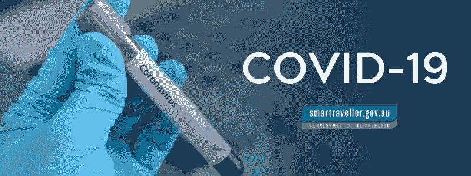
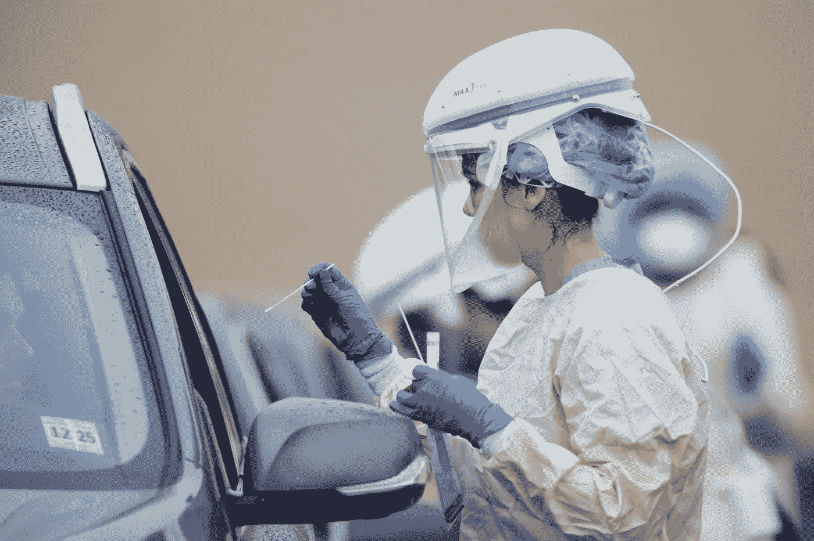

# 冠状病毒对社会的影响

> 原文：<https://medium.datadriveninvestor.com/the-corona-virus-effect-on-society-f29982ff4fa9?source=collection_archive---------24----------------------->

想让世界恐慌，进入恐惧状态？只要创造一种有传染性的病毒，你就有了。新冠肺炎，更广为人知的是“冠状病毒”，已经蔓延到全球各地，并影响了社会的日常生活。

**造成了什么？**

学校停课，不建议 50 人以上的聚会，商店供应不足，全球经济萎缩。对我个人来说，最大的打击之一是体育和音乐节的取消。

Schools are empty.

这种病毒不能掉以轻心，所以我支持高层领导做出的决定。我会支持任何把公众安全放在第一位的决定。

我知道厕纸混乱是一个问题，但我最近在网上看到的视频看起来比黑色星期五的混战还要糟糕。

 [## 医疗保健的未来正在被一场大型技术入侵所塑造|数据驱动型投资者

### 过去十年，全球经济的所有部门都经历了大规模的数字颠覆，而卫生部门现在…

www.datadriveninvestor.com](https://www.datadriveninvestor.com/2018/11/02/the-future-of-healthcare-is-being-shaped-by-a-big-tech-invasion/) 

**个人**

我家大多数人住在病毒肆虐的华盛顿州。它的一种传播方式是当华盛顿州柯克兰市一家养老院的大多数居民都被感染时。这种病毒对老年人或免疫系统受损的人来说最令人担忧。以老年人为目标让我担心我的祖父母。

**这会持续多久？**

根据我看过的文章和视频，没有官方的时间表说明这种病毒会持续多久。任何认为自己有答案的人都应该掉以轻心，因为即使是专家也没有答案。多亏了 Moderna，有一种疫苗可能在几周内准备好，但是仍然没有官方的答案。

**测试**

在像韩国这样的国家进行的测试已经表明可以提高存活率。韩国截至 3 月 8 日每百万人中检测了 3692 人(CNN)。其死亡率为 0.6%(相当低)，约有 66 例确诊死亡。

COVID-19 Testing

相比之下，意大利的检测结果为百万分之 826，其死亡率为 10 倍，超过 1000 例死亡。希望美国能团结起来，允许进行更多的测试，这样我们就有可能在死亡率失控之前降低死亡率。

**部署**

在部署时，他们已经开始“封锁”高接触区，如餐厅、健身房和商店。显然，新冠肺炎不是一个笑话，不会停止，直到我们找到一个方法。

遏制病毒的最佳方法是避免与其他人接触，并保持空前的卫生水平。如果病毒扩散到这里，这里很快就会有一个隔离区。

大家注意安全！我们会一起度过难关的！