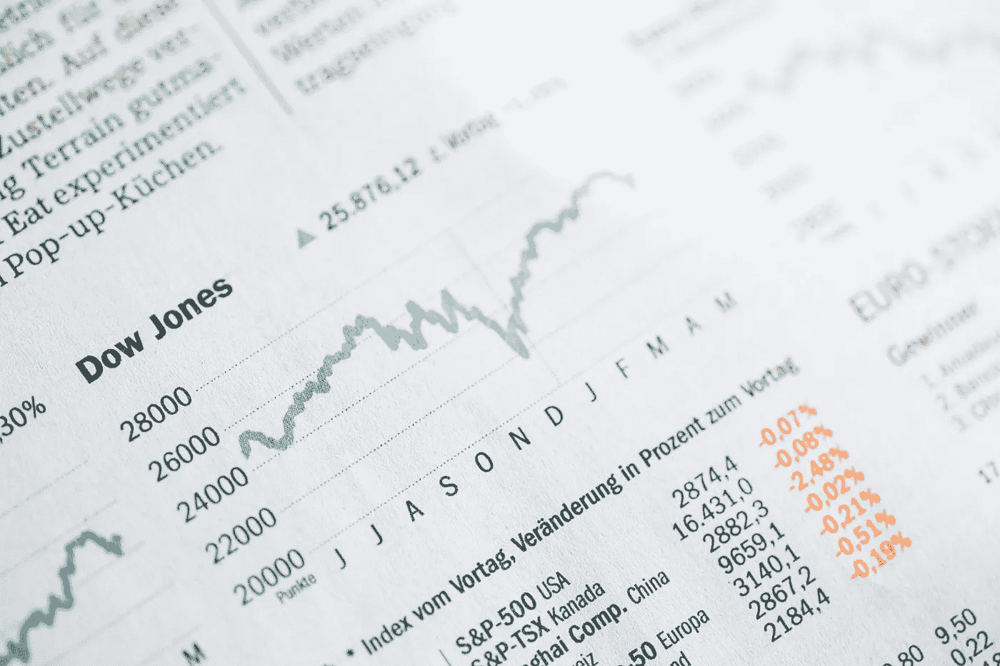
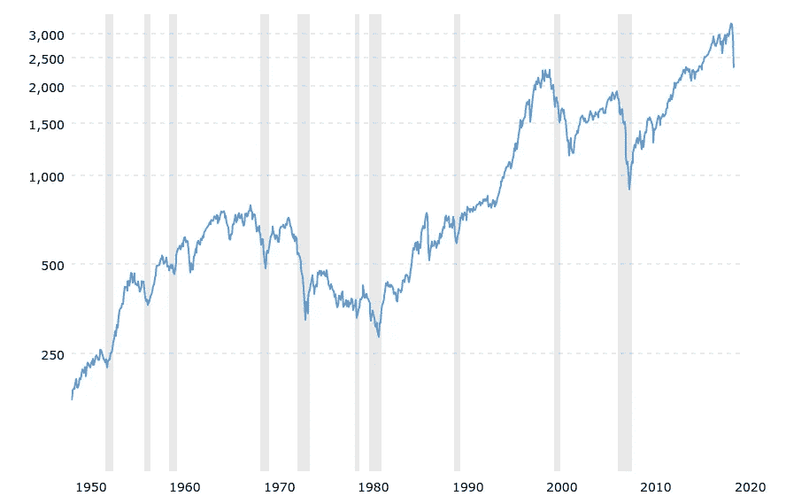

# 冠状病毒爆发是投资股市的绝佳时机

> 原文：<https://medium.datadriveninvestor.com/the-corona-virus-outbreak-is-a-perfect-time-to-invest-in-the-stock-market-a1ce850dd31?source=collection_archive---------12----------------------->

Photo by [Markus Spiske](https://unsplash.com/@markusspiske?utm_source=unsplash&utm_medium=referral&utm_content=creditCopyText) on [Unsplash](https://unsplash.com/s/photos/stock?utm_source=unsplash&utm_medium=referral&utm_content=creditCopyText)

## 目前，市场为任何有闲钱的人提供了一个黄金机会

*本文内容为本人观点，不构成理财建议。*

世界充满了不确定性。各国已经进入封锁状态，以遏制冠状病毒的传播，目前已有近 35 万确诊病例，约 1.5 万人死亡。

这对全球经济造成了灾难性的影响，学校停课，迫使家长请假，企业关门，许多人不确定在疫情继续运行的时候，他们是否还能维持下去。

 [## 算法交易的机器学习|数据驱动的投资者

### 当你的一个朋友在脸书上传你的新海滩照，平台建议给你的脸加上标签，这是…

www.datadriveninvestor.com](https://www.datadriveninvestor.com/2019/01/30/machine-learning-for-stock-market-investing/) 

## 现在是投资的时候吗？

衡量美国证券交易所 500 家最大上市公司业绩的 S&P500，在过去的一个月里下跌了超过 30%。

虽然在过去一个月市场经历了如此剧烈的下跌后建议进入似乎有悖常理，但事实上，对于任何打算投资的人来说，这种下跌可能是进入股市的绝佳切入点。

如果你看看市场在过去几周的表现，你会发现除了红色几乎什么都没有。但在这片深红色的海洋中，你会发现一些公司的股价因冠状病毒而大幅下跌，尽管该业务的长期前景仍然强劲。

尽管疫情很糟糕，但它对经济的影响不会永远持续下去。当一切开始恢复正常时，我们将同样需要这些公司。我不知道未来几周或几个月市场是否会继续下滑。但是有一件事我*可以肯定。*

## 市场将会复苏

一向如此。

Image credit: [www.macrotrends.net](http://www.macrotrends.net)

上图显示了 S&P500 指数在过去 60 年的表现。正如你所看到的，股票市场的总趋势是向上的。这并不是说这一路上不坎坷。你可以看到阴影部分突出了经济进入衰退的时期，最近一次是 2008 年的全球金融危机。

如果你有一个长期的心态，毫无疑问，股票提供了比传统储蓄更大的投资回报。1986 年，英国普通储蓄账户中的 1 万英镑(11650 美元)在 2016 年将价值 28196 英镑(32848 美元)。如果投资于富时 100 指数，即使考虑到 T2 在此期间的四次经济衰退，同样的金额也将价值 121，466 英镑(141，508 美元)。

正如我所说的，重要的是你要意识到你投资的价值会在短期内上下波动。如果这不是你能忍受的，那么投资可能不适合你。但如果是这样，那么从长远来看，你可能会赚很多钱。

## 那么我从哪里开始呢？

投资的前景可能令人望而生畏，但也不尽然。互联网上充斥着关于如何以及从哪里开始的建议。你的投资类型将完全取决于你的投资目标，以及你所处的人生阶段。根据你的具体情况，也许值得和理财顾问谈谈。但是这不是一个要求。许多金融服务提供商允许客户创建在线账户，通过这些账户，他们可以在没有任何帮助的情况下管理自己的投资。

无论你走哪条路，这里有一些我认为需要记住的重要经验。

## 负责

对我们所有人来说，这都是一个不确定的时期，许多工人和个体户不知道他们将如何支付账单。只投资你未来几个月不需要的钱。不要赌上你的钱，投资**T5，希望你能快速获利。你失去一切的可能性和你赚钱的可能性一样大。**

## 做你的研究

当你投资一家公司时，你买的是该公司的一部分。这可能是很小的一部分，但它仍然是你的。在你用你的钱做任何事情之前，明智的做法是至少对你要收购的公司略知一二。

沃伦·巴菲特称之为他的“能力圈”。他只投资他了解的公司。这并不意味着他了解一家公司提供的产品或服务的每个方面，而是意味着他试图了解该产品在十年或二十年后的需求。

2012 年，在佐治亚大学与学生的一次谈话中，巴菲特用箭牌口香糖来举例说明如何留在自己的能力范围内。他认为，人们嚼口香糖的方式不会改变，这些产品的市场将保持稳定，这就是为什么他认为这是一项合理的投资。(2016 年，巴菲特以 45.6 亿美元的价格出售了他在箭牌的股份，价格是 2008 年的两倍。)

在网络泡沫之前的几年，巴菲特因拒绝投资科技股而受到嘲笑。20 世纪 90 年代，过度投机导致互联网和科技公司的估值飙升，尽管这些公司的大部分收入为零。他没有投资这些公司，因为他看不到其中许多公司的长期价值。当股市崩盘时，巴菲特相对毫发无损。

## 有一个长期的心态

如果你不愿意在十年内拥有一只股票，那就别想在十分钟内拥有它—沃伦·巴菲特

正如我之前提到的，投资应该作为一种长期策略。很容易被股票市场日复一日的波动所困扰，但我建议不要一个月检查一次你的投资。

保持专注于最初投资时让你对公司的长期前景充满信心的原因。除非有影响公司潜在收益的重大变化，比如一项新技术使业务过时，否则要努力保持长期心态。但是在决定出售之前，你要做好调查。阅读年度报告和新闻稿。调查公司的财务状况，考虑公司的债务水平与其资产的比例。如果管理层有变动，调查一下他们的背景和记录。有些听起来很专业，但是你需要的所有信息都是可以得到的。关于你所拥有的公司，你永远不会有太多的信息。

## 最后的想法

我们不可能都成为沃伦·巴菲特，净资产 800 亿美元，从 20 世纪 50 年代就开始投资。但我坚信投资的长期前景，不仅是对我自己和我的家人，也是对任何愿意对自己的财务有长期心态的人。正如你可以从我提供的例子中看到的，从长远来看，潜在的收益远远大于风险，即使你考虑到股市下跌的风险。目前的市场状况提供了一个难以置信的机会。*你准备好接受了吗？*

> “机会难得。下黄金的时候，把水桶拿出来，不要顶针。”—沃伦·巴菲特

**28 岁的英国作家乔恩·彼得斯最近看完了《城堡里的男人》第四季。我绝对推荐它。如果你读到这里，感谢你的阅读！如果你想阅读更多我的作品，你可以点击** [**这里**](https://medium.com/@justaguywhowrites) **快速进入我的个人资料。**