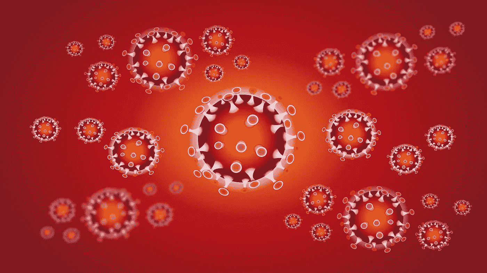

# 冠状病毒不在乎

> 原文：<https://medium.datadriveninvestor.com/the-coronavirus-dont-care-906efa3fda00?source=collection_archive---------5----------------------->

## 做梦不会让这场灾难消失

*由迈克·迈耶~檀香山~ 2020 年 6 月 23 日*

F 首先，我们不得不应对法西斯分子接管了种族主义共和党，然后一个年老的精神病患者通过操纵成为总统，然后是三年的解体和自我毁灭。从一个有权威地位的精神病患者身上扩散出来的众所周知的社会精神病问题，已经被当作教科书上的案例来研究了——一点也不奇怪。

这种情况产生了大量的社会灾难，助长了美国文化中的制度性种族主义和结构性失败，同时也助长了相当一部分人日益恶化的社会精神病。然后，在联邦政府陷入腐败、无知和普遍白痴之后，疫情出现了。

很难想象比一个富裕而强大的国家更糟糕的情况了，这个国家曾经是地球的领袖，被内外摧毁，在面对疫情行星的第一波致命浪潮时，崩溃成贪婪、偏执和无知，这种浪潮很可能永远不会结束。没有任何积极的结果可能会导致这种组合，但相当一部分人口，已作出反应，以灾难性和盲目的官方立场，一切都很好，只要我们停止测试的病毒。

不仅有人相信这一点，还有官员们将开放和回归“正常”作为官方政策。人类的愚蠢和无知是我们都必须忍受的，因果报应确实会降临到做出一长串可怕决定的社会上，但是耶稣·h·罗斯福·基督穿着旱冰鞋，这太过分了。

 [## 冠状病毒；恐慌；字里行间的 z |数据驱动型投资者

### 围绕冠状病毒的话题；更准确地说，新冠肺炎几乎占据了新闻预报的全部头条…

www.datadriveninvestor.com](https://www.datadriveninvestor.com/2020/03/23/coronavirus-a-to-panic-z-between-the-lines/) 

好吧，我们有两个星期的恐怖导致希望后，种族主义者谋杀了另一个黑人男子，盖世太保爱好警察造成大规模的世界范围的示威游行和一些，温和的，抢劫。我们的黑人和棕色人种社区在动员有组织的抗议活动方面发挥了重要作用。尽管如此，盖世太保警察谋杀案仍在不间断地继续，而白宫里的那个白痴在这件事上愚弄了美国军方和其他所有人。

现在，意识的高涨和要求解除警察的资金以消除他们谋杀的自由正被社团主义者的警察国家的巨大惯性慢慢淹没。持续的示威和组织被社团主义者的媒体所忽视，他们无休止地着迷于荒谬和胡言乱语，这是国家层面的唯一信息。当然，有一半的州是由傀儡运营的，这些傀儡受雇重复和模仿社交媒体风格的胡言乱语，就像他们在俄罗斯情报部门的导师所训练的那样。

与此同时，回到疫情。流行病学家和公共卫生专业人士警告的愚蠢、过早和盲目的“开放”正在发生。但我们的运气是真的，我们不仅在“开放”地区出现了感染高峰，而且我们成功地抓住了新型冠状病毒病毒从地区性疾病到广泛传播疾病的全球性爆发的时机。你不可能计划让事情变得更糟。

不，这不是不可避免的第二次浪潮，除了在这些地方设法守住防线，将病毒控制在第一次疫情形式。这些开放的政治要求不是“解放”,而是对疫情控制的破坏，这种控制在第二次浪潮到来之前给了我们喘息的机会。法西斯白痴已经破坏了这一突破，不管他们是愚蠢到不理解，还是根本不理解——干得好，白痴。

但是这种疯狂也是松散的，席卷整个社会，伴随着愤怒、疲惫和精神上的完全丧失。学校、大学、城市、州和企业都在基于完全错误的假设，努力开放和实现回归常态。这又是机构愚蠢的惊人惯性的产物。

我们必须恢复正常。我们会做到的。没人告诉我们怎么做，所以我们会在前进中弥补。除了他们让我做的事，我不会拿我的工作冒险去做任何事。是的先生。一切都是谎言，谁最让我害怕我就信谁。

残酷的现实是，最具动物传染性的疫情病毒的稳步进化是我们对地球所做一切的产物。这些病毒不仅包括 SARS 病毒，还包括产生病毒性出血热的丝状病毒，如埃博拉病毒和马尔堡病毒。我们所做的包括增长到近 80 亿人口；大多数人得不到先进的医疗保健，更不用说住房、营养和教育，以及自然栖息地的破坏将动物驱赶到城镇和城市。

这种东西在科学上是众所周知的，在任何方面都不是政治性的，但被那些正在杀害我们的白痴们视为对他们“自由”概念的某种个人冒犯。这个概念是愚蠢的疫情的结果，是其他流行病的基础，这些流行病现在无休止地蔓延。

这就是我们现在所处的社会，一个走向潜在自杀的社会，同时无休止地否认和愤怒地谴责现实是谎言。古老而愚蠢的信仰总是被那些致力于不冒风险夺取一切可以窃取的东西的人称赞为唯一的真理，它将拯救被选中者。当然，他们也以同样的疫情率死去，但是他们的愚蠢告诉他们，他们对低等人类的疾病免疫。

我们来陈述一下。虽然我们对新型冠状病毒病毒只有部分了解(已经有几种了)，但我们确实知道高传染性气溶胶传播大流行是如何起作用的。它们继续感染人类，直到它们通过在隔离的人群中运行或通过创造一种提供免疫而不被感染的疫苗而使人类无法再感染为止。

在上述简单的陈述下，有大量的细节，但几乎可以肯定的是，最终会如上所述。我们生活在一个紧密结合的、即将变得不那么紧密的全球社会中。除非我们能够开发出一种比这种疾病更有效的疫苗(没有人愿意谈论这一点)，否则我们唯一的希望就是 SARS CoV-2 病毒不会变异成更致命的形式。如果没有疫苗，无论是可能更快的新平台类型还是旧的活疫苗形式，我们只能希望我们足够孤立自己，允许其他人死亡，同时我们熬过疫情的结束。是的，这听起来非常丑陋，但我们给了我们目前的社会结构什么其他选择？

那是什么意思？对于处于崩溃的政治和经济条件下的美国来说，开设学校、企业和商店的计划，如果没有严格的隔离规则和完整的测试和跟踪，将会产生越来越大的灾难。因此，欧盟争论拒绝任何来自失败的疫情国家、美国、俄国和巴西的人进入欧盟。这听起来很糟糕，但在处理由相当于垃圾场的狗管理的民族国家时，这是合乎逻辑的。

看来我们美国和其他失败的国家都完蛋了。我们没有一个正常运转的政府能够实施必须采取的措施来控制病毒及其传播。死亡率将是惊人的，除了实施全民基本收入，给每个人，也就是说我们国家的每个人，食物，和完全免费的医疗保健，没有什么可以拯救衰退的经济。我不建议为此屏住呼吸。

这场疫情灾难不会在 2021 年 9 月或 12 月或 3 月或 12 月结束。除非行星控制到位，否则它可能永远不会以某种形式的病毒疫情持续而结束。那将是一个非常不同的世界。

我们要吞下一颗非常苦的药丸。

**进入专家视角—** [**订阅 DDI 英特尔**](https://datadriveninvestor.com/ddi-intel)