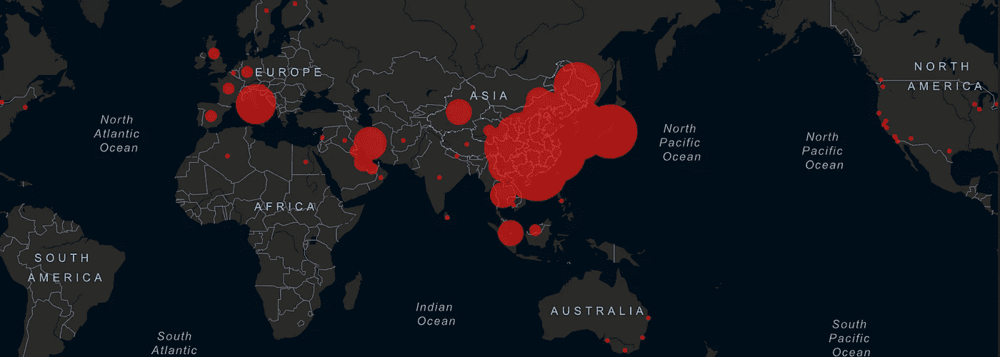
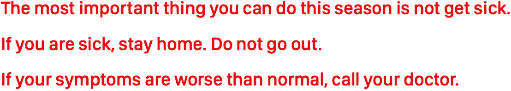

# 冠状病毒可能比我们想象的更严重

> 原文：<https://medium.datadriveninvestor.com/the-coronavirus-may-be-more-serious-than-we-think-b590e35ab6fc?source=collection_archive---------0----------------------->

## 这是我和我的朋友 Bob 合作的结果，Bob 是一个对任何有趣的事物都着迷的研究员和分析师。

如果你是新来的，这个已经有 6 周了。我最近的作品是 [***没有巅峰***](https://medium.com/@pullnews/there-is-no-peak-a-critical-assessment-of-our-collective-situation-8e3b73d876ac) 。

*酒吧日期:2020 年 2 月 26 日*

Johns Hopkins Coronavirus Dashboard, February 26, 2020

# 介绍

我们美国人目前正经历一种新病毒的全球传播，对这种病毒没有天然的免疫力。尽管特朗普总统表示，这种病毒“很快就会消失，可能会在 4 月前消失”，而且疫苗“很快就会出现”，但大多数专家，包括联邦政府雇用的顶级科学家，都不同意这种说法。这种病毒将对美国产生严重影响。

现有的最佳信息必然是不确定的。下面是我们所知道的，我们不知道的，对未来几个月可能发生的各种情况的总结，以及你应该做些什么。

没必要恐慌。现在是时候根据你的位置、你的情况和你对风险的评估来了解和准备了。

# 摘要

2019 年底在中国武汉发现的新型冠状病毒(2019-nCoV /新型冠状病毒/新冠肺炎)比美国主流消息来源承认的严重得多:

*   它可以通过通风系统悬浮在空气中几个小时。
*   它以指数方式传播:每个人平均会感染另外两个人。
*   这种病毒的诊断试剂盒并不普遍。
*   它需要住院治疗的病例比率很高，大约是五分之一。
*   流感会像往常一样杀死成千上万的人。美国应对严重疾病患者大幅增加所带来的额外医疗负担的能力有限。
*   大多数口罩都没有用，无论是对那些被感染的人还是那些试图不被感染的人。

现在采取合理的预防措施是有意义的:

*   你能做的最重要的事情就是不生病。
*   如果你现在生病了，呆在家里。取消一切。
*   除非必要，不要去医院和诊所。
*   如果你有普通感冒或流感之外的症状，打电话给你的医生。

# 我们所知道的

根据《美国医学会杂志》的一项研究，最常见的症状是发烧(98%)、疲劳(70%)、干咳(60%)、食欲不振(40%)、肌肉酸痛(34%)和呼吸急促(31%)。还可能出现腹泻(10%)、恶心(10%)、头晕(10%)、呕吐(4%)、畏寒、咽痛、流鼻涕、头痛等。首先可能是咳嗽或发烧。**由于这些症状与许多常见疾病的症状相同，如果你得了这些症状，没有理由恐慌。你患感冒或流感的可能性要大得多。**

根据中国疾病控制中心迄今为止在中国开展的最大规模研究(n=72，314)，症状严重程度为:

*   81%的人表现温和
*   14%严重
*   对 5%的人(主要是老年人)至关重要。

截至 2 月 19 日，中国通过国家媒体宣布**病毒通过空气传播**——它通过气溶胶传播，而不仅仅是飞沫。这意味着与咳嗽的人保持几英尺的距离会有所帮助，但不会阻止你生病。气溶胶化的病毒可以在空气中停留数小时，并通过船舶、火车、飞机和建筑物等空气循环系统传播。

大部分口罩都是无效的。

截至 2 月 21 日，韩国国家传染病网络发现**人们在被感染 3-5 天后达到传染性高峰。这是在症状出现之前，或者最多是轻微的。**

JAMA 和 NEJM 都报道了**无症状携带者**。在机场检查人们是否发烧减缓了传播，但并不能阻止它。

传染期可能是一个月，也可能更长。在出现症状之前观察到的感染发生的最长时间是 27 天。27 天的“潜伏期”加上感染自然发展的时间(平均约 14 天)比 CDC 建议的 14 天隔离期要长得多。

认为将未被感染的人与可能被感染的人隔离开来需要 40 天的时间并不是不合理的。14 天会减缓扩散，但不会完全停止。

也有一些早期迹象表明**再感染是可能的**。

最近对一名感染者将感染的平均人数(称为 R0)的估计范围约为 2.2-2.7 人。R0 是当前活跃传播率的估计值，将因遏制措施而异。R0 为 2.0+意味着它呈指数分布。

根据伦敦帝国理工学院的模型，病例每 7 天翻一番。从中国出口的大多数病例都没有被发现。死亡率可能平均约为 1%，但据估计，武汉市内的最高死亡率为 18%，其他一些地方的死亡率为 1.2-5.6%。

 [## 医疗保健的未来正在被一场大型技术入侵所塑造|数据驱动型投资者

### 过去十年，全球经济的所有部门都经历了大规模的数字颠覆，而卫生部门现在…

www.datadriveninvestor.com](https://www.datadriveninvestor.com/2018/11/02/the-future-of-healthcare-is-being-shaped-by-a-big-tech-invasion/) 

由于 R0 值仅为 2.0，周期为 7 天，100 个案例在一个月内会变成 800 个。一个月后 800 箱变成了 6400 箱。6400 再过一个月就变成 51200 了。51200 再过一个月就变成 409600 了。当然，80%的人只会有轻微的症状，并且会在短短几周内恢复，所以活跃病例的数量不会像总病例数那样快速增长。但是 20%的严重性使这成为一个担忧。

美国没有太多过剩的医疗能力。整个国家的重症监护室只有大约 10 万张床位。大部分已经在用了。

在严重和危急的病例淹没我们的医疗系统之前，有多少人必须感染这种新型冠状病毒？几万就行了。由于高并发症率和指数传播，这对许多城市来说是一个非常严重的风险。

在撰写本文时，[CDC 只有 57 例确诊病例](https://gisanddata.maps.arcgis.com/apps/opsdashboard/index.html#/bda7594740fd40299423467b48e9ecf6)，听起来并不严重。

真的只有 57 例吗？

**目前美国 50 个州还没有检测试剂盒。几周前，疾控中心制作了一些检测试剂盒，但它们不起作用。疾控中心可以检测病毒的存在，尽管这需要大量资源，因此他们将检测的人群限制在最近在中国武汉的人或与已知感染者接触过的人。即使你有被这种病毒感染的所有症状，并且你已经对所有其他已知病毒(流感等)进行了阴性测试，你仍然不会对这种新型冠状病毒进行测试。**

由于检测的配给，CDC 确诊病例的数量充其量只是一个滞后指标。佛罗里达拒绝公布病例数，担心会损害他们的旅游业。

疾控中心国家免疫和呼吸系统疾病中心主任南希·梅森尼尔博士说:“现在的问题不是这种情况是否会继续发生，而是这种情况会在何时发生，以及这个国家会有多少人患重病。”

疾病预防控制中心最近发推文说:

> 现在是美国企业、医院和社区开始准备应对 COVID19 可能传播的时候了。CDC 继续与商业、教育和医疗保健部门合作，鼓励雇主做好准备。

中国领导层甚至表示，如果发现新病例，地区领导将被追究责任。这可能会阻碍对每个地区正在发生的事情进行真实的报道。

我们看到越南和加拿大的学校关闭，告诉人们储备物资，而意大利则派人带着冲锋枪包围城镇，将他们隔离。所有与伊朗接壤的国家都关闭了边境。日本在处理钻石公主号游轮事件时没有采取明显的预防措施(六人死亡)。中国没有关闭他们的经济，封锁数千万人的季节性流感。**世卫组织仍然没有呼吁禁止往返中国的旅行。**

2019 年 10 月，世界经济论坛、约翰·霍普斯金大学和其他机构举行了一场名为“201 事件”的疫情防备演习，向各国领导人展示了一个模拟的疫情。从这次演习中值得注意的一点是，世界领导人一致认为，使用“叙事管理”来防止歇斯底里是可取的。

简单地说:几个月前，世界领导人决定对模拟疫情的最佳反应是**审查和宣传**。

# 我们不知道的是

我们不知道多快能诊断出这种病毒。一种易于制作和分发的快速测试将对控制病毒大有帮助。

我们不知道是否会研发出疫苗，也不知道何时研发。Moderna，Inc .现在有一种候选疫苗处于早期研究阶段。一个以色列研究小组确信他们将很快研制出口服疫苗。这是一个好消息，但需要进行人体安全性和有效性试验，并且可能需要多次迭代才能正确。

如果一种疫苗被开发出来，这是很有可能的，还不清楚它能多快或多便宜地被分发。认为一种好的疫苗可以很容易地注射给 10%的人是不现实的，即使他们在生病前需要它。如果我们能够足够快地制造足够多的疫苗，我们可能需要大规模的疫苗接种计划来实现群体免疫。那至少需要三个月。大规模的疫苗可能在 2021 年，而不是 2020 年准备好。群体免疫将首先在学校和机构层面实现，然后是城市。

我们也不知道病毒是否会变异，使这种疫苗的效果大打折扣。

我们不知道它会持续多久。在我看来，一年后冠状病毒可能没什么大不了的，就像我们看到的 SARS、H1N1，甚至埃博拉病毒一样(2 年，1.1 万人死亡)。需要理解的一件重要事情是，我们不知道它什么时候达到峰值。这种病毒达到高峰的那一周，我们将预测它可能会继续上升，也可能会掉头开始下降。我们要到几个月后才能知道它何时达到顶峰。

我们不知道**哪些地区或医院可能会不堪重负**。当然，不是全部。我认为我们可以很容易地看到一些城市和地区被淹没，在地理热点和冷点的拼凑。旅游业、港口和国际机场也许是我们目前最好的指标(得梅因看起来比拉斯维加斯好得多)。

我们不知道**会如何结束**。有几个现实的场景。当你阅读这篇文章时，请记住，在美国:1)流感每年导致 12，000 至 60，000 人死亡，平均约 30，000 人；2)美国医疗体系的建立是为了在五个月的流感季节中每月处理 20，000 例流感病例；3)这个季节的流感相当温和，并且已经逐渐消失。鉴于这些事实，我将描述未来 12-18 个月的四种情况:

**场景 1:** 很快发现了一种治疗方法，或者病毒发生变异，毒性减弱，最终消失，但从未对美国公民造成大范围伤害。成千上万的人被杀，大多数是老人。

**情景二:**这种病毒的传播比流感更有效，将数万人送进医院。我们可以在没有额外容量的情况下处理 20，000 人，因此即使它在一年内导致 100，000 人死亡，也是有可能管理的。很快就会被遗忘。

**情景 3:** 病毒传播比这更有效，更像是非常严重的流感。如果每个月有 40k 个病例，大多数医院的压力会很大。我们可以处理它，但它将是非常破坏性的。

**情景 4:** 病毒传播更快或变异变得更加有害，在美国造成数十万人死亡。虽然这可能与 1918 年流感的规模相当(全球有 5 亿人感染，4000-5000 万人死亡)。很难想象它会有一半那么糟糕，但如果这种病毒杀死 100 万美国人，它杀死的人可能比中国、印度和其他地方的人多得多。

我将为这些场景编一些大概的数字:

1.  百分之六十的可能性
2.  百分之二十的可能性
3.  17%的可能性
4.  百分之三的可能性

(鉴于预印本科学期刊和世界各地的医学专家提供的最佳数据，这些都是有根据的猜测)。在这种情况下，我们谈论“不确定性圆锥”——这类似于热带气旋距离海岸数百英里时的可能路径。一个月后，当我们有新的信息时，我会更新这些数字。

# 你该怎么办？

没必要恐慌。你的第一道防线是不生病。即采取措施远离人群和可能有病人的建筑物。避免旅行。在家工作。等等。

如果有类似感冒、流感的症状，远离他人。保持隔离，直到你的症状消失。

[**不要囤口罩**](https://www.businessinsider.com/wuhan-coronavirus-face-masks-not-entirely-effective-2020-1) **。** [外科口罩不灵](https://www.cdc.gov/niosh/npptl/pdfs/UnderstandDifferenceInfographic-508.pdf)。唯一有效的口罩是 N95 口罩，戴着不舒服。如果你需要一个，你可能不应该在你在的地方。

**不要买 N95 口罩！卫生应急人员比您更需要这些。我们目前在美国只有 3000 万部 N95。N95 可能会严重短缺。**

**根据您对所在地区风险的评估，准备您自己的隔离区**。确保你家里有足够的干粮、药物和纸制品，可以维持一个月(假设很少或没有淡水)。有足够的钱来弥补危机来袭和商店再次进货之间的时间差距，这样你就可以安全离开了。大米、面条、汤料、鸡蛋——大地震后你可能想吃的东西。

您可以做的其他事情:

*   多喝水。保持健康。
*   获得充足的睡眠。不要被拖垮。
*   尽可能呆在家里，避开飞机、公共汽车、火车、线路、繁忙地区、餐馆。
*   在家工作；不要去参加会议或研讨会。
*   取消访客，避免与有症状的人或潜在携带者密切接触。
*   不要和别人分享任何东西。保持表面格外干净。
*   在健身房、工作场所、公共汽车、浴室等使用洗手液。
*   没有握手，亲吻，拥抱。
*   不要摸眼睛，鼻子和嘴巴。
*   咳嗽和打喷嚏传播疾病。
*   避开医院和医生的办公室，推迟你以后能做的事情。
*   保持你的家温暖干燥。

如果你现在生病了，呆在家里。取消一切。找人给你带你需要的东西或者在网上订购。远离杂货店和餐馆。假装你得了水痘。

除非需要，否则不要去看医生！这个时候，你的医生甚至不能给你一个合适的诊断。你的医生能做的就是让你回家，告诉你远离其他人。如果你的症状很严重，*打电话给*你的医生，讨论你的情况。

# 结论

冠状病毒比流感更致命，但流感更常见，而且*你比冠状病毒*更有可能感染流感或死于流感。流感*将在今年*杀死数万人，一如既往。**主要问题是，多达五分之一的新冠肺炎感染者将需要住院治疗，超过正常的流感患者数量。**

美国有医疗资源(就床位、医生和供应品而言)来治疗五分之一感染这种新病毒的人吗？从今天开始，是的。

随着传染病在全国蔓延，美国有医疗资源来治疗五分之一的病人吗？不，我们没有。几个月内看起来没什么问题，然后一夜之间就会爆发成一场灾难。有的城市可能幸免，有的则不堪重负。

希望通过控制措施减缓传播，并使医疗服务的负担可控。虽然希望不是计划。预防和准备是一个计划:

# 从哪里了解更多信息

## 主要新冠肺炎网站和追踪器

*   [JAMA 网络警报页面](https://jamanetwork.com/journals/jama/pages/coronavirus-alert)
*   [《柳叶刀》研究页面](https://www.thelancet.com/coronavirus)
*   [世界卫生组织页面](https://www.who.int/emergencies/diseases/novel-coronavirus-2019)
*   [爱思唯尔冠状病毒研究页面](https://www.elsevier.com/connect/coronavirus-information-center)
*   [CDC 常见问题解答](https://www.cdc.gov/coronavirus/2019-ncov/faq.html)
*   [梅奥诊所冠状病毒基础知识](https://www.mayoclinic.org/diseases-conditions/coronavirus/diagnosis-treatment/drc-20479976)
*   [细胞冠状病毒研究页面](https://www.cell.com/2019-nCOV)
*   [疾病控制中心基本跟踪器](https://www.cdc.gov/coronavirus/2019-ncov/cases-in-us.html)
*   [BBC 追踪器](https://www.bbc.com/news/world-51235105)
*   [世界气象站的冠状病毒实时追踪器](https://www.worldometers.info/coronavirus/)
*   [约翰·霍普金斯现场仪表盘](https://gisanddata.maps.arcgis.com/apps/opsdashboard/index.html#/bda7594740fd40299423467b48e9ecf6)

## 值得浏览的新闻来源:

*   [彭博](https://www.bloomberg.com/news/articles/2020-02-24/global-cases-spark-selloff-no-pandemic-who-says-virus-update)
*   [疾控中心电晕新闻页面](https://www.cdc.gov/coronavirus/2019-ncov/index.html)

## 一直在密切报道疫情的信息丰富的 YouTube 频道:

*   [克里斯·马腾斯](https://www.youtube.com/user/ChrisMartensondotcom)
*   [迈克·汉森](https://www.youtube.com/channel/UCMSsLqxqvZsNXi0Z-VjN89A)
*   [约翰·坎贝尔](https://www.youtube.com/channel/UCF9IOB2TExg3QIBupFtBDxg)
*   [地中海冠状病毒基础知识](https://www.youtube.com/watch?v=9vMXSkKLg2I&list=PLQ_IRFkDInv_zLVFTgXA8tW0Mf1iiuuM_)

看到我应该在这里列出的更多资源了吗？更正？把它们发给我。[在 Twitter 上关注我](http://twitter.com/@pullnews)关于冠状病毒和其他知识分子突发新闻。

接下来: [**我的三月五日更新**](https://medium.com/datadriveninvestor/coronavirus-update-what-to-do-now-d10200f49df8) 。

[**大卫·西格尔**](http://dsiegel.com/) 是 DC 华盛顿州的一位连续创业者。他是[支柱项目](http://pillarproject.io/)和 [2030](http://2030.io/) 的创始人。他著有 [*【令牌手册】*](http://thetokenhandbook.com/)*[*开斯坦福*](http://www.openstanford.com/)*[*文化甲板*](http://theculturedeck.com/)*[*气候好奇*](http://climatecurious.com/)**[*气候资料之旅*](https://www.youtube.com/watch?v=bJWnMA3-sQs) 。他向世界各地的观众发表演讲——如果你想让他在你的下一次活动中发表演讲，请参见他的演讲人页面。他的全部作品在[**dsiegel.com**](http://www.dsiegel.com/)展出。*****

**如果你喜欢这个，请看 [**我的气候数据视频之旅**](https://www.youtube.com/watch?v=bJWnMA3-sQs) 。**