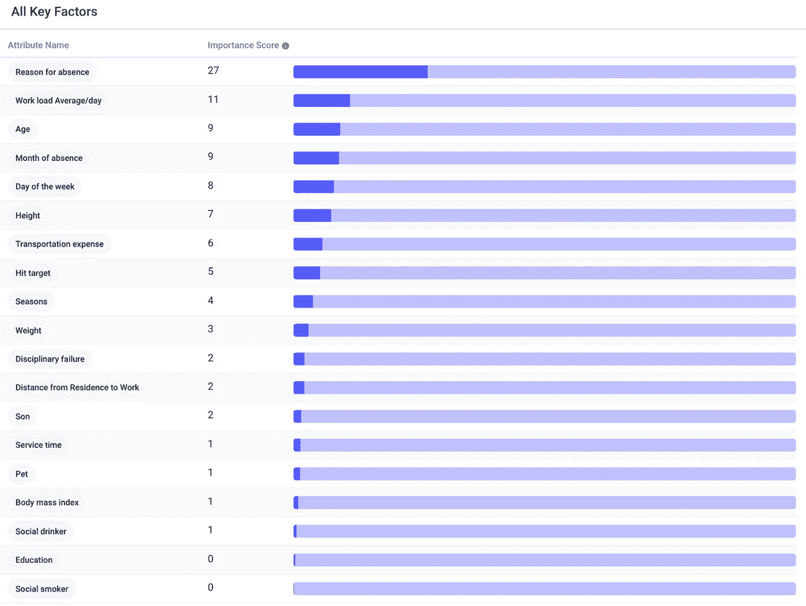
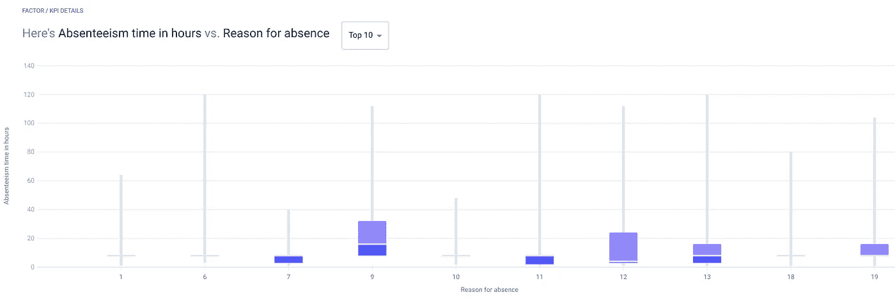
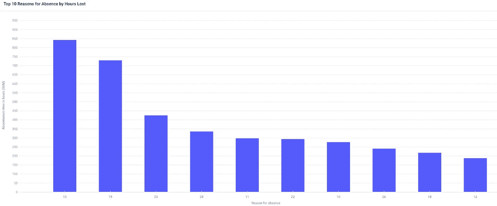

# 不工作的员工的成本

> 原文：<https://medium.datadriveninvestor.com/the-cost-of-employees-that-dont-work-d2c38a46b0b5?source=collection_archive---------18----------------------->

## 旷工分析。

Photo by [Magnet.me](https://unsplash.com/@magnetme?utm_source=medium&utm_medium=referral) on [Unsplash](https://unsplash.com?utm_source=medium&utm_medium=referral)

在美国，每年因旷工造成的损失高达十亿美元。这是一个隐藏的底线杀手，所以公司将它最小化是明智的。

许多公司使用积分系统来打击缺勤，经理不判断有效的缺勤，但根据无效的缺勤、迟到和员工根本不打电话来给“分”。

例如，一个迟到的员工可能会得到 0.5 分，一个缺席的员工可能会得到 1 分，而完全不打电话会得到 3 分。这些加起来就是不同的后果，比如口头警告 6 分，书面警告 7 分，最终警告 8 分，终止雇佣 9 分。

其他策略包括取消晋升资格、加薪或其他福利。然而，所有这些反应都是*被动*，而不是*主动*。此外，他们不会减少有效的缺勤时间，这仍然会花费公司的钱。如果我们能从根本上解决问题，而不是解决症状，会怎么样？如果我们能够理解旷工背后的原因，并相应地解决它们，会怎么样？

 [## 创业 101:我如何在我的联合创始人和员工之间分配股权？数据驱动的投资者

### 所以你刚刚花了六个月的时间和一个早期团队一起构建了一个原型，把如何划分…

www.datadriveninvestor.com](https://www.datadriveninvestor.com/2020/07/12/startup101-how-do-i-divide-equity-among-my-cofounders-and-employees/) 

# 分析缺勤数据

为了回答这些问题，我用无代码 AutoML 工具 [Apteo](http://apteo.co) 分析了一家快递公司的旷工数据集[。我选择`Absenteeism in hours`作为 KPI 列，所有其他列作为属性。](https://archive.ics.uci.edu/ml/datasets/Absenteeism+at+work)

马上，我们可以看到每个属性如何影响缺勤时间。在列表的底部是像员工是否是社交饮酒者或吸烟者这样的事情，这意味着这些属性在预测缺勤方面基本上没有意义。

最重要的属性是`reason for absence`。UCI 的消息来源将此描述为“由国际疾病分类代码证明的缺勤”，这意味着这是指与健康相关的缺勤。

在 740 条缺勤记录中，只有 43 条记录没有医疗原因，33 条记录的值为`26`，或“无正当理由的缺勤”因此，几乎 90%的缺勤都是因为正当的医疗原因。

我们可以看到类别`9`的小时数特别高，缺勤损失的中值为 16 小时，第三个四分位数为 32 小时。原始数据集告诉我们，这一类别指的是“循环系统疾病”，这意味着严重的疾病是最高平均缺勤时间的原因。

然而，这并不是 T4 大部分时间被浪费的地方。这正是平均缺勤损失时间最多的地方。总的来说，为了找出最大的时间损失，我们可以绘制出缺勤时间总和与缺勤原因的曲线图。

类别`13`和`19`造成的工时损失最高，分别指肌肉骨骼疾病和一般伤害。

肌肉骨骼疾病包括肌腱炎、腕管、骨折等。该数据集来自一家快递公司，这意味着与典型的案头工作相比，该数据反映了相对艰苦的劳动。[研究](https://dl.acm.org/doi/abs/10.1145/3396743.3396797)显示，肌肉骨骼疾病在快递行业确实很常见，因为重复的重物搬运会对身体造成伤害。

# 减少缺勤时间

由于大多数缺勤时间都是由于这些伤害造成的，**快递公司可以通过实施更符合人体工程学的工作场所、培训正确的搬运和姿势以及减少加班时间来有效减少缺勤时间，所有这些都可以减少伤害。**

查看关键因素的原始列表，我们可以看到第二重要的属性是`work load average/day`，为过度工作导致更大伤害，从而导致缺勤时间的假设提供了证据。

一篇[研究论文](https://pubmed.ncbi.nlm.nih.gov/22664712/)发现“工作中的高精神压力”是快递行业工伤的一个重要风险因素，这意味着公司也可以通过实施工作场所健康计划和更好地支持压力员工来减少缺勤时间。

# 任何公司如何减少缺勤时间

也许你在一个完全不同的行业，在这种情况下，你的员工的缺勤时间可能有完全不同的原因。

幸运的是，预测洞察力的力量在于它的广泛适用性。您可以在任何具有 KPI 列和属性列的数据集中找到预测洞察力，因此您可以在任何行业中运行相同的分析。如果你没有看起来像我们分析过的数据集，你可以简单地[制作一个](https://www.apteo.co/post/how-to-create-the-best-dataset-for-predictive-insights)。

## 访问专家视图— [订阅 DDI 英特尔](https://datadriveninvestor.com/ddi-intel)