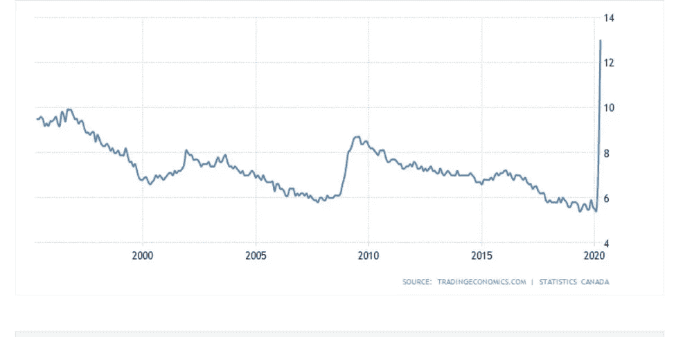
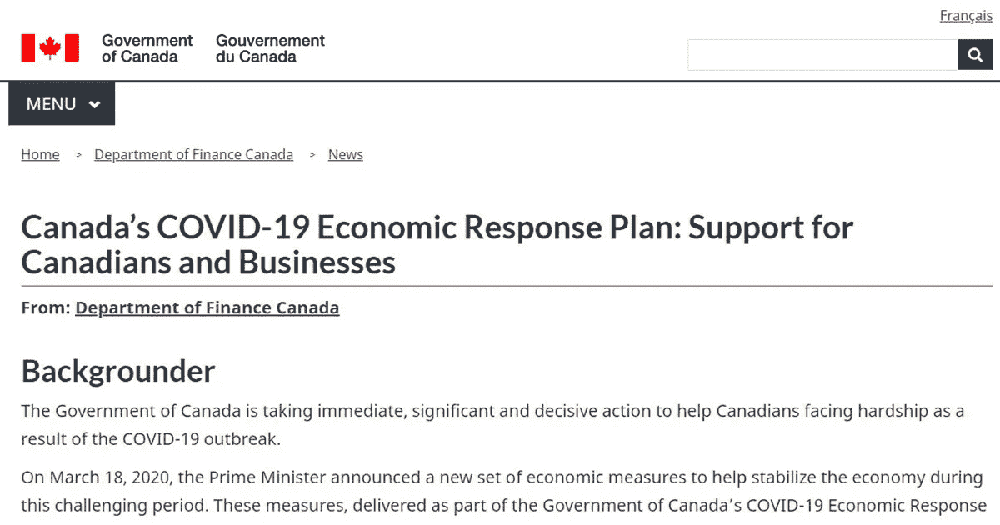

# COVID-19 住房市场不稳定

> 原文：<https://medium.datadriveninvestor.com/the-covid-19-housing-market-precarious-d24921e98621?source=collection_archive---------16----------------------->

[Unemployment Rate Canada Since 1995](https://tradingeconomics.com/canada/unemployment-rate)

由于病毒造成的封锁导致了需求的下降和国民收入的缩水。对经济造成的损害是惊人的。举例来说，在 2008 年经济衰退最严重的时候，失业率[达到了略高于 8%的峰值](https://tradingeconomics.com/canada/unemployment-rate)。现在，T2 的失业率为 13%，就业人数每月下降 11%。然而，这个数字很难代表这场危机的真实性质，如果不作为一个整体加以解决，这场危机必将达到高潮。

首先，失业人数没有真实反映失业个人的真实人数。根据加拿大政府对[的定义，要被视为失业，除了 15 岁以上，还必须满足三个条件；](https://www12.statcan.gc.ca/census-recensement/2016/ref/dict/pop124-eng.cfm)

1.  在过去四周内积极寻找有报酬的工作；或者
2.  被暂时解雇，预计将重返工作岗位；或者
3.  有明确的安排，在四周或更短的时间内开始新的工作。

当人们看到这些具体的定义时，这种测量方法如何严重低估危机期间的真实失业率就变得不言而喻了。首先，在没有联邦协调的危机中，存在重新开放经济的不确定性，很难确定个人是否能够确定他们是否希望通过合并或破产重返工作岗位，当他们的工作可能甚至不存在时。失业也不包括那些因为领取政府福利或心灰意冷而没有找工作的人。

 [## 对于投资者来说，房地产技术远远超出了智能家居|数据驱动的投资者

### 乍一听,“房地产技术”这个术语似乎非常适合超豪华的现代主义。我们…

www.datadriveninvestor.com](https://www.datadriveninvestor.com/2020/06/18/for-investors-property-tech-goes-far-beyond-a-smart-home/) 

[Canada COVID 19 Economic Response Plan](https://www.canada.ca/en/department-finance/economic-response-plan.html)

需要明确的是，政府已经为企业和个人提供了广泛的利益——当考虑到对个人的直接转移支付、向银行和企业提供的信贷额度以及在健康和安全方面的支出时，由于 COVID-19 和随之而来的封锁[而花费的总资金为 8170 亿美元](https://www.cbc.ca/news/politics/covid-19-economic-programs-1.5543092)。这已经大约是加拿大 GDP 的一半，根据国际货币基金组织(IMF)，T2 今年将收缩 6.2%。

然而，这一切仅仅是开始。随着大学宣布秋季学期的课程将主要在网上进行，以及经济重新开放仍不确定，除非经济完全开放或政府干预市场以提供越来越多的缓解，否则房地产市场将崩溃。许多商业计划将于 9 月到期[，如果到那时经济还没有走上复苏的道路，这些计划将不得不再次延期——这将需要更多的政府借贷来继续相关的计划。](https://www.canada.ca/en/department-finance/economic-response-plan.html#businesses)

这正是问题所在，随着封锁的继续，政府福利根本不足以弥补私人市场的损失，更多的个人将通过政府获得收入，因为他们被私人市场抛弃了。这造成了双重负担。首先，政府不能成为私人收入的一对一替代者。第二，这增加了政府的财政负担，因为随着税收减少，政府不得不借钱支付这些款项。

这尤其会损害债务水平已经很高的房地产市场和加拿大整体经济。加拿大的消费者债务已经达到大约 2 万亿美元，其中大约 1.341 万亿美元是抵押贷款债务。根据加拿大银行的数据，由于封锁造成的个人收入损失已经导致大约 [70 万个家庭](https://www.bnnbloomberg.ca/bank-of-canada-warns-of-excess-business-household-debt-from-covid-19-1.1436354)延期偿还贷款。这种支付损失已经被中央银行弥补，中央银行已经购买了政府债券，自三月以来，其资产负债表增加了两倍，达到 3920 亿美元。银行还估计，随着弱势家庭(那些将超过 40%的收入用于偿还贷款的家庭)数量的增加，更多的家庭将推迟偿还贷款。

随着危机的持续，即使是仍有能力偿还贷款的个人也会为价值较低的房屋这样做。房屋的平均价格下降了大约 1.3%。房地产市场也刚刚经历了自 1984 年以来最糟糕的一个月，销售额比上月下降了 56%。无力偿还贷款的家庭数量增加，政府福利不足以维持他们的生活；待售房屋的数量将会增加，而那些有足够现金来承担贷款买房风险的个人的价格将会下降。这正是导致房地产市场崩溃的原因，而房地产市场的价值一直在大幅上升(至少在主要城市是这样)。

随着封锁的继续，裂缝越来越多。在阿尔伯塔省的卡尔加里，由于低油价带来的额外压力，大约 20%的办公空间是空着的。由于目前每月有 720，0 00 个 T2 家庭延期偿还债务，政府的救助计划将不得不向银行支付大约 10 亿美元以确保经济持续运转。如果目前的经济状况保持不变，这个数字肯定会增加。大约 [417 000 笔信用卡还款](https://betterdwelling.com/canadian-households-are-deferring-almost-1-billion-in-debt-payments-per-month/)每月也有所不同，平均年利率[19](https://www.4pillars.ca/blog/how-does-credit-card-interest-work-canada)。大学开始宣布很多课程将在网上进行。这将进一步增加为大学生提供住房的房地产市场的压力——他们的入住率将大幅下降。

通过这种方式，提供办公场所和房屋租赁的房地产市场正在慢慢崩溃，债务负担从民众转移到政府，政府要么不得不承担更多债务以担保这些贷款，要么通过央行购买政府债券来印钞。如果锁定期延长，政府将不得不继续干预市场，以覆盖更多家庭的债务——这将与 GDP 和税收收入的减少同时发生。即使恢复了正常感，由于后 COVID 经济的性质，仍将有一小部分但相当重要的人口无法完全恢复。

因此，当抵押贷款延期保护耗尽时，政府的刺激措施也会失效，房东偿还债务的压力和租房者支付租金的压力都会增加。这将对许多小业主造成压力，并迫使他们违约和出售。这样，住房市场的压力来自不同的方向。根据多伦多道明银行的说法，目前的市场处于“深度冻结”状态，买卖双方都不愿采取任何行动。一旦经济开放，卖方出售的压力，作为上述所有观点的结果，可能会使房地产市场倾斜。类似的情况在美国、德国和欧洲很多地方也有类似的困境——政府暂时设法维持市场运转，但最终会有赢家和输家。

**访问专家视图—** [**订阅 DDI 英特尔**](https://datadriveninvestor.com/ddi-intel)