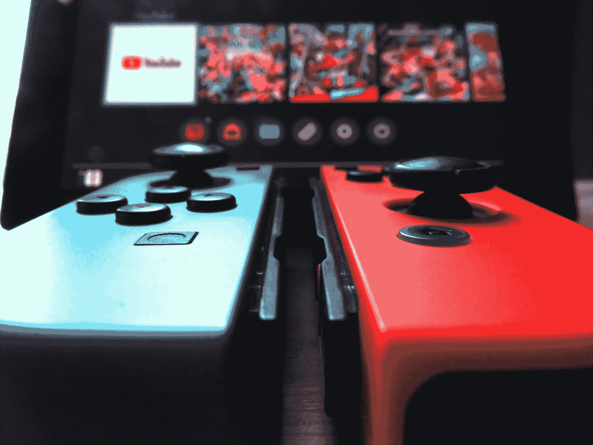
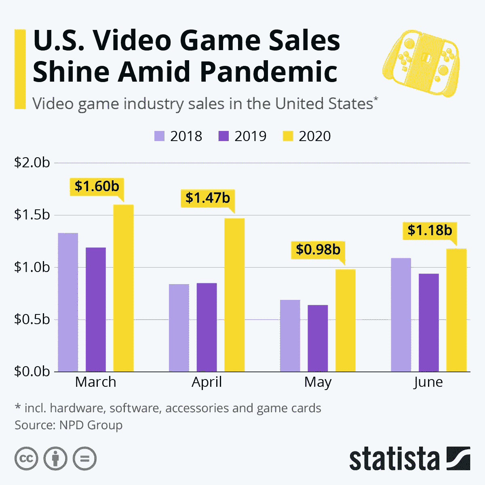
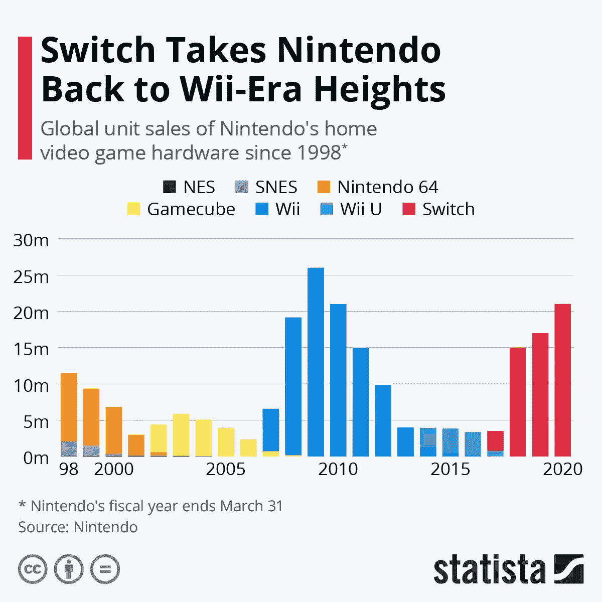
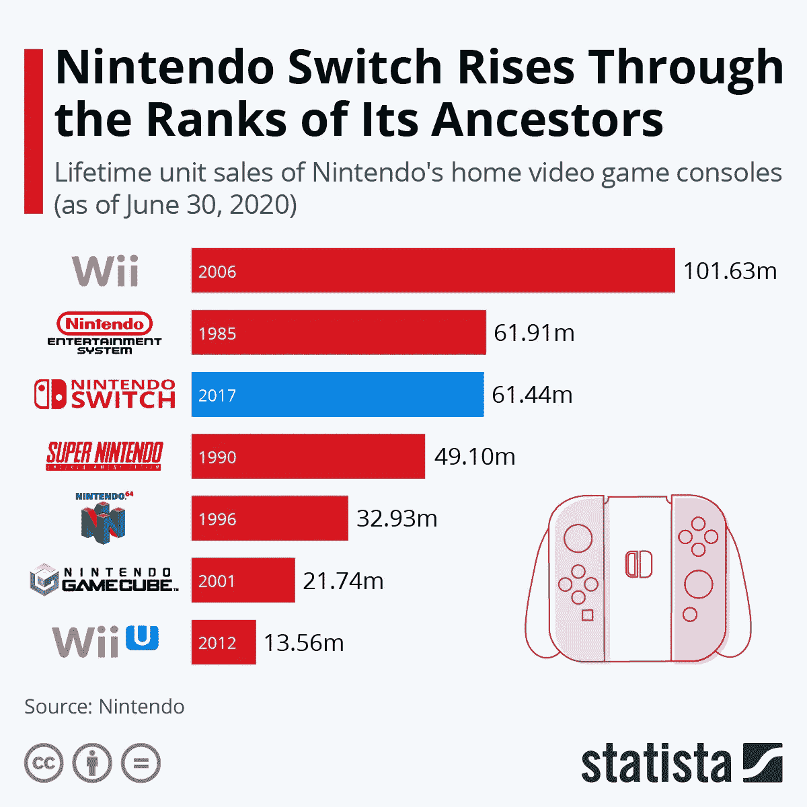
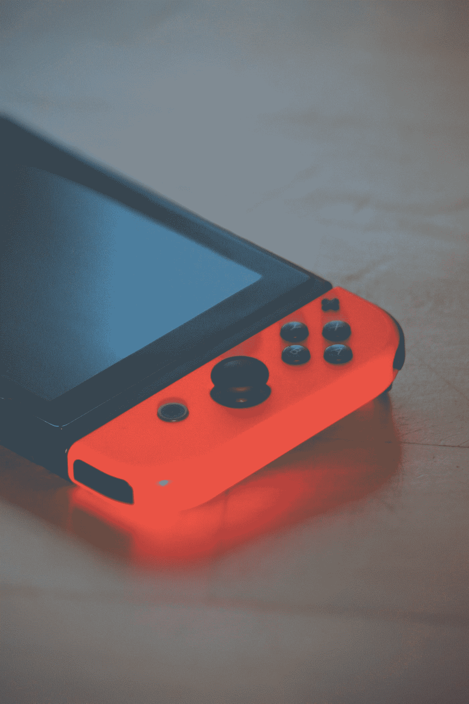

# 新冠肺炎电子游戏热潮

> 原文：<https://medium.datadriveninvestor.com/the-covid-19-video-game-boom-a3707498981b?source=collection_archive---------5----------------------->

Photo by [ELH Express](https://unsplash.com/@elhexpress?utm_source=medium&utm_medium=referral) on [Unsplash](https://unsplash.com?utm_source=medium&utm_medium=referral)

这是一句在互联网上流传的名言。你看过了！事情是这样的:

> **“如果你不从隔离区出来:**
> 
> **—新技能**
> 
> **——你的侧滑开始了**
> 
> **—更多知识**
> 
> **—或者一堆电子游戏:)**
> 
> 你从不缺少时间；你缺乏纪律性...”

也许，我弄错了。或者，也许，我故意加上最后一段来打破僵局。尽管如此，我们不都想知道些什么吗？

*   隔离期间每个人都跑出去买了任天堂 Switch 吗？
*   这个时期对电子游戏有多大的好处？
*   我们会看到游戏机短缺吗？？

玩笑归玩笑，我不会对游戏玩家太挑剔。他们选择待在室内，帮助控制新冠肺炎病例的指数增长。这最终是一种无私的行为。此外，如果人们正在寻找新的室内活动来与家人和朋友分享，那么他们会更有动力。

所以，让我们从视频游戏行业的整体销售开始。

# 第一级:视频游戏销售

Data Source: NPD Group, Chart Source: Statista

如图所示，视频游戏制造商的生意非常好。年复一年，销售额急剧上升。疫情开始后，每个月的数字都超过了前几年。例如，仅在 2020 年 3 月，该行业就获得了高达 16 亿美元的销售收入。这高于前几年大多数三个月的水平。

从百分比来看，2020 年的月度增长(见上图)比 2018 年和 2019 年高出 20–30%。这个数据很容易满足统计学意义的科学阈值(意味着它不是因为矩阵中的一个小故障而发生的)。

虽然这种趋势似乎在放缓，但并不意味着它会停止。随着 COVID 病例继续攀升，社交距离成为一种生活方式，娱乐变得有限，这一趋势可能会加速。

 [## 这么说一家大型风投基金正在投资你的初创公司？4 实际考虑|数据驱动的投资者

### 首先，恭喜你。融资总是需要努力的，一个大的风险投资基金当然是一个大的…

www.datadriveninvestor.com](https://www.datadriveninvestor.com/2020/08/09/so-a-big-vc-fund-is-investing-in-your-startup-4-practical-considerations/) 

这提出了一个有趣的观点:如果人们打算呆在室内，他们就需要有事情做。当前对室内娱乐的需求从未如此之高。消费者在寻找新的内容，他们并不总是在寻找电影。新内容可以包括一套视频游戏、一张歌曲专辑、一部真实犯罪纪录片或一篇有趣的文章——在他们最喜欢的在线发布平台上写的关于视频游戏的文章，有看起来很酷的图表。*感叹。

# 第二关:把*切换到*任天堂(明白了吗？)

Data Source: Nintendo, Chart Source: Statista

好了，这里谁还记得任天堂 64 上的黄金眼 007？尽管这款游戏和 N64 游戏机的销量很受欢迎，但与 Switch 相比，这些数字微不足道。任天堂 Switch 在短短三年内将任天堂 64 的整体性能提高了近一倍。

Switch 正迅速成为许多游戏玩家的首选游戏控制台。用不了多久，它的全球销量就会超过 Wii。

> 对于那些不熟悉 Wii 的人来说，这是任天堂有史以来最成功的视频游戏主机。它对成年人很有吸引力，因为它提供了 G 级家庭娱乐的来源。妈妈、爸爸、奶奶和爷爷乔都会玩。一想到 Wii 就让我会心一笑。

# 第三级:展望 Wii 的成功

Data Source: Nintendo, Chart Source: Statista

就终身销量而言，Wii 的销量超过了所有任天堂游戏机，包括原版任天堂、超级任天堂和任天堂 64。然而，自发布以来，Switch 已经完成了 Wii 的 60%以上——在其生命周期中。

以这种速度和势头，Switch 将超过 Wii 和最初的任天堂的总和。到 2020 年底，它甚至可能成为任天堂有史以来最畅销的平台。

# 第四层:是什么让这个转变如此吸引人？

Photo by [Sigmund](https://unsplash.com/@sigmund?utm_source=medium&utm_medium=referral) on [Unsplash](https://unsplash.com?utm_source=medium&utm_medium=referral)

有两个版本的控制台:任天堂 Switch 和任天堂 Switch 建兴。前者更贵，每台 299.99 美元。价格更贵的开关有三种模式，使其成为三合一娱乐系统:

*   电视模式:将开关连接到大屏幕。
*   桌面模式:开关的两端分开，成为两个独立的控制器，开关屏幕成为平板电脑。这种模式可以用一台交换机设备实现双人游戏体验。
*   手持模式:任天堂游戏机的大版本。

*免责声明:任天堂没有付钱让我写这篇文章。我希望他们有，但他们没有。

# 最后一关:大老板

Photo by [Cláudio Luiz Castro](https://unsplash.com/@claudiolcastro?utm_source=medium&utm_medium=referral) on [Unsplash](https://unsplash.com?utm_source=medium&utm_medium=referral)

没有人知道视频游戏在 2020 年表现如此出色的确切原因。有许多可能的解释:

*   每个人都在寻找新的内容。
*   刺激支票为有兴趣购买电子游戏的个人提供了资金。
*   任天堂是一个邪恶的天才，他们已经知道如何侵入我们的钱包。

无论理由是什么，这一趋势都不太可能放缓。随着我们适应新的规范，我们将继续寻找室内活动和娱乐的新来源。内容提供商和平台的受欢迎程度和需求可能会继续上升。

最后，如果你对自己在疫情期间冲动购买娱乐产品感到内疚——不要！无聊并不是一个新概念。几代人总是感到单调的痛苦，并寻找一个出口:

> "甲壳虫乐队把世界从无聊中拯救了出来。"―乔治·哈里逊

# 不同之处在于，你现在参与了拯救他人生命的行动。

在“新冠肺炎繁荣”的第二部分中，我将探讨电影带子的商业繁荣。自从疫情开始以来，网飞和迪斯尼的订阅量增加了多少？是时候揭开面纱了。

**访问专家视图—** [**订阅 DDI 英特尔**](https://datadriveninvestor.com/ddi-intel)