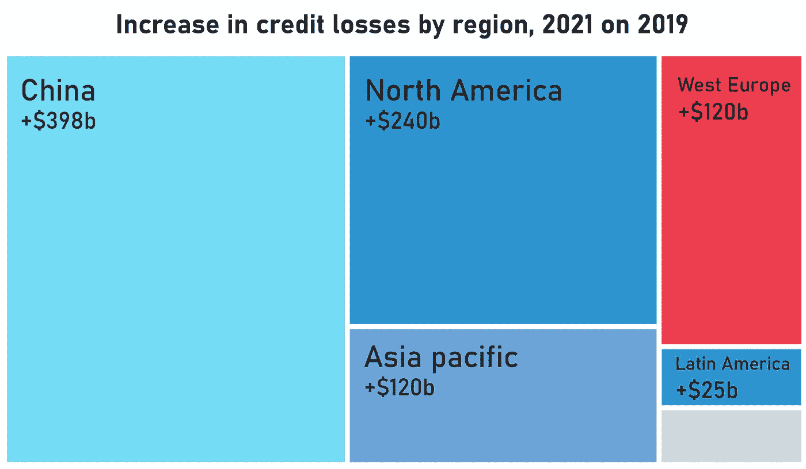
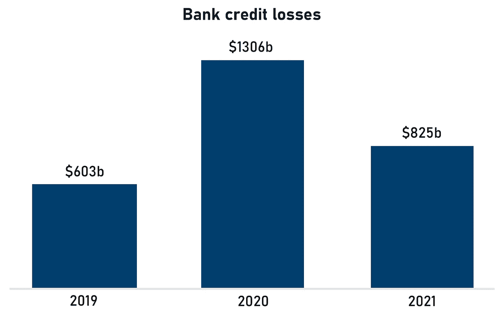

# Covid 危机正让银行和政府走得更近

> 原文：<https://medium.datadriveninvestor.com/the-covid-crisis-is-bringing-banks-and-governments-closer-together-1890e7a60dac?source=collection_archive---------21----------------------->

## 但是多近才算太近呢？

Photo by [Sean Pollock](https://unsplash.com/@seanpollock?utm_source=medium&utm_medium=referral) on [Unsplash](https://unsplash.com?utm_source=medium&utm_medium=referral)

这一次，银行希望成为解决方案的一部分，而不是所有问题的源头。2008 年至 2009 年金融危机爆发十年后，全球经济面临着非常相似的挑战，只是这一次它们是由外源性公共卫生突发事件造成的，而不是金融体系的系统性缺陷。

事实上，银行甚至可能被证明对后 Covid 时代的复苏至关重要，因为政府依赖于主要的货币机构帮助向系统注入尽可能多的流动性。在欧洲，银行是货币政策传导的重要渠道，银行危机可能导致整个系统的失败，要求债券持有人、股东和纳税人承担损失。在更传统的经济危机的情况下，银行可以成为帮助保持经济运转的重要伙伴。我们应该准备给他们多少权力是另一个问题。

 [## 对有商业头脑的投资者有用的行为经济学概念|数据驱动的投资者

### 在美国企业界，高斯统计，对我们周围世界的确定性解释，以及理性…

www.datadriveninvestor.com](https://www.datadriveninvestor.com/2020/07/09/helpful-behavioral-economics-concepts-for-the-business-minded/) 

对于德意志银行来说，最近几年丑闻不断，以至于[经常很难跟踪他们](https://www.nytimes.com/2020/07/07/business/jeffrey-epstein-deutsche-bank-settlement.html)，重建公众信任的需要是最重要的。修复银行的公众形象是一个漫长的过程，涉及许多不同的领导人，但新冠肺炎疫情可能正是银行一直在寻找的，以证明它可以成为一个负责任的企业公民。前往柏林的途中，德意志银行首席执行官克里斯蒂安·塞文在该行的企业记忆中第一次在[受到了比冰点还要高几度的接待](https://www.faz.net/aktuell/finanzen/gefahr-fuer-banken-in-der-corona-krise-noch-nicht-vorbei-16798588.html)。但德国政府和该国最大、最臭名昭著的银行之间新发现的火花意味着什么？一旦危机结束，事情会恢复正常吗？或者这可能是更多事情的开始？

在欧洲和美国，银行正在滑向经济救星的角色，做着政府心照不宣地希望它们做的事情:借钱给需要钱的企业。这意味着绕过通常会阻碍发展的常见组织障碍和官僚主义的低效率。如果更严格的贷款标准需要放宽以有利于借款人，那么谁会抱怨呢？在欧洲，私人银行与财政措施、国有开发银行和由成员国资助的欧盟计划协同行动，在帮助企业度过 Covid 流动性危机并在疫情结束后重新站立起来方面发挥着重要作用。

# **鼓励银行放松银根**

对政治家来说，诀窍在于提供正确的暗示，而不鼓励银行做任何风险太大的事情，尽管事实上，即使在经济形势良好的时候，贷款也是一种固有的风险活动。然而，尽管各国政府希望看到从 Covid 崩盘中迅速复苏，但它们也不希望被指责为，如果这些债务中的大部分变成坏账，可能会出现更糟糕的清算结果。欧洲银行业危机的创伤仍然历历在目，当时的许多领导人仍然健在，要么以不同的身份，要么担任相同的职务。

克里斯蒂娜·拉加德(Christine Lagarde)在欧洲债务危机最严重时期执掌国际货币基金组织(IMF)时，可能没有监管大部分援助资金，但她在为银行纾困、量化宽松和臭名昭著的向受困成员国提供贷款的欧盟“计划”提供机构支持方面绝对是关键的。这些计划要求葡萄牙、爱尔兰和希腊等国实施严厉的预算措施，通常涉及出售关键的国有资产，代表着欧盟国家之间关系的最低点，以及近乎致命的信任崩溃。作为欧洲央行(ECB)行长的新角色，拉加德的行动将在这场危机中产生更深远的影响，考虑到她的任期，她不会希望自己的遗产被违约潮玷污。类似地，15 年来一直是德国和欧洲政坛常客的德国总理安格拉·默克尔在避免欧元危机的混乱和政治功能障碍方面有着既得利益。

尽管政府与银行同床共枕很诱人，但长期后果可能不值得。一旦责任界限变得模糊，缺乏问责可能会对经济造成永久性损害。在欧洲债务危机之前，即使是最敏锐的观察者也很难判断高盛的国际咨询部门的终点和国债的起点。最近的历史告诉我们，政府和银行之间的联姻不太可能有好结果。不幸的是，这样的婚姻非常方便，尤其是当双方对未来越来越紧张的时候。

# **僵尸公司正悄悄逼近欧洲**

银行正竭尽全力避免被视为坏人，即使这意味着它们的资产负债表将受到冲击。根据评级机构 S&P 的数据，全球银行[在未来 18 个月面临 2.1 万亿美元](https://www.economist.com/finance-and-economics/2020/07/11/more-corporate-defaults-seem-to-be-on-the-way)的减记，其中 1.3 万亿美元将在 2020 年到位(是 2019 年的两倍多)。受打击最严重的地区将是亚太地区，标普估计，该地区将承担 60%的信贷损失，主要原因是中国的风险敞口。但是北美和欧洲也不能幸免。在西欧，2020 年的损失总额将达到 2280 亿美元，而 2019 年为 540 亿美元。风险拨备的高点将在 2020 年底前的某个时候出现，并可能在一段时间内保持在这一水平，特别是对于航空公司和汽车制造商等风险敞口最大的行业。

S&P estimates China will bear the brunt of bad debts, but America and Europe will not be spared

在德国，经济学家对“僵尸”企业发出了警告:这些企业仅通过国有银行的紧急贷款才得以生存。很难知道每个月到底有多少僵尸企业蹒跚前行，因为德国政府已经暂时中止了企业申请破产的法律要求。到 10 月份，这一义务将重新生效，这将使僵尸企业公开化。自然，德国议会和默克尔的联盟伙伴施加压力，要求将清算日延长至 2020 年底。

这些短期措施是在 3 月份推出的，作为弥合封锁造成的经济影响的一种手段。对于德国的贸易信贷保险公司来说，形势是无法预测的。每一份保险合同都必须经过发行人的详细审查，而[保费平均上涨了 15%左右](https://www.faz.net/aktuell/finanzen/welle-von-kreditausfaellen-rollt-auf-banken-zu-16855344.html?premium)，对于风险最大的行业，涨幅高达 30%至 40%。几个月来，监管机构一直警告称，一波企业违约潮正向银行系统袭来。欧洲央行的回应是放松对银行的资本要求，目的是提高银行的贷款能力，克服它们不愿意通过代表客户买卖证券来促进市场流动性的问题。

S&P estimates write-downs to hit US $1.3 trillion in 2020

利用银行作为货币政策工具来拉拢银行并不是免费的午餐。风险将需要由金融体系来承担:最终是股东。然而，有一个长期的经济成本影响着我们所有人。银行可以放松贷款标准，帮助企业度过一些短期痛苦，但它们不能支撑失败的商业模式。即使新冠肺炎疫情本身是暂时的，它的影响将是持久的。商业惯例将会改变，消费者行为将会永久改变，经济将会从根本上重塑。目前因新冠肺炎危机而面临破产的公司中，有多少没有受到更大范围的经济逆风的压力？这个问题对于零售行业尤其重要，因为实体店面临着来自在线卖家的巨大压力。对许多公司来说，疫情是一种催化剂，加速了经济结构变化的效果。维持这些商业模式不仅让投资者付出代价，也让我们所有人付出代价。

当政府和银行意见相左时，通常是健康的政治和监管体系的标志。当危机迫使他们走到一起时，人们应该持怀疑态度。目前，股东和监管者似乎只能担忧地看着疫情爆出已经达到创纪录水平的债务。今年 1 月至 5 月，全球最大的 900 家公司[增加了 3840 亿美元的债务，累计总额达到 8.3 万亿美元](https://edition.cnn.com/2020/07/13/investing/premarket-stocks-trading/index.html)。其中很大一部分不是用于为增长和收购融资，而是用于股票回购和分红。这是由中央银行促成的，他们已经介入购买公司债务。尽管利率处于创纪录低点，但偿债所需的收入比例却达到了历史最高水平。

每当政府和银行联手时，我们都应该保持警惕。通常，这意味着更多的风险被心甘情愿地添加到系统中，通常的监管保护措施被搁置一边。危机持续的时间越长，这种关系就会变得越根深蒂固——在经济上和政治上——并带来灾难性的后果。

**进入专家视角—** [**订阅 DDI 英特尔**](https://datadriveninvestor.com/ddi-intel)