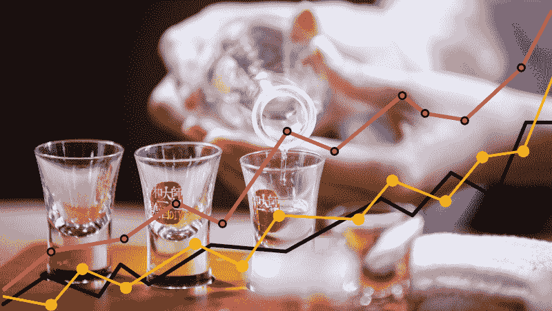
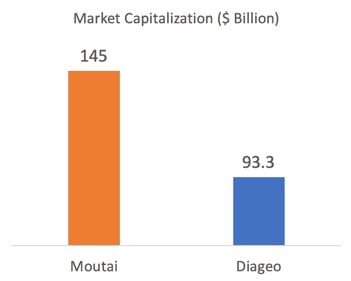
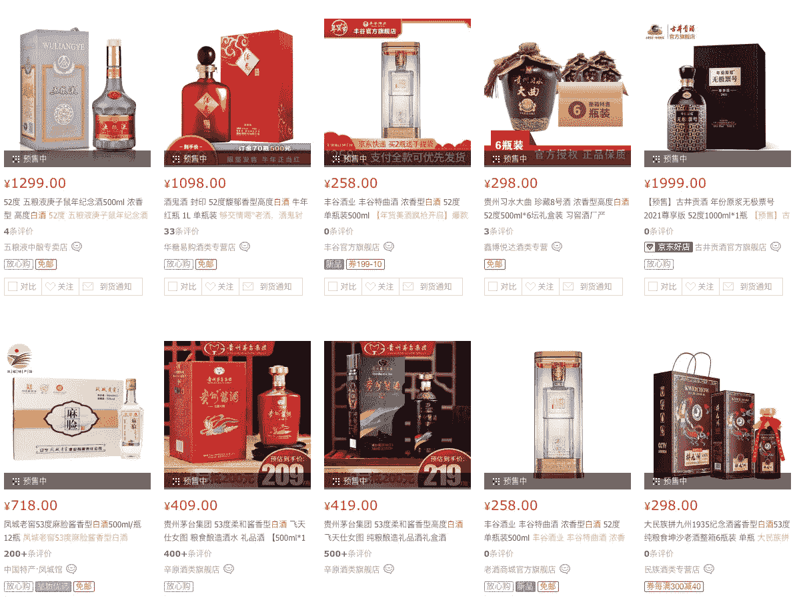
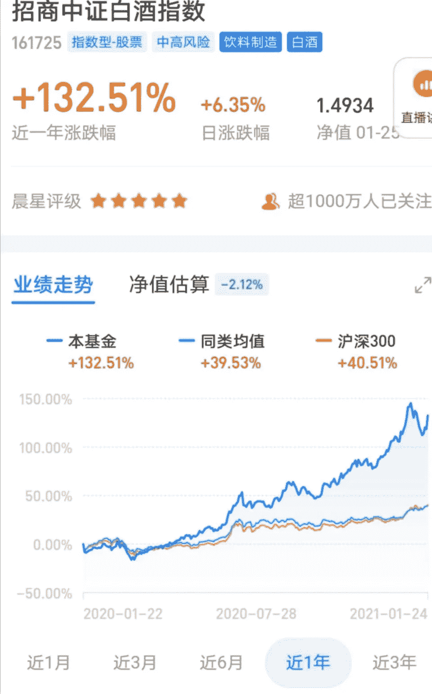
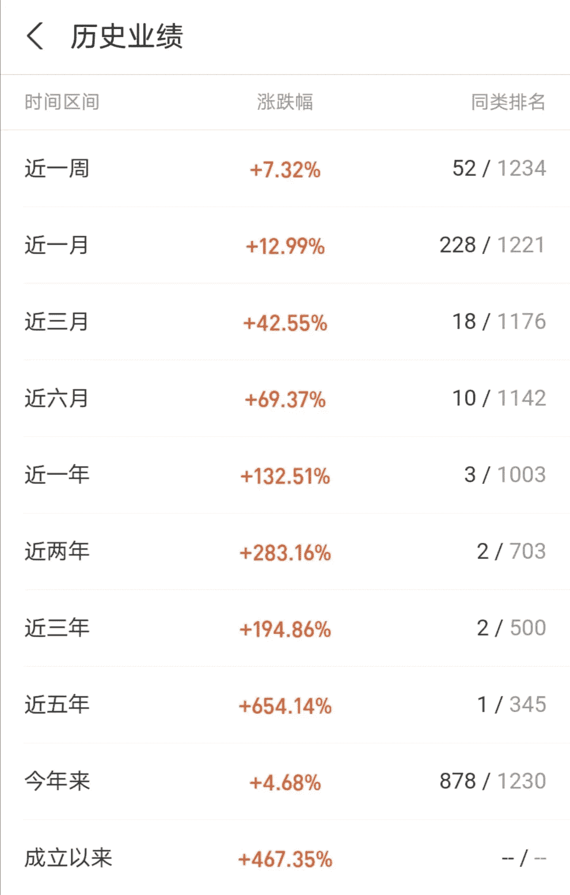

# 中国白酒 ETF 132%增长背后的文化原因

> 原文：<https://medium.datadriveninvestor.com/the-cultural-reasons-behind-the-132-growth-of-chinese-liquor-etf-83acb2d7d81d?source=collection_archive---------20----------------------->

## 中国白酒是世界上消费量最大、销量最好的烈酒。但在其他国家却鲜为人知。尽管白酒通常并不便宜，但销量却在增长，酒厂的股价也在持续攀升。甚至还有中国白酒指数 ETF，其一年回报率为 132%。今天，我们来看看中国白酒 ETF 令人印象深刻的表现背后的文化原因。

# 白酒是世界上消费量最大、最畅销的烈酒

如果你还没有去过中国，你听说过或品尝过白酒的可能性几乎为零。因为根据中国海关总署国家信息中心的数据，每年生产 170 亿升白酒，只有 20，000 升从中国本土出口到 T2。你可能没听说过，但它的重要性不可忽视。

贵州茅台是最大的白酒生产商，也是世界上最有价值的白酒公司——市值超过 [**、1450 亿美元**](https://newseu.cgtn.com/news/2019-09-23/Baijiu-Is-the-world-s-best-selling-liquor-finally-cracking-Europe--JjtKNcTYe4/index.html) 。而拥有一些世界著名白酒品牌的英国公司帝亚吉欧的市值为 933 亿美元。

# 白酒是什么

Baijiu is a transparent liquor that has an alcohol content between 35% to 60%. Each type of baijiu uses a distinct type of [Qū](https://en.wikipedia.org/wiki/Q%C5%AB) for fermentation unique to the distillery for the distinct and characteristic flavor profile. The literal translation of Baijiu (白酒) is White Liquor (wine). Bai (白) means white, and Jiu (酒)means liquor or wine. Now you learned two Chinese words. According to Wikipedia, Baijiu is a clear liquid usually distilled from fermented [sorghum](https://en.wikipedia.org/wiki/Sorghum),[[*citation needed*](https://en.wikipedia.org/wiki/Wikipedia:Citation_needed)] although other grains may be used; some southeastern Chinese styles may employ [rice](https://en.wikipedia.org/wiki/Rice) or [glutinous rice](https://en.wikipedia.org/wiki/Glutinous_rice), while other Chinese varieties may use [wheat](https://en.wikipedia.org/wiki/Wheat), [barley](https://en.wikipedia.org/wiki/Barley), [millet](https://en.wikipedia.org/wiki/Millet), or [Job’s tears](https://en.wikipedia.org/wiki/Coix_lacryma-jobi_var._ma-yuen) (Chinese: 薏苡 *yìyǐ*) in their [mash bills](https://en.wikipedia.org/wiki/Mash_ingredients). The starter culture used in the production of *baijiu* is usually made from pulverized wheat grain or steamed rice.

# 为什么它是中国文化的重要组成部分

自新石器时代以来，白酒就是中国历史的一部分。第一个系统的蒸馏过程开始于汉代(公元前 202 年-公元 220 年)。它在送礼、庆功宴和商务宴请中广受欢迎。

在中国新年或特殊场合，人们会互赠白酒作为新年礼物。在婚礼庆典或家庭聚会上，你会发现每张桌子上都有白酒。新婚夫妇会用白酒向每桌的客人敬酒。在商务晚宴上，喝白酒，大量的白酒是建立可信赖的商业关系的传统。人们相信人在喝醉时会显露出他们的本性，可能这种信念导致了在商务宴会上喝大量白酒的习惯。此外，国内消费者经常在家喝酒，或者和朋友在餐桌上喝酒。白酒无处不在，适合各种场合。

# 白酒价格

一瓶优质白酒的价格可能超过 400 美元。某些批次的成本一直超过每瓶 100 美元。就日常消费而言，一瓶普通白酒的价格为 10 至 20 美元。对于送礼或特殊场合，优质白酒是首选。

我在 JD.com 上搜索白酒，有数百种白酒和特殊的酿造类型、包装、酒精含量。CNY 对美元的汇率大约是 1: 0.15。下面的图片显示了每瓶 40 到 300 美元的价格。还有便宜得多的，只需几美元，但没那么受欢迎。

# 白酒指数

白酒指数由中国主要白酒企业的股票组成，是一个由几个白酒 ETF 跟踪的指数。例如，[工银白酒指数 ETF](http://fund.eastmoney.com/161725.html) 最近 3 年实现 194.86%，一年增长 132.51%，6 个月增长 69.37%，最近 3 个月增长 42.55%。下面截图来自支付宝投资 App 数据。你可能已经注意到，在中国，积极的表现用红色突出显示，消极的表现用绿色突出显示，这与欧洲和美国完全相反。

上面的照片告诉我们什么？该基金在 5 年内获得了 5 倍的回报！

你可能会对中国有这样一个指数感兴趣。你会投资这只 ETF 吗？你们国家有什么有趣的指数吗？

我鼓励每个人都尝一尝白酒，它有独特的香味。第一次，它会在你的嘴里燃烧。

*原载于 2021 年 1 月 25 日*[*https://www . fast track . life*](https://www.fasttrack.life/blog/the-cultural-reasons-behind-the-impressive-performing-chinese-liquor-investments)*。*