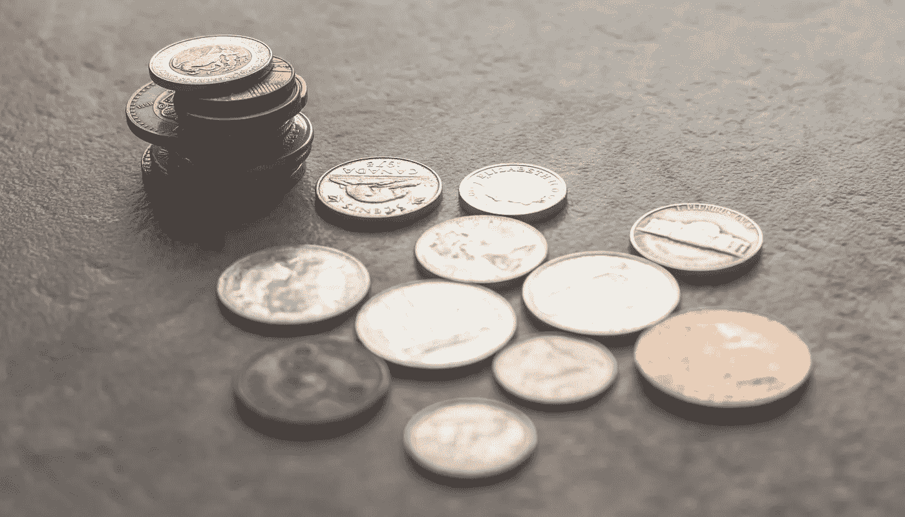

# 不平等的奇特案例:探索增长与不平等之间的关系

> 原文：<https://medium.datadriveninvestor.com/the-curious-case-of-inequality-exploring-the-relationship-between-growth-and-inequality-2b850b8d60d5?source=collection_archive---------25----------------------->

## 关注增长和不平等之间关系的占主导地位的思想流派，已经利用世界各地有代表性的经济案例进行了研究。

当今世界主要根据收入增长和社会发展水平分为发展中国家和发达国家。每个国家都有增长的轨迹，也有部分衰退，但这无疑导致了我们所说的不平等。无论是收入还是机会，都出现了富人越来越富，穷人越来越穷的趋势！

> 这提出了一个重要的问题——为什么有些国家比其他国家发展得更快？如果一个国家增长了，为什么这种增长没有平等地(甚至公平地)反映到每个人身上？增长和不平等之间有权衡吗？

对原因的探究将把我们引向区分每个经济体的因素之一，即自然资源禀赋。一个石油、铁矿石和矿产储量较大的国家，在国际贸易中肯定会表现良好，并占据绝对优势。除了地理因素，其他社会、文化、政治和制度因素也对增长率起作用。通过对教育和医疗保健的投资来发展人力资源，有助于创造有利的劳动力市场条件，促进经济发展。

增长和不平等之间的权衡导致了经济学家通常提出的一个论点，即效率与公平。人们已经看到，经济增长导致了收入的不平等，进而导致了财富的不平等。但从长期来看，收入不平等抑制了这种增长。

财富积累到少数人手中，而其他人则严重缺乏收入和资源。这使得为下一代投资的资金减少，并使他们陷入贫困陷阱的恶性循环。下一代人根本无法接受教育或发展一项技能来就业。无法获得或负担不起公共卫生设施使情况更加恶化。这是像印度这样的发展中国家的典型情况。

 [## 为什么包容性财富指数比 GDP 更能衡量社会进步？|数据驱动…

### 你不需要成为一个经济奇才或金融大师就能知道 GDP 的定义。即使你从未拿过 ECON 奖…

www.datadriveninvestor.com](https://www.datadriveninvestor.com/2019/03/08/why-inclusive-wealth-index-is-a-better-measure-of-societal-progress-than-gdp/) 

中国、尼泊尔、斯里兰卡等邻国在许多发展指标上表现良好。中国一直是一个增长中的经济体，拥有强大的制造业。这归功于乡镇企业的建立，这些企业将初级生产和次级生产结合在一起。与印度相比，尼泊尔是一个 GDP 较小的经济体，但其医疗体系却非常突出。最后，与印度不同，斯里兰卡拥有完全由政府资助的初等教育。

许多经济学家和政策爱好者认为，在印度的形成时期，印度应该更加注重初等教育和健康，以确保先进和可持续的增长。

东亚四小虎——香港、台湾、韩国和新加坡，是另一个见证了 GDP 增长水平大幅提升的例子。他们大力投资人力资本，这与日本的增长故事非常相似。然而，受地理因素和使用教学语言的能力以及种族的影响，受教育机会不平等。

自 1980 年以来，收入不平等在北美迅速加剧，但在欧洲有所缓和。从历史的角度来看，不平等的加剧标志着战后平等主义制度的终结。如今，西欧和美国之间的不平等程度差异尤为明显。而在 1980 年，这两个地区最富有的 1%人口拥有 10%的收入份额；2016 年，西欧仅小幅上升至 12%，而美国则飙升至 20%。

在美国观察到的这种收入不平等的加剧，主要是由于受教育机会和技能发展方面的严重不平等，加上累进程度较低的税收制度。尽管自 20 世纪 80 年代以来最高劳动报酬有所增加，2000 年代最高资本收入也有所增加。

与此同时，欧洲的税收累进程度下降幅度要小得多。相对更有利于中低收入群体的教育和劳动力市场政策缓和了工资不平等的持续存在。然而，在这两个地区，男女之间的收入不平等有所下降，尽管在收入分配的顶端，这种不平等仍然明显具有弹性。

思考增长和不平等之间关系的另一种方法是西蒙·库兹涅茨的经济发展曲线。他认为，不平等只是一个过渡阶段，随着经济的发展，不平等会加剧，但在达到更高的发展水平后，不平等会开始下降。过渡性不平等被认为是好的，因为它为富人提供了足够的收入来进一步投资，理想地导致增长和公平的社会。它还被进一步扩展到用*基尼系数*来衡量不平等。根据国际货币基金组织*的一项研究，当基尼系数达到 27%时，不平等性的增加就会逆转。这被称为*不平等悬垂*，因为它形成了一个驼峰形或倒 U 形图。*

> 政府的两个主要工具是税收和福利。这将确保财富的再分配，但由于缺乏政治意愿，这些政策干预的针对性很差。

要了解这些工具的威力，请考虑一个由劳动力和资本组成的经济体。资本增长导致经济增长，而资本税为政府支出提供资金。对积累财富征收更高的税会降低积累资本的动力，这将进一步降低经济增长率。或者，没有财富的个人会倾向于更高的税率，为他们提供公共设施和财富的再分配。然而，如果持续存在更大的不平等，资本积累在少数人手中，更多的贫困人口将要求更高的税率，从而破坏增长。因此，为了实现更高的增长率，需要确保经济平等。

更高水平的教育、营养以及更高水平的就业或创业将带来公平的增长。女性雇员的参与也应受到重视，因为这将提高某些部门的生产率，从而带来更高的增长。

建立强有力的机构将在确保适当的再分配政策方面发挥重要作用。如果做得不有效，最终会浪费大量资源，导致效率低下。