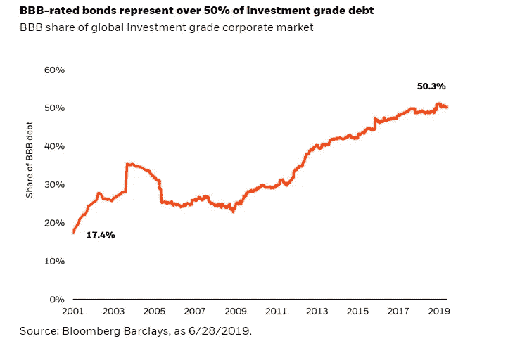
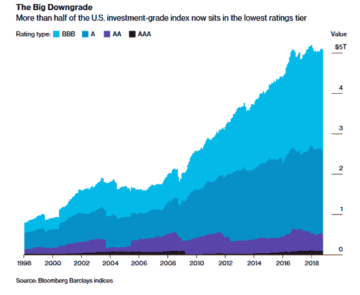
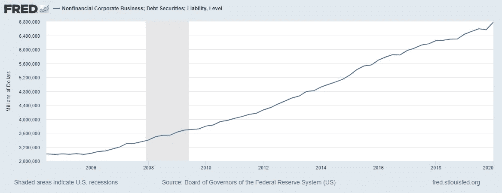
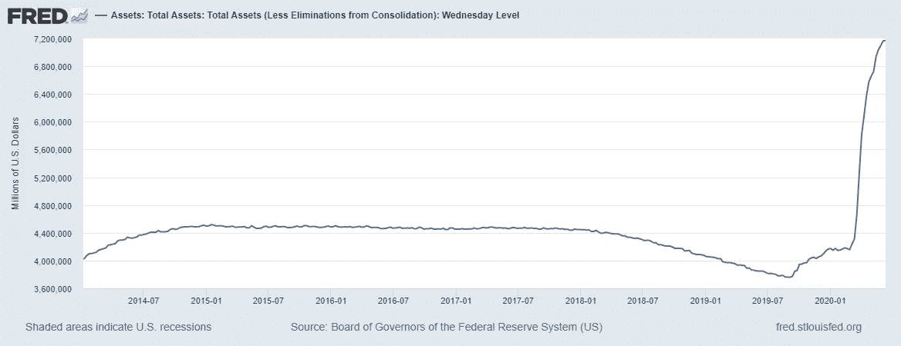

# 当前的经济衰退将是不平等的

> 原文：<https://medium.datadriveninvestor.com/the-current-economic-downturn-will-be-unequal-4b2144ee43b1?source=collection_archive---------18----------------------->

## 为什么这不是一个世界末日的情景，但美联储主席在谨慎上犯了错误

Source: Patrick on [Unsplash](https://unsplash.com/photos/uJhgEXPqSPk).

最近，杰伊·鲍威尔警告观察家们，美国经济将面临“重大的不确定性”。

当我四处滚动时，有大量的帖子涉及所谓的“主街”和“华尔街”之间的分界线。冠状病毒不是将经济推入可怕深渊的东西。

问题不在于冠状病毒。问题在于:

Source: [Blackrock](https://www.blackrock.com/institutions/en-us/insights/investment-actions/assessing-risks-in-bbb-corporate-bonds).

我们投资级债券市场的 50%是垃圾债券。这意味着现金被交给那些几乎没有偿还债务前景的公司。如你所见，它已经废弃很久了。

Source: [Bloomberg](https://news.bloomberglaw.com/bankruptcy-law/after-ge-investors-are-watching-these-debt-laden-companies-1).

政府在指导穆迪或标准普尔等债券评级公司及其评级方面发挥着重要作用。他们今天被评级的方式与他们在 2008 年导致抵押贷款危机时被评级的方式一样神秘。目前，预计美联储将以该公司的名义发行高达 4.5 万亿美元的债券。在过去的几个月里，美联储已经发放了大约 4 万亿美元。BBB 贷款通常是中低风险，但自 2008 年金融危机以来，债券发放率大幅上升。

Source: [FRED](https://fred.stlouisfed.org/series/NCBDBIQ027S). Rise in nonfinancial corporate debt, not updated to reflect current pandemic.

Source: [FRED.](https://fred.stlouisfed.org/series/WALCL) Rise in Federal Reserve’s balance sheet in the last few months, reflecting the current pandemic.

更大的问题是，我们看到非金融企业债务的增加。

现在的问题是，*这是什么？*

这些公司与制造业、服务业、政府和住宅相关。

虽然它们构成了中度到低度的风险，但我们现在的情况是，经济受到了轻微的打击。

但我们正处于这种债务的大高峰，之前利率很高，盈利能力的预期指引相对较低。

虽然这些公司和实体是必不可少的，但它们也在失去控制。不良利率，公司可能违约，大量贷款累积。利用收入持平但高利率下债务激增的经济部门，听起来不是一个长期的解决方案。

这场危机不是由某些疫情造成的，而是由于政府管理不善和决策不当造成的。我们的经济部门拥有大量现金，并有能力连续几个月让工人靠边站，然后我们看到了截然相反的情况，过度杠杆化、收入平平的企业正在进一步扩张。

我们现在开始看到这一点，因为我们所知道的一些公司在无法承受的债务压力下开始崩溃。

冠状病毒不会让我们沉没。政府已经在为我们这样做了。每次我们因为认识到巨大的债务泡沫而崩溃时，我们似乎都认为纳税人有能力把它重新拼凑起来。

资本主义不是杀死我们的东西，病毒也没有揭示资本主义体系的脆弱性。这是一个完全由我们自己的政府制造的泡沫。

一两个月的暂时失业不应该等同于我们经济的全面崩溃。也不应该等同于对它的恐惧。

自我们上次崩溃以来的 12 年里，最高层的人在做着同样的事情。只不过，这一次，经济不会遭受重创。许多公司，尤其是那些资产负债表干净的公司，可能不会感受到这种趋势的影响。这是因为不断增长的收入、高信用评分、更好的技术和更好的适应性。