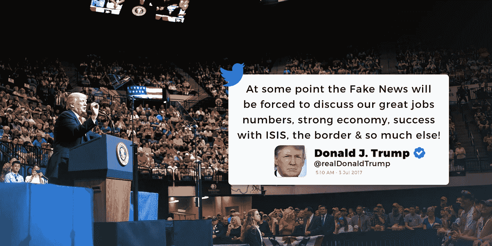

# 特朗普高糖经济的损害和危险

> 原文：<https://medium.datadriveninvestor.com/the-damage-and-danger-of-trumps-sugar-high-economy-c03a740e28d9?source=collection_archive---------7----------------------->

Trump continues to mislead Americans about the real effect of his economic policies. commons.wikimedia.org

特朗普总统在本月早些时候的国情咨文中庆祝了他声称已经建立的经济的公认成功，用历史性的话来说:“今晚我很兴奋地向你们报告，我们的经济是有史以来最好的，”他吹嘘道。

然而，与此同时，预算赤字和国债继续飙升，表明特朗普的政策不是为了长期刺激经济，而是目前美国经济正在运行在一个高糖水平上，显示出随时可能崩溃。

尽管股市表现创纪录，但国债也飙升至创纪录水平，有史以来首次超过 23 万亿美元，并有望进一步膨胀。在 2020 财年的前四个月，赤字超过了去年同期 25%的赤字扩张。在过去的 12 个月里，赤字增加了 1.1 万亿美元。

贝丝·莱文(Bess Levin)为《名利场》( Vanity)Fair)撰稿，她写道:“令人难以置信的是，这一切都是在有记录以来最长的经济扩张和 50 年来最低的失业率的背景下发生的，这种情况通常会导致预算赤字*缩减。”*

当然，特朗普承诺，他给予美国企业和最富有的美国人的极其慷慨的减税将刺激增长，这将覆盖减税的成本，并让所有美国人共享繁荣。(当然，我们不要忘记他在竞选时承诺，事实上，他将完全消除债务，当时的债务约为 19 万亿美元。)

然而，尽管 2018 年国内生产总值增长了 2.9%，但随着债务和赤字膨胀至历史高位，2019 年的增长放缓至 2.3%。

特朗普发表国情咨文炫耀几天后，副总统迈克·彭斯在接受美国消费者新闻与商业频道采访时为特朗普的赤字扩张辩护。

以下是他的一些回应，这些回应不仅重复了涓滴经济学和减税为自己买单的陈腐(因为失败了)叙述，还严重歪曲了历史，错误地声称特朗普继承了一个衰退的经济，而不是奥巴马政府策划的历史上最稳定增长的经济之一。便士支支吾吾如下:

“总统上任后说，‘首先，我们必须恢复增长。’"

“赤字和债务是正确的，但首先是让经济再次运转起来，我们真的相信经济的发展轨迹。”

“一旦我们让经济运转起来，我们将非常努力地工作，不仅是为了让唐纳德·特朗普总统在白宫再呆四年，而且我们将确保我们有一个共和党参议院和一个共和党众议院，以保持美国的增长，并应对这些长期的财政挑战。”

当然，这里的大谎言是彭斯坚持认为奥巴马没有让经济运转起来，特朗普需要让经济再次运转起来。

例如，Politifact 报道称，在研究了特朗普提出的经济措施后，“从奥巴马总统任期的后半段到特朗普任期的前三年，趋势线几乎无缝延续。特朗普声称他扭转了一个失败的经济是错误的。”

奥巴马运行赤字，增加债务，艰难地将国家经济从深度衰退中拉出。特朗普一直在过度刺激一个已经健康的经济，向最富裕的人扔钱，而没有为美国的真正增长投资，欺骗美国人它会慢慢渗透。

当然，早在 2015 年，世界银行就否定了涓滴经济学的功效，将其斥为神话。国际货币基金组织实际上痛斥这是一个笑话。

彭斯坚持循环利用这一失败的神话，基本上是承认特朗普对美国经济的欺诈性管理不善，损害了美国人的生活。

彭斯断言，特朗普认为“华盛顿特区财政挑战的真正长期解决方案是确保每个美国人的预算都在增长。”

然而，贫困和无家可归实际上是美国正在增长的问题，而特朗普试图让大多数美国人更难获得和负担得起医疗保健。

让我们不要忘记不断增长的赤字如何影响美国的经济福祉。

例如，特朗普减税政策导致的赤字膨胀为[保罗·瑞安](https://www.nytimes.com/2017/12/02/us/politics/tax-cuts-republicans-entitlements-medicare-social-security.html)和[米奇·麦康奈尔](https://www.newsweek.com/deficit-budget-tax-plan-social-security-medicaid-medicare-entitlement-1172941)大声重申他们的坚持，即削减医疗保险和社会保障是必要的，以解决他们自己的政策立即加剧的失控赤字。这些减税措施，本应是涓滴细流，却远没有让美国人受益，只是不断削减美国人的收入，增加经济的不稳定性，而不是繁荣。

特朗普本人最近在参加瑞士达沃斯世界经济论坛时证实，他打算削减社会保障、医疗保险和医疗补助。

虽然为了我们的国家和个人福祉，我们需要支持农民，但纳税人出资 280 亿美元帮助他们摆脱困境的原因正是因为特朗普与中国的贸易战失败以及他征收的关税。

再说一次，这实际上是从美国人的口袋里掏出了 280 亿美元，而他们却没有得到任何回报。事实上，他们会损失更多，因为这些支出会导致其他地方的削减以及赤字上升。

请记住，正如经济学家拉里·萨默斯(Larry Summers)所指出的，刺激经济增长的真正投资是重建和更新国家基础设施。

但是这种基础设施在很大程度上是公共领域。企业不会重建我们的桥梁和道路，更新我们的电网，为更快的火车铺设新的铁路。等等。他们希望政府用纳税人的钱来做这件事。

但是，糟糕的是，公司并没有被期望支付公平的税收份额；我们的税收正被扔给他们，而他们却在大规模裁员，对投资美国人的生活却没有什么回报。

彭斯当然知道这一点。他承认了特朗普经济的失败。