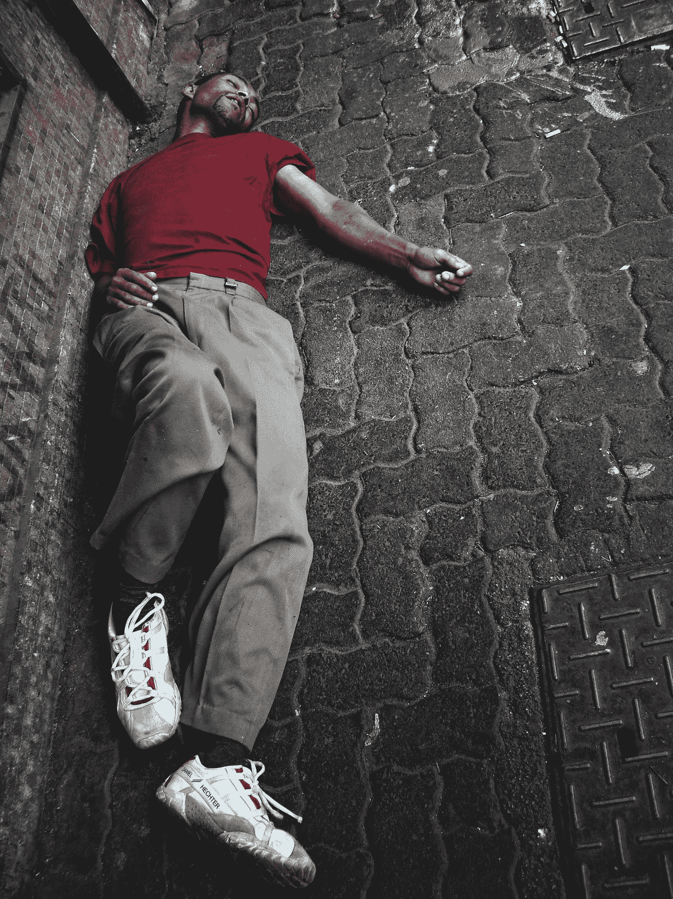

# 那天我在舞台上喝醉了

> 原文：<https://medium.datadriveninvestor.com/the-day-i-got-drunk-on-a-stage-251e304003fb?source=collection_archive---------23----------------------->

## 我给三百多名受酒精影响的人做了一次演讲

我天生害羞；我天性害羞。但是生活把我推向挑战我的羞怯的道路，一点一点地；它成了我性格中的一个特征。以至于我最终成为了一名演员，一个必须出现在舞台上的职业。

但是我现在要讲的故事就发生在这个过渡时期。当我还很害羞的时候，生活把我推到了舞台上。

这发生在 1995 年，当时我在一个与联合国有关的名为“Tips”的非政府组织工作。这个非政府组织的作用是创建一个新兴国家公司的数据库，这些公司可以用它来寻找有利可图的业务。例如，一家中国服装制造商可以从巴西生产商那里以比市场上更有吸引力的价格购买棉花。

我是非政府组织的营销助理。我的主要职能是向对数据库感兴趣的企业家介绍该组织。那总是带我去参加地区性的商业会议，小型的“交易会”，在那里 Tips 设立了一个摊位，我呆在那里，欢迎商人并回答他们的问题。在其中的几次会议中，我不得不就小费进行演讲，这让我感到害怕，但我还是继续领取我辛苦挣来的薪水。

其中一个集市发生在米纳斯吉拉斯州农村的阿拉克萨市。我在那里呆了将近一周。头几天，我呆在摊位上发传单，和商人交谈。最后一天，我会做这样一个讲座。

由于我在这个城市呆了很长时间，我和几个在交易会上参展的人交了朋友。有一天我和一个人吃了晚饭，接着又和另一个人吃了午饭……最后，我们召集了四五个人来庆祝博览会的结束。我们前一天晚上就出发了，因为博览会将在第二天早上结束——我的演讲将是最后一项活动——我们将回到自己的家乡。

我不应该做这件事…

我们去了城里的一些酒吧。我那时还很胆小，过去常常喝酒来克服自己的羞怯。如果我没喝醉的话，我是无法和一个女孩说话的……而且作为一个迷人的女人……

我记得一个漂亮的女孩看着我。

我记得我的一个朋友鼓励我去和她说话。

我记得我向服务员要了一杯啤酒来壮壮胆…

我记得我要了另一瓶啤酒…

另一个…

另一个…

我记得敲了门。

当我睁开眼睛的时候，已经是早上了。我在我住的酒店房间里，仍然穿着我前一天穿过的西装，躺在床上……我想象着我的状况和下面照片中的那个人很相似:

Photo by [Johnny Cohen](https://unsplash.com/@jonecohen?utm_source=medium&utm_medium=referral) on [Unsplash](https://unsplash.com?utm_source=medium&utm_medium=referral)

我起身，头晕目眩……意识到自己还是醉了。我没有宿醉；我当时*还醉着*！我的身体还没来得及从昨晚恢复过来！我没有真正明白是怎么回事就走到门口，问是谁，没有开门。前一天和我一起出去的是我的一个朋友:

“胡利亚诺，快八点了！你记得你必须在八点钟做一个报告吗？”

不，我不记得了。

我内心的绝望让我比拉肚子的尤塞恩·博尔特更快地跑到了浴室。我照了照镜子，刮了有生以来最快的一次胡子，刷了牙，梳了头，换了衬衫，打了领带……然后我摇摇晃晃地——我还醉着——走向演讲厅。

由于我还在酒精的影响下，我对那天发生的事情只有一些记忆。我记得拥挤的三百人大厅——我祈祷它会是空的——被宣布谈论技巧，走上舞台，并开始讲话。幸运的是，那堂课不仅仅是背下来的，无论我去哪里，我总是重复它，也许，也许我没有说什么愚蠢的话。我还记得其中一个商人试图和我开玩笑——也许他意识到我不在我通常的清醒状态——我邀请他上台和每个人开玩笑——我是一个刻薄的演讲者。其他的我都不记得了。

这是个大问题。

我不知道我浏览了什么内容。

我仍然试图和我的朋友们核实讲座是否精彩，但他们在结束前就离开了，我甚至没有和他们中的任何人交换电话。

我相当自信地离开了那里，因为观众为我鼓掌；我不认为我说了什么废话。但是我花了很多时间害怕有人打电话给 Tips 说我喝醉了。我唯一有信心的是，那次演讲很好，因为一个月后，我收到了一份证书，祝贺我发表了精彩的演讲。

唷！

谢天谢地…因为我喝醉了，我可能坐错了公共汽车，最后到了布宜诺斯艾利斯！

(位于阿根廷，距离我的城市圣保罗两千多公里。)

**访问专家视图—** [**订阅 DDI 英特尔**](https://datadriveninvestor.com/ddi-intel)