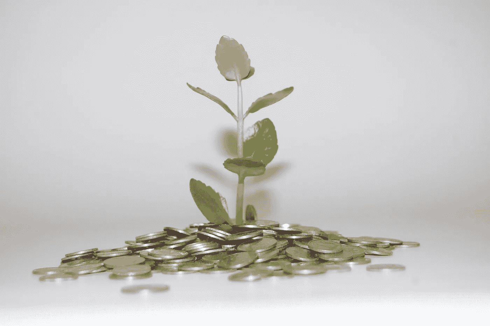

# 那天我遇到了金钱奇迹伯纳德·利塔和班科人

> 原文：<https://medium.datadriveninvestor.com/the-day-i-met-money-miracle-bernard-lietaer-and-the-bancor-people-90b64be7f755?source=collection_archive---------11----------------------->

## 再生未来

## 回忆我迄今为止的美丽旅程

Picture: [pxhere](https://pxhere.com/en/photo/910664).

方舟冬天的日子让我心神不宁。我在沉思。和回忆。在接下来的几周里，我会告诉你一些我不可思议的旅程。以及在我迈向[再生未来](https://medium.com/age-of-awareness/regeneration-better-sustainability-why-and-what-is-it-b6f48415f4e)的旅程中与我同行的那些特殊的人。

今天，我想告诉你我和[伯纳德·里塔尔](https://en.wikipedia.org/wiki/Bernard_Lietaer)的一天，伯纳德·里塔尔是去年去世的[巴黎大学](https://en.wikipedia.org/wiki/Sorbonne_University)著名的货币教授。一位智者，他和我谈到了金钱的阴阳两极，并让我用他的金钱理念帮助农民创造充满活力的市场。

[Bancor](https://blog.bancor.network/about)的联合创始人 Guy Benarzi 和产品架构师 [Eyal Hertzog](https://medium.com/u/1eb38cf7d6a1?source=post_page-----90b64be7f755--------------------------------) 也在现场。Bancor 很年轻，他们从 2017 年 2 月开始。而且我说的是[2017 年 5 月 3 日](https://www.bitcoinwednesday.com/videos/sustainability-design-currency/)。

如果我没记错的话，就在这一天之后，伯纳德成为了 Bprotocol 基金会的主席，并以他惊人的金钱智慧加强了 Bancor 的协议。

为什么我会在那里？嗯，事后看来我也不太清楚。伯纳德给我建议的项目没有成功。但是我确实需要了解再生货币 T21。所以也许正是因为这一课，宇宙在这个特殊的日子把我送到了阿姆斯特丹。

或者我可能会告诉你钱的故事。这是我乐意做的事情。

## 加密货币的基本收入

几天前，我的好友安娜·布鲁姆打电话给我。她很兴奋。“我们看到了如何实现这一点，”她说。“我们可以创造出一种动态的给予和接受的共同体货币。用代币创建一个[无条件基本收入](https://en.wikipedia.org/wiki/Universal_basic_income)。班科尔可能是我们进步的关键。”

我们在视频通话，我从她的眼睛里看到了。她有一种开明的品质，这让我很兴奋。但是我完全不知道她在说什么。Bancor？[加密货币](https://en.wikipedia.org/wiki/Cryptocurrency)？[区块链](https://www.euromoney.com/learning/blockchain-explained/what-is-blockchain)？[以太](https://ethereum.org/en/)？

你一定知道钱从来不是我感兴趣的领域。是的，我了解再生经济。关于[再生商业模式](https://medium.com/swlh/business-models-from-linear-to-circular-to-regenerative-9f10c19f337)与协同和范围一起工作。用这些商业模式创建公司。和再生区域。

我意识到大自然是如何以其丰富的法则运作的，以及我们是如何创造了以匮乏为核心的人类系统。这有什么不合适的。但我从未真正考虑过加密货币能够提供再生解决方案。我还在考虑常规货币和道德银行。

对我来说，加密货币是技术书呆子(我这么说是出于一种热爱，因为我认识许多出色的技术书呆子)和贪婪的资金投机者的领域。比特币是我唯一知道的品牌。我所听到的一点也不道德。最重要的是，区块链是一个巨大的能源消耗者。不太合我的胃口。

## 比特币周三的邀请函

但是安娜是一个很好的解释者。因此，在我们的谈话之后，我了解了区块链和加密货币。我看到了班科尔的潜力。这里就不解释细节了。我想你，数据驱动投资者的读者，比我知道的更多的技术细节。

然后安娜说了咒语。

“下周三你能来阿姆斯特丹吗？Bernard Lietaer 和 Guy Benarzi 都将在比特币星期三(T1)发表演讲。我被邀请在一次私人谈话中与他们谈论[价值工具](http://valueinstrument.org/)，我们对动态资金流的解决方案。加入我吧。会很好玩的。”

嗯，和安娜一起去冒险总是很有趣。她住在柏林(德国)，我住在威尔(荷兰)，所以我们不常见面。但是当我们见面时，令人兴奋的事情开始发生…

伯纳德多年来一直是我的英雄。他是参与建立[欧元](https://en.wikipedia.org/wiki/Euro)的教授，他退出了这个项目，因为他不相信这么多不同欧洲文化的一种货币能够以道德的方式运作。他还写了《金钱的未来:超越贪婪和匮乏》这本书。

伯纳德也是罗马 T8 俱乐部的成员。罗马俱乐部在关于再生未来的需求和机遇的思想领导中发挥了重要作用。他们的报告《生长的极限》是 70 年代开始再生的种子之一。

所以，我坐火车旅行了两个小时到了阿姆斯特丹。我毫不后悔答应了安娜。

## 会见伯纳德和盖伊

那是我们和 6 个人一起吃的早午餐。我记得伯纳德、盖伊、埃亚尔、安吉拉·希勒米(考文垂大学农业生态转变副教授)、安娜和我。气氛轻松友好。我们是一群试图改变世界的人。被驱使。热情。以我们自己的方式。

Guy 和 Eyal 告诉我们他们在以色列开始 Bancor 协议的努力。关于他们移居瑞士的计划，因为这是地球上唯一一个你可以尝试改变货币体系而不会陷入法律纠纷的地方。关于 Bancor 改变货币体系的巨大潜力。让所有社区的所有人都能用上钱。轻松赚钱，独立于机构银行。

伯纳德告诉我们钱的本质以及它与当地文化的关系。钱是如何和人联系在一起的。当我问了他一个我特有的“无辜的”(被一些人认为是愚蠢的)问题时，他解释了滞期费的问题。

我终于明白了货币系统是如何顺应自然运行的。以及为什么现在钱有这么多有毒的品质。

**如果你渴望在生活中学习，我的朋友们，给你一个建议**。总是问一些无辜的问题。不知道的时候千万不要假装知道。尤其是在聪明、知识渊博的人面前。他们经常没有意识到他们远远领先于我们，普通的多面手，什么都懂一点。

露出你最友好的笑容，问你不知道的。这就是我如何获得我自己关于所有人类和地球问题的再生解决方案的深刻知识。

但安娜永远比我更理解金钱的深层智慧。我永远也看不到她所看到的。但至少在我提出问题后，我可以在羊角面包、咖啡和蛋糕上跟随他们的思路。

分享一个美味的细节:我记得蛋糕真的很好吃…

由于我的问题，我现在能够将这些钱点与我从事再生工作的所有其他领域联系起来。获得了宝贵的见解。

## 道德货币

我们谈到了一些新的金钱平台的滥用权力以及 Bancor 需要考虑的道德问题。

当然，我的朋友[安娜·布鲁姆](https://medium.com/u/76d70a72e275?source=post_page-----90b64be7f755--------------------------------)分享了关于给予和接受的动态资金流的智慧之言。我的朋友们，她正在用她的工作改变世界。对于她深刻的伦理思想领导力和实用价值解决方案来说，现在可能还不是时候。但是记住我的话。她很快就会到达那里。

幸运的是，在阿姆斯特丹的这个特殊的星期三，所有参加会议的人都认识到了彼此的价值，并在他们自己的个人旅程中取得了进展。

在这次会面中，Bernard 让我利用我的欧洲再生能源农民网络，帮助 Angela 为农民和新的资金启动一个项目。给农民一个本地市场，缩短供应链。让社区里的所有人都能以一种道德的、充满活力的、经济的、创造性的方式获得金钱。

伟大的工程。但最终，为这个农民项目所预见的欧盟补贴从未启动。所以事情没有按照我们希望的方式发展。我和安吉拉失去了联系，但我希望她能以另一种方式创建她的农贸市场项目。

**在这次会议**之后，Bernard】发表了他 2017 年 5 月的科学论文关于 Bancor 和带有智能代币的无条件基本收入。作为基金会的主席、顾问和创始人的私人朋友，他与班科尔关系密切。他去年不幸去世。

**在这次会面**之后，安娜与[伯特-奥拉·伯格斯特兰德](https://medium.com/u/13bd8f946eb2?source=post_page-----90b64be7f755--------------------------------)和其他有影响力的变革者一起继续她在[冲击之旅](https://www.facebook.com/ImpactJourneyNews/)中有影响力的工作。2017 年 6 月在奥斯陆特隆赫姆组织 [Starmus 节。JP 坎迪奥蒂写道，他们向斯蒂芬霍金传递了一个社区信息。当然，作为](https://medium.com/@jpcandiotti/impact-journey-community-message-to-stephen-hawking-at-starmus-festival-2017-c2d5ecef02bd)[价值工具](http://valueinstrument.org/)的联合创始人，安娜仍然非常活跃。

**这次会面之后**，Guy 和 Eyal 确实搬到了瑞士，继续他们在 Bancor 的工作。我和他们以及伯纳德失去了联系。但我仍然密切关注 Bancor。如果你想了解所有道德、金钱和加密货币方面的最新信息，我建议你也这样做。

我自己没有任何代币。我无法集中足够长的时间来掌握它的窍门。但总有一天，当有人邀请我参与当地的经济和道德价值交换时，我会的。

## 比特币周三会议

那天晚上的[比特币星期三会议](https://www.bitcoinwednesday.com/videos/sustainability-design-currency/)真的很有趣。起初，安娜和我被拦在门口，因为票已经售完，我们还没有登记。但是认识将要上台的名人会创造奇迹。盖伊悄悄地告诉我们，我们可以通过安检。

正如我所料，在场的人主要是技术专家和贪婪的金钱投机者。他们被伯纳德关于金钱的阴阳两极的话惊呆了。这不是他们在比特币会议上所期待的。但是他确实触动了观众的神经。

技术人员非常渴望了解盖伊关于班科尔改变世界的潜力。甚至贪婪的人也有心脏。那间屋子里的每一个人一定从骨子里感到我们当前的货币体系有些不对劲，而且肯定有办法改变它。

再生在当时并不是一个广泛使用的术语。但是现在许多再生的声音站了出来。再生不仅仅被认为是一个环境问题，而是社会问题的系统变化，就像把人和地球结合起来一样。我确信 Bancor 也在他们的交换系统的概念设计中拥抱再生。

事后看来，在阿姆斯特丹的那个特殊的星期三，我可能见证了一个改变世界的事件。现在，在疫情和经济萎靡不振的黑暗日子里，记忆又回到了我身边。

**世界各地身居高位的人们都在为崩溃的经济部门、缺乏弹性的企业和令我们失望的金融体系挠头。**

我希望他们会再读一遍伯纳德·利塔尔的《T4》系列。和 Bancor 的人谈谈用道德的方式改变货币体系。与安娜谈论道德、所有人的无条件基本收入以及给予和接受的动态流动。和我谈谈商业、经济和社会。

进步总是建立在过去的事件上。

如果你想了解货币体系变革的进程，请阅读这篇由 Galia Benartzi 撰写的关于 Bernard Lietaer 的文章。她比我更清楚地告诉你道德货币和加密货币之间的联系。

 [## 为货币自由而战的金融正义斗士伯纳德·利塔尔

### 我对失去我亲爱的朋友和导师伯纳德·利塔尔深感悲痛，他于周一早上在他位于…的家中去世

博客. bancor .网络](https://blog.bancor.network/bernard-lietaer-a-financial-justice-warrior-who-fought-for-freedom-of-currency-25123ca599dd) 

我是一个点的连接器。我非常确定，2017 年 5 月阿姆斯特丹的一个星期三，这个特殊的点是我们梦想的再生未来的一个强有力的点。

## 外卖食品

*   钱是钱是钱。而且不是坏事也不是好事。它嵌入在人体系统中。此时此刻，系统是建立在稀缺性的基础上的。但是我们可以改变它，使之符合总是基于富足的自然法则。但是我们需要改变我们的人类系统。Bernard Lietaer、Bancor、 [Anna Blume](https://medium.com/u/76d70a72e275?source=post_page-----90b64be7f755--------------------------------) 和我都有独特的拼图来实现这一目标
*   货币体系应该受到自然和当地生态系统的启发，才能正常运转
*   货币系统应该与文化、当地的人类系统联系起来，以合乎道德的方式运作
*   跟着一些名人，你可以随时参加一个封闭的聚会

玩得开心，用高科技和低科技去操系统…

迈克，谢谢你给我的话增添了智慧。

*如果你想联系，你可以在这个美丽的星球上找到我。我的手在土壤里，我的目光聚焦在星星上。或者你可以通过* [*Linktree*](https://linktr.ee/desireedriesenaar) *找到我。*

 [## 协调经济、生态和人类精神

### 愿景是通向更美好世界的指南针。有可能！

medium.com](https://medium.com/illumination-curated/aligning-the-economy-ecology-and-the-human-spirit-f3a5185bfde5) 

*德西雷·德里森纳尔*