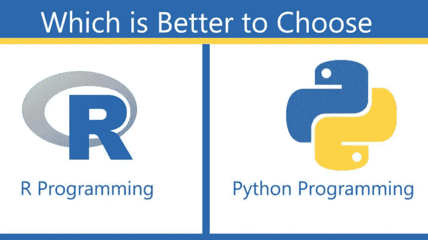

# 数据科学的致命组合——R & Python！

> 原文：<https://medium.datadriveninvestor.com/the-deadly-duo-of-data-science-r-python-b8b9f8c5305f?source=collection_archive---------11----------------------->

## 面向数据科学的 R & Python

编程语言 Python 和 R 经常因为哪种语言最适合数据科学而相互对立。两者都很有名，尽管 Python 似乎更常用，至少对于学习编程的人来说。

然而，数据科学是一个特殊的领域，所以当 Python 作为这个星球上最著名的语言发展时，R 仍然有它的位置，并且对那些进行数据分析的人有兴趣。

r 和 Python 都是开源编程语言，拥有庞大的社区。新的库或工具被一致地添加到它们各自的清单中。r 主要用于统计分析，而 Python 为处理数据科学提供了一种越来越广泛的方法。

[***定调&从基础学 Python！！***](https://techvidvan.com/tutorials/python-tutorial/)

就面向数据科学的编程语言而言，r 和 Python 是最前沿的。很明显，学习这两种语言是完美的解决方案。r 和 Python 需要一些时间投入，这种奢侈并不是每个人都能享受到的。Python 是一种非常有用的语言，具有可读的语法。然而，r 是由分析师创建的，包含他们特定的语言。

## 介绍 R:

Ross Ihaka 和 Robert Gentleman 在 1995 年将开源语言 R 作为 S 编程语言的用法。目的是建立一种语言，专注于提供更好、更容易理解的方法来进行数据分析、统计和图形模型。

 [## 成为数据科学家所需的 8 项技能|数据驱动型投资者

### 数字吓不倒你？没有什么比一张漂亮的 excel 表更令人满意的了？你会说几种语言…

www.datadriveninvestor.com](https://www.datadriveninvestor.com/2019/02/07/8-skills-you-need-to-become-a-data-scientist/) 

从一开始，R 基本上用于学术和研究，然而，最近的创业现场也发现了 R。这使得 R 成为企业界发展最快的统计语言之一。

R 的一个基本特性是它庞大的社区，通过邮件记录、客户贡献的文档和一个有效的堆栈溢出组来提供帮助。

同样还有 CRAN，这是一个巨大的 R 包档案库，用户可以对其进行贡献。这些软件包是 R 函数和数据的分类，使快速获得最新技术和功能变得简单，而不期望自己从头开始创建一切。

[***想成为数据科学家那就开始学习 R 吧！！***](https://techvidvan.com/tutorials/r-tutorial/)

最后，如果你是一名经验丰富的软件工程师，你可能不会花太多时间来熟悉 r。但是，作为一名初学者，你可能会最终与学习和适应的不确定期望作斗争。幸运的是，现在有许多令人难以置信的学习资源可供你参考。

## Python 简介:

Python 是由 Guido Van Rossem 在 1991 年提出的，它强调效率和代码可读性。出于统计目的，需要深入研究数据分析或应用统计技术的程序员是 Python 基础用户的一部分。

你越接近在工程环境中工作，你越有可能喜欢 Python。它是一种适应性很强的语言，特别适合完成一些新奇的事情，并且由于它强调可读性和简单性，所以它对学习和适应的期望通常很低。

和 R 一样，Python 也有包。PyPi 是 Python 包索引，由用户可以贡献的库组成。就像 R 一样，Python 有一个非凡的社区，但是它更分散，因为它是一种广泛有用的语言。

无论如何，用于数据科学的 Python 很快在 Python 世界中占据了越来越重要的地位:需求在增长，不断创新的数据科学应用将在这里开始

## 这很大程度上取决于你想通过你的项目实现什么。然而，这里有一些关于 R 和 Python 的要点需要考虑:

## 稀有

1)因为它是作为一种统计语言来使用的，所以它在总体上有着非凡的统计支持，所以对于任何有正式统计背景的人来说，这是很自然的。

2)基本的数据管理任务很简单。标记数据，填补缺失的品质，以及分离，这些都是基本的和本能的。

3)对于初学者来说，R 使得探索工作变得更加简单，因为统计模型只需要几行代码就可以完成。

## 计算机编程语言

1)如果你有一些编程经验，Python 可能是适合你的语言。它的语法和其他语言一样。

2)它读起来很像口头语言。这种可读性强调开发效率。

3)当数据分析任务应该被合并时，例如，与 web 应用程序合并时，您可以继续使用 Python，而不是与另一种语言进行协调。

[***你知道什么是 Python 列表吗？***](https://techvidvan.com/tutorials/python-lists/)

## 妥协

如果您需要在 Python 中本地获得 R 功能，RPy2 提供了 R 的所有主要功能。这给了你最好的 R 和 Python。

**在你看来，数据科学哪个好？**