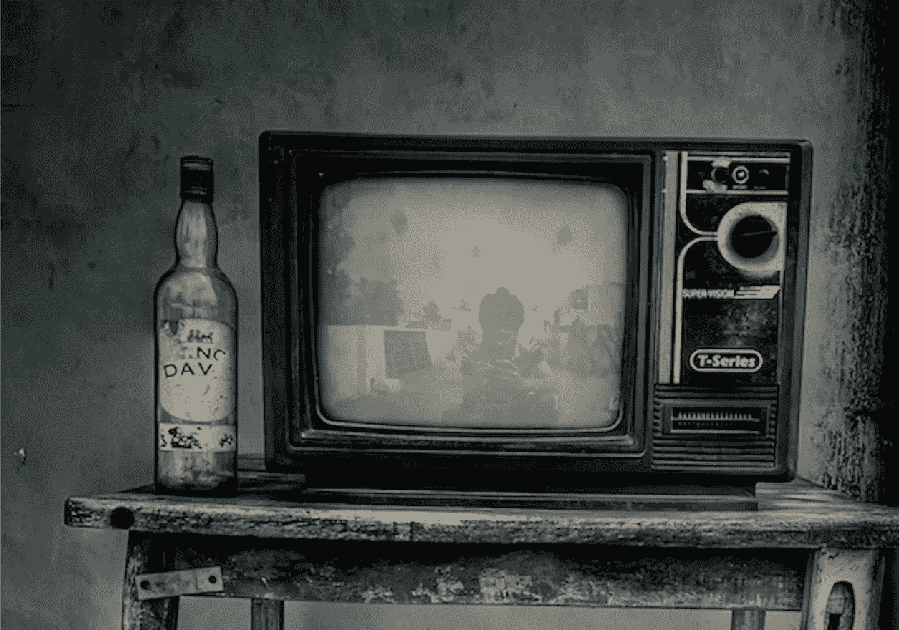
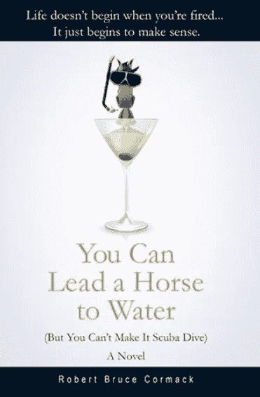

# 广告的死亡。

> 原文：<https://medium.datadriveninvestor.com/the-death-of-advertising-a20aaa20c08e?source=collection_archive---------15----------------------->

## 即将来到你身边的电视机前。

广告的麻烦在于它甚至不假装是真实的弗兰克·扎帕

曾经有一段时间，广告统治着地球。像来苏儿、好运来和 Alka-Selzer 这样的产品的赞助商决定了你抽什么，喝什么，以及什么样的痛苦留给你自己。例如，在《摩登原始人》中，赞助商阿尔卡·塞尔泽(Alka-Selzer)裁定，任何角色都不能胃痛，而且“不能有对医生、牙医或药剂师的贬损。”

> “Plugola”是意料之中的事，除了《Show of Shows》的席德·凯撒，没有人介意吹捧一个品牌，如果它能让他们的节目继续播出的话。

那些辉煌的日子里，每个人都知道自己的位置，艾迪·费舍呷着可乐，露西和德西·阿内兹抽着菲莫香烟，杰克·本尼叫卖着施文牌自行车。对于这些人来说，我们今天所说的产品整合已经过时了。“Plugola”是意料之中的事，除了《Show of Shows》的席德·凯撒，没有人介意吹捧一个品牌，如果它能让他们的节目继续播出的话。

这是一种共生关系，麦迪逊大道享有比他们今天所能想象的更多的权力。一方面，他们可以决定接下来会发生什么——就像当美国广播公司(ABC)建议由小萨米·戴维斯主演一档全黑人综艺节目时，杨和卢比肯走出会议室时的评论“在有太空人之前，广告界就有了太空人”

当然，这个想法被放弃了，多年以后，像诺曼·李尔这样的人才有机会建议黑人角色拥有自己的节目(杰弗逊一家)。

> 广告*很有趣，赞助商也同意每小时 6 分钟广告的行业标准(今天是 14 分钟)。*

当杰里·德拉·费米娜说了一句著名的话“我真诚地相信广告是你穿上衣服后能得到的最大乐趣”时，他不是在开玩笑。广告*很有趣，赞助商也同意每小时 6 分钟广告的行业标准(今天是 14 分钟)。*

在这六分钟的框架内，广告公司知道这不仅仅是一个被关注的问题。如果杰克·本尼能(即兴)说“给我三辆”施文自行车，销量就会飙升，那么每个疯子都知道，购买大众想要一种感觉，即展示中的任何巧妙之处都会渗透到广告中。

像道尔·戴恩·伯恩巴克这样的广告公司，在比尔·伯纳奇“不能让人们厌烦而购买”的理念的引导下，创造了出色的广告。在一个以年轻的达斯汀·霍夫曼为主角的大众广告中，他试图找到一辆快背轿车的引擎，打开前盖和后盖，却发现它们都是行李箱。

 [## 抓住智能营销，获得巨大成果|数据驱动的投资者

### 网上的人都看过。每当人们在谷歌上搜索某样东西，他们最终都会与类似的广告互动…

www.datadriveninvestor.com](https://www.datadriveninvestor.com/2020/08/19/grab-on-to-intelligent-marketing-for-great-results/) 

它在《全家总动员》中播出，很快在尼尔森收视率调查中连续五季排名第一。当*全家*都在飙升的时候，大众也在飙升。这款 Bug 成了超级巨星，在不到十年的时间里全球销量超过 2100 万部(相比之下，它在北美上市的第一年销量只有 2 部)。

> 每一个广告人(和女人)都明白，长时间的闪耀是值得的——或者偶尔*比*更耀眼——一屋子的喜剧作家。

这样的数字并不总是标准，但是只要产品是核心，广告就拥有惊人的力量和影响力。如果这意味着与节目本身竞争，那么长时间的闪耀是值得的——或者偶尔*胜过*——一屋子的喜剧作家。

政治广告同样具有影响力。在 1984 年里根的连任竞选中，南希·里根想给老“吉佩尔”注入新的生命。她推荐了哈尔·雷尼，他以体贴的广告和低沉洪亮的嗓音而闻名。

雷尼创作了《美国的早晨》，他说:“美国又是早晨了。今天，将有比我国历史上任何时候都多的男人和女人去工作。”这有点夸张。失业率创历史新高，但基于相对人口增长，这是事实。

无论如何，里根再次当选，雷尼可以说他发挥了重要作用。更重要的是，该广告在科斯比秀上的亮相帮助里根竞选活动获得了超过 20 亿美元的支持。

> 营销主管会依赖公式，就像大卫·奥格威说的，“一个醉汉用灯柱来支撑，而不是照明。”

事情当然会改变。在广告和情景喜剧领域辉煌多年后，research 决定固守其丑陋的脚跟。全世界的营销高管都会依赖这样的公式——正如大卫·奥格威所说——“一个醉汉用灯柱来支撑，而不是照明。”

如果说 70 年代情景喜剧的能量正在消退，那么与广告业的情况相比，这算不了什么。客户并不一定更难取悦(尽管很多客户确实如此)。他们只是嗅了嗅风，认为他们真正需要的是存在。

当然，他们在超级碗比赛上做广告，但那是因为其他人都在那里。即便如此，这种聪明似乎是被迫的，这是广告公司不习惯聪明概念的一个明显标志，而是依赖昂贵的制作价值和大牌人才。

> 他在信中说，2019 年有 371 个脚本节目。除了少数例外，公式取代了创新。

日复一日，广告商和情景喜剧坚持研究，FX 的首席执行官约翰·兰德格拉夫在向电视评论家协会发表演讲时感叹道。他在信中说，2019 年有 371 个脚本节目。除了少数例外，公式取代了创新。“泡沫最终会缩小，”他预测道。

这算不上什么预测。“巅峰电视”已经达到顶峰。每个人都“屈从于金钱”，广告商也不例外。当两分钟的原创作品可以买到一小时的美剧时，创造新东西有什么好处呢？

当 vcr、DVD、DVR 和互联网已经将网络简化为重播和公式工作时，为什么还要这么麻烦呢？为什么广告应该有所不同？没有深度订婚，何苦呢？

当然，广告公司没有答案。我被邀请参加一个会议，公司想给一位新的副总裁兼创意总监留下深刻印象。展示了一百多个广告，但没有人提到广告做得有多好，除了说客户“喜欢它”

> 没有人会像道尔·戴恩·伯恩巴克(Doyle Dane Bernbach)做大众汽车(Volkswagen)的“小处着眼”(Think Small)时那样，站在饮水机旁辩论广告。

所以我们快死了也就不足为奇了。如果广告曾经统治地球，现在我们只是地球人。没有人再期待被震惊或惊讶了，就像没有人站在饮水机旁像大众汽车的“以小见大”那样辩论广告一样。

我们不思考，因为人们不期望我们思考。“钱”在分配中，这才是最重要的。你有没有想过为什么现在电影公司制作这么多动作片？这是因为追逐戏，枪战，谋杀和强奸需要很少的对话。你拥有的越少，为国际市场翻译和配音就越容易，也越便宜。

想想电子游戏。他们为什么这么暴力？因为游戏玩家不再是孩子了。超过百分之六十的人是成年人，大多数人只想炸毁一些东西。

所以，不，广告商对创意或广告并不特别感兴趣。存在是好的，但是不值得花力气去创造 T1，即使像 GEICO Insurance 这样的公司一直都很有创造力，而且非常成功。

> 伯克希尔·哈撒韦公司董事长沃伦·巴菲特说，如果可能的话，他会向 GEICO 投资 20 亿美元。

伯克希尔·哈撒韦公司董事长沃伦·巴菲特说，如果可能的话，他会向 GEICO 投资 20 亿美元。一个响亮的支持，当然，但仍然不像旋转地狱的切片生活的商业。而产品整合呢？当然，布鲁斯·威利斯拿着可乐炸掉一个弹药库比展示一只会说话的壁虎要容易得多。

难怪广告正在消亡。接下来会发生什么谁也说不准。我们已经看到了警告信号。现在的问题是等待尘埃落定。总有一天会的。也许会有另一个比尔·伯恩巴克。不过，我对此表示怀疑。

正如他曾经说过的，“在广告中，不与众不同无异于自杀。”也许现在的问题就在这里。我们不想与众不同。

所以我想我们是自杀。现在看来的确如此。

罗伯特科马克是一个讽刺作家，小说家，前广告文案。他的第一部小说[“你可以把马牵到水边(但你不能让它潜水)”](http://robertcormack.net/)在网上和大多数主要书店都有售。查看[天马出版社](http://skyhorsepublishing.com/)或[西蒙和舒斯特](http://simonandschuster.ca/)了解更多细节。

## 访问专家视图— [订阅 DDI 英特尔](https://datadriveninvestor.com/ddi-intel)