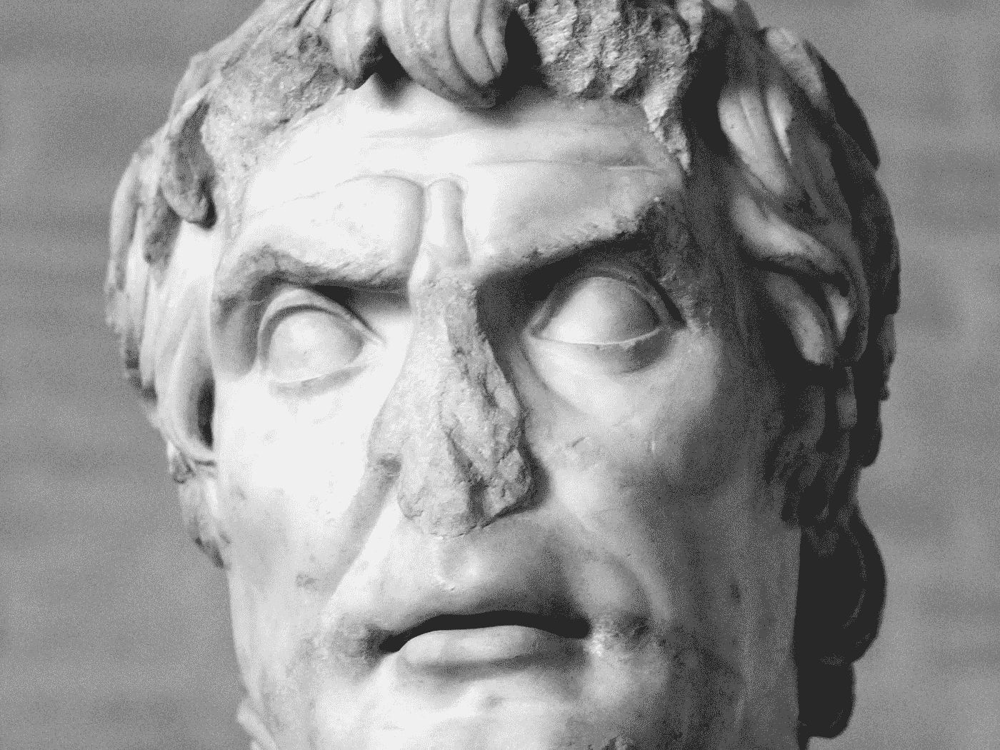
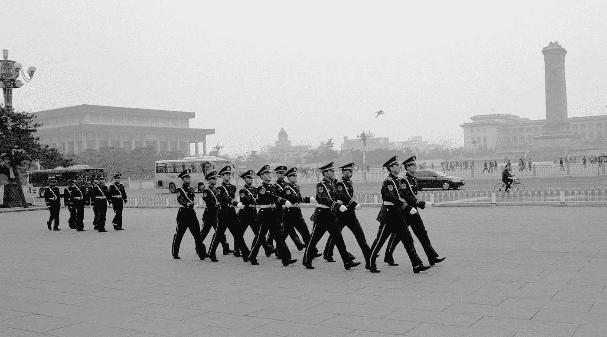

# 美国之死

> 原文：<https://medium.datadriveninvestor.com/the-death-of-america-1b4c93090783?source=collection_archive---------4----------------------->

## 对生存威胁的强烈恐惧——尤其是在真理颠倒、理性减弱的环境下——是驱使一个民族改变一个国家的全部因素，无论这个民族多么谦虚或强大。纵观历史，这种事情发生过无数次；对于历史，尤其是古罗马的历史，我们应该转向理解我们潜在的未来。美国几乎肯定会在未来十年经历翻天覆地的变化。它很可能会出现，面目全非。

Homeless at home © Anthony Fieldman 2017

忘记一个事实，卢基乌斯·科尔内利乌斯·苏拉——简称为**——是一位天才的将军。当他**推翻罗马政府，粉碎有着 424 年历史的共和国**时，不同之处在于他如何利用他作为*Optimates*——罗马保守派——的领袖的权力，粉碎反对派*populars*——主张“为人民”改革的自由派。在与对手马里乌斯发生争执后，他向罗马进军——这是前所未有的举动——并消灭了他的敌人。他掌权后，做了几件事。他煽动并赢得了该国的第二次内战，对抗民众。他巩固了军事权力，成为军队的总司令，然后运用这一权力动摇罗马统治的长期结构，成为其唯一的执行者。然后他复兴了一个古老的独裁政权，继承了衣钵，并通过使用**取缔**——也就是说，通过宣布*民众* **为国家的敌人**——推翻了罗马几个世纪的多党统治。他改革宪法以巩固他的政治权力。而他*直接*充当了朱利叶斯·凯撒的灵感——模板——以及后来*他的*养子凯撒·奥古斯都，使用武力实现他们的意志，让政治见鬼去吧，**开创了罗马帝国**。**

**凯撒，如果需要说的话，和他的儿子凯撒奥古斯都，可能是**罗马帝国**的共同创造者；但事实上，他们只是完成了苏拉开始的工作。**

****

**Sulla**

**人们陷入混乱和存在的恐惧，惊慌失措，迷失了方向。**

**我不会阐明苏拉统治下的罗马共和国和今天的美利坚共和国之间的必然联系，就像上面的故事不会揭露一样。我要说的是，当共和国垮台时，帝国出现了，罗马继续存在并维持其霸权，尽管是以一种全新的形式，持续了 450 到 1000 年，这取决于帝国最终三巨头的哪一个分支——西方、东方和神圣——你算在内。**

**这里重要的是，在短短的三年里，一个贪得无厌的无视宪法和使用武力的人，作为军队的事实上的指挥官，能够通过采取当时前所未有的措施——*——没有任何当权者反对的*——来重塑罗马的形象，从而摧毁了 500 年的历史。**

**从那以后，罗马就变了。**

****

**The Pantheon. Photo by [Johan Munsberg](https://unsplash.com/@johanmunsberg?utm_source=unsplash&utm_medium=referral&utm_content=creditCopyText) on [Unsplash](https://unsplash.com/s/photos/pantheon?utm_source=unsplash&utm_medium=referral&utm_content=creditCopyText)**

# ****恍然大悟****

**当我 18 岁来到美国时——一个外来者——不到一个月，我就不带偏见地认为，美国“从内部”与我移居美国之前对世界上最伟大的民主实验的印象明显不同。具体来说，这似乎是*而不是*一个加速潜能的地方，而是处于某种衰退阶段。这是 1987 年。作为一个对政治或历史(当时)不感兴趣，对美国的成功或失败(当时)也没有任何既得利益的青少年，思考这些事情是很奇怪的。我的观察来源于三个方面:**我观察人们如何对待彼此**；消耗他们注意力的**事情**和对话；以及他们关于他们所关心的事情如何与过去发生的其他事情相关联的知识，可以作为路标。**

**他们中似乎没有人知道——或者对——罗马的故事感兴趣。**

**这就是傲慢。**

# ****战争****

**通过使用“战争”这个词，我指的不是军事战争，而是大量美国人的信念——出于各种原因——我们正在国内为这个国家的“灵魂”*而战。这是真的**政治**，民主党人和共和党人现在都深信‘另一个党’正试图摧毁这个国家。因此，尽管他们被选举出来促进人民的利益，但十年来他们大多拒绝合作。在经济上，贫富之间日益扩大的差距造成了美国历史上最大的收入差距，这是事实。根据皮尤研究中心的数据，在过去的 33 年里，高收入者的财富增加了 33%,现在他们拥有全国总财富的 79%;而中产阶级和下层阶级的财富已经减半，现在分别只有 17%和 4%。在宗教方面，这是真的，其中“老派”偏见已经成为制度性的，NPR 报告说“在最近一年的研究中，美国第一次从政府对宗教限制的低度类别转移到温和类别”在教育方面这是真的，因为根据【美国消费者新闻与商业频道】的说法[仅在过去的十年里](https://www.cnbc.com/2019/12/13/cost-of-college-increased-by-more-than-25percent-in-the-last-10-years.html#:~:text=Work-,The%20cost%20of%20college%20increased%20by%20more%20than%2025%25%20in,last%2010%20years%E2%80%94here's%20why&text=During%20the%201978%20%2D%201979%20school,to%20attend%20a%20public%20college.)*私立大学的费用就上涨了 25%[,使得大多数美国人更难接受高等教育，他们的收入和财富在同一时期都直线下降。有趣的是，它指出国家资金的削减是一个“主要原因”，尽管这只有在入园的价格一开始就令人望而却步的情况下才有意义。确实是。根据皮尤社会趋势](https://www.cnbc.com/2019/12/13/cost-of-college-increased-by-more-than-25percent-in-the-last-10-years.html#:~:text=Work-,The%20cost%20of%20college%20increased%20by%20more%20than%2025%25%20in,last%2010%20years%E2%80%94here's%20why&text=During%20the%201978%20%2D%201979%20school,to%20attend%20a%20public%20college.)[和十分之六的美国人报告说“种族关系不好”，现在大多数(2/3)美国人说“自从特朗普成为总统以来，人们表达种族主义观点变得更加普遍”。我们不需要看很远就能看到窗外的街道上发生了什么。](https://www.pewsocialtrends.org/2019/04/09/race-in-america-2019/)**

**#BLM**

****

**I can’t believe… © Anthony Fieldman 2020**

# **edu-什么？**

**除了私立教育的成本，甚至在大多数地方免费教育的高度可变的*质量*，我们必须考虑普通大众的整体智力能力。我认为，决定一个人发展轨迹的是*教育*，而不是其他任何衡量标准。正如我在 [*反智主义*](https://medium.com/@anthonyfieldman/anti-intellectualism-80af26e19147) 中所写的那样，塔利班执政时铲平了 650 所学校，以阻止儿童——大部分是女孩——通过教育实现自我赋权；然后在他们*不*掌权的时候又扔了 750 个燃烧弹。虽然美国人没有炸掉学校，但就其本身而言(校园内的枪支暴力完全是另一个问题)，全球化研究中心报告称，“美国学生实际上落后于所有发达国家”。据商业内幕报道，皮尤中心的研究显示，美国人在全球排名第 27 位:数学排名第 38，科学排名第 24。教育研究员辛西娅·韦瑟利(Cynthia Weatherly)将美国教育体系称为“终身劳动的有限学习”。根据美国教育部的数据，19%的高中毕业生甚至不会阅读，而 21%的成年人阅读能力低于五年级水平。虽然能源部最近已经从它的网站上删除了这个不方便的统计数据(谢谢，贝琪！)，费用(经济教育基金会)还是包含在里面[这里](https://fee.org/articles/did-public-schools-really-improve-american-literacy/#:~:text=According%20to%20a%20recent%20study,living%20and%20perform%20tasks%20required)。**

**我开始写关于反智主义兴起的论文——讽刺的是，很少有人读这本书——引用亚伯拉罕·林肯的话，“一代人的学校哲学将成为下一代人的政府哲学。”我指出了这样一个事实，即那些有能力接受教育的人将进一步远离那些没有受过教育的人，导致后者被严重地(如果不是不可挽回地)抛在后面。此外，正如我所写的，“他的声明还暗示，没有教育，我们就没有执政能力。也就是说，缺乏高质量的学习(在任何经济水平上)对个人和集体都有严重影响。”**

****

**The Coding Space © Anthony Fieldman 2015**

# ****真理之死****

**这不仅仅要归咎于正规教育。我当时写道，“根据皮尤研究中心 的 [*数据，2008 年至 2019 年间，新闻编辑室的就业人数下降了*一半*，从 7.1 万人降至 3.5 万人。失去工作的人包括分析师、记者、记者和编辑——“制衡”的新闻生态系统确保——至少——报道的内容反映了公认的事实。”真相的死亡——过去十年的一个典型特征，由于多种原因，导致了课堂外美国教育的进一步恶化。这不仅影响个人的机会和繁荣，也影响整个国家的繁荣。这是因为**我们生活在一个单一的、相互依赖的全球经济中**——在这个经济中，许多其他国家在确切的类别(经济、政治和教育)上崛起，而美国却衰落了。这一阴谋将美国变成一张大嘴，供更强大的行动者喂养或操纵。*](https://www.pewresearch.org/fact-tank/2020/04/20/u-s-newsroom-employment-has-dropped-by-a-quarter-since-2008/)**

**已经发生了。到处都是。**

**自称为“无政府资本主义”的作者道格·凯西(Doug Casey)是一名煽动者，我对他的观点基本上不同意。他在《国际编年史》**上写了一篇文章，详细描述了为什么美国会步古罗马的后尘进入历史的垃圾箱，“原因大致相同。”他从一些简单的统计数据开始:****

> ****“早在 20 世纪 50 年代，美国就达到了相对于世界的顶峰，在某些方面是绝对的顶峰。1950 年，这个国家生产了世界国民生产总值的 50 %( T21)和 80%的汽车。现在它约占世界国民生产总值的 21%和汽车的 5%。它拥有全球三分之二的黄金储备；现在它占了四分之一。迄今为止，美国人的平均收入是世界上最高的；今天它排在第八位，而且正在下滑。它是世界上最大的债权国，遥遥领先，而现在它是最大的债务国，遥遥领先。”****

****在最后一点上，美国现在是原油、商品和服务的净进口国，甚至是食品的净进口国，这是自美国农业部开始报告以来的第一次。根据 [*Investopedia*](https://www.investopedia.com/terms/n/netimporter.asp#:~:text=The%20U.S.%20as%20a%20Net,a%20net%20importer%20for%20decades.&text=In%202017%2C%20imports%20exceeded%20exports,was%20%24520%20billion%20per%20year.) 的数据，每年进口超过出口近 6000 亿美元。这就是我刚才提到的“巨口”。****

****然后凯西补充了一个警示故事——我们一生中的一个:****

> ****“但衰落的不仅仅是美国，还有西方文明。1910 年，欧洲在政治、金融和军事上几乎控制了整个世界。现在，它正成为一个拥有真实建筑的迪斯尼乐园和中国人的宠物动物园。它甚至比美国更不稳定。”****

****他很好斗，但这并不意味着他是错的。他接着列出了导致他的结论的十类衰落:政治、法律、社会、人口、生态、军事、心理、智力、宗教和经济。如果你愿意，我就让你去读他那冗长的解释。****

********

****America. Photo by [Dimitar Belchev](https://unsplash.com/@belchev?utm_source=unsplash&utm_medium=referral&utm_content=creditCopyText) on [Unsplash](https://unsplash.com/s/photos/american-flag?utm_source=unsplash&utm_medium=referral&utm_content=creditCopyText)****

# ******秋天******

****将这一点与我早期的观察联系起来——在我不知道的情况下，在接下来的 33 年里，什么将成为我的第二故乡，我们已经看到人们如何对待彼此并没有改善，而是破坏了稳定。我们失去了我们的教育，这导致了我们视野的缩小，正因为如此，我们对日益僵化的信仰体系之外的任何事物的容忍度都大幅下降。****

****我们已经开始看到，消耗我们注意力的事情和谈话不仅随着我们的智力马力，而且随着我们注意力的持续时间而减少。我为《创新》杂志*写了大量关于此事的文章，其中有《两个互联网的故事》*。其中的一个关键点是，社交媒体已经将我们的注意力和话语质量转移到了灾难性的水平。此外，越来越多地消耗我们的时间和注意力的是被动的娱乐。几十年来，这主要是模拟的——通过体育，美国人是世界上最狂热的体育迷和消费者——在 2017 年，仅一年[就达到 1000 亿美元；现在，我们的娱乐很大程度上是数字化的，通过社交媒体、体育或其他方式。在同一篇关于“两个互联网”的专栏文章中，我写道，“假设我们每晚睡 8 个小时，我们每天平均醒着 16 个小时，其中——根据](https://www.marketwatch.com/story/heres-how-much-americans-spend-on-sports-in-one-chart-2017-09-11)[尼尔森](https://www.yorkdispatch.com/story/money/business/2020/02/12/average-day-hours-minutes-media-device-time-study-shows/41223309/)——我们现在平均花***11 个小时 54 分钟盯着屏幕*。这大约是我们醒着时间的 75%，插上电源。”********

*****我们现在主要是一个消费者的国家。*****

*****在 [*异议是走向自由的第一步*](https://medium.com/@anthonyfieldman/dissent-is-the-first-step-to-freedom-224a9e22d023) 中，我分享了古罗马运动会的起源:*****

> *****“体育、购物和电影——从迷因到长篇故事片——是古罗马的 *panem et circenses 的现代版—* 他们创造的‘面包和马戏团’来分散‘闲散大众’的注意力——因为他们知道一大群闲散的穷人是对他们帝国的威胁。这就是这款名为 *ludi —* 的游戏免费的主要原因。”*****

*****苏拉在成为独裁者之前担任执政官，他利用游戏从贵族(富人)和平民(平民)那里获得政治支持。奥运会是罗马人政治操纵的主要工具——他的继任者们理解这一点，并熟练地加以利用。*****

*****最后，我们关于我们关心的事情如何与过去发生的其他 T2 事情联系起来的知识，以及可以作为我们现在和未来的路标的知识，已经随着我们的注意力持续时间和我们对彼此的容忍而消失，而我们对无关紧要的娱乐的日益增长的渴望，我们懒惰的倾向，以及我们教育的(中等)质量都已经基本上使我们中立化了。从本质上来说，**我们已经*通过我们采取的行动战胜了自己*** ，以至于即将到来的掌权者——类似苏拉的人——的突发奇想足以超越我们。*****

# *******结论*******

*****这个故事的意图绝不是明确声明美国作为一个国家已经完了。我当然不希望如此。几十年来，我一直生活在这个我认为是我永远的家的地方，并纳税，因为我相信它的宪法价值，在我认为是世界上最有活力的城市纽约，我终于在去年成为了一名公民。*****

*****我想强调的是，历史是一位非凡的老师，但前提是你意识到——也就是说，了解——历史的教训。民主——如同任何形式的治理——都是脆弱的东西。在条件合适的时候，就像今天在美国一样，它们可以在一夜之间被推翻。事实上，如果有足够的视角来看，似乎凭空出现的东西是日常现象的逻辑结果。*****

*****这就更难被发现了。一只活龙虾在炉子上的一壶水中的比喻是正确的:温度升得太慢，以至于它感觉不舒服，直到它成为晚餐。*****

*****简而言之，罗马帝国的衰落应该成为美国人的前车之鉴，因为这种相似性太强了，不容忽视。一个简单的*谷歌*搜索就会挖掘出无数比较这两者的学术文章或论文。虽然罗马是一个相对较小的帝国(到目前为止，世界上最大的帝国是大英帝国，它在 1920 年达到顶峰，覆盖了世界的四分之一以上——是罗马帝国的七倍)，但它也是世界上持续时间最长的帝国，并向我们介绍了许多美国赖以建立的体系。它是由难民建立的。它由国王统治，直到罗马人在一场革命中宣布独立——自治。成立了元老院和议会来管理它。一些权力移交给行政部门，类似于市长。最后，罗马的权力——事实上和在国家认同中——围绕着强大的军队。*****

*****除了军队，没有人在苏拉幸存。更著名的是朱利叶斯·凯撒和他的儿子凯撒·奥古斯都在棺材上钉了最后几颗钉子。*****

> *****共和国已经死亡。帝国万岁。*****

*****务实地说，如何扭转局面？首先，我们必须**在相关的、21 世纪的教育**上进行深度投资——真正的教育，向所有人开放，没有惩罚性的额外费用。正如我们在疫情看到的那样，互联网是实现这一目标的完美工具。第二，我们需要**重新营造一种宽容的氛围，在讨论和辩论中运用技巧**，用他们的代理人，辩证法(调查或讨论观点真实性的艺术)，用我们在新改造的教育机构中学到的东西来滋养。第三，我们必须**重新建立真理**作为一个共享的平台来构建一个国家的活动。在一个公正的系统中，如果没有共同的真相——以及由此产生的相互信任——一个民族只能越来越疏远，直到内战将他们分开——这是对立现实的逻辑结果。人道技术中心的创始人特里斯坦·哈里斯最近说:*****

> *****“如果我们不能就真相达成一致，那么我们就无法解决任何问题。”*****

*****第四，我们需要让领导人和公民，尤其是有权有势的人，对这个国家的建国文件——宪法——负责，并恢复一种政治进程，在这种进程中，问责制是一个人能否连任的事实上的决定因素。第五，我们将不得不通过加强制衡来限制权力——这些制衡最初让美国繁荣发展，并遏制恶意行为者，使他们无法过多地行使权力。就在四年前，没有人能够想象一个在任的总统会玩弄专制统治的理念，同时向全球的暴君和独裁者献殷勤，而不是被罢免。然而，发生这种情况的原因是，在花了数年时间让民众对极端行为麻木不仁之后，**民选机构中没有人站出来**反对这种在美国历史上任何时候都会被视为**明显违反宪法赋予该办公室的职责**的行为。你认为预示着什么，如果总司令决定调动有义务的军队，并宣布自己为终身独裁者？这不是今天*公开*直接讨论的吗？*****

*****苏拉做到了。*****

*****或者，我们可以思想开放、乐观，并且*不会错*坚持这样一个事实:尽管美国建国时的原则和结构是伟大的，但我们人民不再信任政府，并相信我们会在一个破碎的系统发生变化时幸存下来。*****

*****我们今天绝对不爱我们的政府。只有 21%的 T2 人赞成国会。与此同时， [42%](https://www.statista.com/statistics/666113/approval-rate-of-donald-trump-for-the-presidential-job/) 认为总统做得很好，反映出自 6 月以来有所上升，但仍远未达到多数——这是他第一个任期内的一个里程碑。如果我们用一种新的政府形式取代我们基本上认为无效的僵化机构，情况会有那么糟吗？道格·凯西肯定是这么认为的。作为一名彻底的自由无政府主义者(这是事实)，他并不是唯一一个想要改变现状、重建国家的人。根据维基百科#:~:text=As%20of%202017%2C%20there%20were,registration%20statistics%20and%20Washington%2C%20D.C.)*的统计，美国目前有 168 名自由主义者在职。他们的圣杯？“在这样一个世界里，所有人都可以主宰自己的生活，没有人被迫为了他人的利益而牺牲自己的价值观。”******

******一个仁慈的独裁者，像许多罗马皇帝一样，会被自由主义者很好地容忍，就像他们在中国、俄罗斯或土耳其一样。借用*勇敢新世界*的一个术语，只要你是一个*阿尔法*，谁会关心*伽马——最低种姓*？无论我个人对这种发展的感觉如何，我不确定我会相信“个人主权”会在一个基本上没有受过教育、被剥夺公民权和武装起来的公民的环境中发展得很好。雪上加霜的是，我的几个受过良好教育的非自由主义者朋友也准备好了激烈的变革，*也*因此在 2016 年投了票，并计划在几周内再次这样做。******

******这个群体比我们想象的要大。2016 年，比历史上任何时候都多的人“浪费”了他们的选票:根据[*thirdway.org*](https://www.thirdway.org/memo/wasted-votes-why-national-polls-wont-predict-victory-in-2020)*的统计，总共有 14.3%的人“浪费”了他们的选票。这是 20 世纪下半叶的两倍多。*******

************

******Beijing Rising. Photo by [Hennie Stander](https://unsplash.com/@henniestander?utm_source=unsplash&utm_medium=referral&utm_content=creditCopyText) on [Unsplash](https://unsplash.com/s/photos/tiananmen-square?utm_source=unsplash&utm_medium=referral&utm_content=creditCopyText)******

******如果我们变成一个像中国一样的独裁国家会怎么样？有那么糟糕吗？那里有强大而富有的公民——亿万富翁！——只要他们不捣乱或偏离党的正统，就能享受美国精英享受的资本主义特权。皇帝(或者是同志，或者亲爱的领袖)Xi 没有受到任何人的抨击。此外，中国的治理也有明显的优势。那项声明中没有一丝讽刺意味。中国政府保留单方面采取行动的权力，支持其货币，吞并领土，从零开始建设城市，以任何方式投资，避免停滞或漫长的“正当程序”，移动河流，平息异议，控制媒体。谁爱媒体？国有媒体会差那么多吗？实话实说吧。社交媒体兴起，新闻也就消亡了。因此，一个国家支持的媒体可以——至少在理论上——用一个新的国家身份和一套新的国家真理把这个国家团结在一起，我们可以团结在这些真理的背后，不管它们对我们有没有好处。也许 MAGA 就是这个意思。谁知道呢？******

******中国完成了任务。这就是我所知道的*。*******

*******我是学历史的学生。它并不总是这样；但现在是了。我对古罗马和其他 60 多个衰落帝国了解得越多，就越能理解民主是多么脆弱。在无数其他事情中，它需要我们的信任，以及我们对其原则的信念。当我们不再认为这些真理是不言自明的时候，就是民主开始消亡的时候。这是因为民主只不过是其古希腊词源各部分的总和:人民的**力量**。*******

*******一旦人民被剥夺了足够的权力，民主将不复存在。*******

*******这是激动人心的时刻。*******