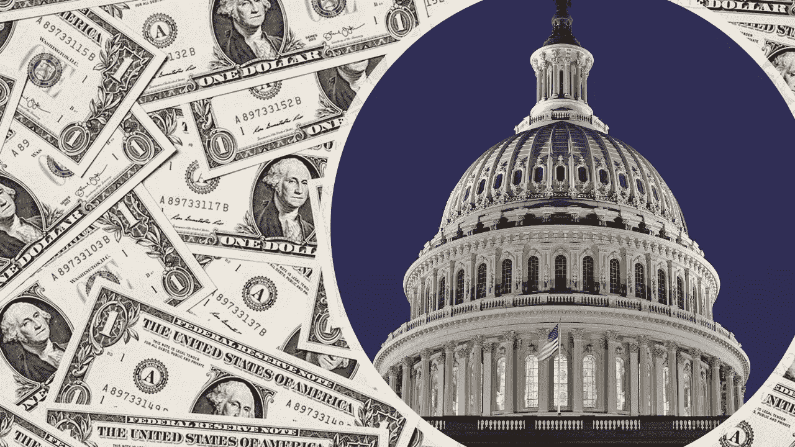

# 美国民主的死亡。

> 原文：<https://medium.datadriveninvestor.com/the-death-of-american-democracy-f46aaf793784?source=collection_archive---------14----------------------->

Photos taken by Unknown Authors are licensed by CC-BY-SA

## 不受控制的选举开支是如何将美国变成一个财阀统治的

2010 年，美国最高法院给了我们美国民主致命一击。

我将是第一个承认多年来美国一直是代议制共和国，而不是真正的直接民主的人。长期以来，我们是一个太大的国家，甚至不能尝试直接的全国选举，尽管许多人会说我们现在有技术来进行这样的选举。但在 2010 年之前，美国至少可以假装是一个代议制共和国。

 [## 保护主义、政治和经济动荡|数据驱动的投资者

### 美国股市昨日出现 400 多点的大幅反转，为未来的事情发出了警告信号。市场…

www.datadriveninvestor.com](https://www.datadriveninvestor.com/2018/06/28/protectionism-politics-economic-turmoil/) 

公民联盟诉联邦选举委员会一案的结果改变了这一点。

在这个具有里程碑意义的法庭案件中，美国最高法院诞生了超级政治行动委员会——超级政治行动委员会。它裁定，工会和公司都可以自由地花费无限的钱来“直接主张候选人的当选或失败。”

金钱主宰一切。

当我第一次听说最高法院做出这一裁决时，我清楚地记得我评论道，“好了，我们的代议制共和国到此为止。我们现在将成为一个由精英统治阶级管理的国家——这个阶级由最有钱的人控制。”

我没想到变化会来得这么快。但是已经发生了。

2016 年，美国总统大选的花费是 23 亿美元。想想吧。23 亿美元。这超过了百慕大 2018 年的全部国家预算。

2018 年美国德克萨斯州参议员选举的成本为 1.25 亿美元。第十昂贵的比赛？这是一个来自威斯康星州的美国参议院席位——你可以花 4020 万美元买到它。

美国众议院？那也好不了多少。美国最昂贵的众议院比赛是在佐治亚州——整整 4900 万美元。第十昂贵的比赛？肯塔基州——价格便宜，只有 1560 万美元。

钱重要吗？绝对的。响应政治中心的统计数据显示，2018 年参议院选举中，82.9%的候选人赢得了最多的钱。在众议院，这一数字攀升至惊人的 88.8%。

我们应该担心吗？在回答这个问题之前，让我们再深入一点。

谁为这些活动买单？不是你或我。除非你是全国 0.47%的人，却为这些活动支付了 71%的费用。让这个数字在脑海中停留一会儿。不到 0 . 5%的人口支付了我们联邦选举将近四分之三的费用。

我们正在变成一个财阀统治。

这些人是谁？他们是公司和富有的协会。全国房地产经纪人协会、当时的全国啤酒协会和美国电话电报公司(美国电话电报公司)分别为各种活动捐助了 300 多万美元。此外，前 20 名捐助者中有 4 名是联邦国防承包商。

是的，我们完全有理由担心。

美国选民正在失去他们的民主声音。联邦候选人唯一必须假装“倾听人民”的时候是在竞选季节。即便如此，统计数据显示，巧妙的广播、电视和互联网宣传往往会胜出。然后我们的代表去国会大厦。

向他们的竞选活动贡献所有超级政治行动委员会资金的同一批人让他们的律师和游说者大军跟踪他们帮助选举的每一项法案和每一张选票。我不禁想知道，他们是否得到了不那么微妙的提醒，是谁让他们当选的。

我非常担心美国人民的声音被淹没在游说者的汪洋大海中。当这种情况发生时，美国人民倾向于远离政治，认为他们的投票无关紧要。最近选举的低投票率掩盖了这种担忧。选民投票率低往往会加剧两党的政治极端，使国家政治更加分裂。

解决办法？我们需要从我们的国家运动中获得这些令人厌恶的钱。

它从限制个人捐助者和政治行动委员会捐助竞选活动的金额开始。对单个候选人用于竞选的资金总额进行绝对限制也将大大有助于解决这个问题。

不幸的是，我对这种情况很快会发生并不乐观。因为目前的做法得到了最高法院的批准，所以需要联邦立法来推翻它们。在一个由超级政治行动委员会控制的国会中，我不会屏息以待这样的立法会在立法委员会中通过。

与此同时，美国代议制共和国的死亡将继续下去，因为我们正在走向财阀统治——一个精英统治阶级，其权力来自超级政治行动委员会的财富。