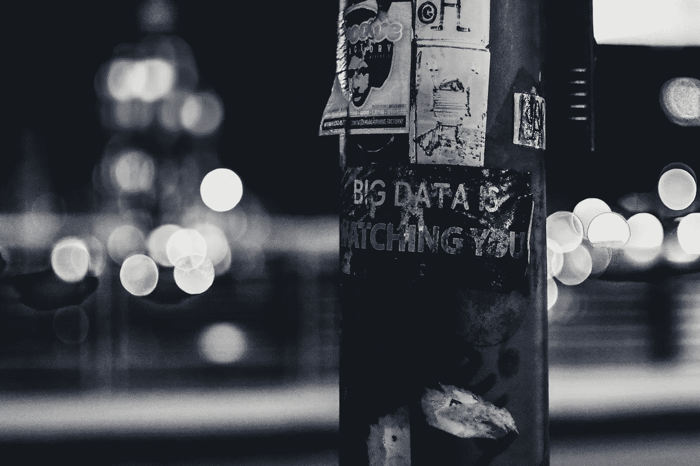

# 隐私的死亡

> 原文：<https://medium.datadriveninvestor.com/the-death-of-privacy-72dd20e1b97d?source=collection_archive---------16----------------------->

与[马修·J·卡希尔](https://medium.com/u/5cb9074665f2?source=post_page-----72dd20e1b97d--------------------------------)合著

在一个信息唾手可得的世界里，我们每天都在导航，这是我们似乎都喜欢的现实。我们可以方便地获取信息，这让我们可以查找歌词、电影时间、查看公司简介，并即时了解我们遇到的人。虽然我们几乎没有时间来思考当前的这种现象，但让我们来考虑一下这种易于访问的信息技术的下一次迭代/发展？什么时候，实时数据才能不断地融入我们的日常活动，为我们的决策、人际关系乃至我们的机构提供经过提炼的见解？

想象一下这样一个世界，人工智能(AI)显示的图形信息不仅可以形成观点，还可以攻击我们的大脑并成为信息。

 [## 人们对隐私的不理解是什么？数据驱动的投资者

### 你知道那种感觉。无论是访问应用程序、订阅还是你最喜欢的运动鞋。你按下…

www.datadriveninvestor.com](https://www.datadriveninvestor.com/2019/04/11/privacy-and-convenience/) 

文明中的技术进步最好理解为我们自身某些部分的延伸。大自然以各种各样的方式复制自己，而人类只是进化的最新迭代。轮子伸出了脚。锤子和枪伸出我们的手。电脑拓展了我们的大脑。互联网扩展了我们的触角。每一次都会带来一些意想不到的和预期的后果。我们放置不同的价值判断，并经常在事后重新分类。

这些年来，向我们实时传递信息的速度越来越快。增强现实眼镜和使用其他设备的个人增强受到通信带宽能力的限制。当我们从 4G 转向 5G 无线通信时，我们也支持所有这些设备和人类增强现实。这种网络功能的升级使云服务器人工智能和决策支持推荐系统更接近我们，能够根据位置、我们当前参与的人或活动等环境影响我们的感知。

例如，人工智能可以作为一种使用生物识别技术的芯片检测服务，即时确定你听到或看到的是真是假。它会实时检查事实，并显示颜色来指示真假？或者，如果当你走进一个房间时，你可以扫描并看到每个人的净资产的实时读数？他们是否有可传播的病毒或疾病？个人数字活动的整体可以合成为单一的图形和图标，以便于使用。这个新的人工智能工具可以帮助你在选择与谁交往以及如何与每个人互动方面做出更好的决定。

马歇尔·麦克卢汉在 1964 年写道，当电视(三个频道的净化、同质化、公式化的内容)开始引领信息时代时，“[媒介就是信息](https://web.mit.edu/allanmc/www/mcluhan.mediummessage.pdf)。作为一名早期的知识先驱，他敲响了警钟，但由于我们对技术创新无节制的偏好，这种警钟在当时很大程度上被忽视了。我们盲目地拥抱媒体，以各种光荣的形式，看着制作人继续相互追逐，创造越来越具有情感煽动性的内容。情绪是塑造和框定我们消费的每一个信息的钩子。我们的大脑对新数据有着几乎无法满足的需求，并在我们的集体记忆中记录了一串二元刻板印象。语境为王。背景很重要。这很重要。

请考虑以下情况:

*   当你知道有人在说谎时，你会怎么做？
*   当你知道房间里每个人赚了多少钱时，你会怎么做？
*   如果你知道一个人有危及生命的疾病，你还会选择交往吗？
*   如果你知道一个人当天早些时候看过色情电影，你还会和他握手吗？
*   你会自动认为这个人是男性吗？如果是一个女人在一天的早些时候看了色情电影，会有什么不同吗？

如果你知道房间里谁有犯罪记录，你是在让世界变得“更安全”吗？性侵犯者在哪里？如果有人只是被指控呢？这种“新闻”能从他们的数字档案中抹去吗？我们可以有效地利用经过提炼、过滤的实时数据来帮助我们决定与谁合作的假设忽略了隐含的偏见。即使有一个仔细筛选过的标准列表，当我们的大脑呈现出经过提炼的图形信息时，我们该怎么做呢？如果这让我们感觉良好，我们仍有可能做出违背理性的决定。人类已经一次又一次地证明了我们不是逻辑或者理性的。

我们如何适应这项技术无法预知。我们的历史模式已经表明，我们高估并盲目地拥抱看似让我们生活更轻松的技术。会有意想不到的后果和潜在的不可逆转的变化。这是一次值得进行的对话，希望能创造出更有思想的实践来减轻我们最糟糕的冲动，并设计政策来保护我们的公共空间和个人界限。