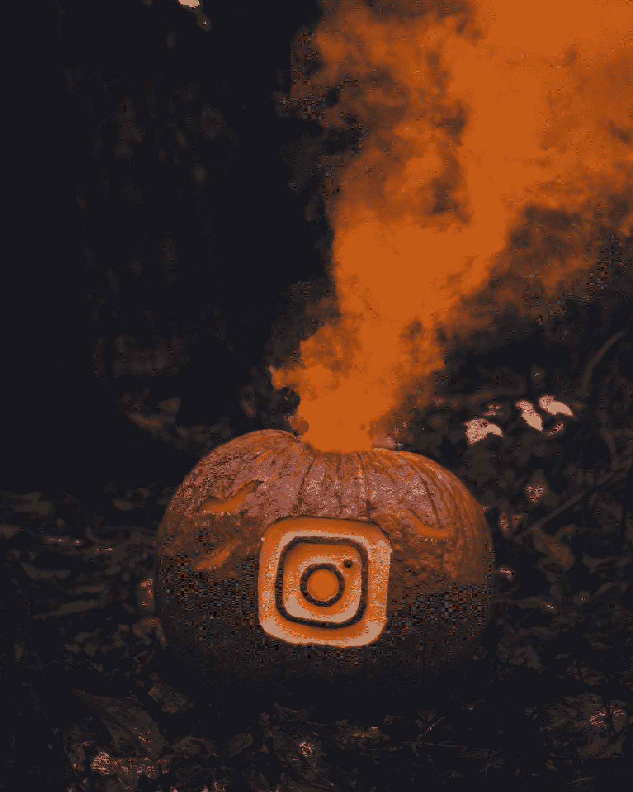
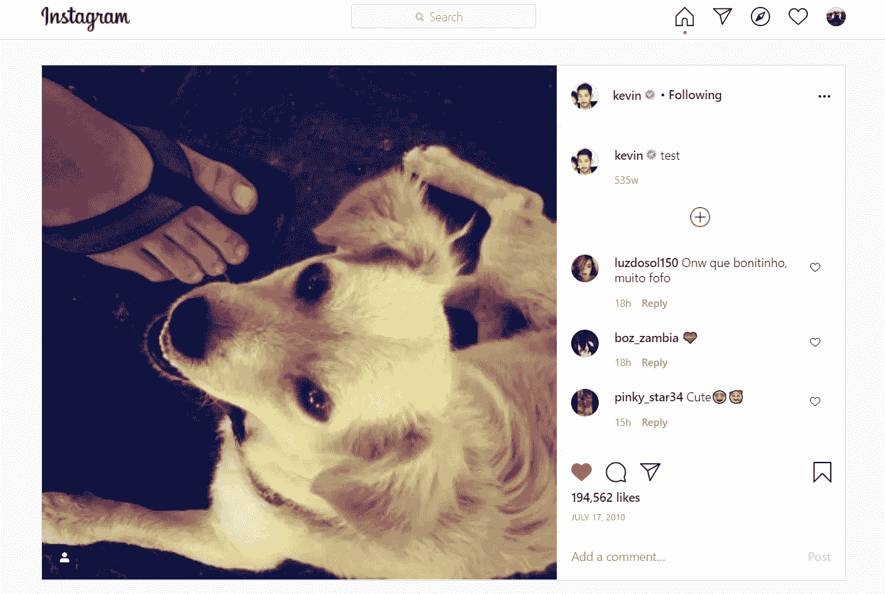

# 一个决定是创业公司和 1000 亿美元之间的全部障碍

> 原文：<https://medium.datadriveninvestor.com/the-decision-that-created-the-1-photo-sharing-app-in-the-world-85358651a73b?source=collection_archive---------5----------------------->

## 问题是:“转向，还是坚持？”

Photo by [Sam 🐷](https://unsplash.com/@shambam?utm_source=medium&utm_medium=referral) on [Unsplash](https://unsplash.com?utm_source=medium&utm_medium=referral)

> “Instagram 想成为自己的老板，我说:‘你知道吗，我想为自己工作，我想研究创意。’我真的希望我能赚钱。”—凯文·斯特罗姆

想象一下，如果你三年前成立了一家公司，你刚刚接到一个电话，确认以 10 亿美元的价格出售你的公司！你会有什么感觉？相当不错？

Instagram 做到了这一点，这是你能讲述的最鼓舞人心的创业故事之一。不仅仅是因为它背后的想法或者他们设法获得了 50 万美元的初始投资，而是因为他们的勇气和做出的决定。

这个教训可以适用于任何人，任何地方，任何时间点。无论是对你的创业，你的生活，甚至你的人际关系。

所以事不宜迟，这就是 Instagram 的故事。一个决定如何创造了现在价值数十亿的公司。

# 凯文·斯特罗姆

出生于 1983 年 12 月的凯文描绘了他年轻时的一个相当普通的行为。高中时在一家黑胶唱片店工作，是《毁灭战士 2》的超级粉丝。你们中的一些年轻人可能甚至没有听说过这个名字，但它绝对是当时最大的名字之一。

事实上，正是因为他对《毁灭战士 2》的热爱，凯文开始热爱计算机编程。当他得知通过编程，他实际上可以命令计算机完成某些任务时，他就着了迷。这个想法很快就被他接受了。

几年后，凯文被斯坦福大学录取，并开始在那里上课。在这里他遇到了一个叫迈克·克里格的人。当时他们只是普通朋友，但他们不知道等待他们的旅程。

有趣的是，在斯坦福大学时，一位年轻的企业家找到了凯文，邀请他加入自己的事业。这位企业家就是独一无二的马克·扎克伯格，他正在努力发展自己的企业——脸书。

显然，当扎克伯格接近凯文时，脸书还没有今天这么大。最重要的是，社交媒体在当时还是一个新概念。大多数人说脸书只是一个时尚，炒作最终会消失。因此，凯文的一位导师建议他不要加入这家公司。

当然，成为企业家的一个关键因素是对学习的渴望。这就是为什么凯文加入了一个叫做梅菲尔德研究员计划的项目。这是你被选中在某个创业公司工作的地方，他们会训练你成为一名企业家。这也是 Kevin 了解到一家公司要“成功”到底需要什么的地方。

> “我祈祷他们会接受我，因为我对创业如此兴奋，他们让我进去了。”—系统

在那个项目中，凯文被选中在一家名为 Odeo 的公司工作。这家公司后来成为了 Twitter。感觉社交媒体真的在跟踪凯文。有人甚至称他为社交媒体之父。

毕业后，他内心的声音让他在一家科技创业公司工作。他白天在那里工作，晚上学习编程。奇怪的是，他的朋友迈克·克里格也在同一地区做着同样的事情。就像星星排成一行，他们两个最终在咖啡馆相遇并聊天。

在咖啡馆里，一个应用程序的想法诞生了。

但不是 Instagram。

# Burbn

凯文想出了一个名为 Burbn 的应用程序的想法。该应用类似于 Foursquare，允许用户在特定地点签到，与朋友制定计划，并在此期间发布图片。

迈克也同意这值得一试。

> “我非常兴奋，我走到凯文面前，对他说，看，如果你真的这样做了，我们就来谈谈吧。”—克里格

长话短说，凯文然后四处尝试，为他们的新想法积累投资。

在一个普通的夜晚，当迈克在酒吧里闲逛时，他看到了一桌投资者。他知道这一点，因为也有其他人试图推销他们的想法，并向这些投资者展示他们的原型。碰巧的是，史蒂夫·安德森也在那里。他们项目的首批投资者之一。

史蒂夫给了迈克一个机会，当他完成后，史蒂夫立刻被迷住了，并决定向他们的想法投资 5 万美元。对于一家初创公司来说，这是一大笔钱！在创业公司和硅谷的世界里，当关于这项投资的谣言愈演愈烈时，其他投资者会想更多地了解这个想法，并试图分一杯羹。认为如果有人愿意做这种投资，那一定是好事。

 [## React Native 如何提高移动应用开发者的生产力？数据驱动的投资者

### React Native 是一个有益的框架，可以帮助您使用 JavaScript 设计应用程序。这种结构包括…

www.datadriveninvestor.com](https://www.datadriveninvestor.com/2020/11/30/how-react-native-improves-the-productivity-of-mobile-app-developers/) 

没过多久，史蒂夫·安德森就决定将这笔投资增加到 25 万美元。除此之外，谣言还引起了风险投资公司 Andreesen Horrowitz 的注意，他们自己投资了 25 万美元！

因此，从本质上说，有两个相对较新的年轻企业家试图自己创造一些东西，他们也可以获得 50 万美元的现金供他们摆弄。我是说，有那么多钱，还能出什么差错，对吧？

# 正确的问题

无论投资者为了得到最好的电脑、最好的设备，甚至最好的员工，向你投多少钱，仍然有一件事是他们无法控制的。这就是市场对产品的反应。

事实证明，Burbn 并不完全符合当时的市场需求。与其他竞争对手相比，Burbn 并没有什么不同。在巅峰时期，Burbn 有大约 100 名用户，仅此而已。凯文和迈克都很快理解了这种情况，即这个应用程序不会像他们希望的那样发展。

于是，凯文体内的企业家精神又一次迸发了。他和迈克联系了他们的客户群，问了几个问题。不，他们没有问为什么没有更多的人加入 Burbn，或者他们如何才能在营销活动中大肆挥霍来推广这款应用。相反，他们问客户:

> "为什么你们一开始就用 Burbn？"

凯文和迈克发现，他们几乎都不关心签到功能。客户只是想使用照片分享功能，他们可以分享在某个特定地点拍摄的照片。

> “对任何创业者来说，最好的事情就是失败。”—凯文·斯特罗姆

# 支点

由于确定 Burbn 不会成功，并且银行账户中还有 49.5 万美元，Kevin 和 Mike 认识到他们必须创造新的东西。以照片分享为核心的东西。

但是还有另一个问题。凯文和迈克并不是第一个想到推出照片分享应用的人。还有其他的，比如 Ofoto 和 Shutterfly，在 Instagram 之前已经存在很多年了。因此，他们不得不考虑另一种方式来获得竞争优势，而不是像对待 Burbn 那样。

> 通常情况下，有抱负的企业家会建立自己的核心业务，然后寻找应该完全相反的问题。先问问题。“我们在解决什么问题？”如果有些东西还不存在或者很糟糕(例如，糟糕的 UX，过于复杂的注册过程)，而你可以解决这个问题，那么这就是你应该做的。—凯文·斯特罗姆

显然，已经有许多签到应用程序也具有诸如计划者或群聊等功能，但如果用户想同时向许多朋友发布精彩照片，他们无处可去。因此，解决问题，创造自己的竞争优势。

> 问题 1 解决了！

在凯文和他当时的女友、现在的妻子去墨西哥度假时，他问道:“你对我们正在开发的这个新应用程序感到兴奋吗？”

“是的”，她无动于衷地回答。她不打算使用这个应用程序，因为她认为自己的照片不够好，不能发布。

凯文很快注意到了这个问题。又经过几次对话交流，他们得出结论，当用户想要发布他们的照片时，凯文可能应该添加一些滤镜。于是，他跑回自己的房间，打开笔记本电脑，给 Instagram 上的第一个滤镜 X-Pro II 赋予了生命。

一旦设置正确，凯文就去一个墨西哥玉米卷摊，拿出他的手机，给一只流浪狗拍照，这张照片成为这个社交媒体巨头上的第一张照片。

[First photo on Instagram](https://www.instagram.com/p/C/?hl=en). Screenshot taken by author.

带着新发现的兴奋和肾上腺素，凯文冲回家去找迈克，继续开发应用程序。从他们开始使用该应用到 2010 年 10 月 6 日发布，他们只用了大约 8 周时间，该应用一发布就火了。

仅仅 24 小时，他们就看到了 25000 次下载！对于一家初创公司来说，这是一个非同寻常的数字。1 个月后 100 万，2020 年超过 10 亿用户。又一次，它吸引了一位企业家的目光。

# 收购

当然，你已经知道这位企业家不是别人，正是马克·扎克伯格，另一位社交媒体巨头脸书背后的人。马克在 Instagram 和脸书身上看到了类似的趋势。用户是如何涌入应用程序的？果然，他看到了潜力，想要分一杯羹。

长话短说，马克安排了与凯文和迈克的会面，他提议以 10 亿美元的巨款收购他们的公司。凯文和迈克同意了！

> “如果你打算卖掉你的公司，想法是把你的公司卖给一家将成为火箭飞船的公司。我记得迈克和我讨论过，我们是否相信通过成为这家大公司的一部分，Instagram 可以更快地发挥出更大的潜力。”

他们相信脸书可以成为他们的火箭飞船，以更高的速度将 Instagram 提升到更高的水平。2020 年，Instagram 估计价值超过 1000 亿美元，这相当于脸书投资回报的 100 倍。谈成长！

# 支点 vs 坚持

只要看看 Instagram 现在的资金、魅力和称赞他们达到这样的水平就很容易了。但是，如果不是在关键时刻，当他们被迫在旋转或坚持之间做出决定，这一切都是不可能的。

旋转意味着根据你已经获得的经验和目前收集的数据，把你的想法变成更好的东西。持之以恒强调的是不放弃最初的想法，无论如何都要坚持下去。

不要误解我，这两个选项在世界上肯定都有自己的位置，在特定的环境下都是合适的。毫无疑问，有些人会看到凯文和迈克的情况，对他们说:“你现在不能退出！在这方面已经投入了太多的时间和精力。”这个建议会阻止他们开发世界上用户基数最高的应用之一。

质疑和挑战一个没有成功的最初想法没有错。随着你获得更多关于创业的经验和知识，你会知道什么是合适的下一步，什么不是。绝对不要害怕失败，但也要记住，在任何时候，选择转向还是坚持都在你的手中。

*嘿，既然你在这里，为什么不加入我的* [***邮件列表***](https://marcuschan.ck.page/76504d9d12)**来看看你收件箱里偶尔出现的精彩故事，或者考虑成为会员***来阅读我所有的故事！☺***

## **访问专家视图— [订阅 DDI 英特尔](https://datadriveninvestor.com/ddi-intel)**