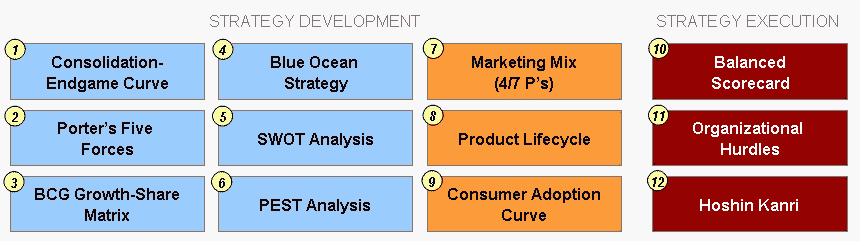

# 战略发展和战略执行的权威介绍

> 原文：<https://medium.datadriveninvestor.com/the-definitive-introduction-to-strategy-development-and-strategy-execution-2d844e1940c6?source=collection_archive---------27----------------------->

*注:本文由我的同事***原创发布。**

**

*一个成功的企业既需要完善的战略，也需要执行该战略的能力。没有执行的战略仅仅是理论。许多公司制定了稳健的战略，但未能将其战略转化为可实施的步骤。*

*在本文中，我们将首先概述与战略发展和战略执行的各个方面相关的 12 个业务框架。我们还包括了关于这些商业概念的进一步信息的参考资料。*

*在一些核心战略框架的基础上，接下来，我们讨论使用战略框架画布(SFC)选择战略框架的艺术和科学。*

**

1.  ***整合-残局曲线***

*[整合-残局曲线](https://flevy.com/browse/business-document/consolidation-endgame-curve-framework-201)框架(也称为整合曲线或残局曲线)并不是一个众所周知的框架，但它提供了对市场动态和竞争战略的惊人见解。*

*这个框架是由科尔尼的管理咨询公司[在对 25，000 家公司进行研究后开发的，这些公司占全球市值的 98%。该公司意识到所有行业都经历相同的 4 阶段生命周期——开放、规模、聚焦、平衡&联盟。在所有行业中，曲线的每个阶段都表现出相同的特征。](http://www.atkearney.com/)*

*通过正确识别我们所处的阶段并理解我们所处阶段的特征和行为，我们可以更好地理解和预测市场和竞争行为及趋势。每一项重大的战略和运营举措都应根据行业在整合曲线中所处的阶段进行评估。*

*更微妙的是，行业阶段也决定了什么样的管理和领导最适合公司。换句话说，规模阶段的管理团队可能不具备在平衡和联盟阶段运营公司的正确技能。*

***2。波特的五种力量***

*由被公认为现代企业战略之父的迈克尔·波特提出的[波特的五种力量](https://flevy.com/browse/flevypro/strategy-classics-porters-five-forces-4051)是最著名的经典战略框架之一。波特的五种力量是一个用于行业分析和理解行业参与者和外部“力量”之间的各种动态的框架*

*它的理论基础是，任何行业的竞争都取决于 5 种基本力量——潜在进入者、内部竞争、供应商、买家和替代品(或补充物)。这些力量的合力决定了最终的利润潜力和在行业中的分配。*

*使用这个框架，我们可以确定在任何行业中竞争的吸引力，以及在行业中成功竞争的总体战略应该是什么——成功取决于发展可持续竞争优势的能力。它还可以用来评估哪些行业趋势可能带来机遇或威胁。*

***3。波士顿咨询集团增长份额矩阵***

*[波士顿咨询公司增长-份额矩阵](https://flevy.com/browse/flevypro/strategy-classics-bcg-growth-share-matrix-4130)(也称为产品组合和波士顿矩阵)是由管理咨询公司[波士顿咨询集团](http://www.bcg.com/) (BCG)开发的经典竞争定位战略框架。增长份额矩阵以 2×2 矩阵的图形方式显示以下两种情况之一:*

*   *公司投资组合中每项业务的头寸；或者*
*   *比较一个行业中不同参与者的位置。*

*矩阵的两个轴是 1)市场/行业增长和 2)相对市场份额(RMS)。然后，我们将我们的产品绘制到矩阵上，与产品相关的象限推动其战略。*

*象限定义如下:*

*   *Star —高 RMS，高市场增长率；*
*   *现金牛——高 RMS，低市场增长；*
*   *狗——低 RMS，低市场增长；和*
*   *问号—低 RMS，高市场增长。*

*该框架的关键前提是，位于每个象限的产品将处于根本不同的现金流状况，并且应该以不同的方式进行管理。该框架用于评估公司业务组合的发展趋势(当绘制当年和过去几年的矩阵时)。它还可以用来了解每个业务的竞争地位，可能的现金需求，并集中关注关键问题。*

***4。蓝海战略***

*[蓝海战略](https://flevy.com/blue-ocean-strategy)是一个增长战略框架，重点是创造一个无竞争的市场空间，即“蓝海”这个框架非常具有创新性，因为它的原则挑战了与竞争对手正面作战的传统商业战略原则。蓝海战略框架是由 Gemini Consulting(现在的 [Capgemini Consulting](http://www.capgemini-consulting.com/) )在 90 年代末开发的一个名为价值创新的框架演变而来的。*

*蓝海战略的核心是价值创新的概念。没有创新的价值倾向于关注增量规模的价值创造，即提高价值但不足以使我们真正在市场中脱颖而出的东西。没有价值的创新往往是技术驱动的、市场开拓的或未来的，常常超出了买家愿意接受和支付的范围。*

*只有当我们将创新与效用、价格和成本定位一致时，价值创新才会发生。这里的重点不是上市时间、尖端技术或最佳实践。它的雄心在于打破基于竞争的战略最普遍接受的教条之一:价值-成本权衡。*

*人们通常认为，公司要么以更高的成本为客户创造更大的价值，要么以更低的成本创造合理的价值。在这里，战略被视为在差异化和成本之间做出选择。相比之下，为了创造蓝海，我们需要同时追求差异化和低成本，方法是放眼行业内外，重新定义整个市场。*

*要了解更多战略框架，请点击此处下载我们的[战略&转换模板汇编](https://flevy.com/download/strategy-and-transformation-templates-148)。这份文件涵盖了 35+战略&转型框架，从麦肯锡 7-S 到 BCG 经验曲线再到 Greiner 增长模型。*

***5。SWOT 分析***

*[SWOT 分析](https://flevy.com/browse/business-document/swot-analysis-124)(也称 SWOT 矩阵)是最早的战略框架之一。它是 20 世纪 60 年代由 Learned、Christensen、Andrews 和 Guth 在哈佛商学院开发的。*

*这个名字是优势、劣势、机会和威胁的缩写。这个框架提供了构建战略分析的基本方向。基本理论是，对竞争地位的评估应该结合外部和内部分析。内部因素是弱点和优势，而外部因素是机会和威胁。*

*除了我们的竞争对手之外，我们还可以对我们自己的组织进行 SWOT 分析，这样我们就可以更深入地了解我们公司的竞争地位。这种分析的输出通常以 2×2 矩阵的形式显示。SWOT 分析通常与 PEST 分析一起进行(见下文)。*

***6。害虫分析***

*[PEST 分析](https://flevy.com/browse/business-document/pest-analysis-234)是一个评估宏观环境因素的框架，用于战略管理的环境扫描部分。PEST 分析框架已经变得越来越流行和相关，因为 21 世纪的第一个十年已经引起了公众对绿色商业和环境的关注。PEST 是政治、经济、社会和技术的首字母缩略词，是本分析中要分析的宏观环境因素。*

*这种分析通常与其他流行的框架一起执行，作为增强对这些其他框架的理解和输出的一种手段。具体来说，它通常用于帮助解释以下框架中的分析:波特的五种力量；SWOT 分析；价值链分析；和行业财务。*

*有害生物分析通常分三个阶段进行:数据收集、行业趋势分析和趋势量化。*

***7。营销组合***

*营销的 4 P，通常被称为营销组合，也许是常用的企业营销框架。营销组合指的是在决定产品营销策略的本质时需要调整的 4 个杠杆。4 P 指的是价格、产品、促销和位置。*

*这个框架已经扩展到 7 P，也包括了物证、人和过程。额外 3 P 的定义不应该与人员-流程-技术框架混淆，后者更侧重于操作(而不是消费者)。*

***8。产品生命周期；和 9。消费者采纳曲线***

*[产品生命周期](https://flevy.com/browse/business-document/product-lifecycle-227)分析是一种根据产品类别的年龄预测销售将如何发展的工具。营销人员和策略师可以利用这种分析来预测销售增长、相关的客户和竞争对手的行为，进而设计出适当的产品营销策略。产品生命周期本身分为 4 个发展阶段:引入、成长、成熟(和饱和)和衰退(和终止)。每个时期的长度变化很大。有些产品的周期很短，而其他产品可能需要几十年甚至几百年才能完成。*

*可以根据消费者采用曲线来绘制生命周期，其中曲线的峰值通常出现在产品生命周期的成熟阶段。事实上，产品生命周期通常是根据消费者采用曲线绘制的，以得出关键的营销和竞争见解。通过了解我们处于消费者采纳曲线的哪个阶段，我们可以获得关于谁是我们的目标客户以及他们的定义属性的宝贵见解。*

*消费者采用曲线由 5 个连续阶段定义:创新者、早期采用者、早期多数、晚期多数和落后者。通常，早期采用者和早期多数人之间存在“鸿沟”。产品生命周期分析也为理解竞争环境提供了一个框架。它做了一个潜在的假设，即所有行业和这些行业中的所有产品的销售和盈利能力都遵循一个可预测的模式。*

*10。平衡计分卡*

*[平衡计分卡](https://flevy.com/browse/business-document/balanced-scorecard-134) (BSC)是战略[绩效管理](https://flevy.com/business-toolkit/performance-management-perf)工具。这是一个半标准的结构化报告，由经过验证的设计方法和自动化工具支持，管理人员可以使用它来跟踪其控制下的工作人员执行活动的情况，并监控这些活动产生的后果。它是由罗伯特·卡普兰和大卫·诺顿开发的。*

*BSC 方法被称为“平衡的”，因为它用三个关键的非财务领域补充了传统的财务方法:*

*   *公司与客户的关系；*
*   *其主要内部业务流程；和*
*   *它的学习和成长。*

*这种方法使公司能够跟踪财务结果，同时监控能力建设和获取未来增长所需的无形资产的进展。*

*BSC 还为公司提供了一个框架，将他们的战略转化为可衡量和可操作的 KPI 和目标。具体来说，它将 4 个关键管理流程(将愿景转化为行动、沟通和联系、业务规划以及反馈和学习)与短期和长期战略目标联系起来。*

*11。组织障碍*

*在《蓝海战略》中，作者指出了组织要成功执行业务必须克服的 4 个主要组织障碍。当一家公司制定新的战略来改变现状时，这些障碍就会出现。这些障碍是认知障碍、资源障碍、动机障碍和政治障碍。*

*尽管所有公司都面临不同程度的障碍，但许多公司可能只面临 4 个障碍中的一个子集。为了有效地克服这些障碍，组织必须放弃影响组织变革的感知智慧。*

***12。Hoshin Kanri***

*[Hoshin Kanri](https://flevy.com/browse/business-document/hoshin-kanri-strategy-deployment-155) (也称为政策部署、Hoshin 规划，或简称 Hoshin)是一种[战略规划](https://flevy.com/strategy-planning)方法论。它是基于 20 世纪 50 年代末由赤尾洋司提出的一个在日本流行的概念。*

*“每个人都是自己工作中的专家，日本的 TQC ( [全面质量控制](https://flevy.com/browse/business-document/total-quality-management-tqm-152))旨在利用所有员工的集体思维能力，使他们的组织成为所在领域的最佳，”赤尾洋次说。这是 Hoshin Kanri 的基本原则。换句话说，这个框架确保我们公司的战略目标推动组织内每个层面的进步和行动。这样就消除了方向不一致和沟通不畅带来的浪费。*

*该框架旨在帮助组织:*

*   *专注于共同的目标；*
*   *向所有领导传达该目标；*
*   *让所有领导参与实现目标的规划；和*
*   *让参与者对完成他们的计划部分负责。*

*Hoshin Kanri 属于精益管理(或称为精益思维、精益方法)的范畴。精益框架致力于组织的持续改进。*

*如需了解更多信息，请点击此处下载关于[战略制定和执行的完整演示文稿(原 PowerPoint 格式)。](https://flevy.com/strategy-frameworks)*

***参考来源:***

*   *[完整的业务框架参考指南](https://flevy.com/browse/business-document/complete-business-frameworks-reference-guide-644)*
*   *[经营战略执行指南](https://flevy.com/browse/business-document/guide-to-business-strategy-execution-873)*
*   *[商业战略设计完整指南](https://flevy.com/browse/business-document/complete-guide-to-business-strategy-design-375)*
*   *[霍欣·坎里](https://flevy.com/browse/business-document/hoshin-kanri-strategy-deployment-155)*
*   *[制定突破战略](https://flevy.com/browse/business-document/formulating-a-breakthrough-strategy-598)*
*   *[增长战略工具包](https://flevy.com/browse/business-document/growth-strategy-208)*
*   *[蓝海战略初级读本](https://flevy.com/browse/business-document/blue-ocean-strategy-primer-113)*
*   *[平衡计分卡](https://flevy.com/browse/business-document/balanced-scorecard-134)*
*   *[产品生命周期](https://flevy.com/browse/business-document/product-lifecycle-227)*
*   *[波特的五种力量](https://flevy.com/browse/business-document/porters-five-forces-235)*
*   *[整合-残局曲线框架](https://flevy.com/browse/business-document/consolidation-endgame-curve-framework-201)*
*   *[BCG 增长-份额矩阵](https://flevy.com/browse/business-document/bcg-growth-share-matrix-200)*

# *战略框架选择的艺术和科学*

*上面，我们强调了围绕战略发展和执行的 12 个既定框架。在战略框架的世界里，这只是冰山一角。战略家、学者和咨询公司开发了上百种战略框架。这些方法中的许多都包含在我们的[战略发展框架中。](https://flevy.com/browse/stream/strategy-development)*

*由于有如此多的工具可供您使用，因此很难确定哪种方法适合我们的组织。在决定要使用的最佳框架或框架集时，有许多重要的考虑因素，例如领导风格、业务成熟度(例如，小型企业对大型企业)、行业成熟度、组织结构(例如，分散决策对集中决策)、企业文化等等。*

*为了帮助浏览可用的战略框架，让我们看一下[战略框架画布(SFC)](https://flevy.com/browse/strategy-development-sd/strategy-framework-canvas-3431) 。SFC 是一个统一的选择框架，它指导我们根据手头的情况选择合适的策略，并有效地执行它。这种模式对于那些业务范围更加多样化、变化更快的大型组织尤其有用。*

1.  *经典的*
2.  *适应的*
3.  *空想家*
4.  *领导者*
5.  *更新*

***经典战略***

*经典方法是最常见的方法。在这种情况下，市场是可预测的，竞争基础是稳定的，战略是可持续的。*

*经典战略是通过可持续的[竞争优势](https://flevy.com/business-toolkit/competitive-advantage)实现的，即在一个有吸引力的市场中对我们的组织进行最佳定位。由于在这些环境中竞争优势的基础是已知的和不可延展的，优势可以基于卓越的规模、差异化(或者，等效地，在更窄的细分市场中的规模)或卓越的能力。*

*最著名的战略框架是经典的，如本文前面已经讨论过的:*

*   *[波特的五种力量](https://flevy.com/browse/flevypro/strategy-classics-porters-five-forces-4051)*
*   *[BCG 增长-份额矩阵](https://flevy.com/browse/flevypro/strategy-classics-porters-five-forces-4051)*
*   *[整合-残局曲线](https://flevy.com/browse/growth-strategy-growth/consolidation-endgame-curve-framework-201)*

***适应性策略***

*当环境既不可预测也不可塑时，我们使用适应性方法。市场不断出现混乱。*

*与可持续竞争优势的经典方法不同，战略适应性方法的基础是系列暂时优势的概念。在不可预测和不可延展的环境中，重点是持续实验和实时调整，而不是长期分析和规划。因为优势是暂时的，我们关注的是手段而不是目的。*

*适应性框架的例子包括:*

*   *基于时间的竞争*
*   *暂时的优势*
*   *适应性优势*

***远见战略***

*当我们能够通过某种程度的可预测性可靠地创造或重新创造一个环境，看到一个机会并一心一意地追求它时，我们就采取了有远见的方法。*

*有远见的方法最常与创业公司联系在一起。然而，大型组织也越来越需要采用这种方法。*

*这里的例子包括:*

*   *[蓝海战略](https://flevy.com/blue-ocean-strategy)*
*   *创新者的困境*
*   *价值革新*

***领导者战略***

*当环境不可预测但具有可塑性时，可以使用领导者方法。我们可以塑造或重塑整个行业。*

*领导者方法允许并要求一个组织在一个多样化的生态系统中与其他组织合作，分散风险，提供互补的能力和资源，并通过数量优势快速建立市场。*

*领导者框架的例子包括:*

*   *网络*
*   *生态系统*
*   *平台*

***更新策略***

*最后，当环境恶劣时，使用更新策略方法。这种战略旨在恢复组织的活力和竞争力。*

*在如此恶劣的环境下，现有的情况使当前的经营方式无法持续。第一步是改变路线以保存和释放资源。*

*此处的示例包括以下任何类型:*

*   *[转型策略](https://flevy.com/business-toolkit/business-transformation)*
*   *转变战略*

*一旦我们确定了要采取的战略方法的类型，下一步就是采用最适合我们组织的战略发展框架。关键的考虑因素包括我们的[企业文化](https://flevy.com/business-toolkit/corporate-culture)、[组织结构](https://flevy.com/business-toolkit/organizational-design)、[领导风格](https://flevy.com/business-toolkit/leadership)、[竞争定位](https://flevy.com/business-toolkit/competitive-analysis)，以及[核心能力](https://flevy.com/business-toolkit/core-competencies)等等。*

# *想在战略发展方面取得卓越成就吗？*

*获取知识，发展专业技能，成为战略发展专家。我们的框架基于领先的咨询公司、学者和公认的主题专家的思想领导力。[点击此处了解全部详情。](https://flevy.com/browse/stream/strategy-development)*

*“没有战术的战略是最慢的胜利之路。没有战略的战术，是战败前的噪音。”——孙子*

*为了有效的战略发展和战略规划，我们必须掌握战略和战术。我们的框架涵盖战略的所有阶段，从战略设计和制定到战略部署和执行；以及各个层面的战略，从公司战略到商业战略再到“战术”战略。这些方法中有许多是由全球战略咨询公司编写的，并且已经在他们的财富 100 强客户组织中成功实施。*

*这些框架包括波特的五种力量、波士顿咨询公司的增长份额矩阵、格雷纳的增长模型、能力驱动战略(CDS)、商业模式创新(身体质量指数)、价值链分析(VCA)、残局利基战略、价值模式、价值创造的综合战略模型、情景规划等等。*

*[点击此处了解我们的**战略发展最佳实践框架**。](https://flevy.com/browse/stream/strategy-development)*

*在 [**管理与企业咨询**](https://app.ddichat.com/category/management-and-corporate-consulting) **:** 中安排一个 DDIChat 会话*

* [## 专家-管理和企业咨询- DDIChat

### DDIChat 允许个人和企业直接与主题专家交流。它使咨询变得快速…

app.ddichat.com](https://app.ddichat.com/category/management-and-corporate-consulting) 

在这里申请成为 DDIChat 专家。
与 DDI 合作:[https://datadriveninvestor.com/collaborate](https://datadriveninvestor.com/collaborate)
点击此处订阅 DDIntel [。](https://ddintel.datadriveninvestor.com/)*