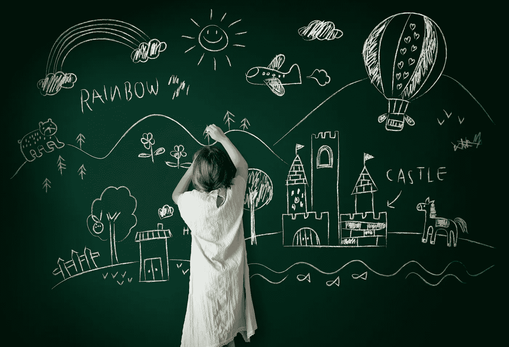

# 期望的二分法

> 原文：<https://medium.datadriveninvestor.com/the-dichotomy-of-expectations-e216b11f5be8?source=collection_archive---------14----------------------->

你今早醒来，期待这将是美好的一天，然而开始并不稳定。你打翻了茶，然后意识到今天是演示的最后期限。诅咒你决定做这份工作的那一天，你熬过了这一天，还想从你的生活中得到更多。

期望可以是一件伟大的事情；他们帮助我们为更美好的未来而奋斗。它们帮助我们推动自己变得更强，然而它们也能引起难以想象的痛苦和悲伤。

当你期望你的老板认可你，只是为了提升别人的时候，你期望你的朋友会在你人生最低谷的时候出现，只是意识到你是孤独的。

期望让我们幻想一种与现有不同的生活。这样做，我们错过了眼前的东西。如果我们给它一个机会，它就足够好了。我们只需要看看我们有什么，而不是我们没有什么。

# 我们对生活的“希望”:

多少次我们希望得到更多，如果我们的伴侣更随和，我们的同事更注意到我们的困境，我们的老板欣赏我们的努力。在某个地方，我们希望生活比现在更精彩。

我们不仅希望。我们最终为这个希望付出了一切。当失望来临时。

> 我们焦虑，甚至绝望。

# 生活是怎样的:

如果我们允许自己注意眼前的事物，生活本身就足够了。普通和平淡是我们看待日常活动的方式。浮华存在于我们的头脑中。

在这样做的时候，我们错过了生活给予的奇迹，凉爽的微风，灿烂的阳光，孩子的微笑，以及夜晚的星星。

> 当我们接受了现在所拥有的，我们就可以放下，去构建我们理想的生活。

# 期望并不都是坏的:

一旦我们看到生活是怎样的，期望可以帮助我们重新关注可能发生的事情。它可以引导我们内心最深处的渴望去获得满足感和个人的东西。

> 期望是我们灵魂的燃料。

没有他们，我们就不会有任何努力、期待和成就。当我们沉浸在幻想中几个小时，问题就来了。

# 结论:

我们心目中的世界和它现在的样子形成了鲜明的对比。当关注它时，公平、平等和实现的概念似乎都是模糊的。

> 唉，看不到现实，我们只是在兜圈子。

只有接受了，才能走向理想信念。