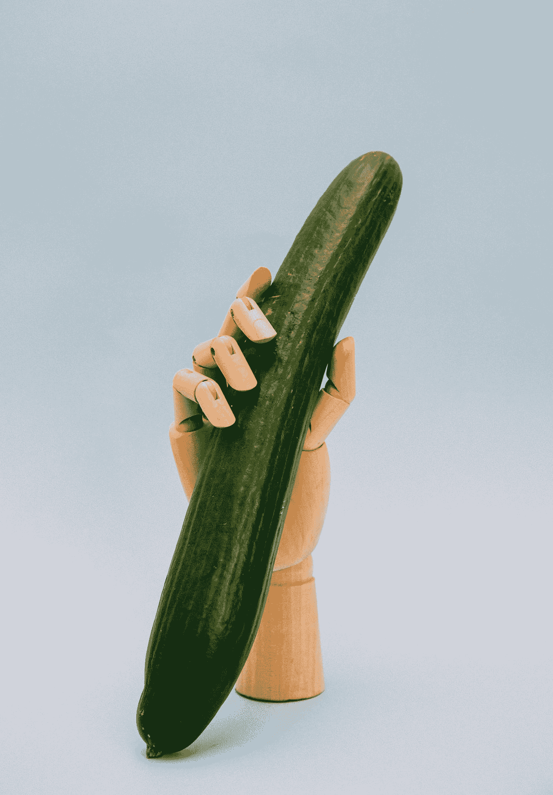
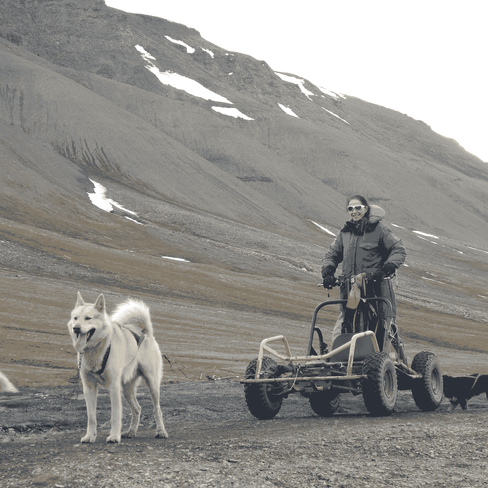

# 商界的精英

> 原文：<https://medium.datadriveninvestor.com/the-dick-picks-of-the-business-world-3b78a328f865?source=collection_archive---------8----------------------->

Photo by [Charles Deluvio](https://unsplash.com/@charlesdeluvio?utm_source=medium&utm_medium=referral) on [Unsplash](https://unsplash.com?utm_source=medium&utm_medium=referral)

## 不要发。以下是避免成为其中一员的方法。

正如我在其他地方多次说过的，我喜欢阅读肖恩·克南的作品。昨天我读了一篇文章，启发了我写这篇文章。跟着我，我要带着这个去某个地方。

这是肖恩的作品:

 [## 征求免费写作建议是我职业的“裸体照”

### 作家:不要让人们欺骗你

medium.com](https://medium.com/publishous/asking-for-free-writing-advice-is-the-send-nudes-of-my-profession-cdedb57a0a98) 

肖恩比我年轻得多，所以他还不具备做别人想做的事情几十年的优势。他是一个好作家，他赚了他的钱，正如他指出的，很多人想要他的书，但是他们:

1.  不想为专业建议买单，而且
2.  我认为他们不应该。

# 伙计们，收发室招人了。

*在亲爱的读者认为我只针对千禧一代或新生代之前，请。一点也不。这是我们任何人，任何年龄，都希望得到免费的专业建议。年龄
和世代在这里不是决定因素。*

我喜欢他关于鸡巴拨片的比喻。作为一个可以轻而易举地在大都会艺术博物馆塞满从约会网站上数以千计的无鸡巴奇迹中挑选的梅普索普风格的鸡巴的人，我可以理解。很多人都是这样工作的。我给你看我的老二，你给我我想要的。

我不想去挣。给我。给我。给我。

我带你去邮件室，斯基泽克斯。就像我做的那些网上约会的无鸡巴奇迹一样。

那些在生活的某个领域获得某种程度的成功的人，很少能够不费吹灰之力就获得成功。虽然可以肯定地说，男性，尤其是白人男性，经常(但并不总是)拥有导师的优势，但这种优势会随着时间的推移而改变。当你和我是学徒的时候，这是从我们离开学校到三十岁左右的世界的方式，一天的顺序是搞砸，失败，积累知识，再次失败，重复重复重复。直到过了人生的前三分之一，我们才开始理清某种方向。

正如我的社交媒体好友 JC Spears 所指出的那样，这种模式在很多方面都被颠覆了。但并不总是如此。

有些人很早就找到了丰厚的回报。许多人不知道。互联网上充满了大器晚成者的故事，他们花了几十年的时间苦读，直到我们最擅长的事情最终进入视野。我们甚至可能非常擅长我们所做的事情，但是当我们到了五六十岁的时候，我们“突然”成功了。

哦。是啊。关于那个"突然"这些年来，我们苦干、鞭笞自己、失败导致了这种“突然”

肖恩在他的文章中提到的是我们许多人在整个职业生涯中所经历的事情。人们想“挖我们的脑子”，这是善意地吸干我们的生活窍门的代码，这样他们就可以避免真正的工作。

Photo by [Paweł Czerwiński](https://unsplash.com/@pawel_czerwinski?utm_source=medium&utm_medium=referral) on [Unsplash](https://unsplash.com?utm_source=medium&utm_medium=referral)

首先，dontcha 认为如果有一种方法可以做到这一点，我们可能会自己雇用这些黑客？

好的，斯巴基。这才是重点。虽然我们可能能够通过指出你需要将所述下颚靠着所述磨石放置的位置来增加一些价值，但是无法避免磨石。然而，Instagram 和社交媒体给人的印象仍然存在，那就是在某个地方有一条捷径，在那里我不必做那些艰难的事情，我可以像肖恩一样。就像……不管是谁，享受所有的福利，却没有工作。

肖恩是他父亲和祖父的产物，一个军人家庭，他的运动背景，作为约会对象的时间(他承认，我们都做过)以及他为了拥有使他成为一名优秀作家的特殊视角而做的所有事情。没有魔术矩阵下载给你。

没有神奇的矩阵下载让我给某人带来巨大观众的技能，给你我的故事，从服兵役，性侵犯，到数万小时的写作，两本获奖的书和成百上千小时的专业辅导。

所有的混乱和失败，我肯定仍然是主题，这使我最好的喜剧故事。学习如何做到这一点是我擅长我所做的事情的一部分。没有下载来学习。这就是他妈的生活。

关于教练的事呢？

呃， ***有偿*** 职业教练，Skeezix。我不会免费提供这些知识。它有价值。肖恩的专业知识也是。

几年前，我链接了一篇精彩的文章，这篇文章是我在网上从一个年轻人那里挖掘出来的，他“得到”(我喜欢这个词，它意味着权利)了我所做的事情。在这篇文章中，他描述了自己的职业生涯:过着节俭的生活，花自己的钱去旅行、探险，住在破旅馆和破帐篷里，忍受恶劣的天气，年复一年地培养自己的技能，让自己的故事遭到拒绝。这些天，他有令人羡慕的演出。大名鼎鼎的署名。

The author sledding in Svalbard Julia Hubbel

每个人都想知道他是怎么做到的。这正是我要走的那条弧线。这需要时间、金钱、谦逊、韧性和耐心，还需要学会如何节俭生活、努力工作，以及如何打破你脆弱的过去。

不想做这些吗？好吧。那你就不会*得到*去做我们做的事情:坏蛋冒险环游世界。是的，报酬很高。但是生活…和故事，我们都变成了收入。

我们在冒险教育上投入的时间让我们值得雇佣。地球上没有人会为你的经历付钱，所以他们可以付钱让你写故事。你必须为此付出代价。

**来自肖恩的文章:**

*任何人都可以打字。任何人都可以挥舞画笔。*

这并不意味着你就是毕加索。不代表你就是海明威。任何猴子都可以做到。这就是为什么我的一些评论者对媒体写作的质量或缺乏质量发表了轻蔑的言论。

肖恩指出: *现在数字出版领域有大量资金在流动。人们很乐意加入这个游戏，来逃避公司的工作。*

是的。这些人中有很多都不是好作家。

我定期为一个名为[感知旅行的网站写文章。](https://www.perceptivetravel.com/)编者，[蒂姆·莱费尔，](https://timleffel.com/)是朋友。他是我的付费旅行写作教练。他不会发表你的故事，除非你已经出版了一本书，而且他不会免费提供他的建议。我为我的故事获得报酬，因为我做了工作来建立我和蒂姆的关系，我出了一本书，我是一个非常好的旅行作家。这是没有窍门的。

事实上，这是支持肖恩的绝佳理由。

几个人问我关于旅行写作的问题。我告诉他们去找蒂姆。他们没听到的是我告诉他们报名参加他的课程。蒂姆后来告诉我，他们两人都浪费时间寻求免费建议，不想花钱学习如何为旅游业写作。他们错误地认为，旅游写作就是花钱让你坐在五星级酒店的游轮上，在你写 100 字评论的时候，有人给你提供鸡尾酒，而这一切都是别人慷慨付出的。不仅从未如此，那艘船很久以前就航行了。

如果你想成为一名游记作家，当飞机再次起飞时，请看看这个:

 [## 旅行写作 2.0 博客——在新媒体环境中作为旅行作家赚钱

### 作者、编辑和博客作者 Tim Leffel 的顶级旅行写作博客，提供建议和采访…

travelwriting2.com](https://travelwriting2.com/) 

那是蒂姆的训练。做工作。不要要求任何免费的东西。没有什么值得拥有的东西是免费的——我们为从机票到飞机票的所有东西付费。

# 迪克图片。

假设西恩或提姆或我有一些神奇简单的按钮可以提供——来交换你的鸡巴照片；2)我们是如此的富有，以至于我们肯定会给任何陷入困境的人提供最好的建议，3)这种行为首先是适当的，这是非常重要的因素。不好。计划。

对此，我给那些分发软弱成员照片的人一些职业建议，这些人要求加入愿意做这项工作的人的俱乐部。

昨天，我的男朋友发现给他的大楼送货的邮政工作人员生病了。已经四天没有邮件了。

Photo by [Mathyas Kurmann](https://unsplash.com/@mathyaskurmann?utm_source=medium&utm_medium=referral) on [Unsplash](https://unsplash.com?utm_source=medium&utm_medium=referral)

# 邮件室在招人，斯巴基。

请停止询问，更糟糕的是，停止期待免费的专业建议。我们努力学习我们的专业知识。当你不愿意赢得进入天国的权利时，不要指望我们会交出天国的钥匙。这就是为什么它是一个王国，伙计们，如果你拒绝建造自己的山，你就不能站在更高的地方。

一如既往地感谢[肖恩·克南，](https://medium.com/u/51e7eb466f57?source=post_page-----3b78a328f865--------------------------------)请去清理那个猫猫盒子。今天轮到你了吗？

*标注* [*罗兹沃伦，*](https://medium.com/u/161ce4d76d4d?source=post_page-----3b78a328f865--------------------------------) *谁知道一些关于网络鸡巴，关于辅导作家。*