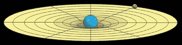

# 褶皱理论

> 原文：<https://medium.datadriveninvestor.com/the-diefold-theory-7c8890581cf9?source=collection_archive---------3----------------------->

> "你总能从真理的美丽和简单中认出它."—理查德·费曼

Photo by Bryan Goff on Unsplash

如果我告诉你，天文学家从未直接观察过黑洞。理论物理学家推断它们的存在是因为对邻近物质的影响。类似地，为了解释重力、光和质量，科学家们提出了弦论和量子论等抽象的现实模型，这些模型很难证明。

# 数学的依赖性

根据 Douglas Vogt 的说法，现代物理学被他们对数学的依赖所蒙蔽。在他的《论多维现实的*、一书中他阐述道:*

**如果一个施工经理按照建筑师的计划，用最好的工具和物资建造一栋房子。完工后的建筑可以像房子一样立着。但是房子在几年后就倒塌了。为什么？这房子的设计是歪的。**

* [## 编码器解码器序列:多长是太长？数据驱动的投资者

### 在机器学习中，很多时候我们处理的输入是序列，输出也是序列。我们称这样的一个…

www.datadriveninvestor.com](https://www.datadriveninvestor.com/2020/03/24/encoder-decoder-sequences-how-long-is-too-long/) 

在这个类比中，数学是一种工具，它通过抽象现实出色地解释了宇宙。但是如果一般的科学哲学有缺陷呢？

# 相对论

爱因斯坦著名的方程 E = mc2 意味着所有的能量都是物质，反之亦然。举例来说，如果你利用橙色分子结构的能量，你可以为一个中等城市供电一天。同样，如果你分裂铀中的几个原子，你可以炸毁一个像广岛一样的城镇。

但是这个广义相对论并没有解释什么是引力或者时间。根据爱因斯坦的说法，引力是质量的副产品，质量会弯曲时空连续体。

[What Is Gravity?- NASA](https://spaceplace.nasa.gov/what-is-gravity/en/)

重力是质量的副产品——取决于质量的大小，重力曲线空间就像毯子里的球。

# 问题

我们太阳系中心的太阳质量最大，所以所有行星都围绕它旋转，这是有道理的。

那么地球上的小磁铁怎么可能吸引桌子的回形针——绕过地球和太阳的全部引力。

因此，物理学家认为，与电磁力、强相互作用、弱相互作用、电弱相互作用和希格斯相互作用等其他基本力相比，重力是最弱的力。

# 全息宇宙

在 Vogel 的多维现实框架中，我们的宇宙是信息从较低维度流入并存在于较高维度的副产品。

沃格尔举例说明:

如果你看录像带，图像是由屏幕上的红色、绿色和蓝色像素构成的。这些彩色点从视频处理器获得电子指令。这个视频处理器通过翻译录像带上的小图像来产生这些信号。这盘录像带在塑料纸上用墨水编码了图像。

换句话说，有一种东西，沃格尔称之为褶皱，它传播基本的力量；这些被转化为量子粒子，在存在与不存在之间浮动。这些粒子形成键，形成原子，创造我们感知的物理宇宙。

时间存在于所有的维度，但是相对于占据那个领域的物质而言。时间的概念类似于视频游戏中的帧速率。

# 更高维度

根据经验，人类观察到的较大的天体是恒星和行星。Vogel 指出，在我们说话的时候，这样的实体可能是活着的，并且正在交流。可悲的是，人类的互动就像一只蚂蚁试图通过戳树根的一小部分来获得树的反应。

Photo by Vlad Tchompalov on Unsplash

太阳系、星系或宇宙可能是其他维度的居民。然而，由于它们的巨大范围，我们只能将这些维度理论化，因为我们太小而无法观察到更高的维度。

# 证明

每台计算机都使用时钟和同步频率在特定的时间段存储大量数据。更简单地说，当你改变一个文档的字体时，计算机首先检索该字体。然后一个函数识别哪些字母必须改变。

最后一个动作是删除这些计算。这些操作发生在 RAM 中，因为它们使用临时数据。如果您随后单击“保存”按钮，文件将被保存在长期存储器中。

同样，要证明死褶的存在，你需要找到一个时钟周期。海量数据传输的时空瞬间。

因此，Vogel 研究了许多不同的科学现象:像磁极反转、Gleisberg 循环和放射性碳浓度，以找到一个 12068 光年的[时钟周期](https://www.youtube.com/watch?v=R2SolQPKlag)。他假设当极移发生时，星系中的所有恒星同时新星，这导致了时间上的空白。

# 最后的想法

如果你有时间和耐心，可以去 Youtube 频道的[文件夹基金会](https://www.youtube.com/channel/UCjBe55XpYzc0HzkK-8lgQtA)看看，在那里，沃格尔机智清晰地解释了他的理论。

如果我必须把我的鸡蛋放在未来几年诺贝尔物理奖得主的篮子里，我会把赌注压在沃格尔身上。

遗憾的是，他的理论还没有到达主流科学或媒体。

*备注:*

[*你是一个模拟&物理学可以证明:乔治·斯穆特在 TEDxSalford*](https://www.youtube.com/watch?v=Chfoo9NBEow)

[*全息宇宙解释*](https://www.youtube.com/watch?v=klpDHn8viX8)

[*李奥纳特·苏士侃世界上的全息影像*](https://www.youtube.com/watch?v=2DIl3Hfh9tY)*