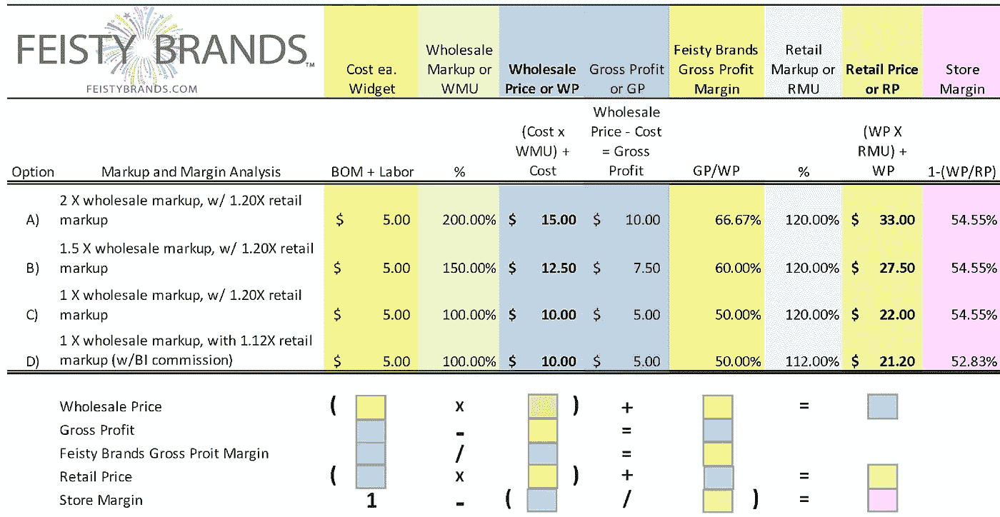
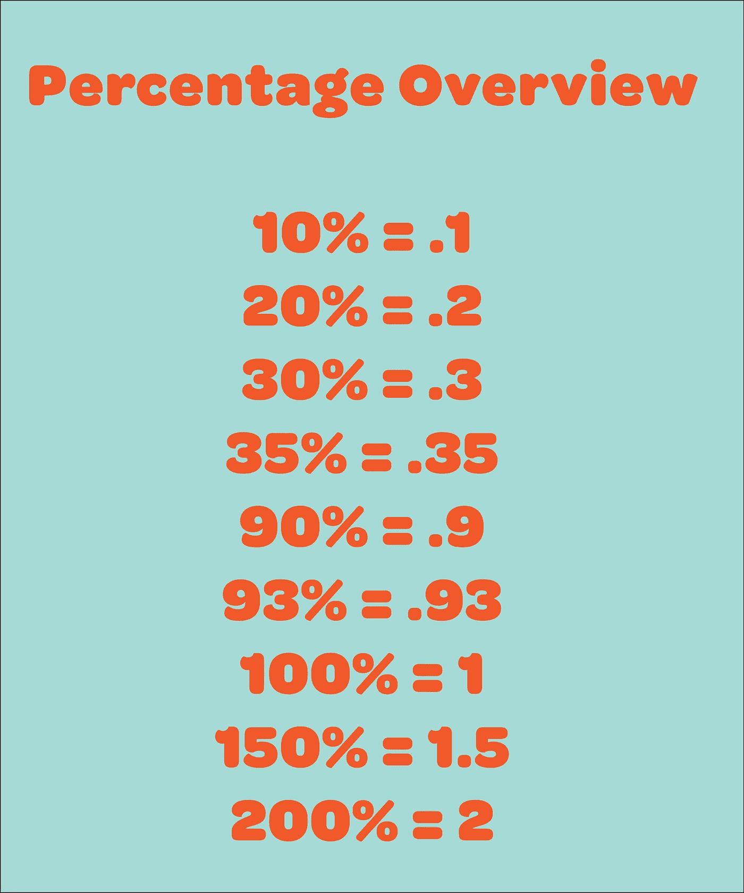
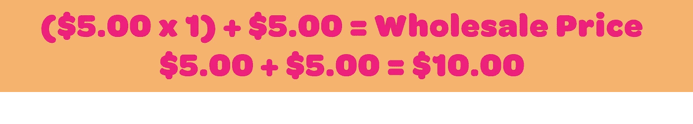
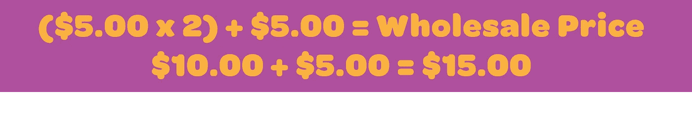
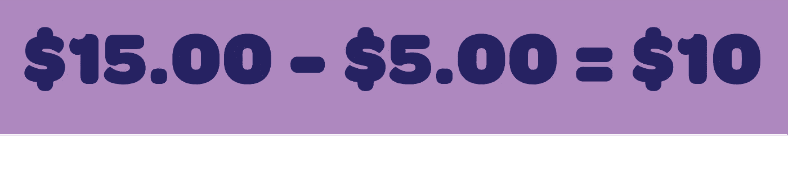
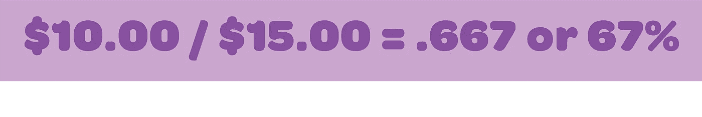
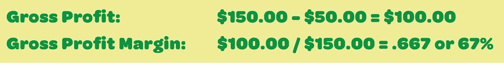

# 揭示了加价和利润之间的差异

> 原文：<https://medium.datadriveninvestor.com/the-difference-between-markups-and-margins-revealed-88057a383bed?source=collection_archive---------4----------------------->

大多数开公司的人都是我所说的“创意者”他们有一个想法或一项技能，甚至是做或制造某物的天赋，他们认为全世界都想要它。或者至少是世界的一部分——和他们一样酷的一部分，当他们看到天才时，他们会认出他。但创意人员往往不知道如何经营一家公司。你可以自己解决，但我是来帮忙的。

# 为什么你应该关心加价和利润？

因为这将有助于你为你的产品定价，而不会太离谱或不切实际。加价决定也是基于行业平均水平。你如何找到行业平均值？去你想卖东西的商店看看，看看不同产品的零售价格。您可以从那里开始向后工作。 **Margin** 是毛利润的简写，**是 T5，它很重要，因为你要确保你的产品收费足够高，而且你的成本足够低，可以覆盖你的管理费用。此外，当你与商店、银行和潜在投资者交谈时，你想知道行话。**

 [## 2020 年最佳短期投资选择精选资源|数据驱动型投资者

### 投资是增加你净财富的一个好方法。如果你通过遵循一个严格的…

www.datadriveninvestor.com](https://www.datadriveninvestor.com/2020/03/28/handpicked-resources-for-the-best-short-term-investment-options-of-2020/) 

我不是会计，我已经获得了国际经济学的研究生学位。我毕业后的第一份工作是在一家商业银行。我是一个团队的成员，这个团队负责整理私募备忘录，为银行客户私下筹集资金。我不知道如何阅读财务报表。我在大学时学过基础会计，当时我知道的最多的是借方和贷方，但不知道它们是如何作为资产负债表流入损益表的。幸运的是，我的办公室室友米歇尔刚刚从加州大学洛杉矶分校毕业，获得了工商管理硕士学位。我记得当她给我看财务报表的来龙去脉时，我蜷缩在她的办公桌前。后来，当我们去我们的第一个客户的办公室做尽职调查时，我开着租来的车，因为她来自法国，害怕在美国开车。她是越南人，又矮又黑。我是德国人，高个子，皮肤白皙。我们是一个对比，并立即成为灵魂姐妹。几年后，我离开了公司，成为一名企业家，学到了更多的经营企业的知识；往往通过试错，大多是错误。我希望能帮你避免一些错误。

如果你还不知道并想知道加价和利润的区别，那么你可以在财务上精明，避免错误；我将用几个简单的步骤向你展示。

我开发了上面的电子表格，你可以很容易地理解和计算不同的加价，以及它如何影响你的利润。我把它做得很漂亮。因为你们是创意者。

# **加价**

一个*加价*是你将出售你的产品的成本的百分比。计算你的销售(批发)价格的公式是:你的成本乘以加价百分比，然后将你的成本加回总数。

加价告诉你销售你的产品应该收取多少费用。这通常被称为批发价。在我们开始举例之前，让我们先来概述一下百分比是如何写的。

使用页面顶部的电子表格示例，我们将首先计算选项 C + D。产品成本为 5.00 美元，您将从 100%或 1%的加价开始(如上面的百分比概览图所示)。

你的批发价是 10 美元。因此，100%的加价相当于你的产品或服务的成本翻倍(如果需要，不要害怕使用计算器)。

假设您想要获得 200%的加价(电子表格中的选项 A)。你的批发价是:

你的批发价是 15 美元。这是你向零售商店顾客销售的价格。选项 B 是 150%的加价或

既然我们已经确定了批发价，让我们来计算一下我们的利润是多少。

# **利润率**

正如我已经提到的，在这种情况下，毛利是毛利率的简写。你的毛利是你减去生产产品的成本后的利润。为此，你必须使用成本表，把每一笔费用加起来，包括投入到你产品中的劳动力。对于这个分析，我假设你知道你的每件成本是多少。

第一步:首先计算你的毛利，也就是批发价减去你的成本。

在我们的选项中有一个例子:

第二步:计算你的利润，用你的批发价格除以你的毛利。

同样，在我们的选项中有一个例子:

边距总是以百分比表示。你的利润是 67%。

如果你卖出 100 件产品，那么你的毛利率将是所有产品的 100 倍，或者:

请注意，您的利润是基于您的毛利和您的价格，无论您销售多少件都不会改变。

所以在这个例子中，选项 A，你的利润是 200%，你的利润是 67%。

瞧啊。

注意:我还在电子表格的右侧经历了零售店会使用的相同过程。配方完全相同，但商店的成本是你的批发价，因为这是他们购买产品的价格。概括一下术语:

**成本**——你为购买或生产你的产品所支付的费用。

**批发价** —向购买你产品的商店收取的价格。

**零售价格** —商店向顾客收取的价格。

最后注意:批发价的标准加价取决于行业，但通常在 0.75-1.5 之间。我喜欢将毛利润保持在 50%的范围内，也就是 100%的利润。记住，你从毛利中赚的钱必须包括所有的日常开支，包括租金、工资、水电、保险、邮费等。商店通常采用 112%或 120%的加价(1.12 或 1.20)。同样，这取决于商店的类型和他们卖什么。

如果你想要一份 Excel 格式的电子表格，请发电子邮件到 gmail.com，我会发给你的。公式已经插入，所以你可以替换你自己的成本和加价。这对你来说可能是个方便的工具。如果你有任何问题，请告诉我，我随时欢迎你的想法和评论。

Cynthia Wylie 是企鹅兰登书屋出版的儿童书籍作者，她拥有乔治敦大学的经济学硕士学位。她为数据驱动投资者撰写商业和经济方面的文章。当她不写作时，她从事商业咨询和为[*【TheProjectConsultant.com】*](http://www.theprojectconsultant.com/)*制定扭转战略。*

*由 Dennis P. Kamoen 主编，创始人&主编，项目顾问。*