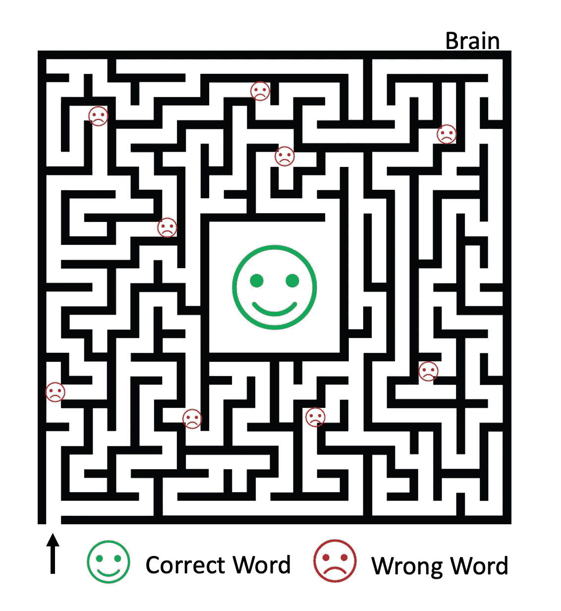

# 做决定的困难工作

> 原文：<https://medium.datadriveninvestor.com/the-difficult-job-of-making-decisions-20a22a0ab98a?source=collection_archive---------14----------------------->

## 生产力

## 你最近做了多少重要的决定？很难，不是吗？我们大多数人可能会低估这个数字；主要看“重要”这个词给你唤起了什么。

Photo by [Javier Allegue Barros](https://unsplash.com/@soymeraki?utm_source=medium&utm_medium=referral) on [Unsplash](https://unsplash.com?utm_source=medium&utm_medium=referral)

一般来说，一个重要的决定会导致重大的改变，比如职业的改变，房子的改变，生活方式的改变。每天都充满了自愿和非自愿做出的决定。开车时即使是简单的改变方向也需要决策。决策可能很简单，但却是一个复杂的过程。几个因素，如情绪，过去的经验，目前的情况，以及有远见的想法都要考虑在内。

# 如何做决定

首先，我们先明确一个重要的点。用“好”或“坏”这样的形容词来限定一个决定是主观的。只有决策的结果才能说明它的质量。它是有追溯力的。然后，你有历史剧目。随着时间的推移，人类已经建立了令人印象深刻的决策库。会不会是在世界的起源，当亚当决定吃禁果时，希望是夏娃慷慨地献上的；或者 1914 年 6 月奥地利的弗朗茨·斐迪南大公在波斯尼亚塞拉热窝遇刺并引发第一次世界大战时(WW1)；或者是德国纳粹在 1941 年 12 月可怕的珍珠港事件后向美国宣战。很可能当前的决定已经由某人在过去的某个时间、某个地方做出，并且后果已经被观察到。

## 我们从错误中吸取教训了吗？

为了避免一次又一次地重复同样的错误，回顾过去告诉我们的事情似乎是明智的。听起来很简单，不是吗？不幸的是，我们的大脑并没有像我们希望的那样从错误中吸取教训。当然，之后会有一个“后错误减缓”阶段。你当然可以想象，在这个错误意识阶段，你的大脑仍然在处理它。所以你不会马上重复这个错误，但也不会阻止它在未来再次发生。一种解释依赖于大脑创造“错误路径”来确保它会再次发生。

一个自言自语的例子就是当你在搜索一个特定的单词时。它就在你的舌尖上。你的思想在几条路径中徘徊，但都指向错误的词语，直到片刻之后，你找到了正确的词语。这条漫长而令人沮丧的路，就是你的大脑下一次很可能行驶的路。它不会直接找到正确的单词，而是会经历同样的漫长旅程，因为你的大脑会奇怪地记住“错误路径”，但当然不是你要找的单词。

有很多例子说明我们大多数人会一遍又一遍地犯错误；其中最常见的是在压力大的时候失去集中注意力的能力，或者在需要快速反应的情况下让我们的情绪控制甚至冻结。请注意，所有这些例子都有一个共同点——情绪。

# 情绪会影响我们的决定吗？

几年前，奥尔加·卡赞就这个话题发表了一篇有趣的文章。那是在大西洋上。对她来说，事实上，在科学观察的支持下，当建议者告诉你“跟随你的直觉”去做决定时，他们通常是不对的。科学家证明，例如，在工作面试中，试图确定受访者情绪的经理在使用系统方法(理性方法)时比使用直觉方法(情绪方法)时更准确[1]。

 [## 释放结果的简单哲学|数据驱动的投资者

### 这是我们播客中帕迪·布鲁斯南的一段话。帕迪是一个正念和冥想老师，一个…

www.datadriveninvestor.com](https://www.datadriveninvestor.com/2020/03/16/a-simple-philosophy-to-unlock-results/) 

情绪对决策有重要影响。研究表明，像愤怒这样的情绪无助于做出明智的决定，快乐也是如此。

*How to make decisions. Emotions influence the decision’s outcomes.*

## 愤怒

没有人喜欢生气，但当我们失去对局势的控制时，这是一种自然反应。它变得令人不安。我们大脑的爬虫层接管，你不应该在此刻做决定。从进化角度来说，愤怒是一种生存反应。当有人试图偷吃经过长时间精疲力尽的狩猎才得到的食物时，愤怒的感觉被触发了。愤怒让你不假思索地快速反应。它给你信心，太多的信心，这可以解释为愤怒的人认为世界风险更小。所以他们更倾向于采取冒险的行动。当涉及到制裁时，他们也倾向于支持更严厉的措施，并且更依赖于刻板印象。此外，人们倾向于将愤怒发泄在个人身上，而不是思想或社会上。

与过度自信的样子相反，愤怒是软弱和脆弱的标志。它已经被很好地研究过，并被多次用来操纵人们的思想，尤其是在选举期间。Campain 的演讲是为了激起对反对者的愤怒。这种愤怒激发选民的正义感，让他们做出情绪化的决定。

## 快乐

有趣的是，快乐的人并不比做决定的人更好。与愤怒的人类似，感到快乐的人做出的决定通常是基于本能。很快，一个信任的纽带就建立起来了。没有很多疑问或具体基础的信任。此时做出的决定将依赖于诸如美貌或慈善之类的特征。营销人员用来销售产品的另一个诡计。人们倾向于对与身体完美的人幸福生活的想法做出积极的反应。一个吸引人的环境导致做出非理性的决定。

## 没有情绪可能是答案

不管是否令人惊讶，在做决定的时候，没有特别的情绪是有好处的。没有心情的人会花时间去质疑甚至过度思考生活的方方面面。它导致用系统的方法做决策。在这样的场景中，[的思维导图](https://www.datadriveninvestor.com/2020/03/31/get-yourself-together-a-story-of-mind-mapping/)的揭示会非常有用。试试看，让我知道它去！

希望你喜欢阅读。想了解更多我的见解，请在[推特](http://www.twitter.com/JuDimastro)上关注我！

# 参考

[1]相信你的直觉还是仔细思考？检验直觉思维模式和系统思维模式是否能产生更高的移情准确性。J Pers 社会心理学。2016 年 11 月；111(5):674–685.DOI: 10.1037/pspi0000063。PMID: 27442764。