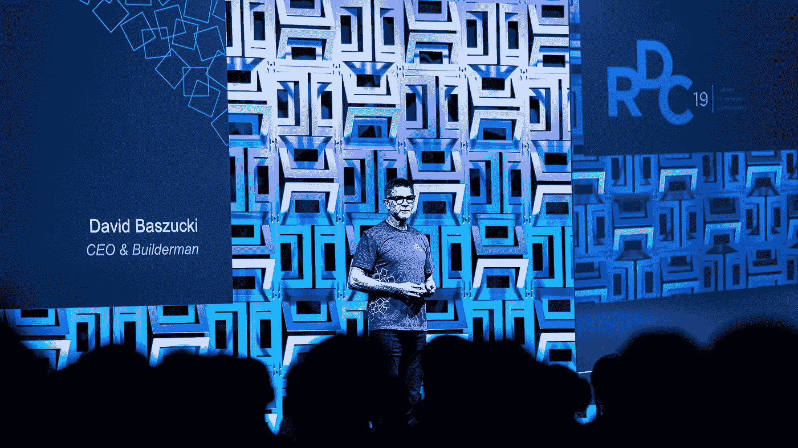

# Roblox 的直接上市表明投资银行变得过于贪婪

> 原文：<https://medium.datadriveninvestor.com/the-direct-listing-of-roblox-indicates-investment-banks-have-become-too-greedy-d07364062bc2?source=collection_archive---------2----------------------->

## 世卫组织从上市公司中获利？

## 或者，投资者为最近的 IPO 支付了过高的价格

A scene from the popular Roblox game Jailbreak. In a lot of recent tech IPOs, investment bankers and their clients are thought to have worn similar orange tracksuits. Source: Roblox

1 月 6 日，Roblox Corporation [宣布](https://corp.roblox.com/2021/01/roblox-announces-anticipated-direct-listing/)他们预计很快会直接上市。

这一消息令投资者感到惊讶，他们预计首次公开募股(IPO)将在 2021 年上半年进行，此前该游戏公司推迟了原定于 2020 年 12 月进行的 IPO。

Roblox 并不是唯一一家推迟原定 IPO 的知名公司。提供先买后付解决方案的金融科技公司 [Affirm](https://www.marketwatch.com/story/affirm-sets-ipo-terms-could-rake-in-up-to-935-million-2021-01-05) 也决定暂停 IPO。

在此之前，IPO 季节出现了投资者泡沫。几个期待已久的 IPO 见证了公司股票在第一个交易日的大幅上涨(见下表)。

由于对新上市公司股票的高需求，特别是在技术领域，进行首次公开募股的公司的估值受到了审查。

但是谁从 IPO 中获利呢？直接上市有什么不同？

公司上市的原因是以优惠条件获得融资。

经济理论表明，愿意提供资本的投资者和要求资本推动增长的公司之间的有效匹配创造了一个盈余，由资本的供应者(投资者)和获取者(公司)以及匹配他们的中介机构(投资银行)分享。

由于这不是一个零和游戏，从私营公司到上市公司的转变既可以加强公司本身，丰富银行和 IPO 参与者，也为投资者提供了一个理想的投资机会。

但如果这种平衡被扭曲，过多的盈余落入银行的口袋，那该怎么办？

许多人目前猜测，公司没有从上市中获得应有的好处，这可能解释了 Roblox 选择不同路线的决定。

## IPO 的受益者

当一家公司决定通过 IPO 上市时，他们会聘请一家投资银行(或者几家，取决于公司的规模)作为承销商。承销商对公司进行估值，并安排发行。

作为回报，承销商收取费用，通常是筹集现金总额的一定比例，以及公司的股份。

他们通过向高净值客户和机构投资者(如共同基金和对冲基金)发行股票来为公司筹集资金。发行价——向参与投资者提供股票的价格——是由承销商在接近 IPO 时设定的。

> 公司错过了宝贵的资本。这损害了它的增长前景

因此，当新上市的公司股价上涨时，投资银行和他们的客户通常会赚得盆满钵满。应该注意的是，内部人士不能在头三个月出售他们的股票，这被称为锁定期。

其他受益者是交易员，他们设法以接近发行价的价格收购股票，然后以更高的价格卖出。但所有这些利润都可能是公司应计的。

在一家公司开始在证券交易所交易后，投资者愿意立即以高于发行价 50%、80%甚至 100%的价格购买股票，这表明该公司本可以在首次股票发行中以更高的估值筹集现金。

公司错过了宝贵的资本。这损害了它的增长前景。因此，对于长线投资者来说，这也是一个不利因素，他们从公司的繁荣中获益更多，而不是从股价的快速上涨中获益。

## Roblox 的直接列表

直接上市有两个主要好处。首先，支付给投资银行的费用减少了，投资银行扮演的是顾问的角色，而不是承销。第二，上述以低于投资者愿意支付的价格发行股票的间接成本。

> Roblox 选择取消原定的 IPO，以更高的估值获得了更多资本

此举可能会让公司的现有股东(创始人、管道投资者和风投)中饱私囊，而不是承销商(投资银行)和 IPO 参与者(机构投资者和承销商的客户)。

没有锁定期，在上市时，所有股票都是浮动的，如果股东愿意，可以进行交易。

直接上市后往往会出现过度波动，因为股票的重新分配是在市场上进行的，其组织方式不如 IPO 路演。但这对该公司来说不是问题，除非它会在上市后立即通过售股筹集现金。

本周，Roblox [宣布](https://corp.roblox.com/2021/01/roblox-raises-520m-led-altimeter-capital-dragoneer-investment-group/)一轮成功的私人融资。该公司向 Altimeter 和 Dragoneer 等对冲基金出售股票，以 295 亿美元的估值总共筹集了 5.2 亿美元。

目前的估值远高于该公司宣布最新一轮融资并计划在 2020 年 10 月上市时预计的 80 亿美元估值。

一句话:Roblox 选择取消原定的 IPO，以更高的估值获得了更多资本。

与此同时，本应承销 IPO 的投资银行损失了大量收益。如果他们对该公司的估值更符合市场情绪，IPO 可能会继续进行。

Roblox CEO David Baszucki has raised a lot of extra capital by postponing the scheduled IPO given the expected valuation. Roblox can now deploy capital to its core business and to sustain growth.

另一家进行直接上市的著名公司是科技公司 Palantir，该公司于 9 月 30 日上市。

Palantir 的联合创始人彼得·泰尔以前也在 PayPal 工作，目前也在赞助一家特殊目的收购公司公司，旨在让一家目前尚未披露的东南亚电子商务公司上市。

特殊目的收购公司是公司上市的第三种 T2 方式。相对于 IPO，它提供了一些好处，但特殊目的收购公司的保荐人(把他们当成中介)往往是主要受益者。

通过 SPAC 上市的公司有时质量可疑，散户投资者更难对它们进行估值，因为在特殊目的收购公司与其上市的私人公司完成合并之前，披露的信息较少。

 [## 特殊目的收购公司是新的黑人

### IPO 替代方案已经大规模回归，投资者的兴趣将使派对持续到 2021 年

medium.com](https://medium.com/datadriveninvestor/spac-is-the-new-black-296947838e2e) 

## 如果不是银行的错，那么“傻钱”是谁呢？

自从云公司雪花(Snowflake)的股价在 2020 年夏末收于 IPO 发行价的两倍以上以来，投资者对新上市公司的兴趣一直在上升。

与十年前相比，公开交易的公司更少，高估值的环境，以及投资者口袋里燃烧的创纪录数量的[现金，对新投资机会的渴望(也见加密货币和其他替代资产)不太可能很快得到满足。](https://medium.com/datadriveninvestor/record-amounts-of-cash-on-the-sideline-can-fuel-the-current-bull-market-7a5c76374709)

 [## 创纪录的兼职现金可以刺激当前的牛市

### 几个因素表明牛市正处于初期阶段

medium.com](https://medium.com/datadriveninvestor/record-amounts-of-cash-on-the-sideline-can-fuel-the-current-bull-market-7a5c76374709) 

以下是 2020 年第三季度和第四季度通过 IPO 上市的公司的不完整列表，IPO 股票的销售价格，以及在证券交易所交易的第一天的收盘价:

*【公司名称；Ticker 日期；承销商；要约价格(筹集的资本)；第一天收盘价(自由流通股的市值)；%-变化]*

*   **雪花**，*$雪花*，9 月 16 日，*摩根士丹利，高盛，摩根大通，花旗，艾伦&公司*，120 美元(10 亿美元)，253.93 美元(71 亿美元)， ***+111.6 %***
*   **Unity** ， *$U* ，9 月 18 日，*高盛，瑞士瑞信银行，美银，巴克莱，威廉布莱*，52 美元(13 亿美元)，68.35 美元(17 亿美元)， ***+31.4 %***
*   **GoodRx** ， *$GDRX* ，9 月 23 日，*摩根士丹利，高盛，摩根大通，巴克莱*，33 美元(11 亿美元)，50.5 美元(17 亿美元)， ***+53 %***
*   **C3.ai** ，*，$AI* ，12 月 9 日，*摩根士丹利，摩根大通，美银*，42 美元(6.51 亿美元)，92.49 美元(14 亿美元)， ***+120.2 %***
*   **DoorDash** ， *$DASH* ，12 月 9 日，*高盛和摩根大通*，102 美元(34 亿美元)，189.51 美元(63 亿美元)， ***+85.8 %***
*   **Airbnb** ， *$ABNB* ，12 月 10 日，*高盛和摩根士丹利*，68 美元(35 亿美元)，144.71 美元(75 亿美元)， ***+112.8 %***
*   **hyfarm Holdings**， *$HYFM* ，12 月 10 日，*摩根大通，德意志银行，Stifel，Truist，和威廉·布莱尔*，20 美元(1.74 亿美元)，51.99 美元(4.52 亿美元)， ***+160 %***
*   **新贵**，*，【UPST】美元*，12 月 16 日，*高盛，美国银行，花旗*，20 美元(2.4 亿美元)，29.47 美元(3.54 亿美元)，**， *+47.4 %* ，**

似乎有一种趋势，第三季度 IPO 在前几周的积极势头加剧了对错过(FOMO)的担忧和对最受期待的第四季度 IPO 的预期。

虽然 Unity 和 GoodRx 第三季度引人注目的 IPO 都以高得多的价格收盘，但走势远不如 DoorDash、Airbnb 和 C3.ai 那样抛物线。

> 散户投资者似乎愿意为新上市的公司支付过高的价格

对于大多数人来说，对新上市公司需求的大幅飙升令人吃惊。在这方面，很难责怪承销商没有准确预测散户投资者的支付意愿。

此外，在最初由 FOMO 推动的价格飙升之后，最近几次被炒作的 IPO 都出现了公司股价失去动力甚至低于早期高点的情况。

这可能表明，散户投资者只是愿意为新上市的公司支付过高的价格。当势头消退时，他们就进入下一轮，参与者有机会以有吸引力的价格抛售部分股票。

如果是这样的话，就很难责怪承销商的估值了。毕竟，他们需要确保产品(公司股票)对 IPO 参与者有吸引力——只有在交易对他们有利的情况下，他们才会有吸引力。

> 如果银行不能确保有吸引力的 IPO 条款，更多的公司可能会选择直接上市，通过股票销售筹集资金

因此，承销商需要取得平衡，确保公司能够以有吸引力的条款筹集现金，IPO 的参与者愿意投资，并且股价仍有初始动力的空间，以便上市前投资者可以在锁定期后锁定收益。

当股价在第一个交易日上涨超过 100%时，这种平衡就不存在了，这些公司错过了可以加强资产负债表或投资于进一步增长的重要资金。

推动增长的需求通常是推动公司上市的原因。在某些时候，私下筹集足够的资金是困难的。

另一个原因是所有者有机会获利——即使只是部分获利。但没有一家公司选择通过 IPO 来讨好投资银行及其客户。

如果银行不能确保有吸引力的 IPO 条款，更多的公司可能会选择直接上市，通过股票销售筹集资金。

对于最有吸引力的公司来说，使用特殊目的收购公司路线并不是一个真正的选择，但如果 IPO 没有带来额外的好处，其他人可能会选择特殊目的收购公司合并。

但目前，投资者渴望风险资产。2021 年看起来将是各种公开上市疯狂的一年。

 [## CAPE 比率表明股票市场是有吸引力的

### 坎贝尔和诺贝尔奖得主席勒发明的这一指标预示着股市的乐观前景

medium.com](https://medium.com/datadriveninvestor/the-cape-ratio-suggests-the-stock-market-is-attractive-7eb3fc22816b)