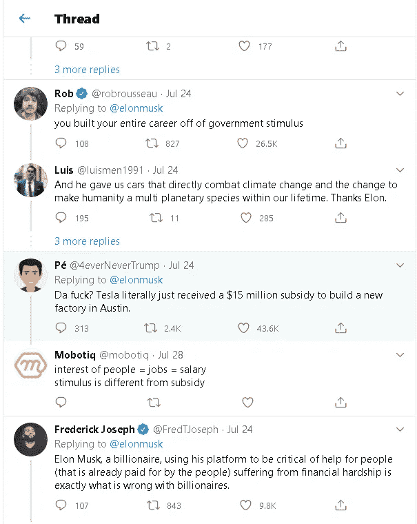
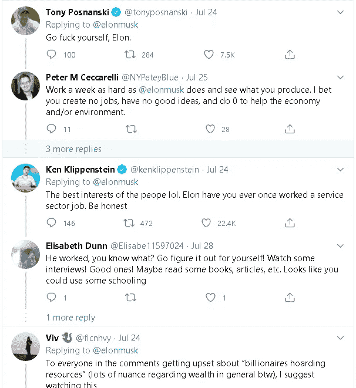

# 美元印刷实验将对美国产生反作用

> 原文：<https://medium.datadriveninvestor.com/the-dollar-printing-experiment-will-backfire-on-america-881830c81737?source=collection_archive---------4----------------------->

## 美国人因在别人不愿意去的地方推进边界而受到尊敬，但他们可能通过印钞票来处理新冠肺炎危机走得太远了

Photo by [Ben Hershey](https://unsplash.com/@benhershey?utm_source=medium&utm_medium=referral) on [Unsplash](https://unsplash.com?utm_source=medium&utm_medium=referral)

美国人在他们夸张的实验中以自信和乐观著称，这些实验在过去的一个世纪里大多数时候都奏效了，并使他们的国家领先于其他国家一步。

难怪美利坚合众国欢迎阿尔伯特·爱因斯坦和约翰·梅纳德·凯恩斯等 20 世纪世界上最伟大的思想家来检验他们的理论，这些理论对世界其他地方来说要么被认为过于聪明，要么被认为过于危险。

最成功、最大胆的实验发生在 51 年前，当时美国将人绑在炸弹上，让他们安全登陆月球并返回地球。

推动壁垒的意愿给了美国许多第一，每一个都不是靠运气，而是对细节的敏锐关注和纯粹的努力。

然而，另一方面，美国以外的许多观察家认为，21 世纪的美国人已经发展出极端的自大和鲁莽，如果任其发展，将会毁灭他们的国家。

如果今天进行一项“全球傲慢指数”来绘制各国的傲慢程度，毫无疑问，美国将名列榜首。

今年，在傲慢的唐纳德·特朗普(Donald Trump)的领导下，美国在政治上超越了所有人，因此造成了一系列自我毁灭，如此严重，以至于人们担心至少需要三代人才能纠正。

尽管特朗普很奇怪，但作为地球上最有影响力的国家的现任总统，他会使用创造神话和伪科学的方法，这是令人难以理解的。

也许，那些对这一事件的转变感到难以置信的震惊的人是来自非洲、拉丁美洲和加勒比海的人，他们从来没有想到美国人会经历下意识的政府反应和政治斗争，这在他们贫穷的国家是正常的。

 [## 将美元变成硬币:久经考验的亏损期权策略|数据驱动的投资者

### 创造伟大的期权策略是一个反复试验的过程。这篇文章就是关于这些错误的。这张图表显示了…

www.datadriveninvestor.com](https://www.datadriveninvestor.com/2020/04/24/turning-dollars-into-dimes-time-tested-options-strategies-for-losing-money/) 

在执政不到四年的时间里，特朗普犯了许多错误，但将使他成为历史上最糟糕的总统的一个错误是采取了可能将美元变成卫生纸的政策。

在他是有史以来最聪明的美国总统的想象的驱使下，特朗普在白宫的时间要么质疑要么试图重做前任奥巴马政府采取的政策。

在 2008 年席卷华尔街和世界其他地区的金融危机之后，奥巴马政府见证了凯恩斯主义经济政策的复兴，美联储印刷了超过 2 万亿美元，最终重振了市场和全球经济。

凯恩斯主义政策首先在大萧条期间付诸实施，此后成为现代政府在面临严重经济紧急情况时的求助对象。

这些政策由英国经济学家约翰·梅纳德·凯恩斯(John Maynard Keynes)提出，并作为现代货币理论得到推广，旨在避免停滞和通胀，即政府为了鼓励支出而出现赤字，这样人们就可以储蓄更多，然后投资更多的政府债券。

但特朗普政府以其一贯的浮夸外表，将其凯恩斯主义救援计划提升到了一个全新的危险水平。

在 3 月中旬冠状病毒危机最严重的时候，美联储宣布了“QE 无限”，并加大了印钞机的马力。

最初印刷的数十亿美元已经以贷款的形式发放出去，以支持家庭、雇主、金融市场以及州和地方政府。

美联储计划根据经济衰退的严重程度印刷高达 2.3 万亿美元的钞票。

> “如果你堆叠 2.3 万亿美元的钞票，它将到达月球的一半以上。”——[佛罗里达大西洋大学经济学助理教授威廉·j·路德在对话中](https://theconversation.com/how-the-federal-reserve-literally-makes-money-140305)。

“QE 无限”计划最危险的一面可能是已经注入美国经济的大量自由资金。

今年 6 月，国会通过《关爱法案》(CARES Act)，授权美国国税局(Internal Revenue Service)支付 1.59 亿美元的刺激资金，价值超过 2670 亿美元。

这些款项被分成每人 1200 美元的支票，每对已婚夫妇 2400 美元，17 岁以下儿童 500 美元。

第二轮此类支付已经获得批准，可能会在 8 月下旬反映到人们的账户上。

这是一个金钱的海洋，美国纳税人已经把它收进了自己的口袋。

这也给了特朗普他一直想要的认可，并在 11 月大选前为他赢得了一群全新的支持者。

正如印钞对经济的风险一样，刺激计划的受益者采取了一种情绪化的方式，攻击任何对该计划持有相反意见的人。

亿万富翁埃隆·马斯克在推特上反对提供刺激支票后，成为愤怒的美国人的焦点。

马斯克在那条推文中受到的抵制证实了美国人的谎言，或者说是事实，即美元总是可以被印刷，因为它是至高无上的，是其他世界货币之王。

这就是为什么前美联储主席艾伦·格林斯潘曾经说过，“美国可以支付任何债务，因为我们总是可以印刷钞票来做到这一点。所以违约概率为零。”

# 美国能一直印钞票吗？

> 印更多的钱不会增加经济产出，只会增加经济中流通的现金量。如果印更多的钱，消费者可以要求更多的商品，但是如果公司仍然有同样数量的商品，他们会通过提高价格来回应。在一个简化的模型中，印钞票只会导致通货膨胀。——摘自格林斯学院经济学教师 Tejvan Pettinger 的文章——[印钞的问题](https://www.economicshelp.org/blog/634/economics/the-problem-with-printing-money/)。

美国政府自己的专家很清楚，就像其他世界货币一样，美元也有自己的局限性

[美联储经济学家 Scott A. Wolla 和 Kaitlyn Frerking](https://files.stlouisfed.org/files/htdocs/publications/page1-econ/2019/11/01/making-sense-of-the-national-debt_SE.pdf) 在 2019 年发表的一篇文章表明，美国政府采取印钞政策将导致极高的通货膨胀率(恶性通货膨胀)，并导致经济崩溃。

专家们提到了一些更著名的此类政策的例子，包括德国在 1921 年至 23 年、津巴布韦在 2007 年至 2009 年以及目前的委内瑞拉。

40 名经济学家也持类似观点，他们参与了一项针对现代货币理论的投票。

结果发表在[全球市场倡议](http://www.igmchicago.org/surveys/modern-monetary-theory/)上。

这些专家被要求对两个问题发表意见。

当被问及以本币借款的国家是否应该担心政府赤字，因为它们总能创造货币为债务融资时，所有人都强烈反对。

他们还以否定的方式回答了这个问题:借入本币的国家可以通过创造货币，为它们想要的实际政府支出提供尽可能多的资金。

# 美元在转向卫生纸吗？

> 当我们谈论各国货币的量化宽松时，我们实际上是在谈论印更多的钱或增加货币储备。另一方面，在比特币的例子中，我们谈论的是量化的“硬化”。随着各国货币中银行纸币的增加，同时新开采的比特币数量每 4 年减少一次——coin motion 私人银行业务负责人 Sami Kriikkula 在文章[中称，2020 年购买比特币为时过晚吗？](https://www.linkedin.com/pulse/too-late-buy-bitcoin-2020-sami-kriikkula/)

面对全面爆发的美元危机，市场陷入恐慌。

这种紧张局势导致了不寻常的事件，否则这在十年前是不可能的。

谁会想到一家公开上市的美国公司会投资比特币来对冲通胀风险。

8 月初，MicroStrategy Incorporated(纳斯达克股票代码:MSTR) [以 2.5 亿美元的总价购买了 21454 个比特币](https://www.businesswire.com/news/home/20200811005331/en/MicroStrategy-Adopts-Bitcoin-Primary-Treasury-Reserve-Asset)。

首席执行官迈克尔·j·塞勒(Michael J. Saylor)表示，此次收购是双管齐下的资本分配战略的一部分，该公司此前在 2020 年 7 月 28 日发布 2020 年第二季度财务业绩时宣布了这一战略。

另一种方法是公司通常做的事情。

在这种情况下,“现金收购”出价高达 2.5 亿美元的 MicroStrategy A 类普通股。"

> “我们决定在这个时候投资比特币，部分是由影响经济和商业格局的宏观因素共同推动的，我们认为这些因素正在为我们的企业资金计划带来长期风险——这些风险应该得到积极应对。这些宏观因素包括，除其他外，新冠肺炎引发的经济和公共卫生危机，前所未有的政府金融刺激措施，包括世界各地采取的量化宽松政策，以及全球政治和经济的不确定性。我们认为，这些因素和其他因素加在一起，很可能会对法定货币和许多其他传统资产类型的长期实际价值产生重大贬值影响，包括许多传统上作为公司财务运营一部分持有的资产。”-塞勒先生。

在目前不确定性不断增加的情况下，选择比特币作为投资对冲工具是非常合理的。

 [## 打算买比特币？了解如何在币安找到最好的报价

### 声明:我只推荐我自己使用的产品，这里表达的所有观点都是我自己的。此帖子包含…

ngugimungai.medium.com](https://ngugimungai.medium.com/planning-to-buy-bitcoin-learn-how-to-find-the-best-offers-on-binance-d90ef283c1a2) 

毫无疑问，比特币是 2020 年表现最好的资产。

不稳定的波动使加密货币在相对较短的时间内取得了显著的市场成功，这在以前被认为是不可能的金融资产。

罗伯特·T·清崎和保罗·都铎·琼斯等美国金融业有影响力的人士也以通胀担忧为由，采用比特币作为对冲工具。

可以肯定的是，当沃伦·巴菲特宣布收购总部位于多伦多的巴里克黄金公司时，美元正在酝酿的不确定性达到了顶峰，巴里克黄金公司是世界上最大的矿业公司之一。

众所周知，巴菲特喜欢许多金融资产，但不喜欢黄金。

尽管如此，俗话说，前所未有的时代需要前所未有的措施。

# 美元有可能遇到什么命运？

要理解美元今天的形态，并预测它最终的未来，你必须回到过去。

在网上搜索之后，我在 Investopedia .网站上找到了一份关于货币历史的清晰概述。

> 美联储银行是根据 1913 年的《美联储法案》创建的，以应对基于单个银行发行的纸币的货币系统的不可靠性和不稳定性。当时，美国经济已经超越英国成为世界最大经济体，但英国仍是世界商业中心，大部分贸易以英镑进行。此外，在那个时候，大多数发达国家将其货币与黄金挂钩，以创造货币汇率的稳定性。
> 
> 然而，当 1914 年第一次世界大战爆发时，许多国家放弃了金本位制，以便能够用纸币支付军费，这使他们的货币贬值。战争进行三年后，英国发现自己第一次不得不借钱，因为它一直坚持金本位以维持其世界领先货币的地位。
> 
> 美国成为许多愿意购买美元计价美国债券的国家的首选贷款人。1919 年，英国最终被迫放弃金本位制，这使得以英镑交易的国际商人的银行账户大幅减少。那时，美元已经取代英镑成为世界主要储备货币。
> 
> 正如在第一次世界大战中一样，美国在战争开始后很久就加入了第二次世界大战。在参战之前，美国是盟国武器、物资和其他商品的主要所有者。战争结束时，美国以黄金作为支付手段，拥有了世界上绝大多数的黄金。这就排除了所有黄金储备耗尽的国家回归金本位的可能性。
> 
> 1944 年，来自 44 个盟国的代表在新罕布什尔州的布雷顿森林开会，提出了一个不会使任何国家处于不利地位的外汇管理体系。当时的决定是，世界货币不能与黄金挂钩，但可以与美元挂钩，而美元与黄金挂钩。
> 
> 后来被称为布雷顿森林协议的这一安排规定，各国央行将维持本国货币与美元之间的固定汇率。反过来，美国会根据需求用美元兑换黄金。当货币价值相对于美元变得太弱或太强时，国家在某种程度上可以控制货币。他们可以买卖他们的货币来调节货币供应。
> 
> 由于布雷顿森林协定，美元被正式加冕为世界储备货币，并得到世界上最大的黄金储备的支持。其他国家积累的不是黄金储备，而是美元储备。由于需要一个存放美元的地方，各国开始购买美国国债，他们认为这是一种安全的资金储存方式。
> 
> 对国债的需求，加上为越南战争和“伟大社会”国内项目融资所需的赤字支出，导致美国向市场投放大量纸币。随着对美元稳定性的日益担忧，这些国家开始将美元储备转换成黄金。
> 
> 对黄金的需求如此之大，以至于理查德·尼克松总统被迫进行干预，使美元与黄金脱钩，这导致了今天存在的浮动汇率。尽管存在滞胀时期——高通货膨胀和高失业率——美元仍然是世界储备货币。

像美国这样可以选择印钞票的国家，认为他们可以随心所欲地印钞票，因为这些钱会在国外被需求，价格不一定会上涨。

这种假设的部分原因是现状使然，即各国央行一直在本国保持美元储备，如果这些储备缩水，它们总是会要求更多。

约翰·梅纳德·凯恩斯，这个最能让美国人对他们让世界屈从于他们意愿的能力感到骄傲的人，也给了他们自我怀疑的最好理由。

原因是对人的因素的考虑，因为经济和市场是由真实的人组成的。

人是很难预测的。

如果人们目前认为美元正在贬值，无法保护财富，他们也可能开始认为美元不适合国际支付。

就像我们简短的历史课告诉我们的那样，美元在货币领域的想象中的宝座在最近受到了挑战，当时美国开始赤字支出，为越南战争和伟大社会国内项目提供资金。

当时，是央行采取行动保护自己的国家免受美元危机的影响。

这一次，在国际贸易中拒绝用美元交易的是商人。

随着比特币成为全球贸易中首选的支付方式，这一趋势正在升温。

连锁反应是海外持有的美元会突然回流到美国，造成毁灭性的通货膨胀。

这里要明白的一点是，没有价值的外币总会找到回到其来源国的方法，因为没有人愿意被无法使用的货币困住。

迄今为止，没有人像清崎那样给出如此深刻的建议。

看看目前的市场情绪，他为什么建议美国人早点把“假钱”用好就说得通了。

简而言之，持有一种正在制造更大经济泡沫、同时窃取你购买力的货币是没有意义的。

**进入专家视角—** [**订阅 DDI 英特尔**](https://datadriveninvestor.com/ddi-intel)

我希望你喜欢阅读这篇文章。请关注我，在您的收件箱中获得更多类似的文章。还有，如果你愿意支持我当作家，可以考虑报名 [***成为中等会员***](https://ngugimungai.medium.com/membership) ***。每月只需 5 美元，你就可以无限制地使用 Medium。***