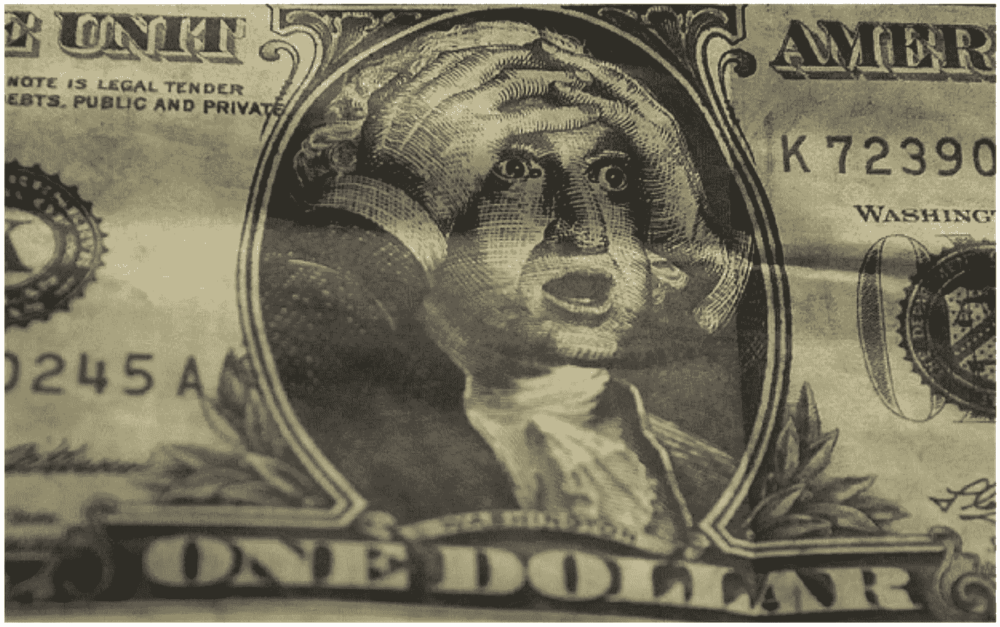

# 美元的霸权属性不利于全球金融稳定和美联储政策

> 原文：<https://medium.datadriveninvestor.com/the-dollars-hegemonic-properties-are-bad-for-global-financial-stability-and-fed-policy-6865264db578?source=collection_archive---------5----------------------->

***简介。***

在新冠肺炎对世界经济造成的经济混乱之后， [*我写了大量关于货币和宏观审慎政策含义的文章。本文试图确定该病毒对国内汇率、信用利差和宏观经济结果的影响。不出所料，全球范围内从新兴和发展中资产市场向安全资产的转移，对从南非、中国到喀麦隆的许多国家造成了前所未有的伤害。资本流动逆转和美元突然升值造成的金融和经济困难在发展中经济体和新兴市场经济体的所有部分都很明显。在宏观经济波动期间，发展中市场经济体的政府债券看到大量资本流入，因为投资者寻求缓冲事件驱动的不确定性的冲击。自然，我问自己，美元的霸权属性是否有利于货币政策的长期实施。*](https://papers.ssrn.com/abstract=3588263)

[Nato Association](http://natoassociation.ca/a-dollar-in-decline-the-future-of-the-greenback/)

美元是全球主要的储备货币。根据国际货币基金组织的数据，美元占全球外汇储备的 61.3%[***%***](https://www.reuters.com/article/us-forex-reserves/us-dollar-share-of-global-currency-reserves-at-lowest-since-2013-imf-data-idUSKBN1WF1IO#:~:text=Reserves%20held%20in%20U.S.%20dollars,2013%20when%20it%20was%2061.27%25.)，欧元、英镑和日元远远落后。此外，各国之间的全球贸易往往以美元结算，因为它同样受益于记账单位和可兑换性。此外，美国同样控制着 SWIFT 系统，全球大多数金融交易都是通过该系统清算的。因此，人们可以理解为什么美元具有前所未有的霸权性质。最后，全球大宗商品同样以美元计价，这对阿尔及利亚、乍得、喀麦隆、沙特阿拉伯等大宗商品出口国的政府收入产生了重大影响。

 [## 如何在不牺牲孩子或财务的情况下安全理智地离婚|数据驱动…

### 在美国，七月是以孩子为中心的离婚月。作为 cdfaⓡ的专业人士，我可以向你保证，从长远来看…

www.datadriveninvestor.com](https://www.datadriveninvestor.com/2020/07/28/how-to-divorce-safely-and-sanely-without-sacrificing-your-children-or-your-finances/) 

***美元的霸权属性对全球有哪些影响？***

当美元升值时，发展中经济体的偿债成本会自动增加，它们的货币会贬值，通胀会飙升。我在早先的一篇论文中发现 外汇储备同样受到美元主导地位的负面影响，美元主导地位已成为全球贸易体系的特征。就新冠肺炎而言，1/3 面临债务困扰高风险的非洲国家受益于多边机构债权人的债务延期。此外，在宏观经济波动时期，这些经济体不能依赖高附加值出口来隔离长期增长。这不仅意味着这些经济体的外汇储备将耗尽，而且货币或银行危机的风险也将显著增加。以 2018 年的土耳其为例，该国外汇储备耗尽，导致其总统呼吁民众抛售美元。

一方面，美联储一直是全球经济的锚，但美元的霸权属性损害了通胀目标的实现。先进经济体的外汇在过去十年保持稳定，减少了从货币到通胀结果的传导，加剧了这种情况；俄罗斯、中国、韩国和南非等新兴市场的情况则大不相同，它们的经济和贸易越来越指向东方，当美元升值时，它们也会同步贬值。

对于大多数美国决策者、分析师和专家来说，保持美元的霸权属性对其软实力来说是不可或缺的。对于美联储来说，情况可能并非如此，美联储已将利率降至前所未有的低位，以刺激经济，保持通胀预期稳定，并实现其法定通胀目标。当然，美联储采取激进的货币政策立场是合理的，即使混合工具的时机可以用来同时实现非强制性目标。而从长远来看，这种政策的执行会给宏观经济和金融稳定带来严重风险。然而，货币政策通过决定资本金融市场反应函数的信号机制，开始在实体经济中发挥不可或缺的作用。然而，尽管股市已经反弹，实体经济仍受到新冠肺炎的重创，失业率不幸仍居高不下。然而，如果美元在本质上不那么全球化，人们可以认为，美联储或许会实现其通胀目标，同时使用其他工具来减轻新冠肺炎的不利影响。

***货币政策可能会保持更大的扩张性而不那么有效***

在后布雷顿森林体系时代，货币政策对于支持经济增长和价格稳定是不可或缺的。然而，在未来几十年，作为刺激和抵消事件驱动型金融危机的工具，它将对发达经济体变得越来越重要。然而，如果债券和美元偏好持续存在，那么在货币政策不变得越来越扩张的情况下，预测通胀回归 2.0%的目标是具有挑战性的。在过去的十年里，美联储的资产负债表已经增长了 X%,到 2021 年增长了 X%。尽管银行资产负债表的增长幅度没有限制，但不清楚一旦达到零下限，货币政策是否会变得越来越有用。

一方面，有人认为，信号机制以及对货币政策的实施和执行的微调，可以在金融压力时期起到锚定经济的作用。美元不可能在不对其外交政策产生重大影响的情况下失去其霸权属性。然而，对国内经济和货币政策的好处将是巨大的，因为美联储将很容易影响其通胀目标，而其资产负债表和整体货币政策的成本将保持温和。诚然，市场力量，而非政策制定者，能够推动从美元向其他货币的转变。我认为，这样的结果将减少发展中市场经济体外部平衡的压力，同时改善美国货币政策的运作，而不是让日益增长的资产负债表与脱锚通胀预期和低于目标的通胀相抗衡，来自发达国家央行的信号工具可以作为更好的外汇管理的背景。

在未来十年的大部分时间里，美国将继续受益于 SWIFT，这应该足以展示软实力。为了价格、金融稳定和不那么臃肿的资产负债表，降低美元在全球贸易和金融市场中的突出地位将有助于解决全球失衡和大宗商品相关贬值对发展中市场经济的溢出效应。与此同时，通过分散外汇储备，美元的避险属性将在宏观经济波动期间得到较低程度的触发。这对美元来说不一定是问题，因为它不太可能遭遇大规模抛售，而是应该受益于全球贸易和金融服务向非美元货币的逐步过渡。

美元不可能在不危及金融稳定及其全球权力的情况下失去任何一项霸权属性，但从绿色银行缓慢而渐进的多元化预示着全球金融稳定，并将有助于实现美联储的明确通胀目标。一些人认为美元的全球霸权会适得其反，并且纯粹是从外交政策的角度来看，但这是被误导的，并且没有将美元在实现国内宏观经济目标中的作用联系起来。美元走软，在全球经济中发挥的作用不那么重要，将实现国内宏观经济和金融稳定，同时减少宏观经济波动期间全球失衡的负面影响。

***位移是必然的，但触发点会是什么？***

在最近一篇关于辛迪加项目的文章中，诺贝尔奖获得者努里埃尔·鲁比尼博士认为，在最近的历史中，几种货币已经被取代。十六世纪的西班牙、十七世纪的荷兰、十八世纪的法国和十九世纪的英国都是如此。问题不在于新冠肺炎引发大范围逃离美元的可能性，而在于美元在整个东方的替代货币中充当全球金融锚的能力。

中国已经创建并实施了数字货币电子支付系统，该系统已在北京、天津-河北、长江三角洲、广东和港澳地区进行了试点。然而，目前这仅限于中国，而且尚不清楚人民币是否会与促进可兑换的数字化货币挂钩。从长期来看，中国将要求其世界各地的合作伙伴开始用人民币进行贸易结算，从长期来看，这可能会削弱美元的霸权。2019 年，超过 44%的欧盟贸易以欧元计价，这表明市场主导和结构性趋势将减少对美元的依赖。

新冠肺炎已经显示出美元在全球贸易和金融市场上的突出地位，但美中贸易紧张以及结构性驱动的市场趋势等一系列触发因素可能会减少后布雷顿森林体系对美元的依赖。尽管没有一个事件会引发这样的变动，但美元的主导地位不太可能在新的世界秩序中持续下去。

**访问专家视图—** [**订阅 DDI 英特尔**](https://datadriveninvestor.com/ddi-intel)