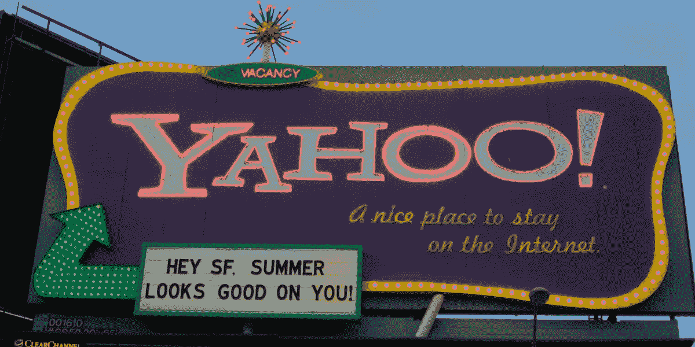
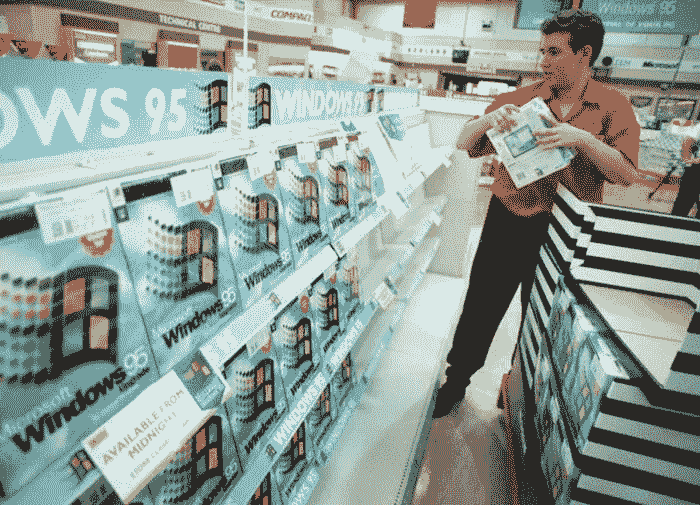
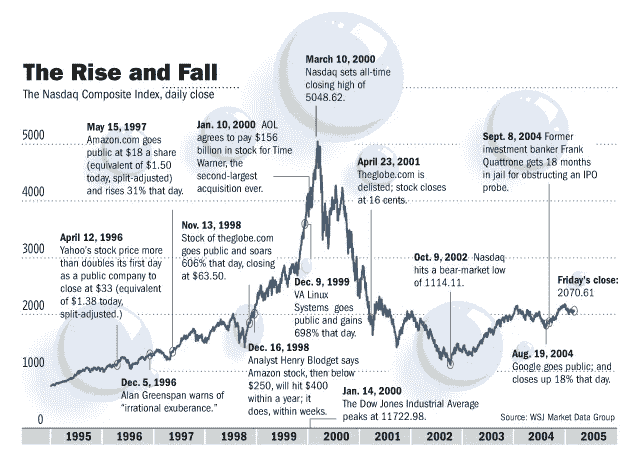
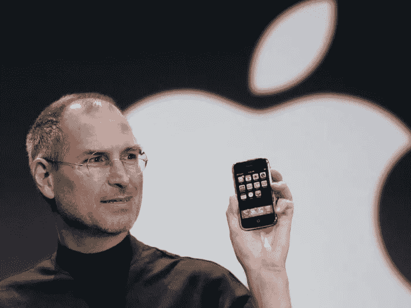
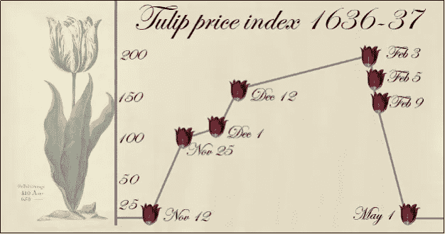

# 网络泡沫

> 原文：<https://medium.datadriveninvestor.com/the-dotcom-bubble-d33d429addcc?source=collection_archive---------1----------------------->

## 或许泡沫出现的频率与投资者的记忆广度相吻合。

The iconic San Francisco motel-themed billboards of Yahoo. Sourced from VentureBeat.

当互联网泡沫产生时，我只有 5 岁左右，虽然互联网泡沫发生在最近，足以让大多数人记忆犹新，而不是出现在尘封的历史书上，但在科技时代，20 年是一个千年。看看那个广告牌，简直是老古董了！互联网泡沫凸显了贪婪、过度承诺和无知的陷阱。对于创新和经济增长之间错综复杂的关系，这也是一个有趣的案例研究。

网络公司之所以被称为网络公司，是因为许多网络公司仅仅由一个网站组成。它们是在线平台，可以方便从银行业务到流媒体内容再到购买宠物用品的所有事情。这是信息时代的黎明——建立在信息技术基础上的经济。互联网将变得像铁路和电力一样具有革命性，将人们更紧密地联系在一起，并为新的服务和市场提供动力。

[A worker packs the shelves of the computer shop, on Wednesday August 23, 1995, with copies of the Microsoft Windows 95, which included the first version of the Internet Explorer browser — most people’s first experience with the web.](https://www.businessinsider.com/history-of-the-dot-com-bubble-in-photos-2016-2?IR=T#the-dot-com-boom-kicked-off-in-the-late-90s-as-more-people-got-the-internet-in-their-homes-and-the-microsoft-windows-95-plus-pack-included-the-first-version-of-the-internet-explorer-browser--most-peoples-first-experience-with-the-web-1) Sourced from Business Insider.

# 那么，互联网泡沫之前是什么？

许多因素:

*   万维网是由蒂姆·伯纳斯·李爵士在 1989 年创建的，他想创建一个全球互联的平台，让任何地方的任何人都可以分享信息。这开启了全球化时代。
*   家用电脑成为主流——在 1984 年到 2000 年间，美国拥有个人电脑的家庭比例从 8.2%上升到 51%。
*   [第一款网络浏览器 Mosaic 于 1993 年推出。Mosaic 在普及万维网和互联网方面发挥了重要作用。](https://en.wikipedia.org/wiki/Mosaic_(web_browser))
*   1995 年，微软 Windows 95 开始销售，其中包括第一版的 ie 浏览器(另一个[活化石](https://en.wikipedia.org/wiki/Living_fossil))。
*   从 1991 年到 1995 年，上传的新网站数量从 1 个增加到 23，500 个。在接下来的 5 年里，即 1996 年至 2000 年，上传的网站数量进一步增长了 72，611%。
*   [从 1990 年到 2000 年，全球互联网流量每年都翻一番以上，此后其同比增长开始略有放缓。](https://en.wikipedia.org/wiki/Internet_traffic)

一幅不是以线性速度增长的画面开始形成。今天，互联网无处不在，我们无法想象没有它的生活。

> 1999 年，通用电气董事长杰克·f·韦尔奇被引述说，互联网“是自工业革命以来美国经济中最重要的事件。”

当时，互联网是一个非常新的事物，人们正在努力发掘它的潜力。人们对互联网的商品化和监管感到焦虑，还有对[千年虫](https://en.wikipedia.org/wiki/Year_2000_problem)的恐惧——计算机会把 2000 年误读为 1900 年，这将导致关键的计算机系统崩溃。但是互联网即将彻底改变我们的购物、社交、学习、旅行等等。

[Everyone assumed that Y2K would be the end of civilization, but when Jan. 1 rolled around nothing happened. Most technology companies invested heavily in upgrading their infrastructure to handle dates with 2000.](https://www.britannica.com/technology/Y2K-bug) Sourced from Reuters

# 像 1999 年那样的派对

尽管非常真实，并开辟了过多的新商机，但互联网——结合自由市场经济、低利率和大量投机——导致了网络公司的狂野西部时代。它创造了一个过度热情的投资者群体，似乎一夜之间不再关心商业计划和债务堆积等事情。也是互联网使得直接在网上购买股票成为可能，这使得大量缺乏经验、不太老练的投资者(愿意购买估值过高的股票)加入了投资者的行列。

【1995 年至 2000 年间，风险投资公司的数量也增长了 90%。用于启动资金投资的资金比以往任何时候都多。同期，439 家网络公司上市，筹集了 340 亿美元的资金。

> 1994 年创立 Progressive Networks 的罗布·格拉泽(Rob Glaser)说，“在 1995 年和 1996 年，如果你说你在做一个互联网烤面包机，我敢肯定你能找到一个风险投资家来资助它。”

每一个科技创业公司(亲切地与。com)似乎是一只独角兽——下一个大事件——在这只独角兽的 IPO 中，每个人都有 FOMO。许多网络公司都是跟风者，没有什么原创想法，没有什么商业计划，只有很多大话。[一些公司将高达 90%的预算用于广告宣传，以让他们的品牌“脱颖而出”。](https://news.gcase.org/2011/05/31/what-caused-the-internet-bubble-of-1999/)

除了净运营损失，他们还向普通人才支付了过高的薪酬，举办了盛大的派对。他们还免费或打折提供他们的产品/服务，希望能够创造忠诚的客户，并在未来向他们收取利润。目标是“快速做大”——[尽早发现利基市场，尽快获得市场份额，将所有竞争对手拒之门外。](https://www.nytimes.com/2008/11/23/business/23proto.html)

Sourced from [https://news.gcase.org/2011/05/31/what-caused-the-internet-bubble-of-1999/](https://news.gcase.org/2011/05/31/what-caused-the-internet-bubble-of-1999/)

# 堕落

一开始，投资者愿意原谅网络公司在忙于开发知识产权和扩大市场份额时出现亏损。但在经历了几年的亏损后，投资者开始紧张起来。许多人通过暴涨的首次公开募股在一夜之间成为纸面上的百万富翁，但我们都应该知道——*股价不等于公允价值，也不等于公司业绩*。这只鹅最终肯定会产下金蛋吗？

股市泡沫在其上升过程中，往往对市场冲击非常敏感。网络泡沫也不例外——3 月 13 日，日本再次陷入衰退的消息引发了全球抛售，对估值过高的科技股造成了不成比例的影响。这一点，再加上大幅提高的利率、911 事件、包括安然和世通在内的几起会计丑闻，引发了纳斯达克综合指数长达两年的下跌，该指数主要由科技股组成。许多网络公司在耗尽现金的同时，努力获得更多的风险资本。首次公开募股和进一步的股票发行是不可能的。由于它们根本没有盈利能力，也没有现金流入，它们最终进入了清算阶段。到 2004 年，估计有 52%的网络公司破产。

互联网泡沫破裂是对互联网公司财务状况审查的加强、投资者疲劳以及认为互联网只是一种时尚的综合结果。当然，互联网并不是一时的时尚，它将很快带来一场新的第四次工业革命。

# 余波

如果泡沫破裂是灭绝级别的事件，那么像苹果、谷歌和亚马逊这样的公司就是科技生态系统的鳄鱼。大流行让它们成为各自领域的顶级掠食者，原因有几个。房地产变得更便宜，硬件变得更容易获得，市场上充斥着最近失业的有才华的软件工程师，竞争对手的消亡使他们能够迅速获得市场份额。今天，它们是世界上最有价值、最知名的品牌之一。他们各自的投资组合有些重叠，他们经常争夺市场份额和人才。后来，像脸书和网飞这样的公司也加入了他们的行列。在各自的工作场所，这些科技巨头都要求员工有极高的表现，并有收购任何潜在竞争对手的习惯。它们统称为 FAANG，截至 2020 年 1 月，它们的总市值超过 4.1 万亿美元。

尽管这些公司在今天几乎不可触及，但在当时也不能幸免。面对信心的下降，亚马逊的股价从 107 美元跌至 7 美元。谷歌一直等到互联网泡沫破灭，直到 2004 年才开始首次公开募股。在网络泡沫的巅峰时期，苹果的股价达到了近 5 美元的高点，但在 2003 年却跌破了 1 美元。

对苹果来说，互联网泡沫之后的十年最为繁荣，因为它引领了消费电子产品的创新。[苹果公司于 2001 年推出 iPod，并于 2003 年推出 iTunes 商店，用户只需花 0.99 美元就可以购买个人歌曲。](https://en.wikipedia.org/wiki/Apple_Inc.)[截至 2008 年 6 月 19 日](https://www.techradar.com/news/internet/itunes-hits-5-billion-downloads-397997)，iTunes 商店的下载量达到了 50 亿次。苹果还在 2001 年发布了苹果 Mac 电脑的主要操作系统 Mac OS X。2007 年推出了第一代 iPhone，这是一款集成了互联网功能的智能手机和 iPod 的产品。2010 年，他们推出了 iPad。

Steve Jobs introducing the first iPhone in 2007.

2000 年代初经济萎靡之后的创新是由这些顶尖公司引领的。他们对新的创业公司进行了大量投资，甚至建立了基础设施(云计算)，使较小的公司能够以更少的前期基础设施投资更快地迭代。

互联网泡沫催生了一个自大萧条之前以来美国从未出现过的创业时代。它提供了一个培养皿来测试各种互联网服务的有效性和可销售性。许多服务都走在了时代的前面，比如网上送餐和网上服装店。不幸的是，这些服务的消费者基础、技术和基础设施都没有准备好。

如今，投资者对科技公司的首次公开募股审查越来越严格——普遍的看法是，在科技公司实现盈利之前，不要让它上市。WeWork、优步、Lyft——所有这些公司都是在显示盈利能力之前上市的。他们在公共广场上被鞭打——当然是象征性的——他们的股价在各自的 IPO 当天下跌。

# 结束语

事后看来，每个人都有 20–20 的视野。但在泡沫时期，每个人似乎都对未来有这些不切实际、近乎狂热的看法。第一次有记录的投机泡沫可以追溯到 1636-1637 年，名为[郁金香狂热](https://en.wikipedia.org/wiki/Tulip_mania)。在狂热的顶峰时期，[灯泡卖到了大约 10，000 荷兰盾——相当于阿姆斯特丹大运河](https://www.investopedia.com/terms/d/dutch_tulip_bulb_market_bubble.asp)上一座大厦的价值。投资者认为，总会有一个买家愿意以高于他们进入点的价格购买灯泡。郁金香球茎的感知价值与其内在价值脱节，这注定要进行一次修正。

在研究互联网泡沫时，我注意到它与今天的市场投机和互联网泡沫有许多相似之处。允许投资者零佣金购买零股的交易应用程序将大量年轻、缺乏经验的投资者引入了市场，这与股市记忆中一些最奇怪的事件不谋而合。历史在重演吗？或许泡沫出现的频率与投资者的记忆广度相吻合。

我很想听到你的反馈。请随时给我发电子邮件，地址是[jeanne.e.daniel@gmail.com](mailto:jeanne.e.daniel@gmail.com)。