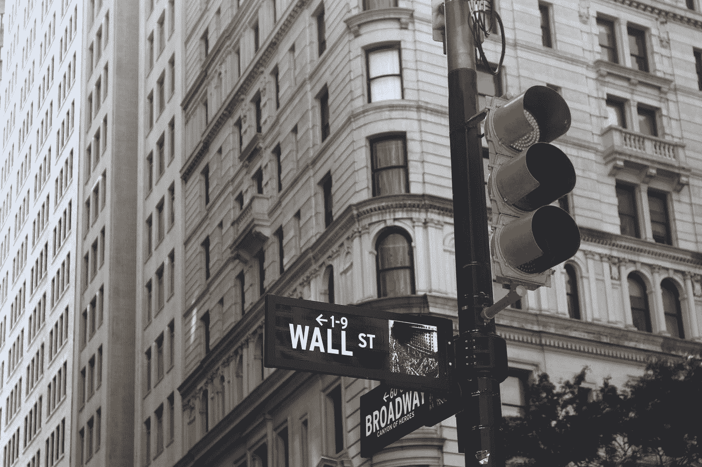

# 熊市中期的反弹提供了一个双刃剑的机会

> 原文：<https://medium.datadriveninvestor.com/the-double-edged-opportunity-of-a-mid-bear-rally-874b2834d87a?source=collection_archive---------8----------------------->

## 在 1933 年以来最大的三天反弹之后…

## 熊市已经结束了吗？

Photo by [Roberto Júnior](https://unsplash.com/@juniorwebd?utm_source=medium&utm_medium=referral) on [Unsplash](https://unsplash.com?utm_source=medium&utm_medium=referral)

像许多其他人一样被困在家里，尤其是在这个疯狂波动的股票市场，我发现自己对标准普尔 500 的波动给予了过多的关注。

套用荷马·辛普森的话，你“像那句话吗？”

# **股市发生了什么**

直到 2020 年 2 月 19 日，我们看到了多年的牛市。

从 2009 年 3 月 9 日到 2020 年 2 月 19 日，标准普尔 500 总回报率上涨了 529%！这相当于 18.3%的年化回报率，几乎是美国股市长期平均回报率的两倍！

然后底部掉了出来。

到 2020 年 3 月 23 日，在不到 5 周的时间里，标准普尔 500 总回报率下跌了 33.8%！

 [## 如何在熊市中生存下来而不失去理智或你的衬衫

### 即使你没有投资股票市场，这也会影响你…

medium.com](https://medium.com/makingofamillionaire/surviving-the-bear-market-without-losing-your-mind-or-your-shirt-93c1cbc2ea6c) 

如果你对这种近乎自由落体的结果没有感到恶心，当标准普尔 500 总回报率在过去一周内飙升 14.4%时，我不会责怪你声称受到了鞭打，其中包括[在短短三天内上涨 18%，这是自 1933 年以来的最快涨幅](https://www.marketwatch.com/story/why-this-wild-coronavirus-rally-has-wall-street-experts-fearing-a-bull-market-trap-2020-03-27)！

在这三天里，道琼斯工业平均指数(DJIA)上涨了 21%，正式进入牛市！距离最近的低点不到五周，这是历史上最短的熊市！

感觉头晕了吗？

# **熊市真的结束了吗？**

短期来看，股市是不可预测的。

这是恐惧和贪婪、希望和担忧的动态混合，唯一不变的是不确定性。

虽然我们人类喜欢看到无处不在的模式和因果关系，但当没有任何模式和因果关系时，我们只会在自己的脑海中制造它们。

 [## 危机？风投适应的 3 种方式|数据驱动的投资者

### 当我写这篇文章的时候，一场全球性的危机正在发生。这不是第一次，也不会是最后一次。很多事情已经…

www.datadriveninvestor.com](https://www.datadriveninvestor.com/2020/03/22/crisis-3-ways-vcs-adapt/) 

因此，这个问题的简短答案是，“熊市真的结束了吗？”可能是，但也可能不是。

> 熊市真的结束了吗？也许是，但很可能不是。

我们还没有看到不确定性的几个关键驱动因素:

*   美国疫情的最高峰。
*   对抗新冠肺炎的有效疗法和疫苗。
*   政府实施史无前例的 2 万亿美元经济刺激计划的效果如何。
*   刺激计划如何有效地防止萧条。
*   美国经济重启的速度。

由于市场讨厌不确定性，所有这些悬而未决的问题就像一堆“达摩克利斯之剑”一样悬在我们头上，可能会推动市场大幅低于本周结束时的水平，甚至可能低于 3 月 23 日的低点。

即使较 2 月 19 日的高点下跌 50%，较 3 月 23 日的低点再跌 24.5%，或较 3 月 27 日的收盘价再跌 33.5%，也不会是史无前例的。

 [## 如何应对市场崩盘？

### 我是这样做的…

medium.com](https://medium.com/makingofamillionaire/what-to-do-in-response-to-the-market-crash-33cc1794fca0) 

# **熊市中期反弹的双重机遇**

首先，如果你现在不需要任何现金，而且离退休还有很多年，那么现在卖出只会锁定目前为止的账面损失。熬过熊市，直到市场复苏，这可能会让你最终的退休生活更加舒适。

事实上，如果你有多余的现金流和勇气，你完全可以考虑增加你在 401(k)计划、个人退休账户或其他退休账户上的投资。市场很可能会进一步下跌，但跌幅将小于 2 月 19 日的峰值。然后，当它恢复时，你将会有很大的改变。

> 如果你有多余的现金流和勇气，你可以考虑增加你在 401(k)计划、个人退休账户或其他退休账户的投资。

熊市中期反弹(或任何其他中期高点)的另一个机会是，如果你知道你很快就会需要比你的应急基金更多的现金(你有应急基金，对吗？)，现在卖出一些投资会比一周前卖出或者当市场进一步下跌时被迫卖出的损失更低。

> 如果你很快就需要比应急基金更多的现金，现在卖出一些投资会比一周前卖出或者当市场进一步下跌时被迫卖出的损失更低。

# **底线**

没有人能可靠地把握市场时机。如果你不是专业投资者，如果你试图选择时机，你很可能会损失更多的钱。

从长远来看，最成功的策略一直是，而且很可能会继续是，尽可能长时间地在市场上投入尽可能多的资金，但只投入几年内都不需要的资金。

再加上足够的多样化，平均成本，定期再平衡，并考虑到你的税收情况，你会比几乎所有人做得更好。

 [## 一个简单的投资方法，17 年来(还在继续)击败了标准普尔 500

### 只需要一点知识和晨星…

medium.com](https://medium.com/makingofamillionaire/a-simple-investing-method-that-beat-the-s-p-500-for-17-years-and-counting-ed1c99803370) 

# 放弃

*本文仅供参考，不应视为财务建议。在做出任何重大财务决定之前，你应该咨询财务专家。*

# 关于作者

Opher Ganel 已经建立了几个成功的小企业，包括支持 NASA 和政府承包商的咨询公司。他最近的冒险是为独立专业人士提供的[金融策略服务](https://www.opherganel.com/)。你可以在那里与他联系，或者关注他的媒体出版物[金融战略](https://medium.com/financial-strategy)。