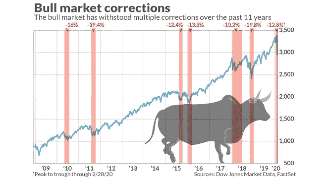
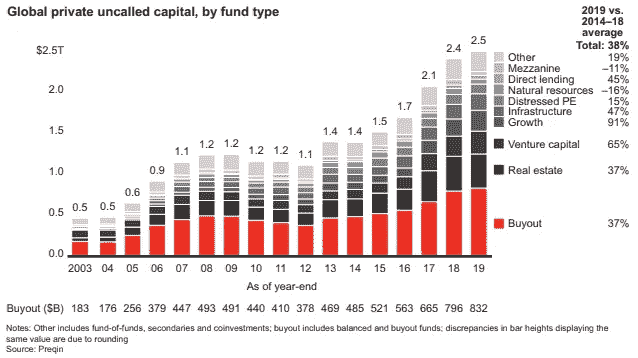
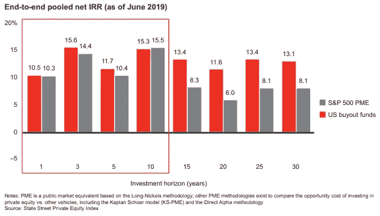
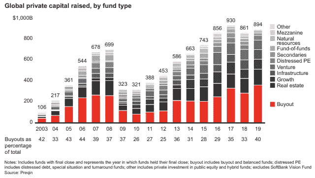
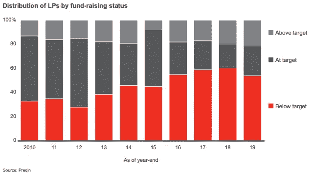

# 干粉支撑:6 分钟私募股权的状态

> 原文：<https://medium.datadriveninvestor.com/the-dry-powder-prop-up-the-state-of-private-equity-in-6-minutes-5709e43e3a06?source=collection_archive---------10----------------------->

*   **私募股权基金已经预见到了这次低迷的到来，并储存了创纪录数量的干粉**
*   **尽管我们已经看到了公开市场的高波动性，但私人市场对降价反应缓慢，并出现亏损**
*   **私人估值的主观性将因注入投资组合公司的干粉数量而加剧，这些公司希望度过低迷期，而不必减持其投资组合**
*   **私募股权基金能够经受住新冠肺炎的低迷吗？私募股权行业将在什么时候面临投资组合干粉支撑的清算？**

*我们不知道怎么做，也不知道(确切的)时间，但我们知道它会到来，大多数投资者都做好了准备。我指的是许多人认为的 2009 年至 2020 年牛市的结束。*

**

*根据贝恩公司(Bain & Company)2020 年全球私募股权投资报告，随着投资者为经济低迷做好准备，2019 年底，所有私募股权类别储存了 2.5 万亿美元的干粉。*

**

*然后，新冠肺炎在 2020 年初来袭，公开市场的表现完全符合预期(也可能不是，但这与公开市场无关)。*

*由于私募市场所遵循的季度报告的性质，私募市场通常会在报告的市场表现方面有一个季度的滞后。因此，私募股权行业等着看私募股权投资组合会发生什么。更有意思的是:*

*私募股权行业很少出现减记。*

*这方面的一个完美例子是 3 月份(2020 年)硅谷投资组合筹资数据与 4 月份的对比。下面是一篇文章的链接，其中包含来自 Fenwick and West 研究的数据以及总结:*

* [## 一份新的硅谷风险投资报告令人震惊——因为疫情影响甚微…

### Fenwick & West 律师事务所公布了一些新数据，以突显新冠肺炎对风险领域的影响…

techcrunch.comU](https://techcrunch.com/2020/06/15/a-new-silicon-valley-venture-report-shocks-because-of-how-little-the-pandemic-has-impacted-dealmaking/?utm_medium=TCnewsletter&tpcc=TCstartupsnewsletter) 

*   硅谷的“上升周期”占整体的百分比(3 月→4 月):72% →70%
*   “下一轮”:16% →12%
*   “平圆”:13% →18%
*   SV 中的启动投资数量:54 → 64(平均每月 65。2019 年)

硅谷筹集的大部分资金仍处于“上升期”，这意味着公司的估值仍在上升。为什么这种情况会发生在一个明显存在保护顶线斗争的时期？别忘了 PE 行业积攒的那些干粉。

过去一个月，融资规模增长最快的领域是平轮融资，较上月增长了 5%。由于基金向投资组合中的公司提供资本，它们不想以较低的估值为它们提供资金，也不想接受折价，但它们仍希望注入资本。现在接受降价将向投资者发出对未来的负面看法，大多数私募股权公司乐观地认为新冠肺炎只是暂时的挫折。不幸的是，当他们维持估值时，并不能告诉我们公司的实际价值以及新冠肺炎的后续影响。这种“平轮”趋势可能会继续，因为基金支持他们的投资组合，但不愿降价。

# *当心:我的观点*

如果你已经在这篇文章中写到这里了，希望你不会介意我表达一些我的观点。

*这种情况能持续多久？*

简而言之:2.5 万亿美元的干粉和投资者试图给他们的投资组合一个足够长的跑道平静的水域已经很长时间了。

更长的回答:我接触过的大多数私募股权公司都说，他们的投资组合公司在疫情期间有 18 到 24 个月的时间。这些私募股权公司大多是第一季度基金，有着良好的业绩记录，至少经历过一次低迷。基于这一上四分位数的样本规模，我会说大多数私募股权公司的情况可能比这些公司更糟糕，因此 8-10 个月可能是大规模减记真正开始影响行业的现实时间表。这当然是在情况没有改善的情况下。

*私募股权公司能经受住新冠肺炎和市场低迷的影响吗，或者他们只是延缓了私募股权市场不可避免的低迷？*

简而言之:我认为大多数第一季度基金都准备好度过新冠肺炎疫情和随后的低迷，但我认为，由于投资组合估值的主观性，私募股权基金经理将面临清算。

长回答:我感觉目前市场在享受一种虚假的安全感。公开市场上的大盘股反弹势头良好，这让投资者认为最糟糕的时期已经过去。我们真的认为市场已经以可持续的方式反弹了吗？让我们不要忘记，许多州目前正在辩论另一个锁定，并可能后悔急于重新开放。也就是说，我不认为疫情和低迷已经过去，我认为额外的恐惧将打击市场。跑道不到 1 年的投资组合公司将受到沉重打击，但许多准备超过 1 年的经理将度过难关。

私有市场的现状？

私人股本正处于一个奇怪的境地。市场上有很多干粉，经理们已经看到了下跌的到来，并在早期阶段感觉良好，该行业正在看到比以往任何时候都更多的资本投入其中。干粉部分在这篇文章里受到了重创，有准备的管理者也自圆其说，那就说说钱被甩进私募吧。

私募股权投资在长期持有期间获得了巨大回报，但在短期内也接近公开市场。总的来说，这是相当令人印象深刻的，因为公共市场在过去 10 年里一直在运行。

凭借这些巨大的回报，我们看到了惊人数量的资本涌入私募股权投资，去年(2019 年)在所有私募股权投资领域聚集了 8940 亿美元。

这一趋势几乎没有放缓的迹象，大多数有限合伙人声称，他们在私人股本中的配置仍然不足。

***结论:*** 超常回报开始成为 PE 的预期。几乎可以说，对公开市场流动性的权衡，会自动让你的回报翻倍。最终，所有美好的事情都要结束。经风险调整后的超额回报一直非常出色，但在什么情况下，基金经理会开始放松对投资组合的估值，认为他们会扭转局面，因为历史上他们一直都是这样做的？私募股权基金及其目前使用的体系将面临清算。经理们将不得不对他们现有投资组合的估值提高警惕，否则我们可能会走向私募股权泡沫。我们已经到了吗？*