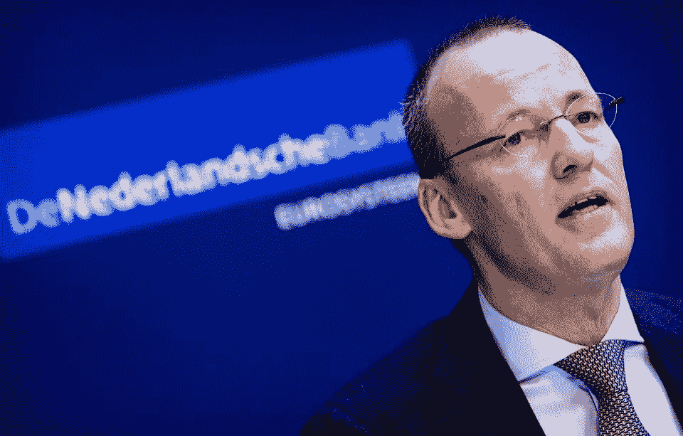

# 荷兰中央银行宣布，数字技术将是其 2020 年监管方法的更高优先级

> 原文：<https://medium.datadriveninvestor.com/the-dutch-central-bank-announces-digital-technologies-will-be-a-higher-priority-for-its-2020-289dca206d78?source=collection_archive---------19----------------------->

Koen Van Weel/AFP via Getty Images

1 月 22 日，荷兰央行(DNB)宣布数据和数字技术的使用将成为 2020 年的监管重点。DNB 在国家金融机构中一直直言不讳地支持结算和支付系统的技术创新，包括区块链和加密论坛。DNB 还发布了 2020 年年度*监管展望*，详细解释了他们的优先事项。2020 年报告中针对区块链行业的一个关键亮点是，DNB 将开始使用 AMLD5(新的欧盟反洗钱指令)来监控加密企业。

DNB 报告中解释的监管指南“强调打击金融和经济犯罪继续在我们的监管中发挥关键作用。诚信是金融领域获得信任的重要前提，社会的目光都集中在我们打击洗钱的努力上。”AMLD5 规则于 2020 年 1 月 10 日生效。了解你的客户(KYC)合规成本预计将大幅增加。在荷兰运营的所有虚拟货币和区块链风格的公司必须向 DNB 注册。

英国退出欧盟的影响可能会让总部设在欧盟的密码公司的事情变得复杂。DNB 主席 Klaas Knot 在 1 月 8 日的 SUERF 会议上的开场白中说，“海峡两岸的央行和监管者将继续在 IMF、FSB、BIS 和其他标准制定机构中协调我们的努力。”虽然 SUERF 会议侧重于英国和欧盟之间的经济关系，但合作需要扩展到加密监管标准，如 KYC，以促进跨司法管辖区的合规性。

对于实施 AMLD5 KYC 变化的欧洲加密公司来说，潜在的两大挑战是:识别持有人的银行账户和加密钱包，以及虚拟货币提供商名单的扩大。

DNB 还在 1 月 22 日的另一份公告中表示，“在这个高度动态的环境中，机构必须将数据的安全性、治理、最佳使用和质量放在首位。”DNB 强调，对市场的信任取决于对个人数据的谨慎使用。DNB 还认为，尽管加密货币像比特币一样具有投资风险，并且不受央行支持，但它们认识到区块链和分布式账本技术有助于更便宜、更高效的跨境支付的机会。

在 Twitter 或 Linkedin 上关注我。在这里查看我的其他作品。

我报告了银行和企业公开采用加密货币、抵押代币和稳定硬币的情况。我的报道包括区块链和分布式分类帐

…阅读更多内容

*最初发表于*[*【https://www.forbes.com】*](https://www.forbes.com/sites/robertanzalone/2020/01/24/the-dutch-central-bank-announces--digital-technologies-will-be-a-higher-priority-for-its-2020-supervisory-approach/)*。*