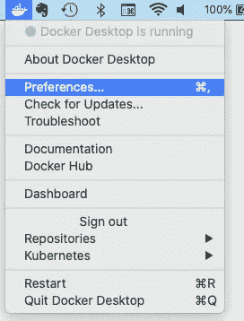
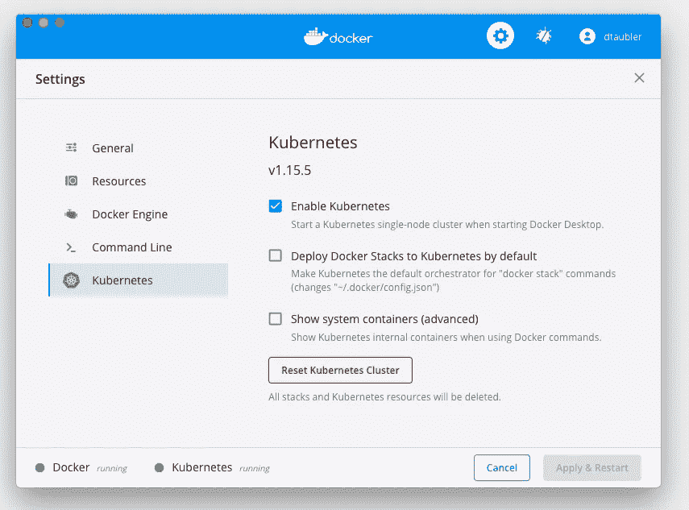
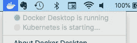
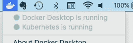

# 自己尝试 Kubernetes 最简单最便宜的方法

> 原文：<https://medium.datadriveninvestor.com/the-easiest-and-cheapest-way-to-try-kubernetes-for-yourself-d7367ff1d6e?source=collection_archive---------2----------------------->

## 通过使用 Docker Desktop 的 Kubernetes 集群，您可以节省一些资金，并保持理智。


Photo by [Kaitlyn Baker](https://unsplash.com/@kaitlynbaker?utm_source=medium&utm_medium=referral) on [Unsplash](https://unsplash.com?utm_source=medium&utm_medium=referral)

学习新事物的最好方法是亲自尝试。想学一门新的编程语言？下载运行时并创建几个示例应用程序。渴望尝试新的微服务框架？使用您环境的包管理器来安装二进制文件，并创建一个简单的 CRUD ReST 服务。准备好沉浸在 Docker 中了吗？下载 [Docker 桌面](https://www.docker.com/products/docker-desktop)并创建一个新的映像——可能使用您的新微服务框架！—并将其作为容器运行。

[](https://www.datadriveninvestor.com/2019/03/25/a-programmers-guide-to-creating-an-eclectic-bookshelf/) [## 创建折衷书架的程序员指南|数据驱动的投资者

### 每个开发者都应该有一个书架。他的内阁中可能的文本集合是无数的，但不是每一个集合…

www.datadriveninvestor.com](https://www.datadriveninvestor.com/2019/03/25/a-programmers-guide-to-creating-an-eclectic-bookshelf/) 

但是我们如何获得 Kubernetes 的实践经验呢？为了与 Kubernetes 交互，我们首先需要一个*集群*——一个或多个[节点](https://en.wikipedia.org/wiki/Kubernetes#Kubernetes_node)(或工作机)加上一些让 Kubernetes 工作的服务(也称为[控制平面](https://en.wikipedia.org/wiki/Kubernetes#Kubernetes_control_plane))。那么，我们实际上可以在哪里找到一个集群来玩呢？

# 访问 Kubernetes 集群的选项

有几个常见的选项:

## 我们公司的集群

我们可能为一个拥有大型运营团队的大型组织工作，该团队维护着自己的 Kubernetes 集群。如果是这样，我们可能被授权部署我们自己的图像和 Kubernetes 对象。

## 云提供商

但是我们大多数人没有那么幸运。因此，我们可能会转向主要的云提供商，每个提供商都提供自己的 Kubernetes 产品。

*   **谷歌云平台(GCP)** 。Kubernetes 脱胎于谷歌，因此[谷歌的 GCP](https://cloud.google.com/) 有强大的 Kubernetes 产品，[谷歌 Kubernetes 工程师(GKE)](https://cloud.google.com/kubernetes-engine/) 是有道理的。GCP 以开发人员友好和易于使用而闻名，而 GKE 则相对简单地在 GCP 上建立了一个集群。但是不便宜。上次我在 GCP 建立集群时，每天花费大约 3 美元，这并不是一个划算的选择。
*   **亚马逊网络服务(AWS)** 。 [AWS](http://aws.amazon.com/) 可能是目前最受欢迎的云提供商。从一开始，AWS 就提供了自己的服务和平台，先是 EC2 和 AMIs，后来是 AWS Lambda 和 ECS。然而，由于 Kubernetes 越来越受欢迎，AWS 勉强加入了这股潮流，现在提供[弹性 Kubernetes 服务(EKS)](https://aws.amazon.com/eks/) 。EKS 比 GKE 更难合作，价格也更贵(主要是因为 EKS 对控制平面收费)；我的上一个 GKE 项目每天花费我 4 美元多一点。
*   **微软 Azure** 。我从来都不是微软的粉丝，但我们不能忘记 [Azure](https://azure.microsoft.com/) 的基于 could 的 Kubernetes 产品( [Azure Kubernetes Service，或 AKS](https://azure.microsoft.com/en-us/services/kubernetes-service/) )。我从未使用过 Azure 或 AKS，但我听说过该服务的可用性很好。尽管如此，它并不比其他任何一家云提供商更便宜。

使用上面提到的云提供商之一可以帮助你开始，但是这可能是一个有点过程来设置一切。更重要的是，这是一个昂贵的选择，特别是如果你只是为了学习 Kubernetes 而建立一个集群。

## 迷你库贝

您也可以使用 [Minikube](https://kubernetes.io/docs/tutorials/hello-minikube/) 在自己的计算机上本地运行集群。Minikube 是一个工具，旨在通过在笔记本电脑或台式机上的虚拟机(VM)内运行单节点 Kubernetes 集群来简化本地运行 Kubernetes。

Minikube 将自动为您设置集群。但是首先，你必须设置 Minikube 本身。考虑到 Minikube 的依赖性，这可能是一个令人沮丧的经历。我花了一个周末与 Minikube 战斗(并输给了 mini kube)，我远远不是唯一有这种经历的工程师。Minikube 也可能喜怒无常，工作一次，然后莫名其妙地失败。尽管如此，我知道其他工程师在 Minikube 上没有重大问题，所以你的里程数会有所不同。

## 但是等等，还有一个…

然而，如果你想要一个近乎傻瓜的，基本上免费的选择，还有一个要考虑的。并且您可能已经安装了它并准备好了。因为 [Docker Desktop](https://www.docker.com/products/docker-desktop) 也附带了一个单节点 Kubernetes 集群。好消息是，如果你安装了 Docker Desktop，那么你就安装了 Kubernetes。

# 如何在 Docker 桌面中使用 Kubernetes

如果您对 Kubernetes 感兴趣，那么您可能会对部署 Docker 映像并将其作为容器运行感兴趣。这意味着你可能已经在你的电脑上安装了 Docker 桌面。但是如果你不这样做，安装是小菜一碟。只是按照 [Docker 网站](https://www.docker.com/products/docker-desktop)上的说明。

## 只需启动您的集群

随着 Docker Desktop 的安装和运行，在自己的集群上运行容器已经完成了一半。您只需点击工具栏中的 Docker 图标，并选择*首选项…* 项，即可打开 Docker Desktop 的首选项:



当首选项窗口打开时，转到 *Kubernetes* 选项卡并选择 *Enable Kubernetes* 复选框:



然后选择*应用&重启*。可能会提示您安装 Kubernetes 集群需要几分钟时间；没关系，点击*安装*按钮即可。您将在 Docker 工具栏菜单中看到您的集群正在被创建:



几分钟后，您的新集群应该准备好了！



## 使用 kubectl 来尝试一下

[*kubectl*](https://kubernetes.io/docs/reference/kubectl/overview/) 是我们用来与 Kubernetes 集群通信的工具。首先，让我们通过进入命令行并键入`kubectl version`来验证它是否已经安装。如果我们看到如下内容，那么我们就可以开始了:

```
Client Version: version.Info{Major:”1", Minor:”15", GitVersion:”v1.15.5", GitCommit:”20c265fef0741dd71a66480e35bd69f18351daea”, GitTreeState:”clean”, BuildDate:”2019–10–15T19:16:51Z”, GoVersion:”go1.12.10", Compiler:”gc”, Platform:”darwin/amd64"}Server Version: version.Info{Major:”1", Minor:”15", GitVersion:”v1.15.5", GitCommit:”20c265fef0741dd71a66480e35bd69f18351daea”, GitTreeState:”clean”, BuildDate:”2019–10–15T19:07:57Z”, GoVersion:”go1.12.10", Compiler:”gc”, Platform:”linux/amd64"}
```

如果不是，没问题！只需前往官方 [kubectl 安装页面](https://kubernetes.io/docs/tasks/tools/install-kubectl/)获取最新版本。(注意，如果你需要了解 Docker 桌面安装的是 Kubernetes 服务器的哪个版本，只需进入 Docker 桌面菜单，选择*关于 Docker 桌面*)。

现在让我们使用 *kubectl* 来部署一个示例 pod。首先，我们将创建一个 Pod 定义文件(称之为`nginx-pod.yaml`，如下所示，它部署了 [nginx](https://www.nginx.com/) 服务器:

```
apiVersion: v1
kind: Pod
metadata:
  name: nginx-server
  labels:
    app: nginx-server
spec:
  containers:
  - name: nginx 
    image: nginx:1.7.9
    ports:
    - containerPort: 80
```

为了部署它，我们将简单地`run kubectl create -f nginx-pod.yaml`我们的吊舱应该被部署。我们可以通过运行`kubectl get pod`来验证这一点；我们应该看到如下内容:

```
NAME           READY   STATUS    RESTARTS   AGEnginx-server   1/1     Running   0          3s
```

当我们完成后，我们可以通过`kubectl delete -f nginx-pod.yaml`旋转我们的吊舱。

至此，我们已经轻松地建立了自己的 Kubernetes 集群。而且对我们来说没有额外的成本(节省了运行本地集群可能需要的额外电力)。我们已经准备好学习 Kubernetes 并尽情地使用它！

觉得这个故事有用？想多读点？只需[在此订阅](https://dt-23597.medium.com/subscribe)即可将我的最新故事直接发送到您的收件箱。

你也可以支持我和我的写作——并获得无限数量的故事——通过[今天成为媒体会员](https://dt-23597.medium.com/membership)。