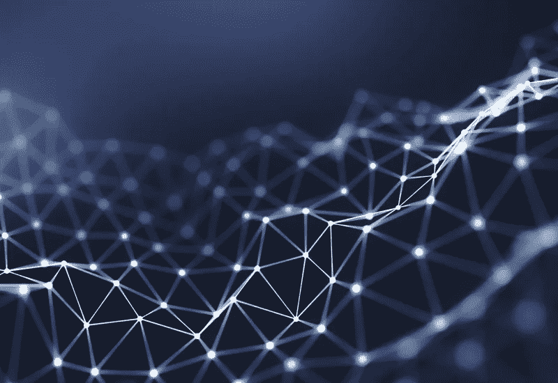
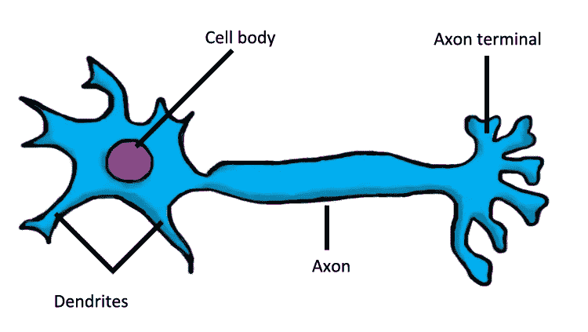
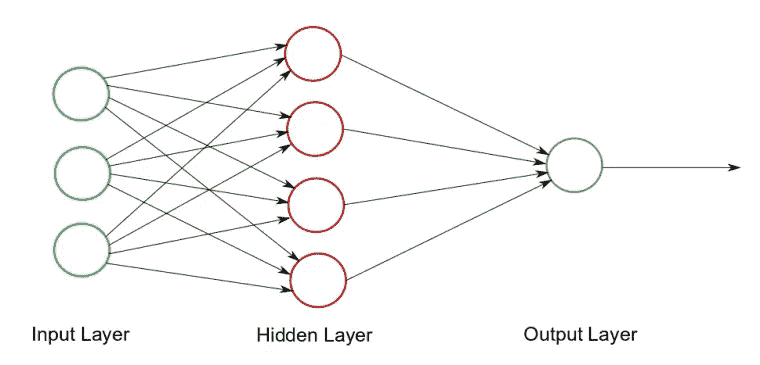
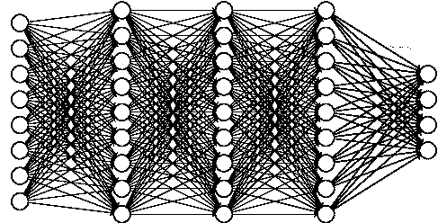

# 神经网络最简单直观的解释

> 原文：<https://medium.datadriveninvestor.com/the-easiest-and-most-intuitive-explanation-of-neural-networks-53162e5ce104?source=collection_archive---------14----------------------->

你会用一个**人工大脑**做什么？做作业？战胜股市？接管世界？可能性是无限的。如果我告诉你，人类已经造出了人造大脑，会怎么样？

事实上，**我们有！** —嗯，有点。它不像我们的大脑那么复杂，但它们是**极其强大的工具，有能力改变世界。它们被称为神经网络。**

# 什么是神经网络？

神经网络(或简称 NN)是一组连接的节点**能够**接收信息，处理信息，然后产生输出**。**

神经网络的一个例子是我们的大脑！它由许许多多**相连的生物神经元**组成，**接收信息**(屏幕上的文字)，**处理**，然后**产生输出**(理解文字并存储信息)。

## 生物神经网络:

[Simplified Diagram of a Biological Neuron](https://www.brainfacts.org/for-educators/for-the-classroom/2018/squishy-neurons-activity-111918)

**理解生物神经元如何工作是** **对** **人工神经元直观理解的关键。首先让我们看一下生物神经元的物理部分，稍后将与人工神经元的部分进行比较。**

生物神经元的组成部分:

*   **树突** : **接收来自其他神经元的输入**
*   **细胞体** : **结合树突收集的所有信息**，并进行一些**计算**。它可以发送信号(根据强度不同而不同)或不发送信号，这取决于计算
*   **轴突**:接受细胞体的计算，**传递信号**
*   **轴突末梢** : **向其他神经元发出信号**

注意:在继续之前，绝对有必要熟悉 ML 和深度学习的关键定义，以便获得 ANN 背后的直观感受。关于这些关键定义，请阅读我的短文。

 [## 人类的未来是基因工程和神经移植|数据驱动投资者

### 领先的技术、音乐和电影节将于 2020 年 3 月 13 日至 22 日举行。它将以前沿的谈话为特色…

www.datadriveninvestor.com](https://www.datadriveninvestor.com/2020/01/13/the-future-of-humanity-is-genetic-engineering-and-neural-implants/) 

## 人工神经网络:

现在进入文章的主题:**人工神经网络**！**ANN’s 不像我们的大脑[那样是物理 NN 的](https://en.wikipedia.org/wiki/Physical_neural_network#:~:text=A%20physical%20neural%20network%20is,function%20of%20a%20neural%20synapse.)**，但它们可以是！)，它们其实只是运行在电脑上的软件！

让我们先看看人工神经网络的组成部分，然后深入了解它们是如何相互作用的。

[A Simple Neural Network](https://www.kdnuggets.com/2017/10/neural-network-foundations-explained-gradient-descent.html)

神经网络的组成部分:

*   **节点** : **接收前一个节点的输入**，进行一些**计算，**和**输出**它。节点类似于生物神经网络中的细胞体、树突和轴突终末
*   **突触** : **将一个节点输出的信号**传递到下一个节点的输入。就像生物神经网络中的轴突
*   **输入层** : **其中输入数据**(数字形式)被**插入**
*   **隐藏层**:即**不是输入或输出的层**(奖励:如果你有超过 1 层，你的神经网络从简单神经网络升级到深层神经网络)
*   **输出层**:NN 最终输出**的层**

# **神经网络是如何工作的？**

神经网络的实际工作原理:

1.  首先会有一些**输入数据**，我们将**将这些数据**放入**输入层**。输入数据是数字的**形式**
2.  这将是通过突触发送的**。当来自前一个节点的数据通过 synapse 发送时，它将被**乘以参数并加上一个偏差**。这个**放大或衰减信号****
3.  该信号将被输入到下一个节点，该节点连同所有的和其他**信号将被加在一起**，然后传递到突触
4.  **重复**的“计算+发送”步骤
5.  **最终输出将是一些数字**，我们可以将其解释为我们的结果

**这 5 个步骤** (+稍后解释的另一个步骤)正是我们的大脑处理信息所经历的**相同的步骤**！安的大脑是模仿我们的大脑的！

[A bit more complex NN](https://math.stackexchange.com/questions/2048722/a-name-for-layered-directed-graph-as-in-a-fully-connected-neural-network)

上面的图像看起来有点复杂，层中有许多节点，有大量的突触连接它们，但它仍然不能反映真实的神经网络。在现实生活中， **NN 的每一层都有数千个节点，有几十层**。虽然**的过程都是一样的**。但问题依然存在:计算机将如何计算所有这些？

## 神经网络编程:

**NN 中的一切都是数字，**是用矢量(数字列表)表示的**，矢量**会通过 [**点积**](https://www.khanacademy.org/math/linear-algebra/vectors-and-spaces/dot-cross-products/v/vector-dot-product-and-vector-length) 与**相互作用。我们这样做是因为计算机处理矢量和点积的速度快得惊人。**

让我们再来一遍这个过程，但这次是用矩阵:

1.  **输入层**将是输入数据的一个**矢量**(例如:单个图像或单个属性列表)
2.  这个向量将在**上**传递**到**下一层**中的每个单个节点**
3.  在每个**节点**中，将有一个参数的**向量，每一个都代替突触。这两个向量将彼此点积产生一个数。一个**偏差将被加到这个数字上**以产生一个输出**
4.  现在，整个层是一组输出，我们**将它们组合成一个矢量**
5.  这个**向量将沿着**传递。过程**重复**直到它到达最后一层

**注意**如何在**步骤 3 中，**我们**将我们的输入乘以某个常数**，然后**加入另一个常数**？这听起来就像 9 年级的线性函数。是的，你必须记住的那个方程， **y = mx + b** ，终于可以在现实生活中应用了！ **y** 为**输出**， **m** 为**参数**， **x** 为**输入**， **b** 为**偏置**！我们称第三步为线性层。

如果你特别注意的话，可能会突然出现一些东西:NN 中的一堆线性层可能会被**组合** **成一个层，那么** **为什么是所有这些层**？这是一个很好的观点，这将通过**键缺失步骤**—**非线性**来解决。

## **非线性功能:**

[ReLU or Rectified Linear Unit, is the most popular and simple Non-Linearity Function](https://medium.com/@danqing/a-practical-guide-to-relu-b83ca804f1f7)

通过在每个线性层之间添加非线性，我们能够将它们分开！我们所要做的就是**将**非线性函数**应用于**线性层**的所有**输出**。**

有无数的非线性函数在那里。最流行最简单的非线性叫做 **ReLU** 。坚持用那个，因为简单，快速，容易理解！

**注:**非线性功能的层称为**激活层**

等等，为什么我们要有这么多层？我就不能做吗？答案是:通用逼近定理

[**通用逼近定理**](https://en.wikipedia.org/wiki/Universal_approximation_theorem) 陈述了如果你有足够多的线性层和非线性层，你可以以任意精度逼近任意函数。换句话说， **NN 的什么都能做**(理论上**至少**)！

感谢阅读！我是 Dickson，17 岁的技术爱好者，很高兴能加速自己的步伐，影响数十亿人🌎

如果你想跟随我的旅程，你可以加入[我的每月简讯](https://bit.ly/DicksonNewsletter)，查看[我的网站](https://bit.ly/DicksonWebsite)，连接 [Linkedin](https://bit.ly/DicksonLinkedin) 或 [Twitter](https://bit.ly/DicksonTwitter) 😃

**访问专家视图—** [**订阅 DDI 英特尔**](https://datadriveninvestor.com/ddi-intel)