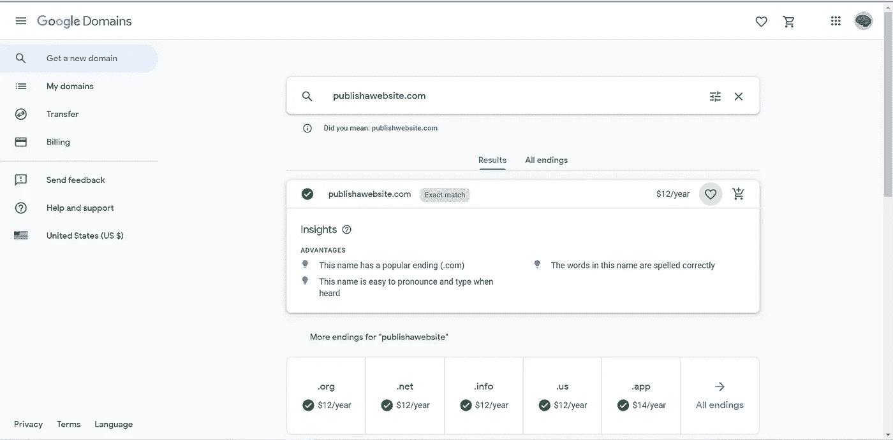
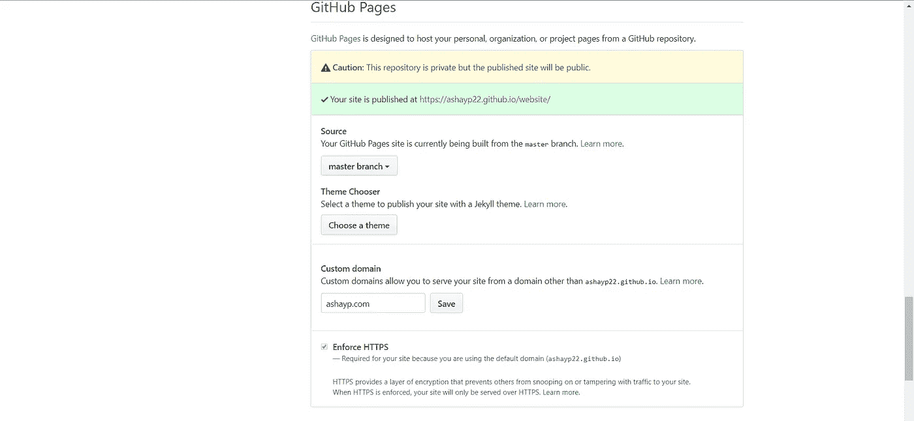
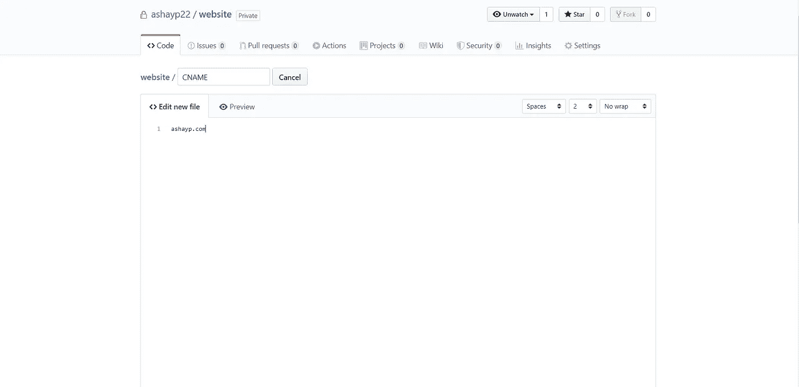
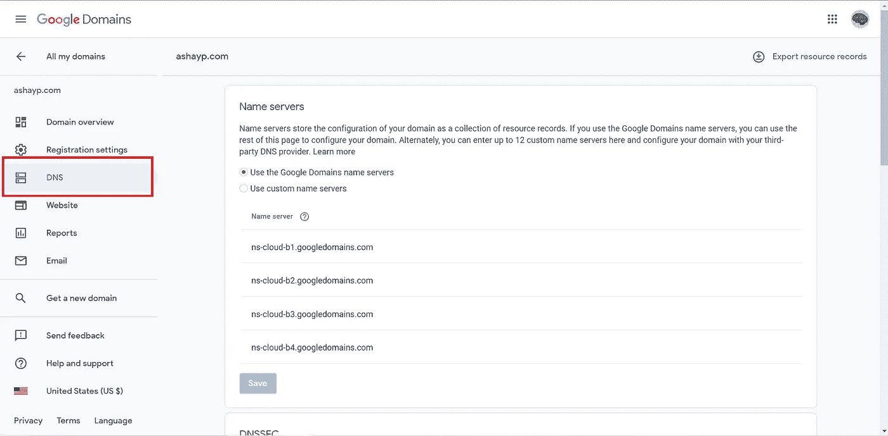

# 给你的网站起名字最简单的方法！

> 原文：<https://medium.datadriveninvestor.com/the-easiest-way-to-give-your-website-a-name-249fad2ca78a?source=collection_archive---------8----------------------->

你是否曾经想给你的网站添加一个域名，但不知道如何添加？好吧，让我告诉你…

# **简介**

你有没有创建过一个*惊艳的*网站，*用*突出的*语言 HTML 构建*，用 JavaScript 强化*用*，用 CSS3 和 Bootstrap 打磨*用*？我过去有过，但是就像你们现在一样，我也面临过一个困境:我不知道如何添加一个域名！

给你的网站添加一个域名可能看起来*吓人*，但其实不是。在这篇文章中，我将解释如何使用 **Google Domains** ，Google 的域名注册服务，为您的网站购买域名，并以**无争议**和**最低成本**链接到您的网站。

# 先决条件

您将需要以下内容:

1.  在允许域名的托管服务上发布的网站。我使用 GitHub Pages ,因为它最容易操作，尤其是静态网站。
2.  一个谷歌账户
3.  积极的态度😀

# 购买域名

获得域名是这个过程中最简单的一步。根据我的经验，我建议在购买域名时使用谷歌域名，因为这是你可以使用的最简单快捷的互联网域名注册服务之一。你所要做的就是搜索你想要的域名，然后用你的谷歌账户结账。你甚至可以根据你网站的名字获得见解和建议。

# 连接到 GitHub 页面

下一步是建立域名和你的网站之间的连接。我使用的托管服务是 GitHub Pages，这是一个很好的方法，可以让你直接从你的存储库中为任何静态网站提供服务。关于设置 GitHub 页面的更多信息可以在这里找到:

 [## GitHub 页面

### 使用你最喜欢的文本编辑器，在你的项目中添加一个 index.html 文件:Hello World I hosted with GitHub Pages…

pages.github.com](https://pages.github.com/) 

首先，导航到设置并向下滚动到 GitHub 页面标题。然后，在自定义域名输入下，输入域名并点击保存。

一旦完成了这些，您需要做的唯一的另一步就是向您的存储库中添加一个 CNAME 记录。CNAME 记录是域名系统中的一种资源记录，它将一个域名映射到另一个域名。在您的例子中，映射发生在您刚刚购买的域名和 GitHub 提供的域名之间。

为了做到这一点，选择“创建新文件”，并命名为 CNAME 没有扩展名。然后，在文档中输入域名。最后，提交新文件，您应该就完成了。

# **管理可怕的 DNS 设置**

最后一步是在谷歌域名上设置一切。导航到“我的域名”部分，找到您刚刚购买的域名。在左边寻找 DNS 头，并点击它。

确保在“域名服务器”下，你使用的是谷歌域名服务器。此外，跳过“DNSSEC”、“注册主机”和“合成记录”，找到“自定义资源记录”

除了添加另一个 CNAME 记录，您还需要添加一个 A 记录。A 记录将域名映射到承载该域的计算机的 IP 地址(IPv4)。在您的例子中，由于 GitHub Pages 是主机，您需要将域名映射到 GitHub Pages 的 IP 地址。GitHub Pages 有四个 IP 地址:

*   185.199.108.153
*   185.199.109.153
*   185.199.110.153
*   185.199.111.153

输入@作为“名称”，将“TTL(生存时间)”设置为 1H，分别输入每个 IP 地址，然后添加所有四个记录。

别忘了加上 CNAME 记录。“名字”应该是“www”，“TTL”应该是 1H，“数据”应该是你的“username.github.io .”加一个句号(。)后. io. **别忘了这部分！**

添加这两个记录后，Google Domains 可能需要几分钟到 72 小时来处理 DNS 更改。在那之后，一旦你在搜索栏中输入你的域名，你应该会被自动引导到你的网站！

# 结论

在本教程中，您学习了如何使用 Google Domains 和 GitHub 页面将域名映射到您的网站。

虽然这对你来说似乎很容易，但是将域名映射到主机服务背后的过程在不同的主机和域服务之间是没有区别的。当你处理大型网站和项目时，你今天学到的东西可能会对你有所帮助，特别是那些不是静态的，需要 Heroku、Digital Ocean、Microsoft Azure、AWS 和其他托管服务的网站和项目。因此，请确保您没有忘记这些重要信息，并不断学习如何部署您的网站供每个人使用！

感谢你把这篇文章看完！我真的很高兴找到像我一样对计算机科学充满热情的人。

确保**喜欢** / **分享**这篇文章😁，并评论你的阅读体验！