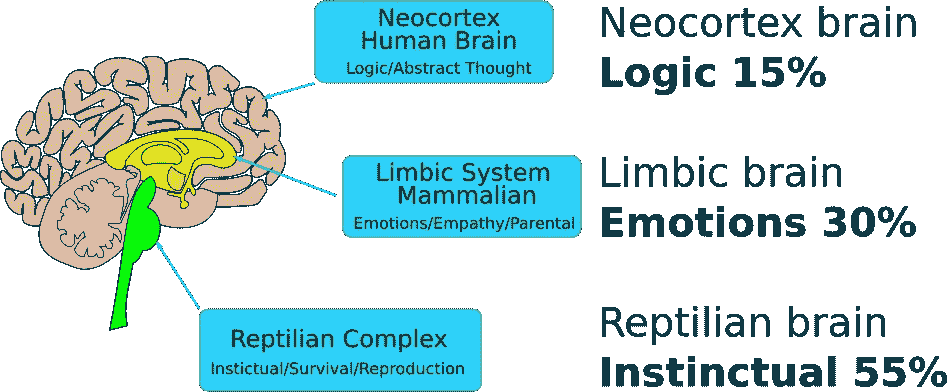
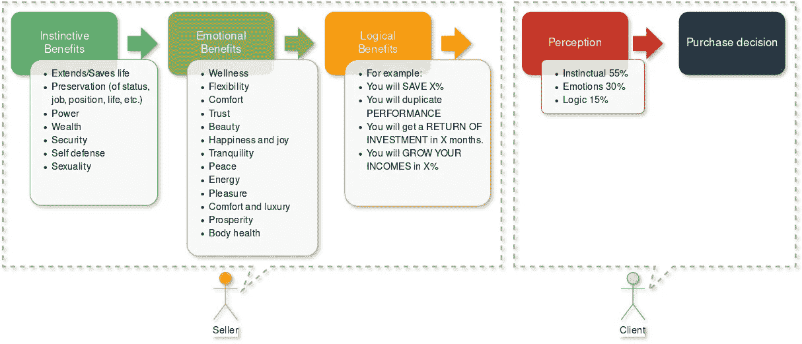

# 创造价值的简单方法

> 原文：<https://medium.datadriveninvestor.com/the-easy-way-to-create-value-4f00a0bf95ac?source=collection_archive---------12----------------------->

当客户做出购买决定时，大脑才是真正做出决定的人。

购买决策在大脑中受到不同层次的影响。众所周知，通常爬行动物的大脑会影响 55%的购买决策，然后是边缘脑 30%，最后是新大脑皮层 15%:

这张简单的图片向我们展示了一个人(通常)如何做出购买决定，以及一个人如何感知价值，因为当人们购买时，一切都受到大脑感知的影响；当然，感知需要通过真实的体验来验证，我不是说我们应该对客户撒谎。我要说的是，你必须向你的客户展示你的产品中对他们有价值的那些特性，并确保客户对你的产品的感知和你想要的一样；此外，客户应该能够通过经验来验证她/他正在感知的东西。

 [## 2020 年最佳短期投资选择精选资源|数据驱动型投资者

### 投资是增加你净财富的一个好方法。如果你通过遵循一个严格的…

www.datadriveninvestor.com](https://www.datadriveninvestor.com/2020/03/28/handpicked-resources-for-the-best-short-term-investment-options-of-2020/) 

多少次我们听说创造价值很难？嗯，如果你知道怎么做，这并不难。

首先你要问一些问题:

*   客户为什么买东西？
*   对你的客户来说，什么是有价值的/相关的/重要的事情？
*   但更重要的是，客户如何购买？

为了准确回答这些问题，你必须配置你的销售策略。在这里，关键词是“**配置**”，因为一旦你知道人类基于感知做出购买决定，那么你只需要挑选一组我们知道大脑感知为有价值的特征，你就有了它，一个针对你的产品或服务的令人敬畏的销售策略。

在这个简单的图表中，我展示了一系列大脑认为有价值的特征。大脑会自动权衡每个特征，如果大脑得出的结论是 100%正确，那么客户就会购买。

# 如何配置我的销售策略？

理想情况下，销售策略应该在你开发任何产品或服务之前确定。通过这种方式，你将知道哪些属性应该被强调，以及你应该把精力集中在哪里。

假设我想开发一个处理个人财务的应用程序。因此，对于这种产品，我应该从第一列中选择“财富”功能，从第二列中选择“繁荣”功能，最后，为了估计准确的逻辑收益，我应该做一些数学计算来定义我的客户将获得的财务收益。

现在，我的个人理财应用需要一个人生目标，一个使命，所以我们应用的使命将是:

*   我们希望你富有

这个任务很短，并且带有任何人都能理解的强有力的信息，因为它直接到达本能和情绪大脑，所以它有 85%的权重。因此，任何人听到这个应用程序的目的都会感兴趣，并会尝试了解更多关于它和它是如何工作的。同样，我的使命包含了前两个特征:“财富”和“繁荣”。

好了，现在我们要问，这个应用程序将如何完成它的使命？这个问题没有正确答案。你的答案的范围将被你的想象力和经验所限制。

*   我认为这个应用程序应该让我们配置目标，这样我们就可以衡量结果:例如，目标可以是——1)买房，2)买车，3)增加收入，等等。
*   一旦我们有了目标，我们应该能够配置当前的投入分配，也许是这样的——1)40%用于日常开支，2) 10%用于储蓄，3) 20%用于投资，4) 10%用于意外开支，5) 10%用于娱乐，6) 10%用于教堂或慈善机构。
*   应用程序应该使用智能算法计算收入分配，该算法能够评估投入量和目标的可行性，并确定最佳收入分配。
*   也许，如果应用程序可以提供低风险投资和增加收入的选项，那就好了。

这个产品只是我想到的第一件事，但是如果这个产品真的做到了它所说的，并且可以衡量，那么我们就达到了销售一个成功的产品或服务所需的 100%。

现在轮到你了，自己做配置，开发一款牛逼的产品。

**进入专家视角—** [**订阅 DDI 英特尔**](https://datadriveninvestor.com/ddi-intel)