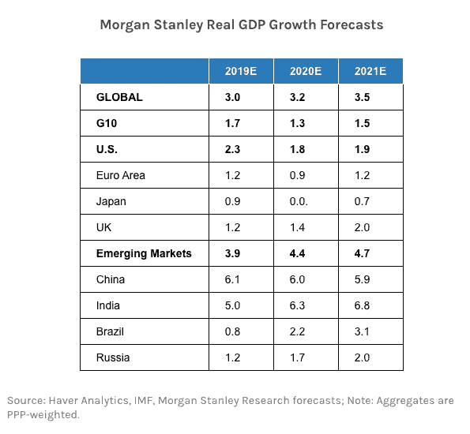
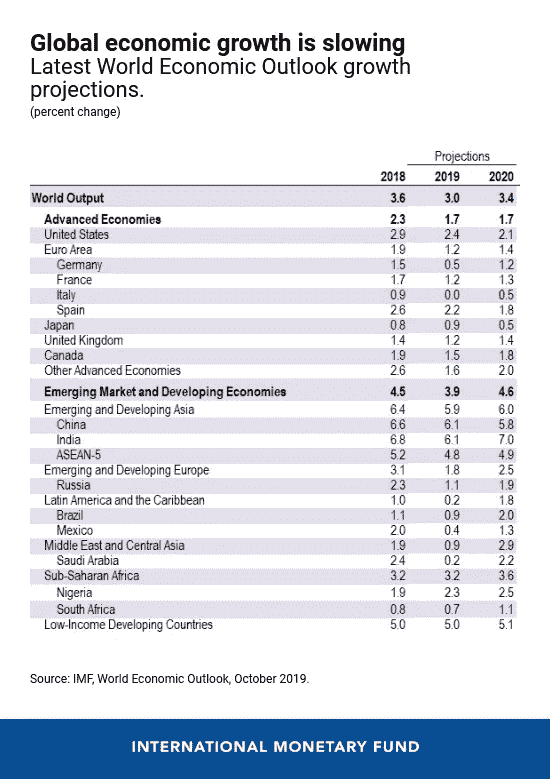
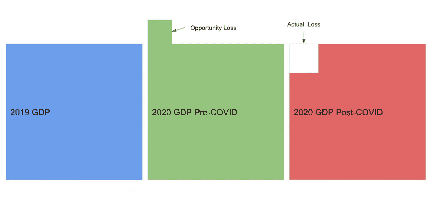
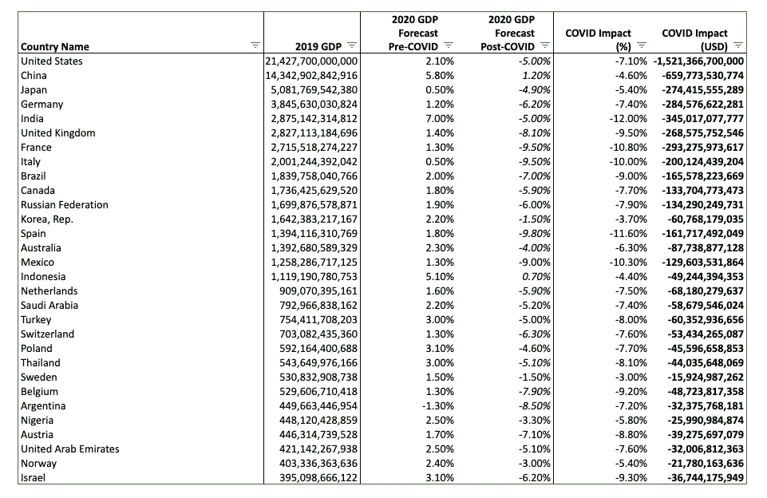
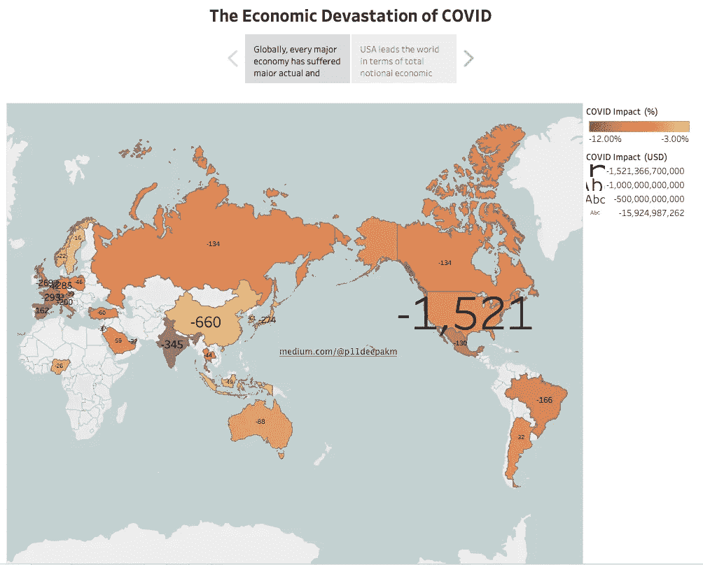
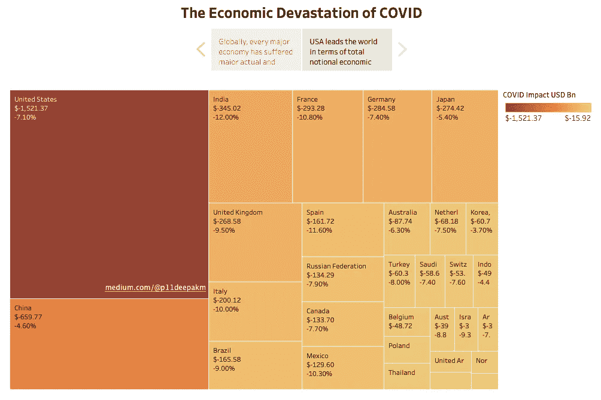

# COVID19 的经济破坏

> 原文：<https://medium.datadriveninvestor.com/the-economic-devastation-of-covid19-92596062d5ff?source=collection_archive---------4----------------------->

## 一种无形的病毒如何使世界经济陷入瘫痪

Photo by [Obi Onyeador](https://unsplash.com/@thenewmalcolm?utm_source=medium&utm_medium=referral) on [Unsplash](https://unsplash.com?utm_source=medium&utm_medium=referral)

一段时间以来，我们都知道 2020 年对世界经济来说是糟糕的一年。自从 COVID19 在全球传播以来，对 2020 年全球国内生产总值的估计已经向下修正，并将继续向下修正。

摩根士丹利(Morgan Stanley)在 2019 年 12 月预计，世界国内生产总值(GDP)将同比增长 3.2%，比 2019 年的增长率高出 0.2%。

[Morgan Stanley Forecasts](https://medium.com/r?url=https%3A%2F%2Fwww.morganstanley.com%2Fideas%2Fglobal-economic-outlook-2020)

[国际货币基金组织的预测](https://blogs.imf.org/2019/10/15/the-world-economy-synchronized-slowdown-precarious-outlook/)稍微乐观一些——3.4%的全球增长率，以印度和中国为首。

[IMF Forecasts](https://blogs.imf.org/2019/10/15/the-world-economy-synchronized-slowdown-precarious-outlook/)

但 2020 年第二季度是一个动荡的时期，国内生产总值(GDP)出现了一系列下调。

[今年 4 月，由于科维德疫情恶化，惠誉将印度经济增长预期从 4.6%下调至 1.8%。仅仅一个月后，随着印度继续抗击病毒，预测值被大幅下调至负 5%。国际货币基金组织的预测与此相似，预计 2020 年经济将收缩 4.5%。](https://economictimes.indiatimes.com/news/economy/indicators/fitch-solution-cuts-indias-fy21-gdp-growth-forecast-to-1-8/articleshow/75244834.cms?from=mdr)

 [## 对有商业头脑的投资者有用的行为经济学概念|数据驱动的投资者

### 在美国企业界，高斯统计，对我们周围世界的确定性解释，以及理性…

www.datadriveninvestor.com](https://www.datadriveninvestor.com/2020/07/09/helpful-behavioral-economics-concepts-for-the-business-minded/) 

2020 年 3 月，多家机构将英国国内生产总值预测下调至-4%(年增长率)。与此同时，标准普尔全球公司将全球 GDP 增长预期严重下调至 0.4%。惠誉对美国 2020 年 GDP 的预测在三月底为-3.3%。

又过了一个季度，情况变得更加糟糕。

美国的预测被摩根士丹利进一步向下修正至-4.6%。英国的命运甚至更糟，新的预测显示，2020 年[的十分位数将下降 10.2%。全球情景也大幅下降，T4 目前的预测预计 2020 年下降 4.5-5%。](https://uk.finance.yahoo.com/news/imf-coronavirus-economy-growth-global-uk-outlook-report-june-gdp-us-132759279.html?guce_referrer=aHR0cHM6Ly93d3cuZ29vZ2xlLmNvbS8&guce_referrer_sig=AQAAAJnBmI3LjjB59ZoIhUBlo_ORuA-CLaF_66cMczEBLLs8zQFZXx8esfaj3H50BwQKrQrileYUZMUgB8wSpJd6Mw2yv1yzx6uzMgd_lu6VOFs0KkM5DWETS35Lpx1WHcjAKeVIvIce63fMeVuAtwUPCRTg0zZU4Xd_A1aTEGMBntbQ&_guc_consent_skip=1597577430)

## 那么，COVID19 疫情已经或将在 2020 年让世界付出多少代价？

解决这个问题的一个方法是总结最新的全球经济预测。例如，如果全球 GDP 预计同比下降 4.5%，2019 年全球产出固定在 87 万亿美元，这将转化为 2020 年全球产出减少**3.9 万亿美元**。

然而，这一估计遗漏了一个关键的组成部分——*疫情的机会成本。*

*如果没有发生 COVID，世界的增长率将达到 3.2%。相反，现在萎缩了 4.5%。总的变化是从 103.2%到 95.5%，或者说大约 7.7%。*

*这相当于 2020 年全球经济损失 6.7 万亿美元。*

**

# *COVID 的经济影响被可视化*

*我还创建了一个漂亮的小可视化，详细描述了世界上一些最大经济体的总经济损失。*

*[**2020 年前 30 大经济体 COVID 预测取自 IMF**](https://www.imf.org/en/Publications/WEO/Issues/2019/10/21/World-Economic-Outlook-October-2019-Global-Manufacturing-Downturn-Rising-Trade-Barriers-48513) **。***

*[**后 COVID 预测主要取自标准普尔全球 2020 年 7 月预测报告**](https://www.spglobal.com/ratings/en/research-insights/topics/economic-reports-july-2020) 。*

**

*Complete Data curated from IMF, S&P Global, and other projections*

****

*互动版可以在我的 Tableau 页面找到[。](https://public.tableau.com/profile/deepak.mehta#!/vizhome/TheEconomicDevastationofCOVID/Story1)*

***进入专家视角—** [**订阅 DDI 英特尔**](https://datadriveninvestor.com/ddi-intel)*