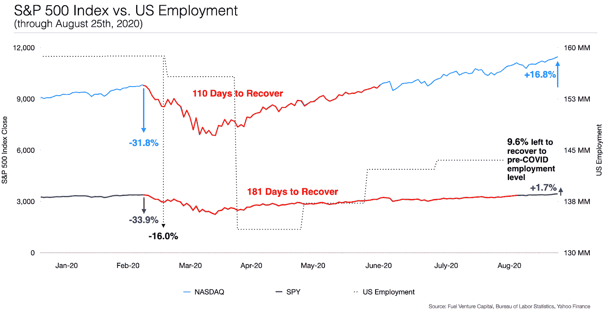
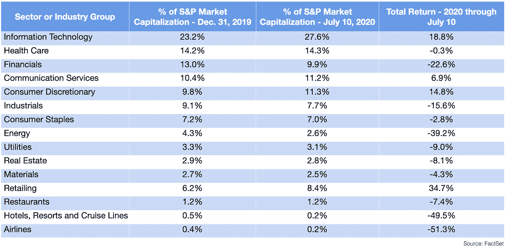
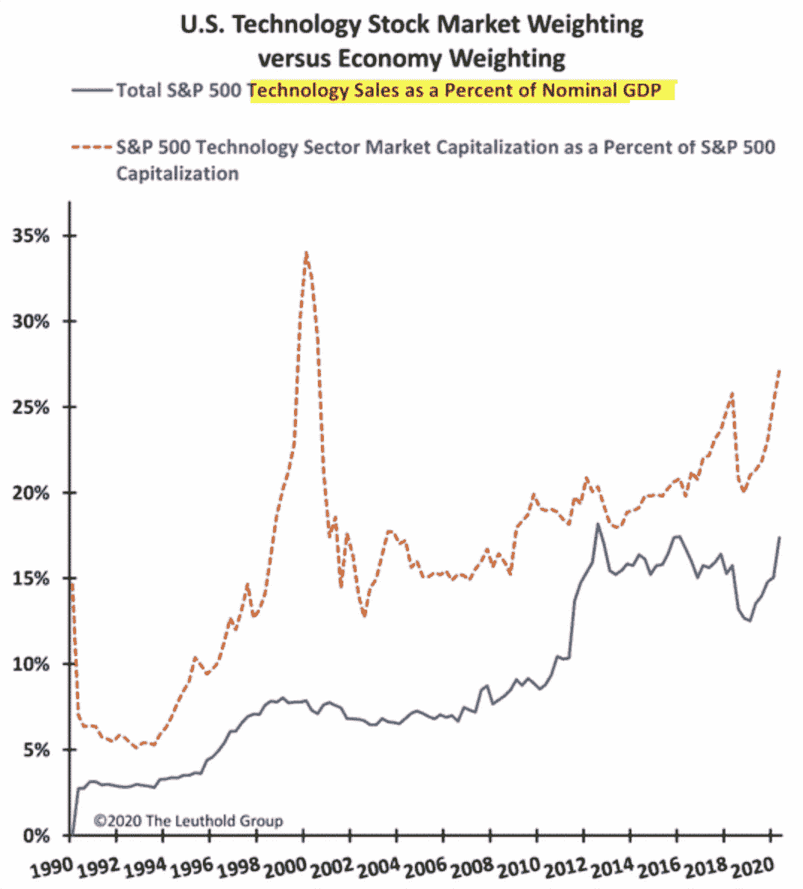

# 经济和股市似乎成反比——原因如下

> 原文：<https://medium.datadriveninvestor.com/the-economy-and-the-stock-market-seem-inversely-related-heres-why-dd0753a6ae99?source=collection_archive---------4----------------------->

## *解释华尔街和主街之间的巨大差异，以及为什么新冠肺炎强调了对任何投资者来说分配风险投资的重要性*

在公共市场工作了近 10 年后，我发现不可能忽视它的涨落。我喜欢抓住并培养自己被股市走势吸引的那部分，哪怕只是因为这让我能够在私募市场上做最好的工作，在那里，我向 Fuel Venture Capital 的有限合伙人提供关于他们的私募股权/风险资本分配以及一般而言的投资组合管理的见解。我经常听人说，说到投资，就像生活中的大多数事情一样，一切都是相对的。

当新冠肺炎·疫情事件发生时，股票市场形势急转直下，家庭避难所的指导方针在全国范围内得到不同程度的实施。然而今天，市场已经完全恢复到病毒爆发前的水平，这一恢复只用了几个月的时间。

然而，许多经济学家认为，至少在未来几年内，经济不会反弹。

经济和股票市场按照不同的规则运行，造成了两者之间的分裂。一个是指主街，另一个是华尔街。

不断上涨的股价和动荡的经济之间的脱节，给最近的市场反弹带来了可疑的性质。华尔街和主街之间出现分歧的原因并不单一。有些因素是显而易见的，有些是隐藏的。有些因素是短期的，有些是长期的。

投资者需要了解哪些因素是暂时的，哪些因素是更持久的，这样他们才能更好地做出长期投资决策。

# **市场与经济**

*经济:*

疫情关闭美国经济的速度和力度可能超过历史上的任何事件。美国在 2 月份正式进入衰退，从而结束了美国历史上最长的扩张——仅仅超过 10 年，准确地说是 128 个月。这是该国自 10 年前的大衰退以来的第一次，其严重程度可与大萧条相提并论，大萧条是该国工业时代最严重的经济衰退。

4 月份，美国的失业率飙升至 14.7%，这是自大萧条以来的最高水平，当时的峰值超过 25%。(背景:大衰退期间的失业率峰值约为 10%)。

*市场:*

虽然道琼斯工业平均指数已经抹去了冠状病毒引发的溃败的所有损失，但标准普尔 500 和以科技股为主的纳斯达克综合指数继续创下新纪录。今年的熊市比峰值下跌了 20%以上(从 2 月份的高点到 3 月 23 日的低点下跌了 34%)，这是历史上最短的熊市，也是 S&P 在经历如此急剧下跌后第三快创下新高的反弹。

# **在表面上**

“不要和美联储作对”这句口头禅经受住了时间的考验是有原因的。

由于担心美国经济螺旋式上升，美联储在疫情开始时迅速介入，采取了一系列广泛的行动，从将利率降至近 0%到开放新的紧急贷款设施，并宣布新一轮量化宽松政策(大规模资产购买)，直到高收益信贷的风险谱。

从大背景来看，2008 年金融危机后，美联储在两年内将资产负债表增加了 1.4 万亿美元，这在当时是创纪录的增长。快进到今天，截至 2020 年 6 月，美联储在不到三个月的时间里为资产负债表增加了 3 万亿美元。到今年年底，美联储的资产负债表预计将占整个国民经济的 40%左右。

疫情显示了美联储的另一个层面。自危机爆发以来，美联储主席杰罗姆·鲍威尔(Jerome Powell)已经证明，在危机时刻，美联储可以更积极地扩大其影响力，也更愿意承担更大的风险。

 [## 收盘，但没有雪茄-股票市场目标在停滞的 COVID 救济中创新高|数据驱动…

### 专家聊天程序:一个协作市场，在这里人们可以和能够解决他们问题的专家聊天。是……

www.datadriveninvestor.com](https://www.datadriveninvestor.com/2020/08/18/close-but-no-cigar-stock-market-targets-record-highs-amidst-stalled-covid-relief/) 

不仅仅是货币政策，财政政策也采取了大量非常措施来支撑市场。

2 万亿美元的《关怀法案》(CARES Act)是美国历史上最大的救市计划，它向美国家庭发放了一次性刺激款项，扩大了失业福利，并为小企业创建了一个可原谅的贷款计划。新刺激方案的前景已使市场因任何消息而走高，即使是负面消息，因为经济后果将增加另一轮财政支持的可能性或规模。

财政政策可能会平息短期的广泛经济压力，但不能解决经济、商业和个人就业挑战的广泛领域的压力。然而，在像现在这样的不确定时期，市场更加情绪化，本质上更关注短期动态而不是长期状态。

此外，市场往往是前瞻性的。

在疫情开始时，市场在经济数据出现之前就敲响了警钟，一个月内市值蒸发了 30%以上。当时，投资者已经考虑到了由于冠状病毒导致的关闭而导致的经济活动的悲剧性下降。由于最坏的情况已经发生，投资者开始展望未来，预计会出现大幅复苏，并将一些希望寄托在冠状病毒的治疗或疫苗上。因此，只要有任何迹象表明潜在疫苗的研发取得了进展，股票就会大幅上涨。目前，这似乎是一个两步走一步退的故事。

面对坏消息的市场反弹可以追溯到其他一些投资者的行为和偏见。

一旦美联储和国会在 3 月份明确了他们以响应性的大规模支持促进复苏的动机，“FOMO”，或对错失良机的恐惧，压倒了在疫情爆发时刺激抛售的“逃向安全”心态。此外，一些投资者开始将股票视为唯一可靠的投资，因为在空前的低利率环境下，他们从债券投资组合中持续获得最低回报。

在长达十多年的长期牛市之后，3 月份的下跌使股票对价值投资者具有吸引力，这些投资者多年来一直在等待有利的购买条件。最重要的是，新冠肺炎疫情也为市场带来了新一波交易者。大约有 800，000 人对股票市场感兴趣，认为这是一种新的简单的短期收入方式，因为他们现在有更多的时间在家工作，封锁限制或最近失去工作。

# **看引擎盖下**

在表象之下，股市表现得似乎与经济无关，还有更长久的原因。

最常讨论的股票价格指标，如 DJIA 和标准普尔 500，是由大公司组成的，这些公司的业务遍及全球，目前 40%的收入来自海外。他们的盈利前景最终会推动股市，受到美国以外地区经济前景的影响，包括那些更有效地平坦化曲线并减轻冠状病毒对经济的打击的国家。美国以外的情况有所好转，这在一定程度上让市场摆脱了美国糟糕的经济消息，这些消息与我国小企业群体及其工人的贫血状况有关。

此外，财务实力和通过公共债券市场获得现金也使得这些大型公共企业比中小型企业更有可能在危机中幸存下来。

行业权重也在很大程度上导致了股市和经济之间的差异，因为受新冠肺炎危机影响最大的行业——酒店、零售等——对美国股市没有太大影响。

根据政府数据，2020 年上半年，近 400 万个酒店和餐馆工作岗位消失。但是大多数餐馆都是私营的。今年年初，按市值计算，餐馆占 S&P 的 1.2%，而酒店、度假村和邮轮公司仅占标准普尔指数的 0.5%。航空业也是如此，今年年初仅占该指数的 0.4%。

在股指中权重较大的大型科技公司是本轮反弹的主要推动力，延续了近 11 年牛市中的普遍趋势。

一些人说，标准普尔 500 被称为 S&P 5 更合适，因为只有五家公司的影响力:脸书、亚马逊、苹果、网飞和谷歌(或 Alphabet)，通常被称为 FAANG。这些股票目前约占该指数市值的 20%，为 30 年来的最高水平，因此它们的走势往往会对整体市场产生巨大影响。

这张图表显示，科技不仅在股票指数中，而且在名义 GDP 中也越来越多地驱动着大部分价值。短期和长期的科技故事仍然引人注目，因为数字化转型的长期趋势一直不可避免，但可能需要几十年才能慢慢显现出来，其加速速度远远超出我们的想象。

居家指南给了人们比以前更多的空闲时间，这些空闲时间被分配到每天更多的分钟或小时来浏览社交媒体平台、在线购物和内容流，以及尝试新技术以适应新常态的更大动力。

随着疫情继续给日常生活带来摩擦，它也迫使公司重新评估他们的工作方式。我们已经看到云计算、远程工作工具(如电话会议)和其他技术生产力解决方案的采用率越来越高，这对科技行业来说是一个福音。

科技行业的乐观情绪受到最近强劲财报的支撑，导致大型互联网公司的市场表现强劲，SaaS 公司的估值倍数激增。

在私人市场，飙升的股市和上市科技公司的高价值有助于后期创业公司捍卫自己的价值，并告知私人市场投资者创业公司可能的高退出价值。因此，许多私营公司都急于上市，包括 Airbnb，该公司去年推迟了 IPO，但最近宣布了即将到来的 IPO 计划。

这个想法是趁热打铁，在美国总统大选的不确定性出现之前乘着股市的势头。根据 Pitchbook 的数据，6 月份，风投和 PE 支持的公司在 IPO 中筹集的资金达到了 2019 年 5 月以来的最高水平。

一个更积极的退出环境当然会鼓励私人投资者不断向初创公司注入资金，尤其是那些诞生于危机之中、解决疫情真正的系统性问题、需要大规模大胆解决的初创公司。根据 TechCrunch 的数据，在寻求资本的公司中，超过 70%的公司在 4 月份能够以高于前几轮融资的估值进行融资。

股市与经济现实的脱节只是 2020 年让我们挠头的又一种方式。但在混乱中，有一件事已经达成共识:技术的作用在未来几年只会越来越大。投资组合应该反映这一长期主题。

投资者越早参与，他或她能产生的回报就越高，因为大部分好处存在于企业生命周期的早期阶段。

现在比以往任何时候，在风险资本中分配 10%到 20%来增加对处于早期阶段的开创性技术公司的投资，不再是应该做的事情，而是必须做的事情。

*本文作者是燃料风险投资公司总经理* *合伙人兼首席投资官 Maggie Vo，CFA。Maggie 管理投资活动，领导对潜在投资的尽职调查，并对现有投资组合公司进行估值分析。要联系玛姬，发电子邮件到 maggie@fuelventurecapital.com。在社交媒体上关注 Fuel 风投，via*[*insta gram*](https://www.instagram.com/fuelventurecapital/?hl=en)*，*[*Twitter*](https://twitter.com/FuelVC)*和*[*LinkedIn*](https://www.linkedin.com/company/fuelventurecapital/)*。*

# **披露**

本文提供的信息仅用于教育和说明目的。所提供的材料代表燃料风险投资公司截至本报告日期的观点。所提供的信息和观点是从据信可靠的来源获得或得出的；但是，我们不能保证此处表达的信息的准确性和完整性。观点如有变更，恕不另行通知，Fuel Venture Capital 不承担更新或修改此处包含的任何信息或观点的责任。请记住，过去的业绩并不代表未来的结果，也不能保证基金将取得类似的结果，实现其投资目标，实施其投资战略或避免损失。

*本协议中的任何规定均不构成出售任何证券的要约，也不构成购买由 Fuel Venture Capital 或其关联公司赞助或建议的任何证券或任何其他产品的要约，也不构成以其他方式提供投资咨询服务的要约或要约。任何此类出售要约或购买要约的邀约只能通过正式要约文件进行，其中包括保密要约备忘录、有限合伙协议和相关认购文件。此类正式发行文件包含本文件中未列出的附加信息，包括与某些投资风险相关的信息，这些信息对任何投资决策都至关重要。此处提供的业绩数据仅用于说明目的，不代表未来回报，也不保证未来结果。本文所述类型的投资可能涉及高度风险，且此类工具的价值可能高度不稳定。投资者可能会损失部分或全部投资。本简要声明并未披露与此处列出的投资类型相关的所有重要方面/风险，包括相关风险因素以及适用于它们的任何法律、税务和会计考虑因素。*

**访问专家视图—** [**订阅 DDI 英特尔**](https://datadriveninvestor.com/ddi-intel)