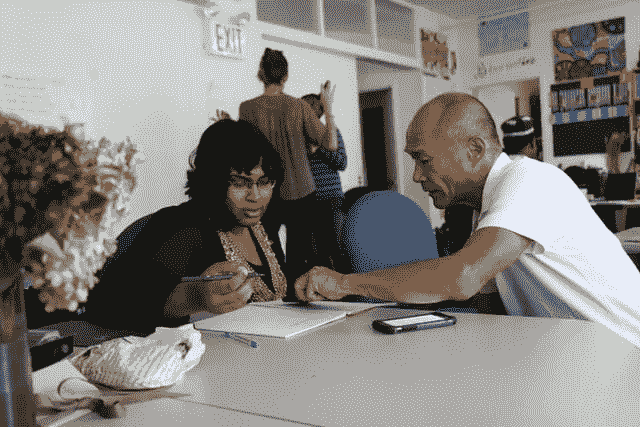
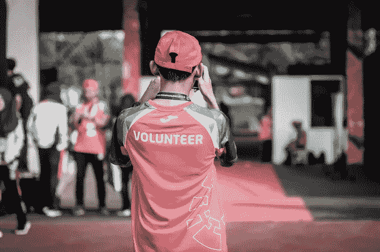

# 经济在不断变化，你也应该如此

> 原文：<https://medium.datadriveninvestor.com/the-economy-keeps-changing-and-so-should-you-f1fa56c6422d?source=collection_archive---------10----------------------->

Photo by [Monica Melton](https://unsplash.com/@monicomelty?utm_source=unsplash&utm_medium=referral&utm_content=creditCopyText) on [Unsplash](https://unsplash.com/s/photos/diversify-job-skills?utm_source=unsplash&utm_medium=referral&utm_content=creditCopyText)

我的经理是一名拥有系统思维的工程师。每当他遇到一个学生，他都以同样的建议结束每次谈话。“专注，超越。”换句话说，不要一次做太多事情。一次掌握一件事，然后从那里开始。

我承认，时不时地遵循这一务实的信条帮助我处理和实现了新的目标。话虽如此，我将永远属于“各行各业的杰克和吉尔”俱乐部。

坚持一件事并擅长它从来都不是我的强项。我总是从一件事跳到另一件事——工作、娱乐、恋爱——随便你说。我是那种喜欢学习多种语言，同时管理一系列自由职业项目，同时自学编码的人。我并不总是每次努力都成功，但即使失败了，至少我享受了尝试的乐趣。

 [## 现金为王，比我们想象的更强大|数据驱动的投资者

### 2020 年 3 月 12 日，在川普总统宣布新冠肺炎进入国家紧急状态的前夕，纽约时报报道…

www.datadriveninvestor.com](https://www.datadriveninvestor.com/2020/03/26/cash-is-king-more-potent-than-we-think/) 

尽管一些企业和组织继续采用传统的职业轨迹，即从初级职位开始，沿着定义明确的阶梯向上爬，但传统的职业道路正在变得过时。两三年后换一份工作，而不是在同一份工作待上几十年，不再是不寻常的事情，或者被认为是职业自杀。自动化和技术的兴起改变了职业前景，我们生活在一个零工经济和创业的新时代。比以往任何时候都有更多的人在开拓创新和创业的职业道路。

我在大学本科时期就养成了杰克和吉尔的心态。尽管我梦想写一本畅销书(现在仍然如此)，但我通过学习几种风格扩展了我的写作技能。我获得的创造性、技术性和新闻写作技能的组合，加上我讲述引人注目和有影响力的人类兴趣故事的能力，帮助我在早期职业生涯中从行政工作中脱颖而出。我得以进入营销和通信领域，并最终授予写作。

知道如何做各种不同的事情将使你的技能多样化，经受住动荡经济的风暴，并教会你如何跳出框框思考。拥有多样化的职业道路会给你丰富的工作经验，让你保持警觉，增加你的市场竞争力。它还会给你信心和自由，让你可以无所畏惧地从糟糕的处境中走出来，并有勇气去冒险。即使你随着就业市场的变化而变老，你也总能站稳脚跟。

在为学生——特别是高中和大学毕业生——做好充分准备以适应不断变化的就业市场方面，美国教育系统仍然落后，但这并不意味着你不能靠自己做好准备。

Photo by [ray sangga kusuma](https://unsplash.com/@rekamdanmainkan?utm_source=unsplash&utm_medium=referral&utm_content=creditCopyText) on [Unsplash](https://unsplash.com/s/photos/volunteer?utm_source=unsplash&utm_medium=referral&utm_content=creditCopyText)

成为各行各业的杰克和吉尔，不一定要赚很多钱。布克·华盛顿说过，“如果你想提升自己，就提升别人。”我一直相信，帮助他人取得成功会增加我自己的成功。通过服务行为帮助他人一直是我个人品牌的重要组成部分，回报是无穷的。志愿工作让我接触了一系列行业和社交机会，同时我也发展了新的技能。例如，我能够担当志愿者协调员和项目经理的领导角色，并且通过使用数据库提高了我的管理技能。

过去，我在劳动力开发部门工作时，与受过最少教育、工作经历有限的人共事。在简历制作过程的开始，我的客户经常感到气馁。然而，我提醒他们，志愿者工作是一个很好的起点，可以突出可转移的软技能和硬技能，如领导力、沟通和时间管理，以及优先排序、批判性思考和解决问题的能力。

我们永远不知道生活会给我们带来什么，所以做好准备很重要。九年前，由于照顾家庭的责任，我不得不从高强度的工作日程中退一步。我回到了我热爱的事情上——教英语学习者。我开始是一名志愿者，但意识到兼职教学会给我更多的灵活性。我获得了 TEFL 证书，并开始在我居住的地方教成人英语。当我的个人生活回到正轨时，我能够在海外使用我的新教学技能。除了省钱和一生一次的冒险，我的海外教学经历让我的简历脱颖而出，让我对招聘经理更有吸引力。

W 当我在高中教书时，我了解到我的学生擅长用手机发短信，但在课堂练习中用电脑打字时，他们速度不够快，做不了多少事情。我很感激我在高中最后一年学到的打字技巧，尽管我最初认为这门课程是浪费时间。我一点也不知道，触摸打字的能力将帮助我在大学期间更快地完成作业，并使我成为未来工作场所的资产。

我的打字技能使我能够同时处理多项任务，有效地利用我的时间。我不必努力专注于工作，因为我不担心我的手指需要去哪里。在大学期间，触摸打字帮助我找到了几份临时工作，并且这些年来，当我断断续续地在临时机构工作时，它仍然对我的管理技能大有裨益。

作为一名作家，触摸打字的能力帮助我在采访中做笔记，并把我手写或录制的笔记打出来。一边听音频，一边快速准确地打字，这也让我有机会兼职做一些自由职业的转录工作。

你可以在职业生涯的任何时候成为各行各业的杰克和吉尔。这里有一些帮助你开始的关键策略。

Photo by [Christin Hume](https://unsplash.com/@christinhumephoto?utm_source=unsplash&utm_medium=referral&utm_content=creditCopyText) on [Unsplash](https://unsplash.com/s/photos/diversify-job-skills?utm_source=unsplash&utm_medium=referral&utm_content=creditCopyText)

**调查就业市场**

调查当前的就业市场，找出哪些工作是有需求的，哪些工作在未来的地平线上，哪些工作正在下降。在你投资金钱或时间到教育和培训之前，了解全局是很重要的。一旦你确定了一些感兴趣的领域，找出雇主想要的技能、知识和证书。

除了利用 LinkedIn 这样的社交媒体平台，还有很多方法可以了解行业新闻和趋势。这包括阅读网络期刊、博客、电子通讯和其他行业出版物。你也应该考虑加入一个与你的行业相关的专业协会，参加会议，通过听播客来了解行业新闻和领先专家的信息。

**培养学习心态**

就业市场瞬息万变，你不想落后。你应该不断发展和拓宽你的技能。如果你负担不起攻读硕士学位的费用，可以考虑投资于大学或非营利组织提供的继续教育项目。

弄清楚你现在的雇主是否提供学费补偿和职业发展资金。LinkedIn Learning 是一个公司赞助的资源，你可以随时使用，甚至是在自己舒适的家里。这个在线教育平台通过课程视频帮助你发展商业、技术相关和创造性技能。如果钱仍然是一个问题，你会惊讶地发现，你可以从 YouTube 上看一个教程这样简单的事情中找到免费的东西。

会见职业顾问

大多数学院和大学都提供职业服务。如果你是大学毕业生，去见见职业顾问，利用你的校友网络。他们提供最新的简历和求职信专业知识，帮助你确定自己的优势，并提供与你感兴趣的特定领域的其他校友建立关系网机会的指导。还有一些叫做一站式职业中心的公共机构，它们在你所在的社区为具有各种教育和就业经历的成年人提供职业咨询服务。

**考虑与临时工中介合作**

在临时职业介绍所工作是探索新职业兴趣的好方法。除了提供职业发展资源之外，他们还可以帮助您提高管理和技术技能。尽管临时工中介机构通常将求职者安排在管理岗位上，但你也可以专注于自己感兴趣的特定行业。一旦你能够迈出第一步，你就能找到通往理想工作的道路。有时找到一个合适的代理机构需要时间，但是如果你做了调查，并把自己放在那里，你有可能被安排一个符合你目标的动态任务。

我们生活在艰难和不确定的经济时代，但我们最终会反弹。当我们继续面对由新冠肺炎引起的前所未有的公共卫生危机时，保持耐心、创造力和寻找机会是非常重要的。这也是通过成为各行各业的杰克和吉尔来学习新技能和改进旧技能的好时机。