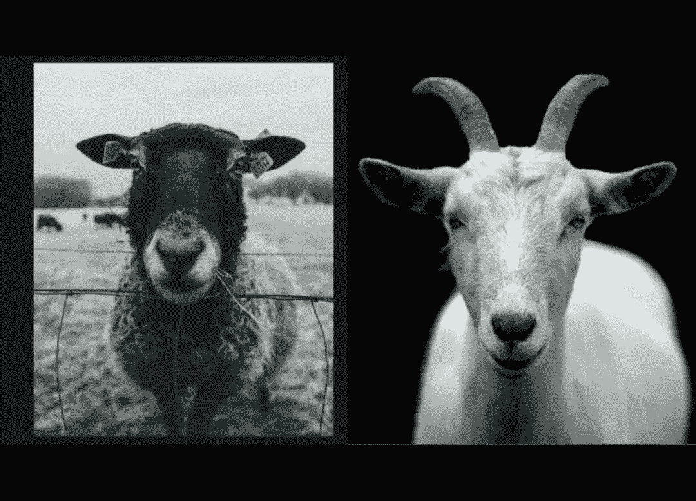
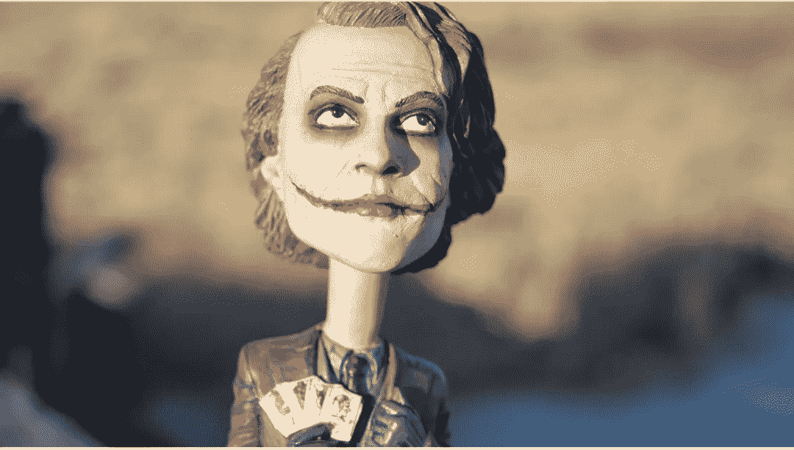
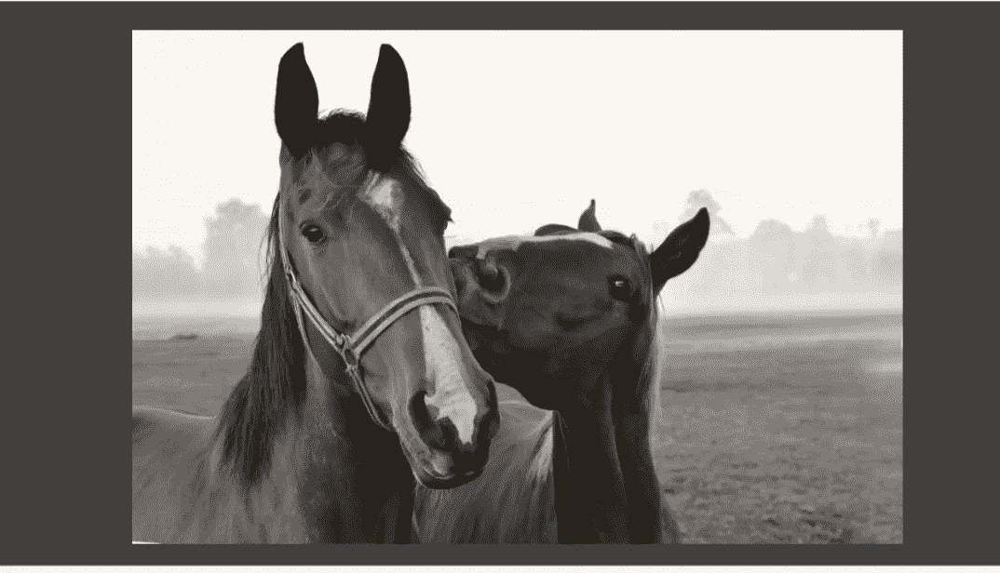

# “二元对立”的影响

> 原文：<https://medium.datadriveninvestor.com/the-effect-of-binary-opposition-68a115622e4b?source=collection_archive---------13----------------------->

courtesy; spark post

无论是在财富、社交聚会、政治联盟等方面，这个世界都生活在二元性之中。自从人类物种进化以来，极性的想法就存在了。在传统时代，人们除了生存的恐惧和创伤之外一无所有，这使他相信一种存在主义的存在，称为**“上帝”，他保护他们**，而另一种形式的存在，称为**“魔鬼”，他折磨他**。他的感知来自于他在自然界看到的这些极性——白色和黑色，冷与热，小与大。这个概念很早就由法国社会学家李维·施特劳斯提出，他提倡在人类生活中使用二元对立，以及这些对立如何影响人类行为。

**人类的感知和行为对个体而言是主观的**，通常被归类为二元对立，这可以通过我们观看的电影、连续剧、戏剧很容易地**归类。例如，故事中总是流传的反派和英雄的概念。**

courtesy; spark post

这些想法和对人类的感知通过对道德的描述影响了人类的思想，其中罪恶、因果报应、贪婪、欲望的概念已经结合在一起，创造了一个与英雄主义、勇气、美德等观念相对立的范畴。
以二元对立的思维，以人类世界的固有属性。
根据肤色区分人的种族主义观念起源于 18 世纪初。这种观点认为黑人是劣等种族，从属和令人厌恶，但另一方面，白人被认为是干净的，优越的种族和高度智力。这种对立统治了人们的思想，并因此发展了他们对人民的看法和行为。这可以在黑人的政治、社会和经济权利较少的情况下观察到。白人霸权的建立和对其他种族的统治。

courtesy; spark post

自从男人和女人为了生存而狩猎以来，这种男女对立的观点就一直存在。传统上，妇女最好被限制在私人领域，主要从事狩猎和户外工作。这些观念在社会中根深蒂固，认为女性由于生理上的差异不适合参加公共活动。例如，在印度，由于**月经(纯洁和污染)**的观念，女性被认为比男性更低人一等、更弱。导致社会对他们的社会、政治和经济利益减少，使他们容易遭受社会上发生的大多数暴行。由于人们的这些不同看法，第三种性别**在很长一段时间里被认为是被排斥的，直到最近，第三种性别才得到承认。**

courtesy; spark post

虽然可以有许多例子来解释二元性，但有一点是肯定的，那就是人类的思维应该超越二元性，推理出相似性，而不是由此产生的差异。由于种族的发展和种姓的不平等所造成的差异应该通过**人类工作的中间环节来解决和解决。虽然通过政治和社会努力消除这些不平等现象已经有一段时间了，但是要让人们团结起来为一个事业而努力还需要付出更多的努力。**