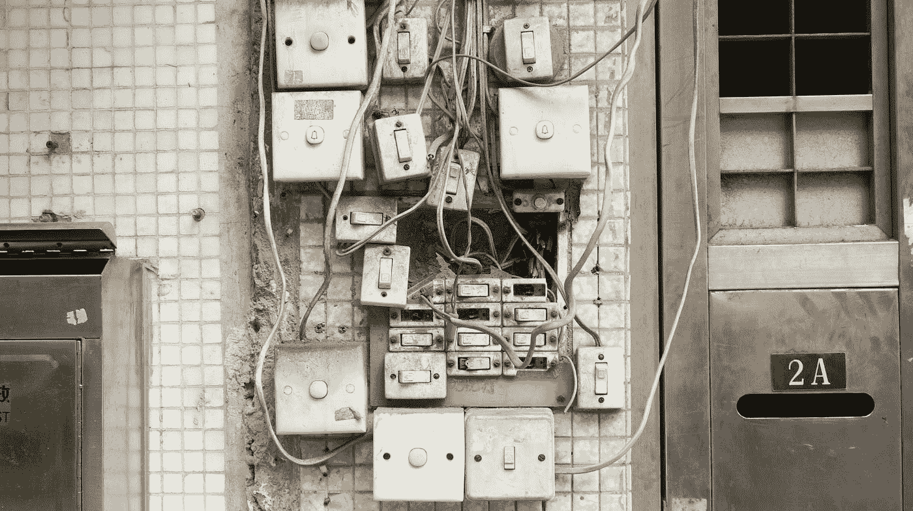

# 澳大利亚的电气工业及其面临的挑战

> 原文：<https://medium.datadriveninvestor.com/the-electrical-industry-in-australia-and-the-challenges-it-faces-99aefec4aa27?source=collection_archive---------2----------------------->

Photo by [Yung Chang](https://unsplash.com/@yungnoma?utm_source=medium&utm_medium=referral) on [Unsplash](https://unsplash.com?utm_source=medium&utm_medium=referral)

## 这是一个成熟市场普遍存在的问题

本文将着眼于电气行业，以及变革和压力是如何产生广泛影响的。这并不是说，其他行业没有经历类似的变化，反映了电气行业。变化正在快速发生，很明显，许多组织以及管理这些组织的人都没有能力应对存在的不确定性。该行业作为一个更大的市场的一部分存在，由许多元素组成。这些包括最终用户，说明符，承包商，制造商，交换机制造商，批发商和分销商。除此之外，还有许多其他组织也发挥了作用；如会计事务所、律师事务所、劳动力雇佣、运输和快递服务。我将只探讨电气行业的主要部分，因为许多联合公司服务于多个其他行业。我还将研究政府和最高机构如何在变革中发挥作用。

## **最终用户**

最终用户多种多样。他们可以是大型跨国组织，也可以是个人业主。正因为如此，他们的愿望和需求非常不同。现在变得越来越普遍的一个总体相似性是，他们都更加精明，能够获得多种产品和服务选择。曾经有一段时间，位于偏远地区的矿场期待制造商和供应商前来参观，以了解最新的产品。公司定期带着新产品和新技术拜访客户。这些都是昂贵的练习，但是可以跟踪和监控 ROI，因为可以跟踪新产品的订单。远程站点是极端的，然而，研究新产品、阅读评论或加入论坛来解决问题的能力使得最终用户对产品更加了解。除此之外，我们还可以在网上直接获取价格，我们看到了一个动态的转变，许多最终用户不知道他们想要什么，也不知道他们现在需要什么。

终端用户也更容易接触到产品。如果我们只看一下我们的家庭与各种智能设备连接的方式的变化，大型硬件和电子产品零售商现在可以买到各种产品。最近一次去 Aldi 商店的旅行表明，我现在可以从零售商那里购买一个主要贸易品牌的蓝牙控制照明。在澳大利亚，要求由有执照的电气承包商安装产品，但这些新的智能设备将指导您完成安装说明。政府应该介入并阻止这些产品出售给房主吗？我相信是的。简单地要求查看电气工人执照是一种方法。这不是一个万无一失的方法，但可能会让消费者对购买这些产品产生怀疑。毕竟，喷漆被锁起来是可以的，酒只能卖给 18 岁以上的人。我不认为这些举措会限制销售机会，因为智能家居的精灵已经从瓶子里出来，需求将继续增长。

 [## 为什么包容性财富指数比 GDP 更能衡量社会进步？|数据驱动…

### 你不需要成为一个经济奇才或金融大师就能知道 GDP 的定义。即使你从未拿过 ECON 奖…

www.datadriveninvestor.com](https://www.datadriveninvestor.com/2019/03/08/why-inclusive-wealth-index-is-a-better-measure-of-societal-progress-than-gdp/) 

对于大型终端用户，特别是在西澳大利亚和昆士兰州的矿业州，上一次主要的矿业繁荣见证了工资和劳动力成本的失控。工程公司用员工填满了城市建筑的楼层，这些员工在主要产品上向最终用户收费，这导致了许多项目的巨大建设成本。这种模式的可行性在采矿放缓后表现出来，因为许多大型最终用户开始再次讨论产品的价格，这些产品通常被严格的规格所限制。现在许多产品在规格、质量和可靠性方面都非常相似。因此，如果改变在经济上可行，探索更具成本效益的选择是有意义的。

## **说明符和顾问**

说明符在行业中仍然很重要，但近年来它们在利基 LED 照明以外的影响力已经减弱。可用的照明和控制系统种类繁多，导致 LED 选项供应商不断增加，尤其是建筑类应用。然而，除了照明本身的规格之外，这些项目的利润对于电气批发商来说严重减少，尽管总价值很大。承包商更喜欢通过批发商购买，因为他们可以利用他们的交易条件来延迟付款。说明符和顾问不明白行业的流动性是如何受到他们的行动和对行业的下游影响。

除了 LED 照明，其他产品也是如此。该部门确实倾向于将某种程度的风险缓解纳入其考虑范围，并将从适用性和库存过时的角度来看待主要品牌。尽管在指定者、承包商、制造商和市场渠道之间，环路需要更加封闭。实现项目交付的可行性和现实性符合所有各方的利益。

## **承包商**

澳大利亚大约有 45，000 个活跃的电气承包商。这是一个高度分散的行业，澳大利亚最大的承包公司仅占整体市场的 3-4%。该行业由许多努力工作的小个体组成，他们能够作为一名个体电工享受工作与生活的平衡。然而，这种分散导致了 it 行业的激烈价格竞争。劳动力成本对所有人来说都是相对稳定的，所以唯一可以用来降低价格的因素是采购和管理费用。采购占与电力合同相关的总成本的 39%,因此，当试图降低价格时，这是一个重点领域。年轻的技术承包商通过社交媒体或熟人接触在线商店，可以轻松地与传统供应商比较购买价格。随着越来越多的人在家里购买食品、杂货、衣服和书籍，这些消费者已经习惯了如何在网上购物。随着技术帮助中小企业做他们的会计，发票和估计，它似乎是一个自然的进步，采购迁移的方式。

所有企业规模的承包商所缺乏的是业务技能和财务管理方面的改进。从多个供应商处获得 30/60/90 天的账户可能是一种商业惯例，但这更多是出于供应商方面的竞争，而不是良好的商业管理。事实是，如果你能及时收取和支付账单，以目前 15%的无担保贷款利率计算，一个 60 天的账户相当于你的钱的 3%的利息。该行业的文化往往将这些交易账户视为一种权利，而非特权。诚然，一个人经营的小企业经常会有一些需要管理的现金流问题。然而，一旦你从一个人的经营上升，你有退休金义务，保险和其他费用，有必要确保企业有足够的资金来支付负债期。这是说起来容易做起来难，当一部分时间你也可以追上未付款的工作。较低的盈利能力意味着现金流极其重要，因为你报价的下一个项目的利润可能会比 12 个月前的项目更低。电力承包商的平均利润率为 8%。这低于其他承包商 11.8%的行业平均水平。与你可能共事的其他行业相比，电工的利润空间更小，看起来他需要比他的同行更加意识到他们的成本和利润。

## **总机建造商**

该行业的这一部分也由不同业务类型的大部分组成。从大型专业工业开关设备制造商到专门为特定市场组装产品的小型利基建筑商。像其他行业一样，配电盘制造商也面临着一些最近的变化，升级到标准和采用新的 AS/NZS 61439。这意味着许多建筑商需要寻找一种满足这些新标准的产品，并且不能再建造或使用他们自己的设计，除非它经过类型测试以满足要求。多年来，澳大利亚拥有强大的配电盘制造业，因为我所在行业要求的高标准意味着本地产品远远超过进口产品。随着项目工作量的增加，本地制造也具有竞争力和可扩展性。

该领域的主要威胁是电气开关设备制造商自身产品的增长。随着自动化、安全性的提高和大型驱动器的普及，许多大型跨国公司已经开发出集成这些功能的产品，并向客户提供完整的成套产品。中小型配电盘制造商将有机会运营，因为这些大型制造商可能会认为这个市场过于分散，在澳大利亚这样的相对较小的市场中不可行。

对于这一领域中的大型企业来说，关键是他们对市场的了解以及他们拥有的关系，这使他们能够足够灵活地满足采矿和工业部门的需求。

## **制造商**

制造商寻求产品的利润回报，以弥补他们的研发、制造和供应成本。随着 LED 照明等新产品的开发和应用加速，电气设备制造商之间的竞争逐年稳步增加。来自中国的新产品制造商的数量也在增加。LED 照明、电路保护和布线附件制造商数以千计，其产品通常是现有产品的复制品。与许多市场的情况一样，这些产品主要通过在线商店进入澳大利亚电气市场，这些在线商店无法与主要的现有品牌达成交易条款。随着近来小型承包商之间的竞争变得越来越激烈，许多人现在支持这些产品，但不知道它们是否按照要求的标准制造。不幸的是，不仅仅是低技术产品面临廉价进口的问题。甚至复杂的自动化产品现在也被复制并供应到当地市场。欧洲、亚洲和美国的主要制造商只能坐视一个以最低价格为基础的市场。他们已经完成了产品规格、功能和产品优势方面的工作，但只看到它是通过替代供应渠道获得的，几乎没有做什么来展示产品的出处。从交易的角度来看，最终用户和制造商之间可能存在的距离可能很大，制造商可能甚至没有意识到这一点。

近年来，澳大利亚最大的案例之一是 Infinity Cables。该产品直接从海外供应给各种电气产品经销商，并最终销售给电工。销售的电缆系列主要用于住宅和小型商业项目。根据 ACCC 网站，大约有 4500 公里的这种产品。这通常以 1 亿卷为一批出售。因此，市场上的产品数量惊人。已经表明，由于绝缘质量不符合澳大利亚标准，这种电缆可能会出现故障。这是一个主要问题，因为它现在被安装在新的家庭中，而业主和租户并没有意识到这种风险。电气设备安全计划、电力监管机构委员会、ACCC 和能源安全等组织都试图确保合规性。然而，价格驱使市场寻求更便宜的产品会导致这种结果。

## **批发商**

电力工业的大部分产品是通过电力批发商供应的。澳大利亚最大的跨国公司来自欧洲和美国。确实存在一些大型独立本地批发商，但大多数是较小的独立经营。大型跨国公司主导着批发行业，为当地的小型到大型承包商提供服务，并与大型最终用户签订定期合同。

在过去的几年里，在线独立批发商的数量有所增加。由于无法采购当地产品，许多供应商从亚洲采购产品。尽管从定义上来说不属于限制贸易，但是现有的大品牌供应商会避免与这些替代批发商开户。这表明了这一领域的主要参与者所拥有的市场力量。

随着全国各地分支机构数量的增加，这一领域的经验水平明显降低。许多这类个体分支机构的营业额都在数千万美元以上，但它们受到定价心态的驱使，害怕失去在其他地方购物的客户。许多分支机构缺乏商业知识，这增加了该行业的风险，因为它们寻求获得更便宜的产品，并延长与客户的交易期限。并非在所有情况下都是如此，但肯定会影响许多分支机构的长期生存能力。

由于许多传统实体分支机构面临客户减少支出的情况，因为他们采用在线方式或使用在线价格来寻求更好的交易，所以批发商也在寻求通过替代渠道采购品牌产品，主要是通过灰色市场进口商。这些进口商利用海外网络从拥有相同产品但价格更低的国家采购品牌产品。这种做法被称为价格歧视，因为制造商会为某一市场的产品设定最高价格。批发商部门这种做法的问题是，经理们不喜欢他们的客户在网上购物，但他们会将销售转移到灰色市场中的传统制造商。

传统店面批发商店面临的一个主要挑战，需要记住的是，这个行业在澳大利亚的营业额高达数十亿美元，就是如何为顾客提供最佳的网上和店面体验。消费者和 B2B 的购买习惯正在发生变化，全球范围内都感受到了零售业务的风险，因为许多城市的主要街道都有空置的商店，因为它们难以获得客流量。最近一次去德国和英国考察独立批发商如何适应与跨国公司的竞争，突出了更好地利用在线和扩大其现有产品的需要。德国的一家企业甚至开始在其名称中使用“在线”一词，并投资建设了一个专门的配送中心。即使有这些重要的投资，在线交易也只增长到他们总业务的 33%。他们相信，随着时间的推移，随着客户看到好处，这一数字将会增长。

## **分销商**

分销商往往是海外品牌的代理，这些品牌在一个国家没有自己的代表，他们的经营方式不同于传统的批发，因为他们库存有限。这一组将直接销售给客户或通过批发商。因此，分销商的利润高于批发，但低于制造商。许多公司面临的挑战是传统供应商的产品趋同，这可能会稀释他们的产品。这也可以被视为许多分销商进入新市场或在现有客户中发展业务的机会。如果母品牌乐于通过分销商向市场供货，它们的长期生存能力是好的。我认为电气行业的这一部分是通过整合和收购实现增长的良好目标。

## **高峰机构和政府**

我把这两者放在一起，尽管它们在市场上的影响力和感知能力截然不同。政府通过各州的机构，在确保从事电工工作的人员获得执照和充当工艺审核员方面发挥作用。他们还参与建立广泛的标准，以确保安全和一致的工作和产品质量。每个行业都可能有所谓的“牛仔”，这些机构将根据违规情况处以罚款或吊销执照。然而，当涉及到确保进入该国的产品符合要求的标准时，情况就不同了。进口边境漏洞百出，总是有产品进入，这将需要一些审查。不幸的是，正如在包层和 Infinity 电缆案例中发生的那样，它是在大量产品已经进入市场并被使用之后才被发现的。政府监管相当严格，进一步加强监管只会让一个已经遭受收入减少和利润率下降的行业付出更多成本。

电气承包商在澳大利亚有两个 peak 机构。但是，作为旨在帮助小企业的机构，它们的效率如何呢？这一点很难评估，因为通常情况下，那些在高峰机构职能部门的代表往往是中型或大型承包商。他们实施了一些很好的计划，集中和培训学徒，并在规则发生变化时教育承包商。他们所缺乏的是缩小他们的成员使用什么产品以及他们是否符合当地标准的差距。他们确实与澳大利亚的一些大型制造商合作，但一个愤世嫉俗的观点是，他的目的是协助赞助，因为几乎没有证据表明他们指示成员支持作为澳大利亚商业景观一部分的品牌。

澳大利亚缺失的尖峰体是批发业的尖峰体。有一家确实存在，但在澳大利亚竞争和消费者委员会(ACCC)的调查中倒闭了。尽管调查认为没有任何错误，但一个完整的市场部门失去了一个代表机构。鉴于批发、培训和知识一节中强调的一些要点，似乎一个最高机构可以协助培训成员、审计不符合规定的进口品并为其成员辩护。市场上对这一群体是否有兴趣还没有被注意到。

## **结论**

我试图通过观察组成澳大利亚电气行业的不同部门来强调该行业面临的几个关键点。尽管面临着来自许多地方的逆风，该行业在澳大利亚商业格局中仍然举足轻重，并且总体上由一些非常有能力和训练有素的人组成。同样重要的是要承认，在这篇文章中可能有遗漏，我试图涵盖所面临的更广泛的主题。像许多其他行业一样，它正面临着尚未完全适应的内部和外部挑战。没有人愿意看到电力承包商关门，400 名员工失业，就像刚刚在西澳大利亚发生的 ECM 事件一样。我确实认为，需要所有部门更经常地进行更多的讨论，以解决当前的问题。