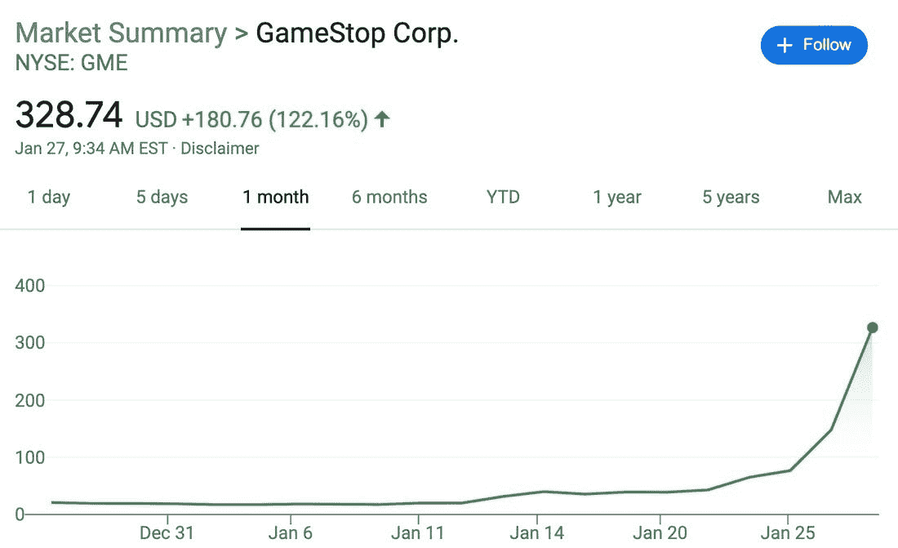

# 游戏停止传奇房间里的大象

> 原文：<https://medium.datadriveninvestor.com/the-elephant-in-the-room-of-gamestop-saga-e901112caf75?source=collection_archive---------6----------------------->

Photo by [Austin Distel](https://unsplash.com/@austindistel?utm_source=medium&utm_medium=referral) on [Unsplash](https://unsplash.com?utm_source=medium&utm_medium=referral)

在过去的几天里，到处都是新闻，我们所见证的是历史性的。

Game Stop 的股票价值一直在飙升，与公司的财务基本面没有任何关系。如果你不明白我指的是什么，这里有一个图表可以让你看得更清楚。

Image from Google Stock price viewer

为什么会成为个案？

因为一些 Reddit 用户发现股票被严重低估，然后意识到被一些主要投资基金做空。他们开始在平台上传播他们的发现，影响了过去两周的整个股市行为。如果你想了解更多关于这个机制的信息，你可以看看 Graham Stephan 的视频。

Video from Graham Stephan on Youtube

据包括路透社在内的几个消息来源称，美国证券交易委员会(SEC)正在考虑开始调查，以澄清 Reddit 上的对话在大规模操纵市场中的作用。无论调查结果如何，在我看来，焦点都放在了错误的事情上。

**卖空**，或者说卖空，发生在一个投资者从另一个投资者那里借股票的时候；一旦它进入投资组合，就会转售给其他人。希望股票会降低其价值；在这种情况下，借款的投资者回购债券，然后归还给借款人。这种机制的结果是借款投资者的利润。

这一行动的结果是以承担疯狂的风险为交换，提供快速的利润。风险在于这样一个事实，如果股票价值上升，那么重新买入会产生利润损失，甚至可能高于股票本身的价值。

这是最危险的一种投机，你在赌某人会失败。

我会试着从日常生活中举一个例子来规范我们的做空经历。

我借了我最好朋友的车，向他保证一个月后会还给他。我一拿到它，就把它卖给一个新司机，开了几英里后，他对它造成了一些损坏。不多，只是外部部分，足以使汽车的价值大幅下降，同时，产生恐慌。此时，我走近新司机，提出一项交易:我重新买下这辆车，但价格非常低，因为我需要修理它。新司机不情愿，但最终接受了:发生的事情很可怕，她/他觉得有必要摆脱这个物体。我修好了车，它看起来像新的一样，最后我把它还给我最好的朋友。如果我做一些计算，我的利润是由我第一次卖了多少钱，我偿还了多少钱再加上赔偿的差额得出的。

如果你是一个旁观者，你会如何评价我的行为？你认为这合乎道德吗？

虽然我认为，监管散户投资市场可能有利于为白手起家的投资者提供更多保护和信息，但为什么 SEC 不同时调查做空行为呢？

它投机于价值破坏，而不是可持续经济的发展。对于一个特定公司的所有利益相关者的生存和幸福来说，这难道不是危险的吗？

在整个情况下，房间里的大象是资本和监管的表现与经济发展不同步。资本不再为创造它的人服务，而是为少数人的贪婪服务，这种说法正确吗？

 [## 如何在不牺牲孩子或财务的情况下安全理智地离婚|数据驱动…

### 在美国，七月是以孩子为中心的离婚月。作为 cdfaⓡ的专业人士，我可以向你保证，从长远来看…

www.datadriveninvestor.com](https://www.datadriveninvestor.com/2020/07/28/how-to-divorce-safely-and-sanely-without-sacrificing-your-children-or-your-finances/) 

**进入专家视角—** [**订阅 DDI 英特尔**](https://datadriveninvestor.com/ddi-intel)