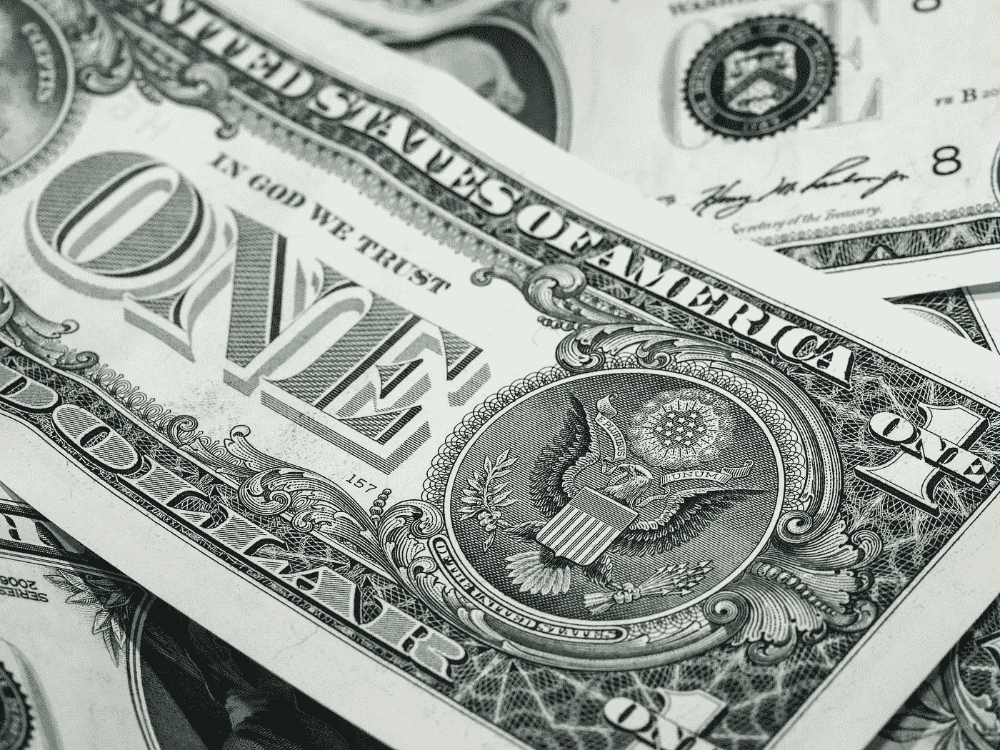
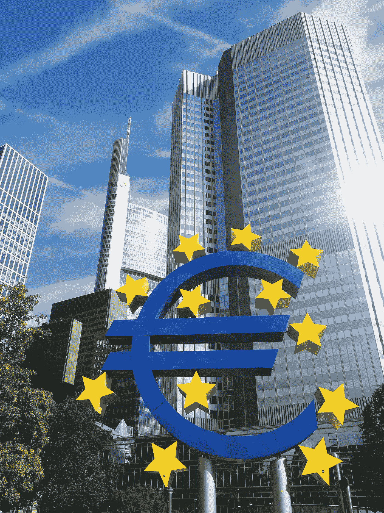

# 美元的末日？

> 原文：<https://medium.datadriveninvestor.com/the-end-for-the-dollar-fdc21297f2db?source=collection_archive---------16----------------------->

(Picture by Thomas Breher on pixabay.com)

欧元被科罗纳危机击碎了吗？甚至在疫情建立之初，人们对共同货币就有很大的恐惧。然而，最近，作为美元的“避风港”，欧元的价值越来越大。专家甚至认为欧元正在成为“稳定的避风港”。

对于欧元怀疑论者来说，还有比疫情再次宣布欧元区崩溃更好的时机吗？这种情况看起来很完美:这场危机如何能够跨国界地协调应对，最重要的是，谁将最终买单？

这些话题不仅主导了欧洲的辩论，也主导了共同货币的进程。今年春天，欧元汇率明显下跌，随后大幅上涨，只是在 3 月份从 1 欧元兑 1.1496 美元的 52 周高点跌至 1 欧元兑 1.0635 美元的 52 周低点。

 [## 回购市场注入对经济有何影响——跟踪面包屑|数据驱动的投资者

### 我们发现人们倾向于忘记(包括我们自己)重要的因素、事件或定义…

www.datadriveninvestor.com](https://www.datadriveninvestor.com/2020/05/13/what-repo-market-injections-say-about-the-economy-follow-the-breadcrumbs/) 

然而，自那次低谷以来，事情一直在一点一点地走上坡路。欧元目前交易于 1.1316 美元，再次接近 52 周高点，而不是低点。一美元目前相当于 0.8838 欧元。欧元从低点上涨了约 6.4%。换句话说，欧元在过去三个月已经明显稳定下来。押注于共同货币的外汇交易员享受了利润。

## 欧元跨越“黄金十字”

它可能会更高。这一点一方面可以通过技术指标来体现，另一方面也可以通过专家评估来体现。[金融新闻机构彭博最近指出](https://www.bloomberg.com/news/articles/2020-07-09/europe-s-virus-response-has-put-the-euro-in-a-win-win-situation)欧元兑美元汇率(EUR-USD)即将升至超过其 200 周的移动平均线。该品牌的持续上涨将表明该球场有进一步上升的潜力。

根据彭博的说法，这一举动将是对单一货币的一系列看涨信号中的另一个信号。欧元在 5 月中旬突破了 200 天平均线，随后在 6 月中旬出现了所谓的“黄金交叉”——短期平均线越过了长期平均线，在这种情况下，移动平均线超过了 200 天。该信号表明短期至中期的积极趋势。

彭博认为，欧元上涨的主要原因是对欧盟危机管理的信心。国际银行的外汇专家也这么认为。如果我们退后一步，看看总体的天气状况，预计欧元在未来几个月会有所稳定和走强是有道理的，”分析师在一份市场评论中写道。

## 欧盟重建妥协消除“内部冲突”

专家指出，市场上可能再次出现避险情绪(“避险”)，投资者会以众所周知的模式做出反应，即逃向“安全港”美元。世界上确实有足够多的麻烦。然而，欧元的前景相当乐观。未来几个月，在德国担任欧盟理事会轮值主席国期间，可能会就欧盟重建计划达成妥协。

据专家称，这将消除作为欧元负担的欧盟“内部冲突”。当然，这并不能立即克服所有的疫情挑战。尽管如此，由于欧洲中央银行(ECB)的一揽子刺激计划和货币政策支持，欧盟经济体应逐步走出严重衰退。

(Picture by Hans Braxmeier on pixabay.com)

相比之下，美国在总统竞选之后显得越来越四分五裂。由于美联储在一系列加息后将关键利率推回到接近零的水平，美元甚至没有得到这方面的支持。美元对欧元的利率优势只是微不足道的，因此不再是支持美元的主要理由。

## 在美国，疫情比以前更加肆虐

根据专家的说法，另一个重要因素是冠状病毒疫情本身，这引起了对政府能力的怀疑。与此同时，美国出现了(显然无法控制的)疫情，这日益动摇了人们对相关责任人的责任心和卫生系统的信心。

事实上，美国的病例数量最近显著增加。数据汇总显示，这个国家有超过 330 万病例，是疫情的中心。美国记录了全世界所有确诊病例的 25 %,尽管不到世界人口的 5%生活在那里。一个多星期以来，美国每天新增病例超过 5 万例。

在亚利桑那州、得克萨斯州和佛罗里达州等个别州，疫情在第一次放松后比以前更加肆虐。例如，[据美国媒体](https://www.newsweek.com/arizona-adding-many-new-daily-coronavirus-cases-eu-reports-icus-are-89-full-1515007)报道，亚利桑那州在 7 月初报告了新感染病例的七天平均水平，这大致相当于整个欧盟的水平——而联邦州的人口是其 60 多倍。

## 欧元取代美元——新的“稳定之源”？

所有这些都不利于美元，因此也不利于欧元。据彭博称，内部美元指数已经连续三个月下跌。该指数衡量美元相对于一篮子其他货币的走势，欧元在这一篮子货币中占了整整三分之一。彭博说，美元已经有一年多没有这样的损失了。

正如英国金融新闻社(financial news agency)所写的那样，如果外汇交易员想押注欧元或美元，现在的成本甚至会更高。这将显示必要期权的价格。因此，市场甚至倾向于假设欧元汇率将继续上升。在今年接下来的时间里，欧元可能会成为一个稳定的避风港。

—更新—

由于我几天前写了这篇文章，我想在最后补充一个更新。

美元不仅在不断上升的感染数字下呻吟，也在货币政策下呻吟。美国美联储将比以往更有动力推动货币政策。如果美联储的利率管理者不仅采取更具扩张性的货币政策，而且——这是很有可能的——还努力控制利率曲线，长期来看，这可能会给美元带来压力。

另一方面，欧盟的重建计划为欧元说话。财政方面在这里发挥作用，一方面让成员国松了一口气，但同时也给了危机中的前救世主欧洲央行更多的回旋余地。

欧元延续了过去几个交易日的涨势，升至四个月来的最高水平。周三上午，人民币兑美元汇率为 1.1444，为 3 月份以来的最高水平。欧洲央行(ECB)上一次在周二下午将参考利率设定在 1.1375 美元(周一:1.1329)。

英俊的约翰尼

**进入专家视角—** [**订阅 DDI 英特尔**](https://datadriveninvestor.com/ddi-intel)