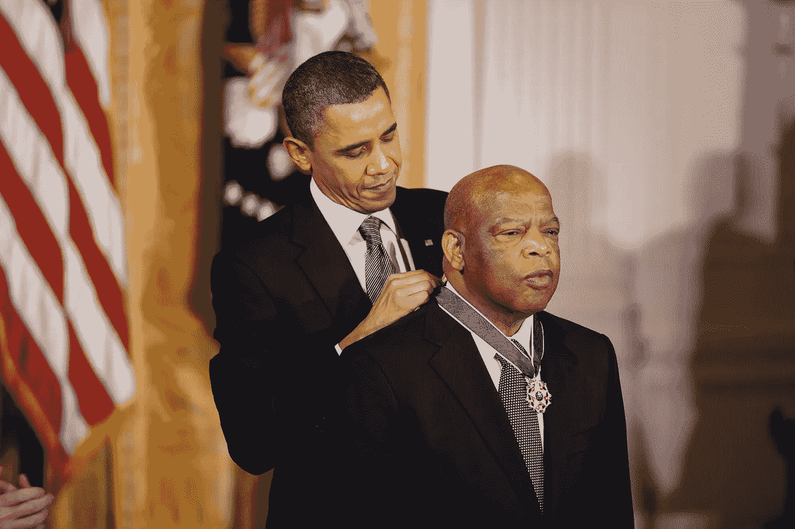
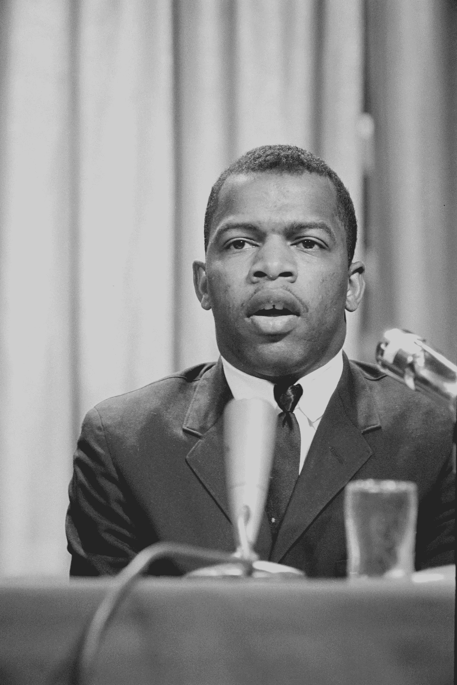
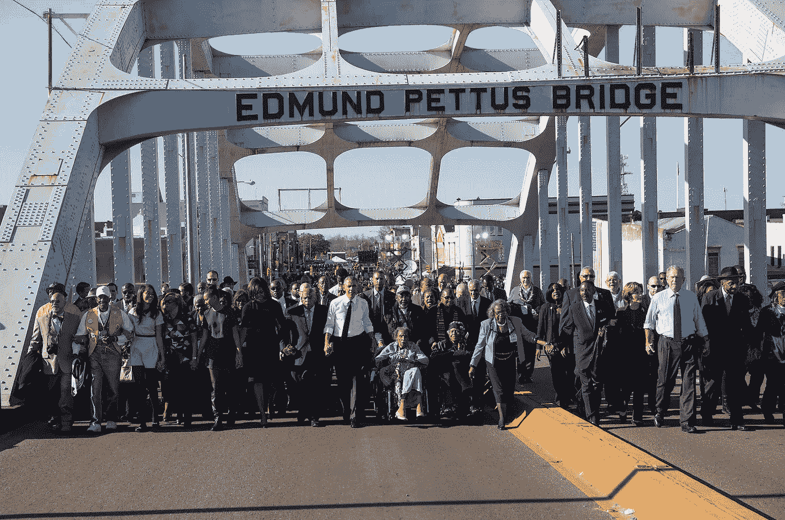
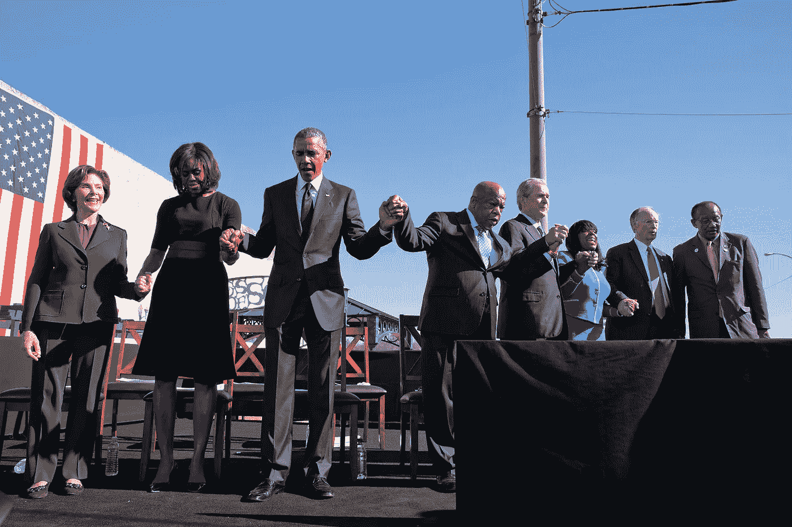

# 民权时代的结束

> 原文：<https://medium.datadriveninvestor.com/the-end-of-a-civil-rights-era-de42c8ad393d?source=collection_archive---------13----------------------->

约翰·刘易斯的去世标志着美国英雄时代的结束。

President Barack Obama awards the 2010 Presidential Medal of Freedom to Congressman John Lewis in a ceremony in the East Room of the White House February 15, 2011\. (Official White House Photo by Lawrence Jackson)

> “人们必须渴望走出去，去推去拉，永不放弃，永不迷失在绝望的海洋中，但要保持信念。”众议员约翰·刘易斯

在关于美国历史——它的传统、它的缔造者和它的纪念碑——的有争议的全国辩论中，民权领袖和长期的阿拉巴马众议员约翰·刘易斯在与癌症长期斗争后去世。他 80 岁了。

他长期以来一直是美国民权时代英雄们的最后堡垒，这对他如此努力为之服务的国家和为世界和平而奋斗的全人类都是有益的。他是一个与马丁·路德·金博士一起载入史册的人，他在公共服务领域的漫长而富有成效的职业生涯使自己脱颖而出。

约翰·刘易斯出身卑微，真正的伟人往往如此。作为南方佃农的儿子，刘易斯强烈地感受到了种族隔离、种族歧视和种族歧视的痛苦。他把自己年轻的生命奉献给了与这些不公正的斗争，这是对这个人的证明，也是对养育和影响他的人的证明。

John Lewis by Marion S. Trikosko, April 1964 (Photo: Library of Congress)

当什么都不做会更容易、更安全的时候，约翰·刘易斯却一次又一次地将自己置身于危险之中。如果有人为了美国的自由和平等而受到伤害，约翰·刘易斯已经决定了这个人就是他。

他从塞尔玛游行到蒙哥马利，和其他民权运动的关键斗士一起争取投票权。刘易斯是第一批自由骑手之一，他决心在各个层面上融入美国社会。

March 7, 2015: 50th anniversary of the March at Selma. President Barack Obama leads a march across the famous bridge where the original march took place. The Obama family join hands as they begin the march with the foot soldiers across the Edmund Pettus Bridge. (Official White House Photo by Lawrence Jackson)

然而，与金博士和其他许多人不同，刘易斯并没有为他的激进主义付出最终的代价。约翰·刘易斯出现在民权时代，并非毫发无伤——当然也不是毫发无伤，因为约翰·刘易斯满脸鲜血的照片是软化当时公众对种族正义的情绪不可或缺的一部分。

约翰·刘易斯一生都带着 1965 年被警察殴打的伤疤。

> “他如此热爱这个国家，以至于他冒着生命和鲜血的危险，希望这个国家能够实现自己的诺言。早期，他信奉非暴力抵抗和公民抗命的原则，认为这是给这个国家带来真正变革的手段。”—前总统巴拉克·奥巴马

为了服务他的国家和他的同胞，约翰·刘易斯在民权时代结束时进入了他行动主义的下一个阶段。在国会任职是他致力于真正变革的自然延伸。

然而，约翰·刘易斯从未放弃他的激进主义根源。众所周知，刘易斯抵制了 2001 年乔治·w·布什的就职典礼。他于 2004 年和 2009 年因在华盛顿特区苏丹大使馆外抗议达尔富尔的种族灭绝而被捕

 [## 不是数据驱动的政治辩论投资者

### 《纽约时报》在 2020 年 6 月 3 日在线发表了阿肯色州参议员汤姆…

www.datadriveninvestor.com](https://www.datadriveninvestor.com/2020/06/08/the-political-debate-that-has-not-been/) 

在他为国会服务的几十年中，刘易斯在政府和公共生活的各个方面为平等、公正和公平而奋斗。他选择的工作，他支持的慈善机构，他发起的事业，他支持的机构以及他在竞选中支持的政治家；约翰·刘易斯是民权时代的北极星。他把自己的每一分承诺都带给了他所服务的人们。

约翰·刘易斯，连同小马丁·路德·金博士和其他一些人，号召新一代人为民权而战。在战斗结束之前，约翰·刘易斯因其在民权时代及以后的努力获得了总统自由勋章。

美国第一位非洲裔总统将总统自由勋章挂在了众议员约翰·刘易斯的脖子上，这是一个平民所能获得的最高荣誉。

Rep. John Lewis holds hands with President Obama during a prayer at the ceremony. (Official White House Photo by Pete Souza)

巴拉克·奥巴马总统是约翰·刘易斯在多个方面帮助选举的人。是的，刘易斯是民权先锋。但众议员约翰·刘易斯是 2008 年第一批从希拉里·克林顿转向巴拉克·奥巴马的杰出民主党人之一。

> “如果有人告诉我这会发生在现在，我会告诉他们，他们疯了，疯了，他们不知道自己在说什么……我只是希望其他人能看到这一天。对于那些被殴打、被关进监狱、被问及他们永远无法回答的问题的人来说，去登记投票，这是令人惊讶的。”众议员约翰·刘易斯，2008 年

一个仍在与不公正作斗争的国家将会怀念约翰·刘易斯。

他的贡献不应被遗忘。我们也不需要等着纪念约翰·刘易斯。在一个关于纪念碑的全国性讨论正在进行的时候，增加一个像约翰·刘易斯这样的民权斗士，他一生中从未得到过应有的荣誉和认可，将是诗意的正义。

Former President George W. Bush and former First Lady Laura Bush also participated in the 50th year anniversary of the Selma March program. (Official White House Photo by Pete Souza)

邦联将军的雕像不需要被愤怒的抗议者亵渎；它们甚至根本不需要被拆掉。把它们转移到博物馆。邦联早已不复存在，其领导人也是如此。当然，他们在公共广场上被纪念的时间已经够长了，如果他们真的值得被纪念的话。

保留过去最微弱的回声而忽视对社会更近的贡献是没有意义的，特别是在定义和观点不断扩大的情况下，这使得南方将军们为维护奴隶制而战的遗产引起了如此多的争议。

答案不是减少，而是增加。过去无法改变或修补；它不能也不应该被重新解释来缓和现代的敏感情绪。但是，它可以而且应该得到修正和补充。

扩展我们的历史，包括那些还没有机会讲述他们的故事的美国人的观点，他们的美国历史，一点也不损失。无论如何定义，这都是一种收获。

像约翰·刘易斯这样鼓舞人心的美国黑人故事应该在公共广场上讲述。让他们坚持到邦联将军们站了多久。

那就让他们也退居博物馆吧，因为一群多元化的新美国英雄正在崛起，在约翰·刘易斯等人托付给他们的基础上进行建设和改进。

随着新的英雄们依次更加完整地代表了美利坚合众国的理想，这是很自然的。美国未来的主角们最终会被一个感恩的国家纪念，这是像约翰·刘易斯这样的人的功劳。

这是约翰·刘易斯留给我们的遗产:不是民权时代的结束，而是一个新时代的开始。新一代人在他的领导下，不管他们是否认识他，都接过了衣钵。

约翰·刘易斯从未停止为美国的正义、民权和平等而战；他死于办公室，从未从公共服务中退休。他理解了争取正义游行的一些基本内容。

它必须比过桥走得更远；它一定不只是坐在公共汽车的前面。争取正义的游行是跨越几十年、几代人的游行；穿越历史的书页。它是种下一棵树，知道你可能永远不会坐在它的树荫下。知道别人必须完成一项工作，这就是开始这项工作。

当约翰·刘易斯传递火炬时，一百万只手站起来接过火炬。

> “如果你问我(巴拉克·奥巴马)当选是否实现了金博士的梦想，我会说，‘不，这只是一个定金。’50 年后，仍然有太多的人，仍然有太多的人被遗忘。”—众议员约翰·刘易斯

(特约撰稿人布鲁克·贝尔)

**访问专家视图—** [**订阅 DDI 英特尔**](https://datadriveninvestor.com/ddi-intel)