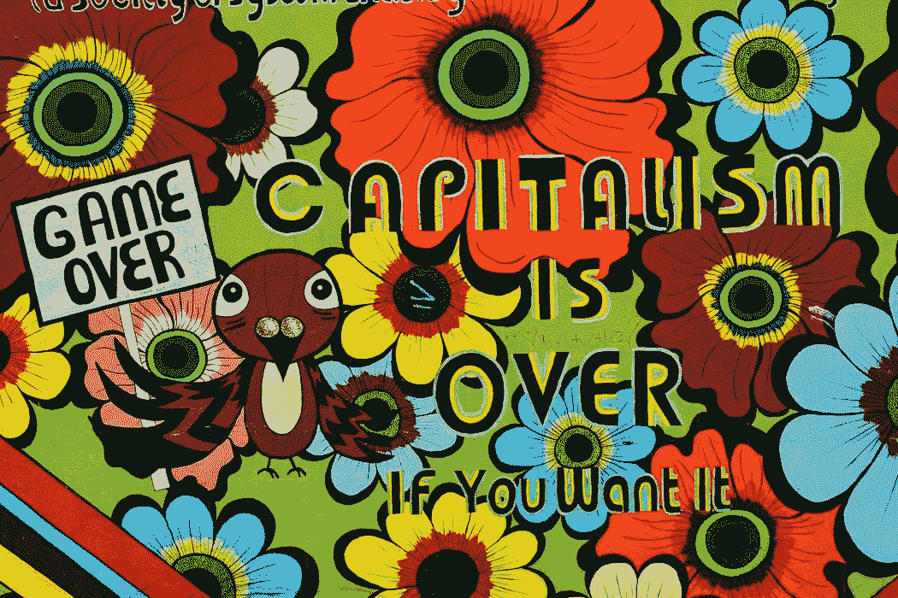

# 我们所知的资本主义的终结

> 原文：<https://medium.datadriveninvestor.com/the-end-of-capitalism-as-we-know-it-6c246bd6dae0?source=collection_archive---------17----------------------->

新冠肺炎·疫情一劳永逸地向我们展示了为什么资本主义——或者任何建立在无情的排他性竞争、以牺牲他人的成功为基础的体系——在我们当前的进化条件下是不合适的、不可持续的:它存在于一个全球一体化、相互依存的世界中。

诚然，资本主义最符合我们天生自私、个人主义和残酷竞争的本性。但在这个完全融合、相互依存的世界里，我们生活在我们固有的本性中，它所驱动的经济就像癌症一样。

**我们无法改变我们的全球内部条件，因为它们是由大自然的包罗万象的系统及其进化计划所决定的。**

因此，我们没有任何其他选择，只能学习如何适应我们的“原始资本主义”本性——我们无法抑制或抹去——进入大自然的“共产主义”系统，在这个系统中，与任何个人主义的计算、个人成功、个人利润相比，集体的福祉和最佳发展始终是首要的。

 [## 如果资本主义失败了，那么还有什么选择呢？数据驱动的投资者

### 在当前政治领域的修辞之旅中，我们都可以面对面地接触到流行词汇，如…

www.datadriveninvestor.com](https://www.datadriveninvestor.com/2020/03/16/if-capitalism-is-a-failure-then-what-is-the-alternative/) 

**由于这个原因，我们需要一种非常独特、有针对性和高度实用的教育方法，这种方法可以教导我们，重要的是可以帮助我们感觉到，通过以一种相互负责、相互补充的方式——根据大自然的完美模板——为他人和集体的成功、利益而努力，我们都会比通过通常的方法获得更大的成功、利益、成长和进步。**

这与政治意识形态无关，与我们发明的、历史上使用过的主义无关。我们只需要与大自然无情的进化计划保持一致，朝着完全融合的方向前进。

由于自然和进化是完美的，当我们适应自己的时候，我们也会在我们做的任何事情上获得完美的成功和满足。