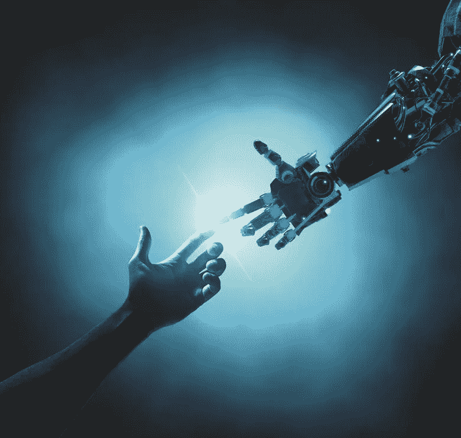

# 旧世界的终结和新的数字契约

> 原文：<https://medium.datadriveninvestor.com/the-end-of-the-old-world-and-the-new-digital-covenant-44f0f6508c89?source=collection_archive---------12----------------------->

最近的事件与新型冠状病毒的传播有关。冠状病毒可以让你思考人类在不久的将来会面临什么。尽管统计数据向我们保证，在最糟糕的情况下，单个国家的死亡率不会超过 5%至 6%，而且一般来说，健康状况良好的人可能甚至不会感觉到他们已经被感染，但疾病的传播已经成功地大大改变了我们的日常社会经济生活。

 [## 保护主义、政治和经济动荡|数据驱动的投资者

### 美国股市昨日出现 400 多点的大幅反转，为未来的事情发出了警告信号。市场…

www.datadriveninvestor.com](https://www.datadriveninvestor.com/2018/06/28/protectionism-politics-economic-turmoil/) 

各国关闭边境，宣布进入紧急状态，人们被锁在家中，世界经济一落千丈，还有意识形态斗争和种族间的分歧。所有这些可能都是暂时的，最终会逐渐消失。然而，一切都像战时一样。我们有一个看不见但共同的敌人，这迫使我们重新思考我们的价值观。第一次为了战胜共同的敌人(不同于所有其他战争)，人类不应该团结，而是应该分裂，并通过普遍的努力达成一个新的“数字契约”

**洪水过后，人们已经与上帝立约，其中一个要点就是关于“自由意志”的条款不幸的是，很可能是自由意志让我们有了今天。甚至更有可能的是，为了共同利益，我们将不得不牺牲自由意志，通过与人工智能(AI)缔结新的数字遗嘱**。是的，乔治·奥威尔的*1984*中的“老大哥”很可能在明天成为每个人的新现实。

尽管这种病毒是“民主的”——既影响穷人也影响富人——但抗击它的最有效方法是引入严格的隔离措施，限制人们的自由，这几乎就像是威权主义。

当这种病毒在感染人数和死亡人数方面打破欧洲的所有记录时，拥有近 15 亿人口的中国成功遏制了新病例的增加。中国成功的关键不仅仅是隔离人民和实施紧急状态，还有他们对待生活和人民权利的方式。当世界其他地方希望这种感染能够绕过他们，并争论如何以最民主的方式处理时，中国默默地采取了前所未有的措施来保护自己的国家，除了生命权之外，不考虑任何人权。

特别是，目前的情况引发了许多争议，即为了人类生存的共同利益，是否有必要交换有关你私生活的信息。

例如，在中国，几乎每个人都通过 Ant 应用程序被分配了一个绿色、黄色或红色的个人二维码，该二维码根据感染概率的级别而变化，分析地理位置信息并据此确定一个人的行动和移动。

以色列走得更远，安全部门获准在不事先通知的情况下，通过手机监控人们的行动。

显而易见的是，其他国家很可能会采取这种趋势。此外，随着时间的推移，这种跟踪方法会变得更加复杂(正如尤瓦尔·赫拉利在《金融时报》上一篇文章中所写的),甚至可以让你跟踪自己的体温、血压、脉搏以及身体对某个事件的反应，这最终将使预测任何疾病成为可能，甚至在疾病出现之前。

也许这样的未来对某些人来说似乎是不现实的，但是零售公司 Target 的例子，它基于一个女人的购买行为，几乎准确地猜测她怀孕了，说了相反的话。另一个例子是剑桥分析公司(Cambridge Analytica)的算法，它只需点击一下社交网络脸书，就能识别你的性别、取向和政治观点。

所有这些数据，所有我们不理解或不情愿留下的数字足迹，对政府和私营公司都有很大的兴趣，它们利用这些数据来塑造我们的行为方向。在这里，你可以就这一切的道德性争论很长时间。然而，这样一个世界的架构已经建立起来了，无法摆脱它。我们自己，在技术公司的要求下，在没有深入研究细节的情况下，通过订阅和点击，在我们已经“阅读并接受条款”的每份协议下打勾，允许访问我们的个人数据，以换取速度和便利。这样，我们自己为新的数字契约奠定了基础。我们越早意识到并接受这个现实，就越容易适应新的生活。

**新生活预示着一种新形式的管理系统，这种系统较少基于传统价值观，更多地基于最大限度地减少官僚程序和提高做出正确决策的速度**。为了做出这样的决定，国家机器需要拥有只有人工智能才能分析的大量结构化数据。如果现在医生可以向 IBM 的沃森寻求“第二意见”，因为它可以分析大量数据，并在几分钟内给出准确的诊断或治疗计划，那么不可能不排除一个人通过牺牲自己的决策自由来将决策自由交给人工智能，从而与人工智能签署新的数字契约。