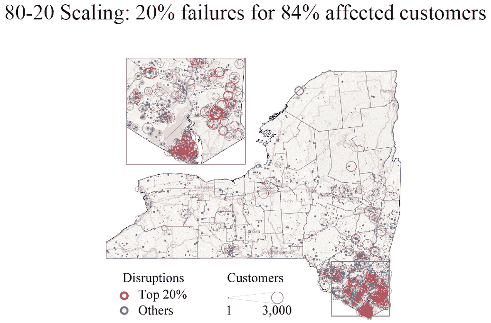
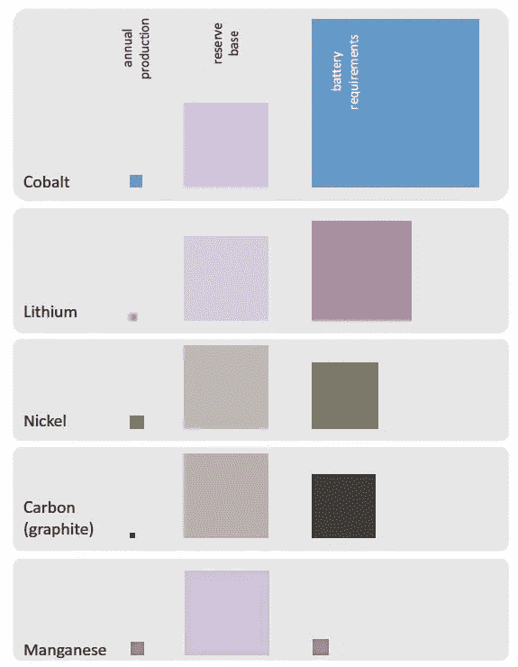

# 能源行业可能会向好的方向转变。利益相关者准备好迎接这一浪潮了吗？

> 原文：<https://medium.datadriveninvestor.com/the-energy-sector-might-change-for-good-will-stakeholders-be-ready-for-the-wave-90e5fb9b2b7e?source=collection_archive---------7----------------------->

# 元分析显示，一旦一些限制性障碍被解除，储能领域的新趋势可能会爆发；电力行业可能会发生不可逆转的变化。最好做好准备！

Photo by [Jeremy Bishop](https://unsplash.com/@jeremybishop?utm_source=unsplash&utm_medium=referral&utm_content=creditCopyText) on [Unsplash](https://unsplash.com/s/photos/wave?utm_source=unsplash&utm_medium=referral&utm_content=creditCopyText)

## 推动潮流的各种电力技术

储能系统成本、使用寿命、耐用性和功率密度的改善正在加速，并因创新材料和技术而成为可能。这使得新型电池化学、新型储能和组件技术成为可能，例如用于液流电池的低成本隔膜、钠基电池、合成相变材料、高压电容器、宽带隙材料和用于电力电子的智能设备。

存储系统可以用多种技术组合来设计，每种技术都有自己的性能特征，使其最适合某些网格服务。诸如抽水蓄能和压缩空气蓄能等成熟的大规模技术能够实现长放电时间和高容量。相比之下，各种电化学电池、热能储存和飞轮则定位于低功率但更剧烈的应用或适合于较短放电时间(几秒到几小时)的应用。

最近，在诸如开关、逆变器和控制器等领域，电力电子技术得到了极大的改进，使得电力能够被精确而快速地控制。储能和电力电子技术提高了电源的可靠性和响应能力。

 [## 远程医疗中的大数据分析重塑医疗保健行业|数据驱动的投资者

### 最近，在冠状病毒疫情的推动下，远程医疗的使用出现了大爆炸。越来越…

www.datadriveninvestor.com](https://www.datadriveninvestor.com/2020/05/15/big-data-analytics-in-telemedicine-reshaping-the-healthcare-industry/) 

## 网格分析和政策。

除了这些技术改进之外，数据科学、分析和多物理模型也有了新的部署，从而可以更好地了解复杂系统的风险和安全性、优化以及现场储能系统的高效利用。先进的模拟和建模以及真实世界的演示项目增加了对储能系统的安全性和可靠性的理解。

Source: C. Ji et al, IEEE Power and Energy Society Power; Large Scale Data Analytics for the resilience of Power Grid and Grid Failure during Hurricane Sandy in NY

## 许多重大变化即将到来

许多分析已经表明，公用事业和全球范围内的能源部门可以通过多种方式从储能中受益。经验证的数据集已经支持制定代码和标准，以优化许多国家电力基础设施中存储资源的使用。在这些变化中，我们可以明显地看到:

## 智能储能和频率调节

当与物联网(IoT)集成时，储能技术可以将电网边缘的能源使用数据传回给公用事业公司。然后，他们可以通过预测和负载平衡将这些信息作为其战略规划的一部分。物联网储能产生的数据甚至可以帮助公用事业公司通过频率调节简化能源生产活动，从而减少建设调峰电厂和变电站的需求。

## 提高可再生能源的效率

能量储存技术可以增加间歇性可再生能源的有用性，例如风能和太阳能。这是因为它能使它们产生的能量被储存起来，在没有风或者没有阳光的时候使用。通过这种方式，公用事业公司可以通过更多地依赖可再生能源来节省资金和减少碳足迹。

In the USA, the electric power grid is integrated coast to coast by modern devices connected to an aging infrastructure. Without Energy Storage and proper Reall time analytics, an accident or attack on one component could create cascading problems for huge segments of the grid.

## 增强电网弹性

能量存储可以在电网断电和其他不可预见的停机情况下提供备用电力系统。当与物联网技术集成时，它还可以快速向公用事业公司传达断电信息，以便它们可以快速修复。因此，停电可能会发生，并在不中断电力流动的情况下得到修复，而客户不会知道发生了什么。

# **提升障碍物**

另一方面，能量存储和 DER 部署也存在许多障碍。它们可以聚集成 3 个子集。

# 障碍一:成本

高成本是广泛采用储能技术的主要障碍。尽管许多存储技术的运营成本很低，但与其他可用选项相比，大多数存储技术的前期投资成本往往高得惊人。由于部署有限，许多储能技术尚未完全实现规模经济。

[软成本](https://www.energy.gov/eere/articles/soft-costs-101-key-achieving-cheaper-solar-energy)是加速大规模部署清洁能源的另一个障碍。这些成本反映了最终产品销售中既不是设备、安装也不是利润的部分。虽然这个大桶包括其他障碍，但软成本通常由繁文缛节和客户获取成本主导。

再次以屋顶光伏为例，Sungevity 前首席执行官 Andrew Birch 对软成本如何增加美国分布式太阳能系统安装费用给出了一个[的致命解释](https://www.greentechmedia.com/articles/read/how-to-halve-the-cost-of-residential-solar-in-the-us#gs.cd9nu2)，在美国，系统成本几乎是澳大利亚的三倍——一个典型的 5 千瓦系统几乎要多 1 万美元。来自 [Lawrence Berkeley 国家实验室](https://cloudfront.escholarship.org/dist/prd/content/qt0s43p660/qt0s43p660.pdf)的一项研究比较了美国和德国的住宅太阳能软成本，估计客户采购成本差异约为 3000 美元，接近美澳差异的三分之一。这些成本差异可能只是由于美国市场更加分散和缺乏公共教育，但繁文缛节对客户获取成本也有明显的影响。

住宅太阳能市场有据可查的挑战反映在大多数清洁能源企业的经历中。电动汽车充电器面临着复杂的选址和许可规则，以及千差万别的电价结构。在满足消防规范的同时，储能面临不同的电池互连规则和比率。电气化设备面临着孤立的激励机制，这些激励机制提倡用更新更高效的燃气设备取代旧的燃气炉，却没有考虑热泵等替代方案；能源效率法规和项目可能没有意识到新的电力负载取代肮脏燃料的好处。

 [## 各州如何克服迫在眉睫的电动汽车充电基础设施缺口:加州

### 88%的美国大城市没有足够的电动汽车充电基础设施来满足未来的电动汽车需求…

www.forbes.com](https://www.forbes.com/sites/energyinnovation/2019/04/03/how-states-can-overcome-the-looming-electric-vehicle-charging-infrastructure-gap/#120da6ac4ded) 

这些挑战都属于软成本范围，虽然在减少这些挑战方面取得了进展，但在一个有明确安装政策目标的环境中，通过许可证和要求的标准化和精简，仍有很大的进展空间。

# 障碍二:市场和融资以及敌对的现任者

市场呈现出一系列障碍。例如，存储解决方案与其他灵活的能源供应技术以及智能电网竞争，目前许多替代方案的成本要低得多。许多领域都需要融资，但融资方法本身往往是储能研究和采用的障碍，缺乏足够的项目融资用于示范项目和部署。也许最大的挑战是市场对大规模储能性能和技术能力缺乏经验和信心。市场环境还存在基于传统电力系统技术的过时薪酬结构，这可能与存储解决方案不相关。

Photo by [Balaji Malliswamy](https://unsplash.com/@blahji?utm_source=unsplash&utm_medium=referral&utm_content=creditCopyText) on [Unsplash](https://unsplash.com/s/photos/aggressive?utm_source=unsplash&utm_medium=referral&utm_content=creditCopyText)

在通往规模化的道路上，能源存储和能源企业必须与敌对的现有企业竞争，而这些现有企业有多种形式。例如，垂直整合的电力公司制定了管理新客户产品的新规则和要求，天然气公司利用其监管影响力来减缓从家用天然气向清洁电力的过渡，汽油经销商发起公共运动或促进反电动汽车立法。

## 敌意现任有三个来源:

现任者将能源储存和能源回收视为对其业务的现存威胁，并利用他们相当大的力量来抵制清洁能源的过渡。

监管者可能有理由担心变革的后果，因为一些现任者有义务为公众服务，监管者担心清洁能源的过渡可能会伤害脆弱的客户或破坏安全和可靠性标准。虽然这些论点经常被不诚实地用来维护公司利益，但公共服务的核心关切是有效的，必须予以考虑。

[清洁能源的转变意味着现任者的彻底改变。电力公司可能会从提供端到端电力供应转变为平台提供商，允许多个实体相互交易，同时维护安全可靠的系统。](https://www.forbes.com/sites/energyinnovation/2019/07/10/utility-regulators-should-avoid-risky-bets-on-new-natural-gas/#5c4545a274fa)

因为改变是艰难的，企业惯性是真实的，而且投资者已经为任何一家公司设定了预期。幸运的是，不管是自愿的还是在监管行动的威胁下，像 [Xcel Energy](https://www.xcelenergy.com/carbon_free_2050) 和 [Green Mountain Power](https://greenmountainpower.com/news/gmp-launches-vision-to-have-100-renewable-energy-by-2030/) 这样的公用事业公司通过投资新的解决方案开始了转型。

 [## 暴风雨不会等我们的！

### 领导力、人工智能和集成系统可以帮助我们在能源基础设施继续崩溃之前做好准备…

medium.com](https://medium.com/@smbilodeau/the-storms-will-not-wait-for-us-e1219b8f2614) 

标准和监管限制也阻碍了储能系统的市场发展。与市场一样，监管机构很难对储能提供的服务进行分类和补偿。此外，缺乏认证能量存储系统质量、安全和操作性能的国际标准和方案

为了克服这一障碍，该行业将需要[劳动力发展](https://www.forbes.com/sites/energyinnovation/2019/04/22/renewable-energy-job-boom-creating-economic-opportunity-as-coal-industry-slumps/)，新的商业模式，以及像新的和更新的[激励和标准](https://www.energypolicy.solutions/policies/building-codes-appliance-standards/)这样的强制功能来加速进步。

# 障碍三:复杂的技术和部署环境

因为储能和可再生能源必须大规模部署，以实现必要的经济影响，所以它们最好作为标准化产品出售。但是每个城市、社区、家庭和企业都有不同的物理和交易需求——与标准化相反。

抽水蓄能水电占已部署蓄能容量的绝大部分，其他技术的部署仍然相对较少。尽管这些技术正在迅速成熟，但它们也是多种多样的，导致理解和分类解决方案的困难。化学电池存储是一个快速增长的领域，但必须考虑其他技术来提高灵活性和满足各种市场需求。

随着早期领先州太阳能渗透率的增加，简单版本的 NEM 变得越来越不可行:[夏威夷州正在限制新系统](https://www.greentechmedia.com/articles/read/the-new-normal-for-rooftop-solar-in-hawaii#gs.oh9vzk)，因为配电线路已经饱和，[加利福尼亚州已经转向强制性分时电价](https://www.utilitydive.com/news/california-utilities-prep-nations-biggest-time-of-use-rate-roll-out/543402/)，以鼓励在太阳能最大值窗口之外的消费。

在商业领域，分布式太阳能一直难以起飞，因为[回收资本更加复杂](https://www.forbes.com/sites/energyinnovation/2017/10/02/how-developers-governments-and-investors-can-avoid-hidden-risk-from-inaccurate-solar-projections/#759c9d9e1215)而所有权结构和屋顶配置更加多样化。例如，尽管美国整体太阳能市场预计将在 2019 年增长，但商业太阳能市场[预计将萎缩 13%](https://www.greentechmedia.com/articles/read/qa-leading-players-and-strategies-in-us-commercial-solar#gs.l3hboz) ，原因是不太有利的费率结构和激励措施。

在某种程度上，快速下降的电池价格可能有助于太阳能的部署，因为它允许太阳能发电在最有价值的时候被消耗掉，但这只是冰山一角。实现零能耗建筑和低碳交通意味着[给车辆](https://www.energypolicy.solutions/policies/electric-vehicle-policies/)和建筑充电，以增加新的充电负载，吸收更多的可再生电力，同时调整总功耗，以便可以通过 der 抵消，并消耗最便宜的公用事业供应的可再生电力。这意味着整合能源效率升级，增加热泵和电磁炉等新电器，安装电池和电动汽车充电器，让公民面对令人眼花缭乱的选择，却没有多少训练有素的专业人士来帮助导航。

建立足够的储能能力同样令人望而生畏。如果我们看看将世界上的天然气和柴油动力乘用车转换为电池电力推进的挑战。即使在适当考虑电动机更高的“油箱到车轮”效率后，他们发现，要取代目前汽车油箱中的能量存储容量，我们需要相当于 142 太瓦时(太瓦时)的电池存储容量。

此外，正如 Palmer 和 Floyd 在下面的插图中所示，许多电池的关键材料需求是巨大的，在某些情况下超过了当前世界的总储量。为了匹配储存在燃料箱中的可输送能量，电池生产将消耗大量的关键材料——在某些情况下超过了当前的世界储量。更不用说获取材料和制造电池的能源成本，或者更困难的重型货运车辆电气化问题。

*Material requirements for batteries for world’s fleet of passenger vehicles (Source: Graham Palmer and Joshua Floyd, from* ***Energy Storage and Civilization: A Systems Approach****)*

除非储存技术出现未知的、因此不可预见的可能发展，这些发展可能提供数量级的改进，那么，期望我们可以简单地用可再生能源替代当前的世界能源需求是非常不现实的。更大的变化是可能的:技术、贸易惯例、法规、社会实践、生活方式的变化的结合。相互作用的复杂性超出了简单计算机模型的预测能力。人工智能肯定会被要求能够实现这一目标。

Photo by [Matthew Henry](https://unsplash.com/@matthewhenry?utm_source=unsplash&utm_medium=referral&utm_content=creditCopyText) on [Unsplash](https://unsplash.com/s/photos/electric-grid?utm_source=unsplash&utm_medium=referral&utm_content=creditCopyText)

# 来自电力公司和电网运营商的许多例子可供参考

已经有许多组织经历了这些障碍，克服了它们，并成功地应用了能量存储。事实上，我们可以很容易地发现，储能可以用于将电力需求从高峰时段转移到非高峰时段，这可以减轻高峰需求费用，从而为客户节省成本，同时减轻电网压力。

这些论点不仅仅是假设。事实上，有几个例子可以说明公用事业公司目前是如何实现储能对自身运营的好处的:

美国电力公司已成为首批大举投资储能的公用事业公司之一，并在西弗吉尼亚州和德克萨斯州安装了设施。此外，它还向储能软件公司 Greensmith 投资了 500 万美元。格林史密斯公司近三分之二的客户是电力公司，包括夏威夷电力公司、圣地亚哥煤气电力公司和萨克拉门托市政公用事业区。

国家电网委托开发一种电池加存储解决方案，以推迟昂贵的电缆安装，并有可能支持当地电网和市场运营。由于复杂性和成本，国家电网在近期排除了第三个海底电缆选项，而独立的燃气发电设施从环境角度来看不是一个好的选择。此外，独立存储选项安装成本太高。因此，国家电网选择了混合动力方式，安装了由特斯拉制造的 6 兆瓦锂离子电池和位于岛上的 10 兆瓦燃气涡轮发电机。这一解决方案使电力公司能够将第三条地下电缆的建设推迟到 2045 年。它还为该公司提供了一个在存储资源支持下探索 DER 使用案例的机会。国家电网于 2019 年 10 月完成了 6 兆瓦/48 兆瓦时 Nantucket BESS 的建设和调试。

太平洋煤气电力公司与一家储能公司合作，通过分布式储能在加州提供电网服务。该计划的一部分包括在加利福尼亚州的一所大学安装 1MW/2MWh 的能量存储系统，该系统在其寿命期内可以节省大约 80 万美元。该大学预计储能系统将提高其在电力公司需求响应计划中的性能。

佛罗里达电力和照明公司建造了一个 10 兆瓦的试点系统，现在正在跟进一个计划中的 409 兆瓦系统。该项目将于 2021 年底完成，将比世界上任何其他锂离子电池系统都要大。

该大学的设施主管戴尔·威瑟斯(Dale Withers)说，“虽然我们安装储能装置的主要动机是通过高峰需求削减来节省资金，但我们很高兴储能装置是提高我们供电可靠性和性能的一种方式。”

并以一些“全球性”例子来结束这个列表。

世界银行在推动电池存储解决方案方面发挥了更大的催化作用。很明显，我们需要催生一个新的电池和其他存储解决方案市场，这些解决方案适用于各种应用的电网，并且可以大规模部署。2018 年，世界银行集团宣布了一项 10 亿美元的全球电池存储计划，旨在筹集 40 亿美元的私人和公共资金，以创造市场，帮助压低电池价格，从而可以作为中等收入和发展中国家负担得起的大规模解决方案进行部署。迄今为止，世界银行已经资助了发展中国家 15%以上处于不同部署阶段的电网相关电池存储。到 2025 年，[世界银行](https://www.worldbank.org/) (WB)预计将为 17.5 千兆瓦时的电池存储提供资金——是目前发展中国家安装的 4-5 千兆瓦时的三倍多。有了正确的解决方案，就有可能建设具有重要储能组件的大规模可再生能源项目，部署电池以稳定基础设施薄弱国家的电网，并增加离网接入已准备好使用储能清洁能源的社区。

在印度，世界银行-国际金融公司联合小组正在开发世界上最大的太阳能、风能和储能混合发电厂之一，而在南非，世界银行正在帮助开发 14.4 千兆瓦时的电池储能能力，预计这将是撒哈拉以南非洲同类项目中最大的项目

储能将继续发展，为公用事业和能源消费者带来好处。公用事业公司可以通过实施储能技术为自己带来众多战略优势，从而在节省客户资金的同时改善运营。最后，大家都赢了。

## 唯一的结论是，这仅仅是开始

利益相关者开始通过实施储能系统获得经济利益。他们这样做的主要方式之一是通过高峰需求削减为客户提供省钱的机会。如果电网运营商和公用事业公司快速有效地采取行动，并在未来 5 年内尽早整合其组织中的一个或多个三重关键项目，他们将获得大量机会。

Photo by [Annie Spratt](https://unsplash.com/@anniespratt?utm_source=unsplash&utm_medium=referral&utm_content=creditCopyText) on [Unsplash](https://unsplash.com/s/photos/beginning?utm_source=unsplash&utm_medium=referral&utm_content=creditCopyText)

**首先，储能(电网规模和需求侧水平)是实现清洁能源潜力的关键**

可再生能源，主要是太阳能和风能，在发展中国家越来越便宜，越来越容易部署，有助于扩大能源供应，帮助全球努力实现能源可持续发展目标和减缓气候变化。但是太阳能和风能本质上是可变的，这使得有必要有一个大规模的、定制的解决方案来存储它们产生的电力，并在最需要的时候使用它们。

电池是解决方案的关键部分。然而，在当前的电池存储市场中，发展中国家电网的独特要求尚未得到充分考虑，尽管这些国家可能拥有最大的电池部署潜力。

今天的电池市场主要由电动汽车行业驱动，大多数主流技术不能提供长期存储，也不能承受恶劣的气候条件，并且操作和维护能力有限。许多发展中国家获得其他灵活选择的机会也有限，如天然气发电或增加输电能力。

**其次，推广混合储能解决方案是一个重大机遇**

到 2040 年，全球对能源储存的需求预计将达到 2800 千兆瓦时(GWh)——相当于储存今天全球一天产生的所有可再生能源的一半多一点。到 2050 年，世界各地的电力系统将需要更多的储存容量，以便将更多的太阳能和风能整合到电网中。

要使各种储能解决方案成为清洁能源储存和部署的大规模推动者，就必须加快新技术及其应用的创新和部署。培养正确的监管和政策环境以及采购实践也很重要，以大规模降低电池成本，并确保财务安排能够为开发商建立成本回收的信心。同样重要的是，要想方设法确保 ESS 价值链的可持续性、安全的工作条件和对环境负责的回收利用。

有了合适的有利环境和电池的创新使用，就有可能帮助发展中国家建设未来的灵活能源系统，并向即使在今天仍没有电力的 10 亿人提供电力。

**第三，电池存储可以改变发展中国家的新能源格局**

如今，ESS 技术在发展中国家的大型能源项目中并未得到广泛应用。这一差距在撒哈拉以南非洲尤为严重，尽管该地区的风能和太阳能潜力巨大，能源需求也在迅速增长，但仍有近 6 亿人无法获得可靠和负担得起的电力。催化新市场将是降低电池成本并使其成为非洲可行的储能解决方案的关键。

如今，本区域对能源解决方案的需求已经非常巨大，这些解决方案不仅能促进清洁能源的吸收，还能帮助稳定和加强现有电网，并有助于推动全球采用更多清洁能源和应对气候变化。

## 所以，做好准备，这可能是旧电网模式的日落和智能储能时代的起义！

Photo by [Joshua Earle](https://unsplash.com/@joshuaearle?utm_source=unsplash&utm_medium=referral&utm_content=creditCopyText) on [Unsplash](https://unsplash.com/collections/228144/%5Bbeach-vibes%5D?utm_source=unsplash&utm_medium=referral&utm_content=creditCopyText)

本文是由荷兰国际集团[夏羽·比洛多](https://www.linkedin.com/in/stephane-bilodeau/?locale=en_US)撰写的关于**能源、人工智能、加密货币、颠覆性技术、能源转型和更多**的系列文章的延伸。工程博士，对外经济合作中心。创始人&首席技术官、Smart Phases ( [Novacab](http://www.novacab.us/) )、加拿大[工程师协会会员](https://engineerscanada.ca/about/committees/operational/public-affairs-advisory)以及[能源中心](https://www.energycentral.com/member/profile/217621/activity)和[媒体](https://medium.com/@smbilodeau)的专家撰稿人。

**访问专家视图—** [**订阅 DDI 英特尔**](https://datadriveninvestor.com/ddi-intel)