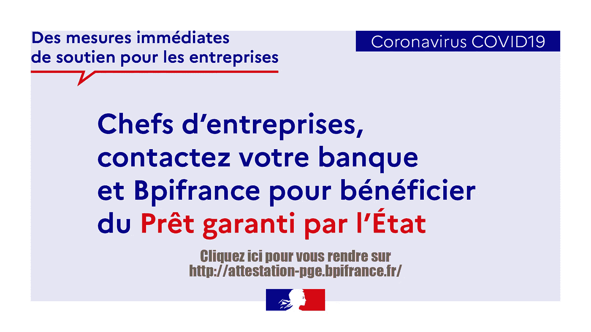

# 《企业家在科维德疫情生存指南》

> 原文：<https://medium.datadriveninvestor.com/the-entrepreneurs-guide-to-surviving-the-covid-pandemic-457961fc31ef?source=collection_archive---------4----------------------->

没人想到的事情发生了。距离上次大疫情已经过去了一个世纪，西班牙流感袭击了世界，夺走了大约 5000 万人的生命。这是一种现代世界看不到的疾病；然而，地球上的居民遭受了一些小病毒:H1N1、SARS、MERS 等。当时的世界不同，当时的世界不太了解情况。

在社交媒体时代，疯狂的互联网带宽和技术为所有这样的疫情打击了人类的健康、生活方式和恐惧。这是我们无法控制的自然反应；covid19 之后的世界将会是一个不同的地方。艰难的告别将是第一步，但病毒和保护我们的严格规则对经济的影响将是巨大的。企业将会倒闭，人们将会不公平地失去工作，受冲击的行业包括依靠有限资源生存的企业家。我将尝试解决一些问题，许多企业家(除非那些骑着神话中的独角兽)将从中受益。人类是一个适应力强的种族，会生存下去，生存的代价是什么我们不知道。

节俭是这个游戏的名字:

人们往往把节俭和贪婪混为一谈；节俭是节约，贪婪是贪婪。节俭甚至是亚马逊的领导原则之一，亚马逊做得很好。因此，在尘埃落定之前，削减任何不必要的或未优化的开支。从办公室搬到一个共同工作的地方，或者在家工作。取消没人完全消费的每周早餐，取消任何你可能不需要的订阅。当事情正常化时，这些小开销可以积累起来，成为一笔可观的数目。

**延长你的跑道(如果你有钱的话):**

你的资金可以维持你 12 个月，很好；这些都是基于旧的假设。你现在可能会增长得更少，所以回头看看你的商业计划，消除你还没有投入的支出，包括设备、旅行、开发等……你坚持得越久，当一切恢复正常时，你就越有可能恢复。将目标定在+50%是明智之举

 [## 金融科技初创公司正在颠覆全球银行业|数据驱动的投资者

### 传统的实体银行从未真正从金融危机后遭受的重大挫折中恢复过来…

www.datadriveninvestor.com](https://www.datadriveninvestor.com/2018/10/20/fintech-startups-are-disrupting-the-banking-industry-around-the-world/) 

**筹一轮桥牌(没钱的话):**

假如你的资金非常有限，而你正计划筹集资金，你的计划可能会泡汤。尝试以低估值进行 20 万美元的小型桥牌回合，你会发现投资者愿意承担风险，尽管进行下跌回合的感觉很糟糕，但拥有 20%的 1000 万美元比拥有 35%的 0 美元更好，并且是最后清算的优先选择。

**不雇佣也不解雇全职员工:**

员工是任何创业公司的生命和血液，裁员有时可能是不可避免的，但当时代艰难，没有人犯错时，解雇可能是可怕的。除了对雇员或雇主的情感影响之外，这对公众来说也不是一个好兆头。制定减薪方案，以便在情况好转时加薪。招聘也是一样:即使你正在招聘一个能带来很多的顶级人才，也要暂停招聘。你既不会充分发挥这个人才的能力，也不会很快让他融入你的生活。在一个紧急的任务中需要雇佣自由职业者，他们很有效率，真的很好，而且花费更少，因为你放弃了任何与注册，工作许可等相关的事情…

**查看来自政府的帮助和补贴:**

一些政府正在为他们的初创公司提供补贴:法国政府提供高达初创公司或自由职业者/工匠 2019 年收入 25%的担保贷款，偿还灵活，最高利率为 0.5%。(【https://attestation-pge.bpifrance.fr/description】T2)。美国通过其小企业管理局(SBA)也在提供低息(2.75%-3%)的补贴贷款，并且已经开展了众筹活动，为中小企业和初创企业设立救济基金。

时代对每个人来说都是艰难的，但从更大的角度来看；人类从黑死病、无数战争和灾难中幸存下来，并且总是能够恢复。接下来的几个月不会很愉快，但是只要有毅力，我们仍然可以为自己创造一个更美好的未来

 [## 数据驱动投资者

### 组织继续丢弃其未受保护的敏感数据，同时在网络安全上花费数百万美元…

www.datadriveninvestor.com](https://www.datadriveninvestor.com/?s=covid)