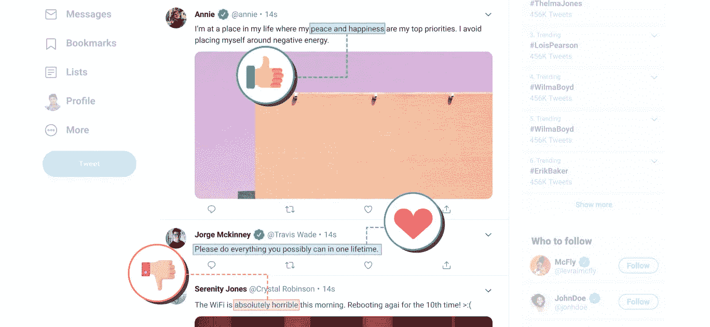
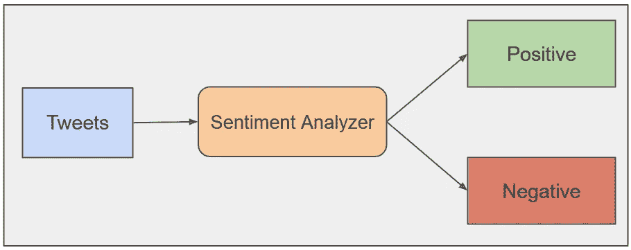
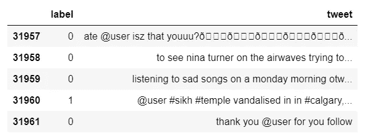
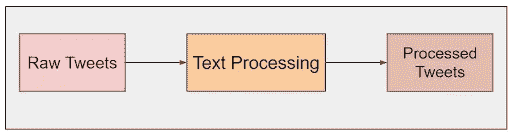
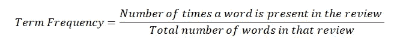
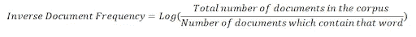
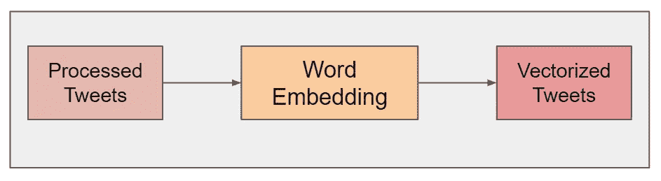
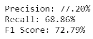
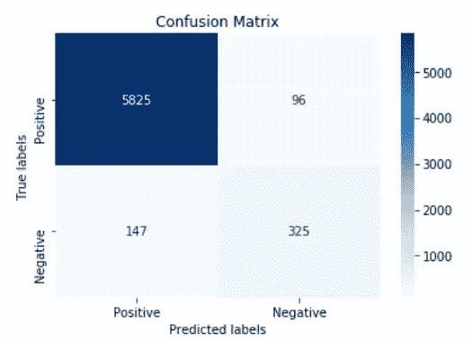

# 构建 Twitter 情感分析系统的基本指南

> 原文：<https://medium.datadriveninvestor.com/the-essential-guide-to-building-a-twitter-sentiment-analysis-system-ac484d40b8a2?source=collection_archive---------2----------------------->

## 在社交媒体数据分析领域，一个流行的研究领域是 Twitter 数据的情感分析。

Twitter 是世界上最受欢迎的社交媒体平台之一，每月有 3.3 亿活跃用户，每天发送 5 亿条推文。通过仔细分析这些推文的情绪——例如，无论它们是积极的、消极的还是中立的——我们可以了解很多关于人们对某些话题的感受。

出于各种原因，理解推文的情绪很重要:商业营销、政治、公共行为分析和信息收集只是几个例子。Twitter 数据的情绪分析可以帮助营销人员了解客户对产品发布和营销活动的反应，也可以帮助政党了解公众对政策变化或公告的反应。

然而，Twitter 数据分析并不是一项简单的任务。每秒大约有 6000 条推文发布。Twitter 数据真多！尽管人类很容易理解一条推文的情感，但人类情感分析根本无法扩展。

在本文中，我们将着眼于构建一个可扩展的 Twitter 情感分析系统，以帮助我们更好地理解机器学习在社交媒体数据分析中的作用。

# 问题:识别推文中的负面情绪

在这篇文章中，我们将学习如何识别带有负面情绪的推文。为此，我们将创建一个情感分析器，以文本格式对积极和消极的推文进行分类。虽然我们将使用我们的分类器进行 Twitter 数据分析，但是它也可以用于分析来自其他来源的文本数据。

通过这篇文章，我们将了解数据集、各种文本处理和嵌入技术，然后使用机器学习模型来处理我们的数据。

# 索引

*   Twitter 情感分析数据集
*   文本处理
*   A.清除原始文本
*   B.标记化
*   C.堵塞物
*   单词嵌入技术
*   A.一袋单词
*   B.术语频率—逆文档频率
*   C.Word2Vec
*   模型
*   性能指标
*   结果
*   摘要

# Twitter 情感分析数据集

让我们从我们的 Twitter 数据开始。我们将使用开源的 [Twitter Tweets 数据进行情感分析](https://www.kaggle.com/ramyavidiyala/twitter-tweets-data-for-sentiment-analysis)数据集。它包含 32，000 条推文，其中 2，000 条包含负面情绪。

这个数据集的目标变量是“label ”,它将负面推文映射到 1，其他任何内容映射到 0。把目标变量想象成你试图预测的东西。对于我们的机器学习问题，我们将在这些数据上训练一个分类模型，以便它可以预测我们给它的任何新推文的类别。

下图显示了数据的快照。

# 文本处理

数据通常来自各种不同的来源，并且通常采用各种不同的格式。因此，清理原始数据是准备数据集的重要部分。然而，清理不是一个简单的过程，因为文本数据通常包含冗余和/或重复的单词。在 Twitter 情感分析中尤其如此，因此处理我们的文本数据是我们解决方案的第一步。

文本处理的基本步骤包括:

*   A.原始数据的清理
*   B.标记化
*   C.堵塞物

# A.原始数据的清理

这个阶段包括删除对文本意义没有价值的单词或字符。一些标准的清洁步骤如下:

*   下降箱
*   删除提及
*   特殊字符的删除
*   停用词的删除
*   移除超链接
*   数字的删除
*   删除空白

## 下降箱

降低文本的大小写是必要的，原因如下:
单词“TWEET”、“tweet”和“Tweet”都为句子添加了相同的值。降低所有单词的大小写有助于通过减少词汇量来降低维度。

`def to_lower(word):
result = word.lower()
return result`

## 删除提及

在推文中提及是很常见的。然而，由于它们不会增加解释推文情感的价值，我们可以删除它们。提及总是以“@提及”的形式出现，所以我们可以删除以“@”开头的字符串。

为了在整个数据集上实现这一点，我们使用下面的函数。

`def remove_mentions(word):
result = re.sub(r"@\S+", "", word)
return result`

## 特殊字符的删除

这种文本处理技术将有助于处理像“万岁”和“万岁！”这样的词同理。在这个阶段，我们去掉所有的标点符号。

`def remove_special_characters(word):
result = word.translate(str.maketrans(dict.fromkeys(string.punctuation)))
return result`

## 停用词的删除

停用词是语言中经常出现的词，如“the”、“a”、“an”、“is”等。我们可以在这里删除它们，因为它们不会为我们的 Twitter 数据分析提供任何有价值的信息。

`def remove_stop_words(words):
result = [i for i in words if i not in ENGLISH_STOP_WORDS]
return result`

## 移除超链接

现在我们可以从数据中删除 URL。tweets 包含 URL 并不罕见，但是我们不需要为我们的任务分析它们。

`def remove_hyperlink(word):
return re.sub(r"http\S+", "", word)`

# B.标记化

标记化是将文本分割成更小的块(称为标记)的过程。每个标记都是作为特征的机器学习算法的输入。NLTK(自然语言工具包)提供了一个用于标记数据的实用函数。

`from nltk.tokenize import word_tokenize
tweets_data['tweet'] = tweets_data['tweet'].apply(word_tokenize)`

# C.堵塞物

词干提取是从单词中移除和替换后缀以获得单词的词根或基本形式的过程。这叫做‘梗’。例如，单词“满意”、“满足”和“满意”的词干是“满足”，所有这些都意味着相同的感觉。

波特词干分析器是一种广泛使用的词干分析技术。nltk.stem 为 stem“porter stemmer”提供了实用函数

`from nltk.stem.porter import PorterStemmer
stemmer = PorterStemmer()
def stem_words(text):
return " ".join([stemmer.stem(word) for word in text])
tweets_data['tweet'] = tweets_data['tweet'].apply(lambda text: stem_words(text))`

# 单词嵌入技术

有大量文本格式的数据。对机器来说，分析文本数据是一项极其复杂的任务，因为机器很难理解文本背后的语义。在这个阶段，我们将使用单词嵌入将文本数据处理成机器可理解的格式。

> 单词嵌入只是将文本格式的数据转换成数值(或向量)，这样我们就可以将这些向量作为机器的输入，并使用代数的概念来分析数据。

但是，重要的是要注意，当我们执行这种转换时，可能会有数据丢失。关键是在转换和保留数据之间保持平衡。

说到这一步，这里有两个常用术语。

*   每个文本数据点称为一个文档
*   一整套文档被称为语料库

可以使用以下技术进行文本处理:

1.  一袋单词
2.  TF-IDF
3.  Word2Vec

接下来，让我们更详细地探索上述每一种技术，然后决定将哪一种用于我们的 Twitter 情感分析模型。

 [## 一瞬间学会数据科学！？数据驱动的投资者

### 在我之前的职业生涯中，我是一名训练有素的古典钢琴家。还记得那些声称你可以…

www.datadriveninvestor.com](https://www.datadriveninvestor.com/2020/07/23/learn-data-science-in-a-flash/) 

# A.一袋单词

单词包通过使用唯一单词的字典将文档简单地转换为向量。这只需两步即可完成，如下所述。

## 词典的构建

以向量形式创建数据语料库中所有唯一单词的字典。假设语料库中唯一单词的数量为‘d’。所以每个单词是一个维度，因此这个字典向量是一个 d 维向量。

## 向量的构建

对于每个文档，比如说 rᵢ，我们创建一个向量，比如说 vᵢ.

这个具有 d 维的 vᵢ可以用两种方法来构造:

1.  对于每个文档，根据字典构建 vᵢ，使得字典中的每个单词按照该单词在文档中出现的次数来再现。
2.  对于每个文档，根据字典构建 vᵢ，使得字典中的每个单词被再现为:

*   如果该单词存在于文档中，则为 1，否则为
*   如果文档中不存在该单词，则为 0

这种类型被称为二进制单词包。

现在，我们有了每个文档的向量和一个字典，其中包含来自数据语料库的一组独特的单词。这些向量可以通过，

*   在 d 维空间中绘图或
*   计算向量之间的距离以获得相似度(*向量越接近，它们就越相似*

# B.术语频率—逆文档频率

这里有三个要素:单词、文档、语料库。词频—逆文档频率，简称 TF-IDF，使用这些元素之间的关系将文本数据转换为向量。

> 词频指的是单词和文档之间的关系。而逆文档频率指的是单词和语料库之间的关系。

## 计算词频

词频是单词 wⱼ在文档 rᵢ.中的概率计算如下。

> 一个单词在评论中的高频意味着该单词在该评论中是频繁出现的。一个单词在评论中的低词频暗示该单词在该评论中是罕见的。

## 计算 IDF

逆文档频率(IDF)表示一个单词在整个语料库中出现的频率。计算如下。

> 低逆向文档频率意味着该单词在语料库中是频繁的。高逆向文档频率意味着该词在语料库中很少见。

由于缩放，我们使用对数而不是简单的反比。术语频率是一个概率，范围在 0 到 1 之间。这个比值的倒数可以取从 0 到无穷大的值，并且可以偏置 IDF。使用日志来解决这个问题是一个简单且被广泛接受的原因。

> 评论中某个词的 TF-IDF = TF(词，评论)* IDF(词，语料库)。

在每个文档的向量形式中，我们有每个单词的 TF-IDF。使用 TF-IDF 值将文档转换为矢量称为 TF-IDF 矢量化。

TF-IDF 矢量化非常重视以下单词:

*   在文档中频繁出现(来自 TF)
*   语料库中罕见(来自 IDF)

# C.Word2Vec

在单词包和 TF-IDF 中，我们将*句子转换成向量*。但是在 Word2Vec 中，我们将*单词转换成矢量*。因此得名，word2vec！

Word2Vec 将大型文本语料库作为其输入，并产生一个向量空间，通常具有数百个维度，语料库中的每个唯一单词都被分配给该空间中的一个对应向量。单词向量的定位是以这样的方式完成的，即语料库中具有共同上下文的单词在空间上位于更近的位置。

比如从男人到女人的向量平行于国王到王后等等。

# 什么时候用什么？

当谈到机器学习模型使用哪种嵌入技术时，没有明显的答案:这确实取决于用例。

单词包通常用于文档分类应用，其中每个单词的出现被用作训练分类器的特征。

TF-IDF 被 Google 这样的搜索引擎用作内容的排名因素。

当应用程序需要大量信息(如翻译文档)时，Word2vec 非常有用。

对于我们的 Twitter 情感分析，我们将使用“单词包”作为单词嵌入技术。Scikit 学习库提供了一个“计数矢量器”函数来执行单词包。使用“计数矢量器”，我们将处理后的数据转换成矢量。

`from sklearn.feature_extraction.text import CountVectorizer
bow=CountVectorizer
( min_df=2, max_features=100000)
bow.fit(tweets_data['tweet'])
tweets_processed =bow.transform(tweets_data['tweet']).toarray()`

# 模型拟合

逻辑回归是一种被互联网应用广泛使用的监督机器学习分类算法。这是解决分类问题最简单的算法，但效率很高。我们将利用这一点在 Twitter 数据分析中获得情感概率。

使用 sklearn.linear_model，我们可以实现逻辑回归。该模型输出输入属于该类的概率，使我们有可能对新推文中的 twitter 数据进行情感分析。

`from sklearn.linear_model import LogisticRegression
model = LogisticRegression()
model.fit(tweets_train, target_train)
# training the model
prediction = model.predict_proba(tweets_test)
# predicting on the test set
prediction_int = prediction[:,1] >= 0.3 # if prediction is greater than or equal to 0.3 then 1 else 0
prediction_int = prediction_int.astype(np.int)`

# Twitter 情感分析的性能指标

现在我们有了一个 Twitter 情感分析模型，可以输出一条推文属于特定类别的概率，我们需要一些方法来判断它的性能。精确度和召回率是分类模型的两个最广泛使用的性能度量。

> 精度是所有检索实例中相关实例的分数。它帮助我们理解结果的有用性。
> 
> 回忆是所有相关实例中相关实例的分数。回忆有助于我们理解结果的覆盖范围。

F1 分数是精确度和召回率的调和平均值。

例如，考虑一个搜索查询产生 30 个页面，其中 20 个是相关的，但是结果不能显示 40 个其他相关的结果。在这种情况下，精度是 20/30，召回率是 20/60。所以，我们的 F1 成绩是 4/9。

使用 F1-score 作为分类问题的性能指标是一个很好的选择。

`from sklearn.metrics import f1_score
from sklearn.metrics import confusion_matrix,f1_score, precision_score,recall_score
cf_matrix =confusion_matrix(target_test, prediction_int)
tn, fp, fn, tp = confusion_matrix(target_test, prediction_int).ravel()
print("Precision: {:.2f}%".format(100 * precision_score(target_test, prediction_int)))
print("Recall: {:.2f}%".format(100 * recall_score(target_test, prediction_int)))
print("F1 Score: {:.2f}%".format(100 * f1_score(target_test, prediction_int)))`

`import seaborn as sns
import matplotlib.pyplot as plt
ax= plt.subplot()
#annot=True to annotate cells
sns.heatmap(cf_matrix, annot=True, ax = ax,cmap='Blues',fmt='');
# labels, title and ticks
ax.set_xlabel('Predicted labels');
ax.set_ylabel('True labels');
ax.set_title('Confusion Matrix');
ax.xaxis.set_ticklabels(['Positive', 'Negative']); ax.yaxis.set_ticklabels(['Positive', 'Negative']);`

# 结果

F1 分数为 73%的模型是使用传统机器学习算法的良好模型。但是，也有改进模型的方法。我们可以使用深度学习技术(尽管这些技术很昂贵)，我们可以通过添加功能和删除拼写错误的单词来响应结果和反馈。

此外，请记住，这些结果是基于我们的培训数据。当将情感分析模型应用于真实世界的数据时，我们仍然必须随着时间的推移主动监控模型的性能。

# 总结:Twitter 情感分析技巧

在本文中，我们学习了各种文本处理和单词嵌入技术，并在经过处理的数据上实现了一个 Twitter 情感分析分类模型。希望这能让你了解这些社交媒体数据分析系统是如何工作的，以及准备和部署它们需要做的工作。

本文中提到的文本处理技术广泛应用于文本数据。然而，我们不必一直执行所有的技术。根据我们的用例仔细选择处理和嵌入步骤很重要；这将在情感分析数据中发挥重要作用。

在社交媒体数据分析领域，尤其是 twitter 数据分析领域，在过程的每一步都获得领域专家的支持通常非常重要。社交网络上的词汇通常是特定社区独有的，领域专家可以帮助您避免数据偏差并提高数据集和分析的准确性。

本文中所学的概念和技术可以应用于各种自然语言处理问题。除了 Twitter 情感分析，你还可以使用类似的技术来构建聊天机器人、文本摘要、[垃圾邮件检测](https://lionbridge.ai/articles/using-natural-language-processing-for-spam-detection-in-emails/)和语言翻译模型。

感谢阅读！如果你想自己试验这个自定义数据集，你可以下载[数据](https://www.kaggle.com/ramyavidiyala/twitter-tweets-data-for-sentiment-analysis)并在 [Github](https://github.com/RamyaVidiyala/SentimentAnalysis-Tweets) 上查看完整代码。如果你想尝试其他 Twitter 数据集，这里有一个针对各种不同 Twitter 内容的[存储库](https://lionbridge.ai/datasets/top-20-twitter-datasets-for-natural-language-processing-and-machine-learning/)。

之前发表于[https://lionbridge . ai/articles/how-to-build-a-Twitter-opinion-analysis-system/](https://lionbridge.ai/articles/how-to-build-a-twitter-sentiment-analysis-system/)

## 访问专家视图— [订阅 DDI 英特尔](https://datadriveninvestor.com/ddi-intel)